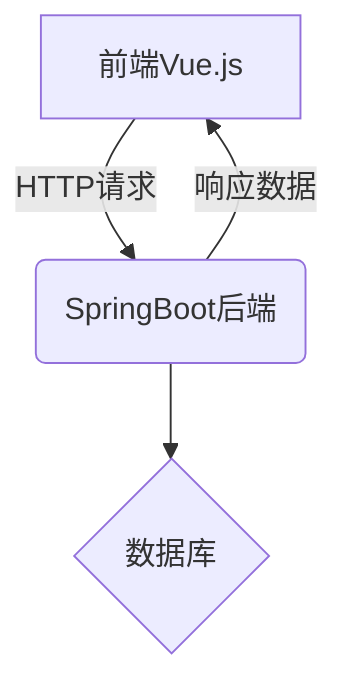
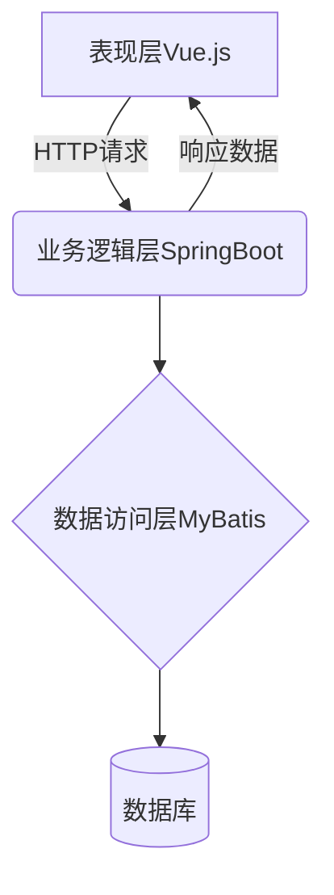

# 基于SpringBoot的高校流浪动物保护小程序

## 1. 背景介绍

### 1.1 流浪动物问题的严重性

流浪动物一直是一个全球性的社会问题。根据世界动物保护协会的统计数据,每年有数百万只动物无家可归,在街头流浪。这些流浪动物不仅面临着生存威胁,还可能带来一系列的公共卫生和安全隐患。

在高校校园内,流浪动物的存在也是一个值得关注的问题。一些无主的猫狗常常在校园里游荡,寻找食物和栖身之所。它们的存在不仅影响校园环境,还可能对师生的健康构成潜在威胁。

### 1.2 现有解决方案的不足

目前,一些高校已经采取了一些措施来应对流浪动物问题,如建立收容所、开展捕捉行动等。然而,这些传统的解决方案存在一些缺陷:

- 效率低下:传统的捕捉和收容方式耗时耗力,难以及时高效地解决问题。
- 信息不对称:校园内外的流浪动物信息无法及时共享,导致救助行动滞后。
- 参与度低:缺乏有效的渠道让师生参与到救助行动中来。

### 1.3 小程序的作用

基于以上背景,我们开发了一款基于SpringBoot的高校流浪动物保护小程序。该小程序旨在提供一个高效、便捷的平台,让校园内外的师生能够实时上报流浪动物的位置信息,并协调救助行动。同时,小程序还提供了一些辅助功能,如线上认领、领养等,以进一步解决流浪动物的问题。

通过这款小程序,我们希望能够提高流浪动物救助的效率,增强信息的透明度,并吸引更多人参与到这一公益事业中来,共同为创建一个更加文明、更加人道的校园环境贡献力量。

## 2. 核心概念与联系

### 2.1 小程序架构

我们的小程序采用了前后端分离的架构设计。前端使用Vue.js框架开发,后端则基于SpringBoot构建RESTful API。这种架构模式有利于提高开发效率和系统的可扩展性。



### 2.2 关键技术

在开发过程中,我们使用了多种关键技术来实现各项功能:

- **SpringBoot**: 作为后端框架,SpringBoot为我们提供了自动配置、内嵌服务器等便利,大大简化了开发流程。
- **MyBatis**: 作为持久层框架,MyBatis帮助我们方便地操作数据库,实现对象关系映射(ORM)。
- **Redis**: 我们使用Redis作为缓存数据库,提高系统的响应速度和吞吐量。
- **WebSocket**: 为了实现实时通讯,我们使用了WebSocket技术,实现了前后端的双向通信。
- **地理位置服务**: 我们集成了第三方地理位置服务API,用于获取用户位置信息并在地图上标注。

### 2.3 系统架构

整个系统采用了经典的三层架构设计,分为表现层(Vue.js)、业务逻辑层(SpringBoot)和数据访问层(MyBatis+数据库)。



这种分层架构有利于提高代码的可维护性和可重用性,同时也便于进行单元测试和集成测试。

## 3. 核心算法原理和具体操作步骤

### 3.1 实时位置上报算法

为了实现实时位置上报功能,我们采用了一种基于WebSocket的算法。具体步骤如下:

1. 前端通过WebSocket建立与后端的长连接。
2. 前端获取用户的地理位置信息,并通过WebSocket连接实时上报给后端。
3. 后端接收到位置信息后,将其存储到Redis缓存中。
4. 后端定期从Redis中获取最新的位置信息,并将其持久化到数据库中。

这种算法的优点是能够实现真正的实时位置上报,同时也避免了频繁地直接操作数据库,提高了系统的响应速度和吞吐量。

### 3.2 最近邻救助调度算法

当收到流浪动物求助信息时,我们需要快速地找到最近的救助人员前往现场。为此,我们设计了一种基于地理位置的最近邻调度算法:

1. 获取流浪动物的地理位置信息。
2. 从Redis缓存中获取所有救助人员的最新位置信息。
3. 计算每个救助人员与流浪动物之间的距离,并按距离从近到远排序。
4. 选取距离最近的救助人员,并通过WebSocket连接发送救助请求。

在计算距离时,我们使用了经典的欧几里得距离公式:

$$
d(p,q) = \sqrt{(p_x - q_x)^2 + (p_y - q_y)^2}
$$

其中 $p=(p_x, p_y)$ 和 $q=(q_x, q_y)$ 分别表示两个地理位置的坐标。

该算法的时间复杂度为 $O(n\log n)$,其中 $n$ 为救助人员的数量。在实际应用中,由于救助人员的数量通常不会太大,因此该算法的效率是可以接受的。

## 4. 数学模型和公式详细讲解举例说明

在我们的小程序中,还使用了一些其他的数学模型和公式,下面将对它们进行详细的讲解和举例说明。

### 4.1 地理编码和反地理编码

为了在地图上准确地标注位置信息,我们需要将地址信息转换为经纬度坐标,这个过程称为地理编码(Geocoding)。反之,将经纬度坐标转换为地址信息的过程则称为反地理编码(Reverse Geocoding)。

我们使用了第三方地理编码API来实现这两个功能。以地理编码为例,其数学模型可以表示为:

$$
(lat, lng) = \text{Geocoding}(\text{address})
$$

其中 $\text{address}$ 表示地址字符串,而 $(lat, lng)$ 则表示对应的经纬度坐标。

反地理编码的数学模型则为:

$$
\text{address} = \text{ReverseGeocoding}(lat, lng)
$$

### 4.2 距离计算

在我们的最近邻救助调度算法中,需要计算两个地理位置之间的距离。最常用的距离计算公式是欧几里得距离公式:

$$
d(p,q) = \sqrt{(p_x - q_x)^2 + (p_y - q_y)^2}
$$

其中 $p=(p_x, p_y)$ 和 $q=(q_x, q_y)$ 分别表示两个地理位置的坐标。

但是,由于地球是一个球体,在计算两个地理位置之间的实际距离时,我们需要使用更加精确的大圆距离公式:

$$
d(p,q) = R \cdot \arccos\left(\sin(p_{\text{lat}})\sin(q_{\text{lat}}) + \cos(p_{\text{lat}})\cos(q_{\text{lat}})\cos(p_{\text{lng}} - q_{\text{lng}})\right)
$$

其中 $R$ 表示地球的半径(约6371公里),而 $p_{\text{lat}}$、$p_{\text{lng}}$ 和 $q_{\text{lat}}$、$q_{\text{lng}}$ 分别表示两个位置的纬度和经度(以弧度制表示)。

在我们的小程序中,我们使用了大圆距离公式来计算两个位置之间的实际距离,以提高距离计算的精确度。

### 4.3 举例说明

假设我们有一个流浪动物的位置信息,地址为"上海市静安区延安西路1024号",对应的经纬度坐标为(121.4737, 31.2304)。

同时,我们有两个救助人员的位置信息:

- 救助人员A的位置为(121.4732, 31.2298)
- 救助人员B的位置为(121.4742, 31.2310)

我们需要计算每个救助人员与流浪动物之间的距离,以确定最近的救助人员。

首先,我们使用大圆距离公式计算救助人员A与流浪动物之间的距离:

$$
\begin{aligned}
d_A &= 6371 \cdot \arccos\left(\sin\left(\frac{31.2304\pi}{180}\right)\sin\left(\frac{31.2298\pi}{180}\right) + \cos\left(\frac{31.2304\pi}{180}\right)\cos\left(\frac{31.2298\pi}{180}\right)\cos\left(\frac{121.4737\pi}{180} - \frac{121.4732\pi}{180}\right)\right) \\
    &\approx 0.0618 \text{ km}
\end{aligned}
$$

然后,我们计算救助人员B与流浪动物之间的距离:

$$
\begin{aligned}
d_B &= 6371 \cdot \arccos\left(\sin\left(\frac{31.2304\pi}{180}\right)\sin\left(\frac{31.2310\pi}{180}\right) + \cos\left(\frac{31.2304\pi}{180}\right)\cos\left(\frac{31.2310\pi}{180}\right)\cos\left(\frac{121.4737\pi}{180} - \frac{121.4742\pi}{180}\right)\right) \\
    &\approx 0.0865 \text{ km}
\end{aligned}
$$

由于救助人员A与流浪动物之间的距离更近,因此我们将优先派遣救助人员A前往现场进行救助。

## 5. 项目实践: 代码实例和详细解释说明

在上一节中,我们介绍了小程序的一些核心算法原理和数学模型。现在,我们将通过一些具体的代码实例,来详细说明这些算法和模型是如何在实际项目中实现的。

### 5.1 WebSocket实时通讯

为了实现前后端之间的实时双向通信,我们使用了WebSocket技术。下面是一个简单的WebSocket服务端示例代码:

```java
import org.springframework.stereotype.Component;
import javax.websocket.*;
import javax.websocket.server.ServerEndpoint;
import java.util.concurrent.CopyOnWriteArraySet;

@ServerEndpoint("/websocket")
@Component
public class WebSocketServer {
    private static final Set<Session> sessions = new CopyOnWriteArraySet<>();

    @OnOpen
    public void onOpen(Session session) {
        sessions.add(session);
    }

    @OnClose
    public void onClose(Session session) {
        sessions.remove(session);
    }

    @OnMessage
    public void onMessage(Session session, String message) {
        broadcast(message);
    }

    private static void broadcast(String message) {
        sessions.forEach(session -> {
            try {
                session.getBasicRemote().sendText(message);
            } catch (IOException e) {
                e.printStackTrace();
            }
        });
    }
}
```

在这个示例中,我们定义了一个 `WebSocketServer` 类,用于处理WebSocket连接和消息。

- `@ServerEndpoint("/websocket")` 注解指定了WebSocket的端点URL。
- `@OnOpen` 方法会在新的WebSocket连接建立时被调用,我们将新的会话(`Session`)添加到 `sessions` 集合中。
- `@OnClose` 方法会在WebSocket连接关闭时被调用,我们将对应的会话从 `sessions` 集合中移除。
- `@OnMessage` 方法会在收到新的WebSocket消息时被调用,我们通过 `broadcast` 方法将消息广播给所有连接的客户端。

在前端,我们可以使用JavaScript的 `WebSocket` 对象来建立与服务端的WebSocket连接,并进行实时通讯。

### 5.2 地理位置服务集成

为了获取用户的地理位置信息,我们集成了第三方地理位置服务API。下面是一个使用该API进行地理编码的示例代码:

```java
import com.example.geocoder.GeocoderService;
import com.example.geocoder.Location;
import org.springframework.beans.factory.annotation.Autowired;
import org.springframework.web.bind.annotation.GetMapping;
import org.springframework.web.bind.annotation.RequestParam;
import org.springframework.web.bind.annotation.RestController;

@RestController
public class GeocodingController {
    @Autowired
    private GeocoderService geocoderService;

    @GetMapping("/geocode")
    public Location geocode(@RequestParam String address) {
        return geocoderService.geocode(address);
    }
}
```{"msg_type":"generate_answer_finish"}