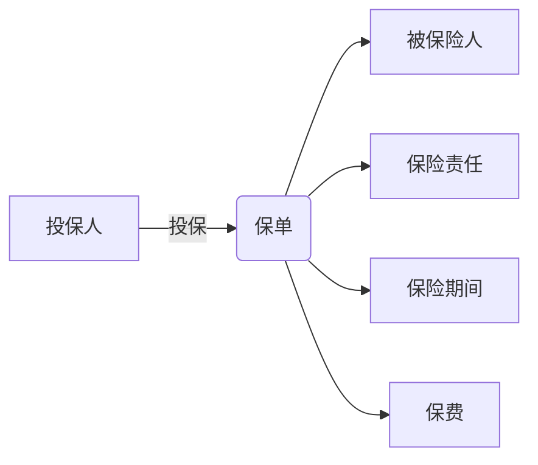

# 1. 背景介绍

## 1.1 保险行业概述

保险行业是一个庞大而复杂的领域,它为个人和企业提供风险保障和财务规划服务。随着社会的发展和人们对风险管理意识的增强,保险业务日益多样化,涵盖了人身保险、财产保险、责任保险等多个领域。

保险公司需要管理大量的保单信息,包括投保人信息、被保险人信息、保险责任、保费计算、理赔流程等,这对信息系统的要求非常高。一个高效、安全、可扩展的保险单管理系统,对于保险公司的运营至关重要。

## 1.2 系统开发的必要性

传统的手工操作和纸质档案管理方式已经无法满足现代保险公司的需求,主要原因包括:

1. **工作效率低下**:大量重复性的手工录入工作,容易出现错误,工作效率低下。
2. **数据管理混乱**:纸质档案管理混乱,数据查询和统计分析困难。
3. **业务扩展受限**:手工作业模式无法适应保险业务的快速增长和多样化发展。
4. **缺乏风险控制**:手工作业过程中,缺乏有效的风险控制和审计机制。

因此,开发一套保险单管理系统,实现保单数据的电子化管理,提高工作效率,加强风险控制,成为保险公司的迫切需求。

# 2. 核心概念与联系 

## 2.1 保单

保单是保险合同的载体,记录了投保人、被保险人、保险责任、保险期间、保费等核心信息。它是保险公司开展业务的基础。

## 2.2 投保人

投保人是与保险公司签订保险合同,并支付保费的当事人。投保人可以为自己投保,也可以为他人投保。

## 2.3 被保险人

被保险人是保险合同的受益对象,一旦发生保险责任范围内的事故,保险公司将向被保险人或其指定的受益人给付保险金。

## 2.4 保险责任

保险责任是指保险公司在保险合同项下应当承担的赔付义务,包括赔付范围、赔付金额等。不同类型的保险产品,其保险责任也不尽相同。

## 2.5 保险期间

保险期间是指保险公司承担保险责任的时间范围,通常为一年或若干年。在保险期间内,只要发生保险责任范围内的事故,保险公司就必须履行赔付义务。

## 2.6 保费

保费是投保人为购买保险服务而支付的费用。保费的计算通常与被保险人的风险程度、保险金额、保险期间等因素相关。

上述概念相互关联,构成了保险单管理系统的核心数据模型,如下图所示:



# 3. 核心算法原理具体操作步骤

## 3.1 保费计算算法

保费计算是保险单管理系统的核心功能之一。保费的计算通常涉及多个因素,如被保险人的风险等级、保险金额、保险期间等。下面以人身保险为例,介绍保费计算的一般步骤:

1. **确定被保险人的风险等级**

   根据被保险人的年龄、性别、职业、健康状况等因素,计算其风险分值,并将其划分为相应的风险等级。风险等级越高,保费越贵。

2. **选择基础保费率**

   不同的保险产品有不同的基础保费率,通常以每万元保险金额的年费来计算。基础保费率越高,保费越贵。

3. **计算风险保费**

   $$ \text{风险保费} = \text{基础保费率} \times \text{风险系数} \times \text{保险金额} $$

   其中,风险系数是根据被保险人的风险等级确定的调整系数。

4. **计算附加保费**

   除了风险保费外,还需要考虑其他附加费用,如手续费、营业费用等。附加保费通常是风险保费的一个百分比。

   $$ \text{附加保费} = \text{风险保费} \times \text{附加费率} $$

5. **计算总保费**

   $$ \text{总保费} = \text{风险保费} + \text{附加保费} $$

上述算法可以根据具体的保险产品类型和公司策略进行调整和优化。

## 3.2 理赔流程

理赔是保险公司履行保险责任的关键环节。一个高效的理赔流程,可以提高客户满意度,降低运营成本。理赔流程一般包括以下步骤:

1. **理赔申请**

   被保险人或其指定的受益人向保险公司提出理赔申请,并提供相关证明材料。

2. **材料审核**

   保险公司对理赔申请材料进行审核,包括投保人信息、被保险人信息、保单信息、事故情况说明等,确认理赔申请的合理性和真实性。

3. **核实理赔金额**

   根据保单约定的保险责任范围和赔付标准,核实本次理赔的金额。如有需要,保险公司可以委派公估人员现场查勘。

4. **审批理赔**

   理赔金额经过内部审批流程后,确定最终的理赔金额。

5. **支付理赔金**

   向被保险人或其指定的受益人支付理赔金。

6. **结案归档**

   理赔案件办理完毕后,将相关材料归档保存。

上述流程可以根据保险公司的具体情况进行优化,如引入自动化审核、在线理赔等,以提高处理效率。

# 4. 数学模型和公式详细讲解举例说明

## 4.1 生命contingencies模型

生命contingencies模型是人身保险精算的基础模型,用于计算人身保险产品的价值和保费。该模型的核心思想是将人的生命周期按年龄分段,计算每个年龄段的生存概率和死亡概率。

设 $l_x$ 表示年龄为 $x$ 的人数, $d_x$ 表示年龄在 $x$ 到 $x+1$ 之间死亡的人数,则:

$$
\begin{aligned}
l_{x+1} &= l_x - d_x \\
q_x &= \frac{d_x}{l_x} \\
p_x &= 1 - q_x
\end{aligned}
$$

其中, $q_x$ 表示年龄为 $x$ 的人在一年内死亡的概率, $p_x$ 表示其生存概率。

基于上述概率,我们可以计算各种人身保险产品的价值,如:

- 年金现值:

  $$ a_{\overline{x}} = \sum_{t=0}^{\infty} v^t p_x $$

- 终身人身保险净保费:

  $$ A_x = \frac{\sum_{t=0}^{\infty} d_{x+t} v^{t+1}}{l_x} $$

其中, $v = \frac{1}{1+i}$ 为折现因子, $i$ 为年利率。

上述模型为保费计算和产品定价奠定了理论基础。

## 4.2 大数定律与中心极限定理

在保险精算中,大数定律和中心极限定理是两个重要的概率统计原理。

**大数定律**认为,随机变量的算术平均值在独立重复试验中趋于其期望值。对于保险公司来说,这意味着通过拥有足够多的保单,整体的赔付金额将趋于期望值,从而实现风险分散。

**中心极限定理**则指出,无论总体分布是什么,只要样本足够大,样本均值的分布就近似于正态分布。这为保险公司的风险管理提供了理论依据,因为正态分布的性质较为简单,易于建模和计算。

例如,假设一份意外伤害保险的赔付金额 $X$ 服从参数为 $\mu$ 和 $\sigma^2$ 的对数正态分布。如果保险公司拥有 $n$ 份这种保单,则根据中心极限定理,当 $n$ 足够大时,总的赔付金额 $S_n = X_1 + X_2 + \cdots + X_n$ 的分布可以近似为正态分布:

$$ S_n \sim N(n\mu, n\sigma^2) $$

这样,保险公司就可以根据正态分布的性质,估计出一定置信水平下的最大可能赔付金额,从而制定相应的资金准备金策略。

# 5. 项目实践:代码实例和详细解释说明

为了更好地理解保险单管理系统的设计和实现,我们将使用 Java 语言,基于 Spring Boot 框架开发一个简单的示例项目。

## 5.1 系统架构

我们将采用经典的三层架构,包括:

1. **表现层(Controller)**: 处理HTTP请求,将请求转发给服务层。
2. **服务层(Service)**: 实现业务逻辑,对数据进行处理。
3. **持久层(Repository)**: 负责与数据库进行交互,执行数据的增删改查操作。

此外,我们还将引入以下组件:

- **Spring Data JPA**: 简化数据持久层的开发
- **H2 Database**: 内存数据库,用于开发和测试
- **Swagger**: 自动生成API文档

## 5.2 数据模型

我们将使用 JPA 注解来定义数据模型,对应的数据库表将由 Hibernate 自动创建。

```java
@Entity
public class Policy {
    @Id
    @GeneratedValue(strategy = GenerationType.IDENTITY)
    private Long id;

    private String policyNumber;
    private PolicyType type;
    private PolicyStatus status;

    @ManyToOne
    private Customer policyholder;

    @ManyToOne
    private Customer insured;

    private LocalDate effectiveDate;
    private LocalDate expirationDate;
    private BigDecimal premium;

    // getters and setters
}

@Entity
public class Customer {
    @Id
    @GeneratedValue(strategy = GenerationType.IDENTITY)
    private Long id;

    private String name;
    private LocalDate dateOfBirth;
    private String occupation;
    private RiskLevel riskLevel;

    // getters and setters
}
```

上面的代码定义了两个实体类 `Policy` 和 `Customer`。`Policy` 表示一份保单,包含了保单号、保险类型、状态、投保人、被保险人、生效日期、到期日期、保费等字段。`Customer` 表示客户信息,包含了姓名、出生日期、职业、风险等级等字段。

两个实体之间通过 `@ManyToOne` 注解建立了一对多的关联关系,即一个客户可以投保多份保单。

## 5.3 Repository 层

Repository 层负责与数据库进行交互,我们使用 Spring Data JPA 来简化开发。

```java
@Repository
public interface PolicyRepository extends JpaRepository<Policy, Long> {
    List<Policy> findByPolicyholder(Customer policyholder);
    List<Policy> findByInsured(Customer insured);
}

@Repository
public interface CustomerRepository extends JpaRepository<Customer, Long> {
}
```

上面的代码定义了两个 Repository 接口,分别用于操作 `Policy` 和 `Customer` 实体。由于我们继承了 `JpaRepository`,因此可以直接使用其提供的基本 CRUD 方法。此外,我们还定义了两个自定义查询方法,用于根据投保人或被保险人查找保单。

## 5.4 Service 层

Service 层实现了业务逻辑,包括保费计算、保单管理等功能。

```java
@Service
public class PolicyService {
    private final PolicyRepository policyRepository;
    private final CustomerRepository customerRepository;

    public PolicyService(PolicyRepository policyRepository, CustomerRepository customerRepository) {
        this.policyRepository = policyRepository;
        this.customerRepository = customerRepository;
    }

    public Policy createPolicy(PolicyDto policyDto) {
        Customer policyholder = customerRepository.findById(policyDto.getPolicyholderId())
                .orElseThrow(() -> new ResourceNotFoundException("Policyholder not found"));
        Customer insured = customerRepository.findById(policyDto.getInsuredId())
                .orElseThrow(() -> new ResourceNotFoundException("Insured not found"));

        Policy policy = new Policy();
        policy.setPolicyNumber(generatePolicyNumber());
        policy.setType(policyDto.getType());
        policy.setStatus(PolicyStatus.ACTIVE);
        policy.setPolicyholder(policyholder);
        policy.setInsured(insured);
        policy.setEffectiveDate(policyDto.getEffectiveDate());
        policy.setExpirationDate(policyDto.getExpirationDate());
        policy.setPremium(calculatePremium(insured, policyDto.getType(), policyDto.getCoverageAmount()));

        {"msg_type":"generate_answer_finish"}