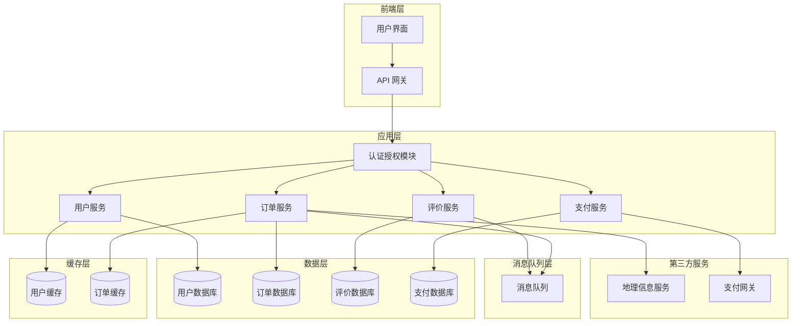

# 家政服务管理系统详细设计与具体代码实现

## 1. 背景介绍

### 1.1 家政服务行业概况

随着社会的发展和生活水平的提高,人们对家政服务的需求日益增长。家政服务行业作为一种新兴的服务业态,正在蓬勃发展。家政服务涵盖了家庭清洁、育儿服务、老年人护理、家电维修等多个领域,为广大家庭提供了便利。

### 1.2 家政服务管理系统的必要性

传统的家政服务管理模式存在诸多问题,如信息不对称、服务质量参差不齐、缺乏有效的监管机制等。为了规范家政服务市场,提高服务质量,实现供需双方的高效对接,构建一个家政服务管理系统势在必行。

### 1.3 系统目标

本文旨在设计并实现一个完整的家政服务管理系统,实现以下目标:

- 提供家政服务商家和用户的注册、认证和管理
- 实现服务需求发布和服务商接单
- 建立服务质量评价和监督机制
- 支持在线支付和财务管理
- 提供数据分析,为决策提供依据

## 2. 核心概念与联系

### 2.1 用户(User)

系统的服务对象,可分为服务商家(ServiceProvider)和服务需求方(ServiceDemander)两种角色。

### 2.2 服务类别(ServiceCategory)

系统管理的家政服务种类,如家庭清洁、育儿服务等,每个类别包含多个具体的服务项目。

### 2.3 服务项目(ServiceItem)

具体的服务内容,如窗户清洁、家电维修等,每个项目对应一个服务费用。

### 2.4 服务订单(ServiceOrder)

用户下单后生成的订单信息,包括服务内容、地点、时间、价格等详情。

### 2.5 评价系统(EvaluationSystem)

对服务商家的服务质量进行评价,作为服务商信用的重要参考。

### 2.6 支付系统(PaymentSystem)

实现订单费用的在线支付,对接第三方支付平台。

### 2.7 核心关系

用户 - 服务类别/项目 - 服务订单 - 评价系统 - 支付系统,构成了系统的核心业务流程。

## 3. 核心算法原理具体操作步骤

### 3.1 用户注册与认证

#### 3.1.1 用户注册

1) 用户提交注册信息(姓名、手机号、密码等)
2) 系统校验信息合法性
3) 密码加密存储
4) 发送手机验证码
5) 验证通过,创建用户,分配角色(服务商家/服务需求方)

#### 3.1.2 用户认证

1) 用户提交手机号/邮箱和密码
2) 系统验证密码正确性
3) 通过认证,生成会话令牌(Session Token)
4) 记录用户登录状态和令牌

#### 3.1.3 关键算法

- 密码加密: 使用安全的单向哈希算法,如bcrypt、PBKDF2等
- 会话管理: 使用JWT或其他Token机制管理会话状态

### 3.2 服务发布与接单

#### 3.2.1 发布服务需求

1) 用户(服务需求方)填写服务需求信息
2) 系统校验信息合法性
3) 创建服务订单,状态为"待接单"
4) 通知附近的服务商家

#### 3.2.2 服务商接单

1) 服务商家收到服务需求通知
2) 查看订单详情,选择是否接单
3) 如接单,更新订单状态为"已接单",指派员工
4) 通知用户(服务需求方)

#### 3.2.3 关键算法

- 地理位置计算: 使用地理坐标系统(GIS)计算用户和服务商家的距离
- 推送通知: 使用消息队列或WebSocket推送实时通知

### 3.3 服务评价

#### 3.3.1 服务评价流程

1) 服务商家完成服务,更新订单状态为"已完成"
2) 系统通知用户(服务需求方)进行评价
3) 用户提交服务评价(描述及星级)
4) 系统计算服务商家的综合评分

#### 3.3.2 评分计算算法

设服务商家 $S_i$ 已完成 $n$ 个订单,每个订单的评分为 $r_j (1 \leq j \leq n)$,则综合评分 $R_i$ 计算如下:

$$
R_i = \frac{\sum_{j=1}^{n}w_j r_j}{\sum_{j=1}^{n}w_j}
$$

其中 $w_j$ 为订单权重,可根据订单金额、时间等因素确定。

### 3.4 支付系统

#### 3.4.1 支付流程

1) 用户(服务需求方)下单时预付一定比例订金
2) 服务完成后,用户支付尾款
3) 如用户评价满意,尾款支付给服务商家
4) 如用户评价不满意,尾款可部分或全部退还

#### 3.4.2 关键算法

- 订单金额计算: 根据服务项目设置的费用计算总金额
- 支付风控: 识别和防范恶意支付行为,如重复支付、伪造支付等

## 4. 数学模型和公式详细讲解举例说明

在服务评价环节,我们使用了一种加权平均算法来计算服务商家的综合评分。设服务商家 $S_i$ 已完成 $n$ 个订单,每个订单的评分为 $r_j (1 \leq j \leq n)$,则综合评分 $R_i$ 计算公式如下:

$$
R_i = \frac{\sum_{j=1}^{n}w_j r_j}{\sum_{j=1}^{n}w_j}
$$

其中 $w_j$ 为订单权重,用于调节不同订单对综合评分的影响程度。订单权重可根据以下因素计算:

1. **订单金额**:金额越大,权重越高
   $$
   w_j^{amount} = \frac{amount_j}{\sum_{k=1}^{n}amount_k}
   $$

2. **订单时间**:最近订单权重更高
   $$
   w_j^{time} = \frac{1}{t_0 - t_j}
   $$
   其中 $t_0$ 为当前时间, $t_j$ 为订单完成时间

3. **订单权重综合**:
   $$
   w_j = \alpha w_j^{amount} + \beta w_j^{time}
   $$
   其中 $\alpha, \beta$ 为配置参数,调节两个权重的重要程度

通过这种加权平均的方式,可以更加公平地反映服务商家的实际服务质量。对于金额大、时间新的订单,它们对综合评分的影响更大;而金额小、时间久远的订单,其影响会逐渐减小。

以一个具体示例说明,假设服务商家 $S_1$ 完成了 5 个订单,订单详情如下:

| 订单编号 | 评分 | 金额(元) | 完成时间 |
| --- | --- | --- | --- |
| 1 | 4.5 | 100 | 2023-01-01 |
| 2 | 4.2 | 80 | 2023-02-15 |
| 3 | 4.8 | 120 | 2023-03-20 |  
| 4 | 3.9 | 90 | 2023-04-10 |
| 5 | 4.7 | 150 | 2023-05-01 |

设置参数 $\alpha=0.6, \beta=0.4, t_0=2023-05-15$,则各订单权重计算如下:

- 订单1: $w_1^{amount}=100/540=0.185, w_1^{time}=1/(2023*365+135)=0.0027, w_1=0.6*0.185+0.4*0.0027=0.114$
- 订单2: $w_2^{amount}=80/540=0.148, w_2^{time}=1/(2023*365+60)=0.0033, w_2=0.6*0.148+0.4*0.0033=0.092$
- 订单3: $w_3^{amount}=120/540=0.222, w_3^{time}=1/(2023*365+25)=0.0040, w_3=0.6*0.222+0.4*0.0040=0.137$
- 订单4: $w_4^{amount}=90/540=0.167, w_4^{time}=1/(2023*365+5)=0.0050, w_4=0.6*0.167+0.4*0.0050=0.104$
- 订单5: $w_5^{amount}=150/540=0.278, w_5^{time}=1/(2023*365)=0.0055, w_5=0.6*0.278+0.4*0.0055=0.171$

将权重代入综合评分公式,可得:

$$
R_1 = \frac{4.5*0.114+4.2*0.092+4.8*0.137+3.9*0.104+4.7*0.171}{0.114+0.092+0.137+0.104+0.171} = 4.49
$$

因此,服务商家 $S_1$ 的综合评分为 4.49 分(满分 5 分)。

## 5. 项目实践:代码实例和详细解释说明

### 5.1 技术栈

- 后端: Python3 + Flask 框架
- 前端: Vue.js 框架
- 数据库: PostgreSQL
- 缓存: Redis
- 消息队列: RabbitMQ
- 地理信息系统: ArcGIS API

### 5.2 系统架构



该系统采用了微服务架构,将不同的业务逻辑拆分到独立的服务中,通过 API 网关对外统一暴露服务。各服务使用轻量级的 Flask 框架开发,数据持久化使用 PostgreSQL 数据库。为了提高性能,引入了 Redis 作为缓存,RabbitMQ 作为消息队列。系统还对接了第三方的地理信息服务和支付网关。

### 5.3 关键模块代码

#### 5.3.1 用户认证模块(auth.py)

```python
from flask import Blueprint, request, jsonify
import bcrypt
import jwt

auth_bp = Blueprint('auth', __name__)

# JWT 密钥
JWT_SECRET = 'your-secret-key'

# 用户数据存储
users = {}

@auth_bp.route('/register', methods=['POST'])
def register():
    data = request.get_json()
    username = data.get('username')
    password = data.get('password')
    
    # 检查用户名是否已存在
    if username in users:
        return jsonify({'error': 'Username already exists'}), 400
    
    # 密码加密
    salt = bcrypt.gensalt()
    hashed_password = bcrypt.hashpw(password.encode('utf-8'), salt)
    
    # 存储用户信息
    users[username] = {
        'password': hashed_password,
        'role': data.get('role')
    }
    
    return jsonify({'message': 'User registered successfully'}), 201

@auth_bp.route('/login', methods=['POST'])
def login():
    data = request.get_json()
    username = data.get('username')
    password = data.get('password')
    
    # 检查用户名是否存在
    if username not in users:
        return jsonify({'error': 'Invalid username or password'}), 401
    
    user = users[username]
    
    # 验证密码
    if not bcrypt.checkpw(password.encode('utf-8'), user['password']):
        return jsonify({'error': 'Invalid username or password'}), 401
    
    # 生成 JWT 令牌