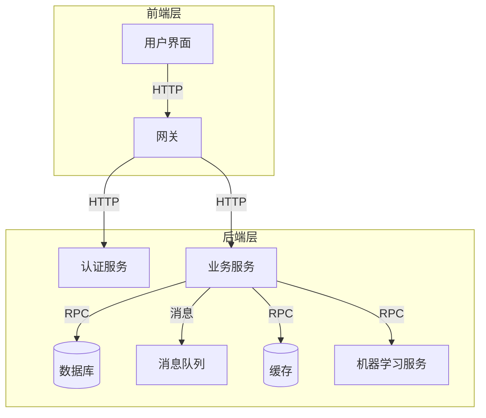

# 1. 背景介绍

## 1.1 毕业设计的重要性

毕业设计是高校本科教育的重要组成部分,是学生综合运用所学知识,培养独立工作能力的重要实践环节。通过毕业设计,学生可以巩固和深化所学的专业知识,提高分析问题和解决问题的能力,培养独立工作的习惯和创新意识。同时,毕业设计也是高校评价学生综合素质的重要依据之一。

## 1.2 传统毕业设计管理存在的问题

传统的毕业设计管理模式存在诸多问题:

1. **信息化程度低**:大部分高校仍采用纸质文件的方式进行管理,工作效率低下,信息共享困难。

2. **流程复杂**:从选题、开题到答辩,需要大量的人工审批和协调,流程繁琐。

3. **监管困难**:对学生的开发进度和成果质量缺乏有效的监控手段。

4. **资源共享困难**:优秀的毕业设计成果和相关资源难以得到充分利用和共享。

因此,构建一个高效、智能的毕业设计管理系统迫在眉睫。

# 2. 核心概念与联系

## 2.1 系统架构

毕业设计管理系统通常采用B/S架构或C/S架构,主要包括:

- **前端**:提供用户界面,实现人机交互。
- **后端**:处理业务逻辑,对数据进行增删改查等操作。
- **数据库**:存储系统所需的各种数据。

## 2.2 主要功能模块

- **用户管理**:管理教师、学生等用户的基本信息。
- **选题管理**:发布选题信息,学生选择课题。
- **任务书管理**:填写和审批任务书。
- **过程管理**:学生上传开发文档,教师评阅。
- **答辩管理**:安排答辩,录入答辩成绩。
- **成果管理**:上传最终成果,优秀作品展示。
- **系统管理**:管理员对系统进行配置和维护。

## 2.3 角色权限

不同角色在系统中拥有不同的权限:

- **管理员**:拥有最高权限,可管理全部模块。
- **教师**:可发布选题、审阅文档、评定成绩等。
- **学生**:可选题、提交文档、参加答辩等。

# 3. 核心算法原理和具体操作步骤

## 3.1 用户身份认证

### 3.1.1 原理

用户身份认证是系统的基础,确保只有合法用户才能访问系统资源。常用的认证方式有:

- 用户名+密码
- 双因素认证(密码+手机验证码等)
- 单点登录(SSO)

### 3.1.2 操作步骤

1. 用户输入用户名和密码
2. 系统将用户输入与数据库中存储的用户信息进行比对
3. 如果匹配成功,生成会话标识(Session ID),允许用户访问
4. 如果匹配失败,提示用户重新输入

### 3.1.3 安全加固

- 密码加密存储(如MD5、bcrypt等)
- 设置密码复杂度要求
- 限制错误尝试次数
- 双因素认证提高安全性

## 3.2 选题智能匹配

### 3.2.1 原理

选题是毕业设计的重中之重,系统可以根据学生的兴趣爱好、专业背景等信息,为其智能匹配合适的选题,提高选题的针对性。

常用的匹配算法有:

- 基于内容的推荐
- 协同过滤算法
- 机器学习算法(如决策树、SVM等)

### 3.2.2 操作步骤

1. 学生在系统中填写个人信息(专业、兴趣等)
2. 教师发布选题,并标注选题的关键词
3. 系统根据学生信息和选题信息,计算相似度得分
4. 将得分较高的选题推荐给学生

### 3.2.3 改进

- 引入学生的历史选题数据,改进推荐
- 学生可以反馈推荐结果,系统自我学习优化
- 增加教师人工审核环节,保证匹配质量

## 3.3 过程监控与评阅

### 3.3.1 原理 

过程监控是保证毕业设计质量的关键,教师需要实时跟踪学生的开发进度,及时发现并解决问题。同时,教师需要评阅学生提交的文档,给出中肯的评语和分数。

### 3.3.2 操作步骤

1. 学生按阶段性上传开发文档(需求、设计、代码等)
2. 系统记录每个文档的提交时间,并通知教师审阅
3. 教师在线打分并填写评语
4. 系统汇总各阶段的评分,生成总体评价报告
5. 学生可查看评语,并根据建议进行改进

### 3.3.3 改进

- 设置文档提交截止时间,对逾期文档自动扣分
- 教师可以直接在文档上批注,更直观
- 引入同行评审机制,多位教师共同评阅

## 3.4 成果优选与推广

### 3.4.1 原理

优秀的毕业设计成果不应该只存放在档案室,而应该得到充分的推广和利用。系统可以自动甄别出优秀作品,并在校园或更大范围内进行展示和分享。

常用的优选算法有:

- 基于规则的筛选(如根据总分、教师评价等)
- 基于投票的排序(如学生投票、教师投票等)
- 基于机器学习的分类(如决策树、SVM等)

### 3.4.2 操作步骤  

1. 学生上传最终成果(文档、代码、演示视频等)
2. 系统根据预设规则或算法,计算每个作品的优秀分数
3. 将得分较高的作品列为优秀作品
4. 在系统内展示优秀作品,并组织线上或线下分享会
5. 优秀作品可被其他学校或企业查阅、使用

### 3.4.3 改进

- 增加人工审核环节,防止算法误判
- 优秀作品可在系统内进行有偿下载
- 作品作者可获得版税或其他奖励
- 企业可在系统内发布需求,寻找合适的优秀作品

# 4. 数学模型和公式详细讲解举例说明  

## 4.1 选题智能匹配算法

假设有 $m$ 个学生 $U=\{u_1,u_2,...,u_m\}$, $n$ 个选题 $I=\{i_1,i_2,...,i_n\}$。我们的目标是为每个学生 $u_j$ 推荐一个最合适的选题 $i_k$。

### 4.1.1 基于内容的推荐算法

我们将学生 $u_j$ 和选题 $i_k$ 的特征表示为向量 $\vec{u_j}$ 和 $\vec{i_k}$,则它们之间的相似度可以用余弦相似度来计算:

$$\text{sim}(u_j,i_k)=\frac{\vec{u_j}\cdot\vec{i_k}}{|\vec{u_j}||\vec{i_k}|}$$

对于每个学生 $u_j$,我们计算它与所有选题的相似度,将相似度最高的选题作为推荐结果:

$$\hat{i}_j=\arg\max_{i_k\in I}\text{sim}(u_j,i_k)$$

### 4.1.2 协同过滤算法

协同过滤算法利用用户之间的相似性进行推荐。我们定义学生 $u_j$ 和 $u_l$ 之间的相似度为:

$$\text{sim}(u_j,u_l)=\frac{|\{i_k|r_{jk}\neq0 \&\& r_{lk}\neq0\}|}{\sqrt{|R(u_j)||R(u_l)|}}$$

其中 $R(u_j)$ 表示学生 $u_j$ 已选择的选题集合。

对于学生 $u_j$,我们计算它与其他所有学生的相似度,将与它最相似的那些学生选择的选题作为推荐:

$$\hat{I}_j=\bigcup_{u_l\in\text{top-N}(u_j)}R(u_l)-R(u_j)$$

这里 $\text{top-N}(u_j)$ 表示与 $u_j$ 最相似的 $N$ 个学生。

### 4.1.3 机器学习算法

我们也可以将选题推荐问题建模为一个分类或回归问题,利用机器学习算法进行求解。

假设我们有一个训练数据集 $\mathcal{D}=\{(x_1,y_1),(x_2,y_2),...,(x_n,y_n)\}$,其中 $x_i$ 表示学生的特征向量, $y_i\in\{0,1\}$ 表示该学生是否选择了某个选题。我们可以训练一个分类器 $f(x)$ 来预测一个新的学生 $u_j$ 是否会选择选题 $i_k$:

$$\hat{y}_{jk}=f(x_j,i_k)$$

常用的分类算法有逻辑回归、决策树、支持向量机等。对于回归问题,我们可以用 $\hat{y}_{jk}$ 表示学生 $u_j$ 对选题 $i_k$ 的兴趣程度,将兴趣程度最高的选题作为推荐结果。

## 4.2 过程监控评分模型

为了全面评价学生的毕业设计过程,我们可以将评分过程建模为一个加权评分模型。假设有 $n$ 个评分维度,每个维度的权重为 $w_i$,学生在该维度上的分数为 $s_i$,则学生的总分为:

$$S=\sum_{i=1}^{n}w_is_i$$

满足约束条件:

$$\sum_{i=1}^{n}w_i=1,\quad 0\leq w_i\leq 1,\quad 0\leq s_i\leq 100$$

各个评分维度可以包括:

- 文档质量
- 代码质量
- 进度情况
- 答辩表现
- ...

权重 $w_i$ 可以由教师或管理员根据实际情况进行设置。

此外,我们还可以引入时间惩罚因子,对于逾期提交的文档给予一定分数扣减:

$$s_i'=s_i-\lambda\max(0,t_i-T_i)$$

其中 $t_i$ 表示实际提交时间, $T_i$ 表示截止时间, $\lambda$ 为每单位时间的扣分比例。

# 5. 项目实践:代码实例和详细解释说明

## 5.1 技术选型

- 前端:React+Ant Design
- 后端:Spring Boot
- 数据库:MySQL
- 缓存:Redis
- 消息队列:RabbitMQ
- 机器学习:Python+Scikit-Learn

## 5.2 系统架构



## 5.3 关键模块实现

### 5.3.1 用户认证

```java
// Spring Security配置
@EnableWebSecurity
public class SecurityConfig extends WebSecurityConfigurerAdapter {

    @Override
    protected void configure(HttpSecurity http) throws Exception {
        http.authorizeRequests()
            .antMatchers("/login").permitAll() // 登录接口不需要认证
            .anyRequest().authenticated() // 其他接口需要认证
            .and()
            .formLogin() // 使用表单登录
            .loginProcessingUrl("/login") // 登录接口
            .and()
            .csrf().disable(); // 禁用CSRF保护
    }

    @Bean
    public PasswordEncoder passwordEncoder() {
        return new BCryptPasswordEncoder(); // 使用BCrypt加密密码
    }
}
```

### 5.3.2 选题推荐

```python
# 基于内容的推荐算法
def recommend_by_content(student, topics, sim_func):
    # 计算学生与每个选题的相似度
    scores = [(sim_func(student