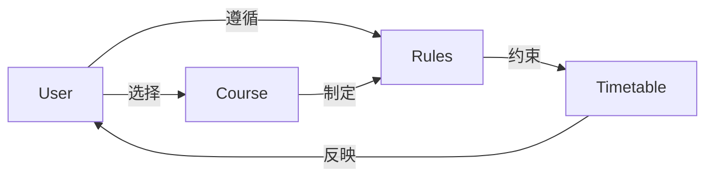

# 选课系统详细设计与具体代码实现

## 1. 背景介绍

### 1.1 选课系统的重要性

在当今的教育体系中,选课系统扮演着至关重要的角色。它不仅为学生提供了一个方便、高效的选课平台,同时也为教师和管理人员带来了诸多便利。一个良好设计的选课系统能够:

- 简化选课流程,节省时间和人力成本
- 确保课程安排的合理性和公平性 
- 提高教学资源的利用率
- 为教育决策提供数据支持

### 1.2 现有系统的不足

目前,许多高校仍在使用传统的人工作业方式进行选课,或者使用了功能单一、用户体验差的选课系统。这些做法存在以下问题:

- 工作量大,效率低下
- 错误率高,数据准确性差
- 无法满足多样化的选课需求
- 缺乏数据分析和决策支持

### 1.3 设计目标

针对以上问题,我们需要设计一个全新的、功能完备的选课系统,以实现:

- 自动化、高效的选课流程
- 公平、透明的课程分配机制
- 丰富的个性化选课功能
- 强大的数据分析和决策支持能力

## 2. 核心概念与联系

### 2.1 选课系统的核心概念

- 用户(User): 包括学生、教师和管理员
- 课程(Course): 包括课程基本信息、上课时间、上课地点、任课教师等
- 选课规则(Selection Rules): 确定选课的先决条件和限制
- 时间表(Timetable): 记录学生的课程安排

### 2.2 概念之间的关系

用户根据选课规则选择课程,并生成个人时间表。管理员负责维护课程信息、制定选课规则。教师开设课程,审批学生的选课申请。



## 3. 核心算法原理具体操作步骤

### 3.1 课程冲突检测算法

为了避免学生选择时间冲突的课程,我们需要一种高效的课程冲突检测算法。这里介绍一种基于区间树(Interval Tree)的解决方案。

#### 3.1.1 区间树的构建

1) 将所有课程时间段转换为区间,按起始时间排序
2) 构建一个初始只包含根节点的区间树
3) 从排序后的区间列表中取出第一个区间,将它插入树中
4) 对剩余的每个区间,按以下步骤插入树中:
    - 从根节点开始查找,沿着与当前区间有交集的子树继续查找
    - 如果当前节点的区间与插入区间不相交,则沿着不相交的子树继续查找
    - 如果当前节点没有子节点,则在该节点下创建新节点,存储插入区间

#### 3.1.2 检测课程冲突

对于新的课程时间段,我们可以在区间树中查找是否与已有课程时间冲突:

1) 从根节点开始查找
2) 如果当前节点区间与查询区间不相交,则查找不相交的子树
3) 如果当前节点区间与查询区间相交,则存在冲突
4) 如果查找到空节点,则不存在冲突

该算法的时间复杂度为 $O(k \log n)$,其中 $k$ 为冲突区间的数量, $n$ 为区间树中节点的总数。

### 3.2 课程选择优化算法

为了最大化学生的选课满意度,同时满足选课规则的约束,我们可以将其建模为一个约束优化问题(Constraint Optimization Problem, COP),并使用启发式算法(如模拟退火)求解。

#### 3.2.1 问题建模

- 决策变量: 每个学生选择的课程组合
- 目标函数: 最大化所有学生的选课满意度之和
- 约束条件:
    - 课程时间冲突
    - 先修课程要求
    - 课程容量限制
    - 学生兴趣偏好

#### 3.2.2 模拟退火算法

1) 初始化: 随机生成一个可行的课程选择方案
2) 评估当前方案的目标函数值
3) 循环直到满足终止条件:
    a) 生成新的邻域解(通过交换两个学生的部分选课)
    b) 计算新解的目标函数值
    c) 如果新解更优,则接受新解
    d) 否则,以一定概率接受新解(模拟退火)
4) 返回最优解

该算法可以有效地探索解空间,并在合理的时间内找到一个近似最优解。

## 4. 数学模型和公式详细讲解举例说明

### 4.1 选课满意度建模

我们将学生对每门课程的满意度用实数 $s_{ij}$ 表示,其中 $i$ 表示学生, $j$ 表示课程。$s_{ij}$ 的取值范围为 $[0, 1]$,值越大表示满意度越高。

令 $x_{ij}$ 为二元决策变量,表示学生 $i$ 是否选择了课程 $j$:

$$
x_{ij} = \begin{cases}
1, & \text{学生 $i$ 选择了课程 $j$}\\
0, & \text{学生 $i$ 没有选择课程 $j$}
\end{cases}
$$

则学生 $i$ 的总满意度为:

$$
u_i = \sum_{j} s_{ij} x_{ij}
$$

我们的目标是最大化所有学生的总满意度之和:

$$
\max \sum_{i} u_i = \max \sum_{i} \sum_{j} s_{ij} x_{ij}
$$

### 4.2 约束条件建模

#### 4.2.1 课程时间冲突约束

令 $C_{jk}$ 表示课程 $j$ 和课程 $k$ 是否存在时间冲突:

$$
C_{jk} = \begin{cases}
1, & \text{课程 $j$ 和课程 $k$ 存在时间冲突}\\
0, & \text{课程 $j$ 和课程 $k$ 不存在时间冲突}
\end{cases}
$$

则时间冲突约束可表示为:

$$
\forall i, j, k: x_{ij} + x_{ik} \leq 1 + (1 - C_{jk})
$$

#### 4.2.2 先修课程约束

令 $P_{jk}$ 表示课程 $k$ 是否需要先修课程 $j$:

$$
P_{jk} = \begin{cases}
1, & \text{课程 $k$ 需要先修课程 $j$}\\
0, & \text{课程 $k$ 不需要先修课程 $j$}
\end{cases}
$$

则先修课程约束可表示为:

$$
\forall i, j, k: x_{ik} \leq x_{ij} + (1 - P_{jk})
$$

#### 4.2.3 课程容量约束

令 $Q_j$ 表示课程 $j$ 的最大容量,则容量约束可表示为:

$$
\forall j: \sum_{i} x_{ij} \leq Q_j
$$

通过将上述约束条件与目标函数相结合,我们就可以构建出完整的约束优化模型。

## 5. 项目实践: 代码实例和详细解释说明

为了更好地理解选课系统的实现,我们将使用 Python 编写一个简单的示例项目。该项目包括以下几个核心模块:

### 5.1 数据模块

该模块定义了系统中的基本数据结构,包括 `User`、`Course`、`Timetable` 等类。

```python
class User:
    def __init__(self, id, name, type):
        self.id = id
        self.name = name
        self.type = type  # 'student', 'teacher' or 'admin'
        self.courses = []  # 学生选课列表
        self.timetable = Timetable(self)  # 个人时间表

class Course:
    def __init__(self, id, name, teacher, schedule):
        self.id = id
        self.name = name
        self.teacher = teacher
        self.schedule = schedule  # 上课时间
        self.students = []  # 选课学生列表
        self.capacity = 50  # 课程容量

class Timetable:
    def __init__(self, user):
        self.user = user
        self.slots = []  # 时间段列表

    def add_course(self, course):
        # 检测时间冲突
        # ...
        
        # 添加课程时间段
        self.slots.extend(course.schedule)
```

### 5.2 选课规则模块

该模块实现了各种选课规则的检查和执行逻辑。

```python
def check_conflict(course, timetable):
    """检测时间冲突"""
    for slot in course.schedule:
        if slot in timetable.slots:
            return True
    return False

def check_prerequisite(course, student):
    """检查先修课程"""
    for prereq in course.prerequisites:
        if prereq not in student.courses:
            return False
    return True

def enroll(student, course):
    """选课逻辑"""
    if not check_conflict(course, student.timetable) and \
       check_prerequisite(course, student) and \
       len(course.students) < course.capacity:
        student.courses.append(course)
        course.students.append(student)
        student.timetable.add_course(course)
        return True
    return False
```

### 5.3 用户界面模块

该模块提供了命令行界面,允许用户执行各种操作。

```python
def main():
    # 初始化数据
    users = load_users()
    courses = load_courses()

    while True:
        # 显示菜单
        # ...

        choice = input('请选择操作: ')
        if choice == '1':  # 学生选课
            sid = input('请输入学生ID: ')
            student = get_user(sid, users)
            # ...
            
        elif choice == '2':  # 教师开设课程
            # ...

        elif choice == '3':  # 管理员操作
            # ...

        # ...

if __name__ == '__main__':
    main()
```

通过上述代码示例,我们可以看到选课系统的基本架构和核心功能是如何实现的。当然,在实际项目中,我们还需要添加更多的功能和优化,如数据持久化、并发控制、用户权限管理等。

## 6. 实际应用场景

选课系统在教育领域有着广泛的应用,不仅适用于高校,也可以应用于中小学、培训机构等场景。以下是一些典型的应用场景:

### 6.1 高校选课系统

高校选课系统是最常见的应用场景。该系统需要满足以下需求:

- 支持大规模学生和课程
- 复杂的选课规则和约束
- 个性化的选课偏好
- 教学资源的合理分配
- 数据分析和决策支持

### 6.2 中小学选课系统

中小学选课系统相对简单,但也有一些特殊需求:

- 家长参与选课过程
- 课程分级和分流
- 兴趣课程的开设和选择
- 校外培训课程的管理

### 6.3 培训机构选课系统

培训机构的选课系统需要满足以下需求:

- 灵活的课程安排
- 多场地、多教室的资源调度
- 学员分级和分组
- 收费和财务管理

无论是哪种应用场景,选课系统都可以极大地提高教育资源的利用效率,优化教学过程,为教育决策提供数据支持。

## 7. 工具和资源推荐

在实现选课系统时,我们可以利用一些现有的工具和资源,以提高开发效率和系统质量。

### 7.1 编程语言和框架

- Python: 简单易学,生态系统丰富
- Django: 一个流行的 Python Web 框架
- Flask: 一个轻量级的 Python Web 框架

### 7.2 数据库

- PostgreSQL: 功能强大的开源关系型数据库
- MongoDB: 领先的开源 NoSQL 数据库

### 7.3 前端技术

- React: 流行的 JavaScript 前端框架
- Vue.js: 渐进式 JavaScript 框架
- Bootstrap: 流行的 CSS 框架

### 7.4 算法和优化库

- NumPy: 科学计算的基础包
- SciPy: 算法和数学工具库
- CPLEX: 商业优化求解器

### 7.5 其他资源

- GitHub: 开源社区,可以找到许多相关项目
- Stack Overflow: 技术问答网站,解决开发中的问题
- Coursera、edX: 提供优质的在线课程资源