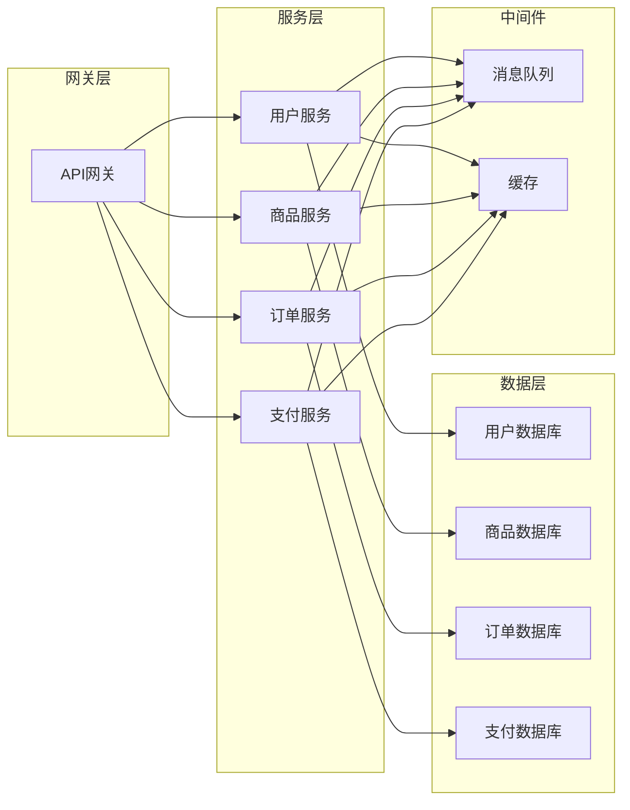

# 第五部分：技术方案设计

## 1. 背景介绍

在现代软件开发过程中，技术方案设计是一个关键环节。它为整个项目奠定了技术基础,确定了系统架构、技术选型和实现细节。一个优秀的技术方案不仅能够满足当前的业务需求,还需要具备良好的可扩展性、可维护性和性能,以适应未来的发展需求。

本文将探讨技术方案设计的重要性、常见挑战以及最佳实践。我们将介绍如何进行需求分析、架构设计、技术选型,并讨论性能优化、安全性和可维护性等关键因素。通过实际案例分析,读者将了解如何制定一个全面、高效的技术方案。

## 2. 核心概念与联系

### 2.1 需求分析

需求分析是技术方案设计的基础。它包括对业务需求、功能需求、非功能需求(如性能、安全性、可用性等)的全面理解和分析。需求分析阶段需要与业务人员、用户等利益相关方进行充分的沟通和讨论,确保需求的完整性和准确性。

### 2.2 架构设计

架构设计是技术方案的核心部分。它定义了系统的整体结构、组件划分、模块交互等。常见的架构模式包括单体架构、微服务架构、事件驱动架构等。架构设计需要考虑系统的可扩展性、可维护性、高可用性等非功能需求。

### 2.3 技术选型

技术选型是指选择合适的编程语言、框架、中间件、数据库等技术栈。技术选型需要综合考虑项目需求、团队技术能力、社区活跃度、生态系统等因素。合理的技术选型可以提高开发效率,降低维护成本。

### 2.4 性能优化

性能优化是技术方案设计中不可忽视的一个方面。它包括代码优化、数据库优化、缓存优化、负载均衡等多个层面。良好的性能可以提升用户体验,降低运营成本。

### 2.5 安全性

安全性是现代软件系统的基本要求。技术方案需要考虑数据加密、身份认证、访问控制、漏洞防护等安全措施,以保护系统和数据的安全。

### 2.6 可维护性

可维护性是指系统在未来的运维和迭代过程中的可维护程度。良好的可维护性可以降低维护成本,提高开发效率。可维护性需要从代码质量、文档完备性、测试覆盖率等多个角度来考虑。

## 3. 核心算法原理具体操作步骤

技术方案设计过程中,我们需要遵循一定的原理和步骤,以确保方案的完整性和可行性。下面是一个常见的技术方案设计流程:

1. **需求收集与分析**
   - 与业务人员、用户等利益相关方进行沟通,收集业务需求、功能需求和非功能需求
   - 对需求进行梳理、细化和优先级排序
   - 识别关键需求和潜在风险

2. **架构设计**
   - 选择合适的架构模式(单体、微服务、事件驱动等)
   - 划分系统模块和组件,定义模块职责和交互方式
   - 设计数据模型和数据流
   - 考虑可扩展性、高可用性、容错性等非功能需求

3. **技术选型**
   - 评估现有技术栈的适用性
   - 调研新兴技术,对比优缺点
   - 结合项目需求、团队技能、生态系统等因素进行选型
   - 制定技术路线图和迁移计划(如有必要)

4. **详细设计**
   - 对架构和技术选型进行进一步细化
   - 设计系统各个模块的详细实现方案
   - 制定接口规范、数据模型、缓存策略等
   - 进行安全性、性能等非功能需求的设计

5. **原型设计与验证**
   - 构建原型系统或关键模块
   - 进行功能验证和性能测试
   - 收集反馈,调整设计方案

6. **文档编写**
   - 编写技术方案文档,包括需求分析、架构设计、技术选型、详细设计等内容
   - 编写开发文档、部署文档、运维文档等

7. **持续优化**
   - 在实施和运维过程中持续收集反馈
   - 根据新需求和新技术进行方案优化
   - 建立健全的技术债务管理机制

需要注意的是,技术方案设计是一个迭代式的过程。在每个阶段,我们都需要与相关利益相关方进行沟通,收集反馈并及时调整方案。同时,我们还需要考虑技术债务的累积,制定相应的偿还计划。

## 4. 数学模型和公式详细讲解举例说明  

在技术方案设计中,我们经常需要使用数学模型和公式来量化和优化系统性能。下面是一些常见的数学模型和公式:

### 4.1 小世界网络模型

小世界网络模型是一种描述复杂网络拓扑结构的数学模型。它可以用于设计高效的分布式系统、社交网络等。小世界网络具有以下两个重要特征:

1. 短路径长度(Average Path Length): 网络中任意两个节点之间的平均最短路径长度较小,接近于随机网络。

2. 聚集系数(Clustering Coefficient): 网络中节点之间的聚集程度较高,远高于随机网络。

小世界网络模型的数学表达式如下:

$$
C(G) = \frac{1}{n}\sum_{i=1}^{n}C_i = \frac{1}{n}\sum_{i=1}^{n}\frac{2E_i}{k_i(k_i-1)}
$$

其中:
- $C(G)$ 表示整个网络的聚集系数
- $n$ 表示网络中节点的数量
- $C_i$ 表示第 $i$ 个节点的聚集系数
- $E_i$ 表示第 $i$ 个节点的邻居节点之间实际存在的边的数量
- $k_i$ 表示第 $i$ 个节点的度(邻居节点数量)

通过调整网络参数,我们可以构建具有小世界特征的高效分布式系统。

### 4.2 队列模型

在系统设计中,我们经常需要对请求队列进行建模和优化,以提高系统的吞吐量和响应时间。下面是一个基于 M/M/1 队列模型的示例:

$$
\begin{aligned}
\rho &= \lambda / \mu \\
L &= \rho / (1 - \rho) \\
W &= L / \lambda \\
W_q &= W - 1 / \mu
\end{aligned}
$$

其中:
- $\lambda$ 表示请求到达的平均速率
- $\mu$ 表示服务器处理请求的平均速率
- $\rho$ 表示系统的利用率
- $L$ 表示系统中的平均请求数量
- $W$ 表示请求在系统中的平均等待时间
- $W_q$ 表示请求在队列中的平均等待时间

通过调整请求到达速率、服务器处理速率等参数,我们可以优化系统的吞吐量和响应时间。

### 4.3 缓存命中率模型

缓存是提高系统性能的重要手段。我们可以使用数学模型来估计缓存命中率,并优化缓存策略。下面是一个基于 LRU(最近最少使用)缓存替换策略的示例:

$$
h_t = h_{t-1} + \frac{1 - h_{t-1}}{1 + \frac{1}{m}(1 - \frac{t}{n})}
$$

其中:
- $h_t$ 表示第 $t$ 次请求的命中率
- $m$ 表示缓存的大小
- $n$ 表示请求序列的长度

通过调整缓存大小、替换策略等参数,我们可以提高缓存命中率,从而优化系统性能。

以上只是一些简单的数学模型示例。在实际的技术方案设计中,我们还可以使用更加复杂的模型,如队列网络模型、马尔可夫模型、时间序列分析等,来量化和优化系统性能。

## 5. 项目实践:代码实例和详细解释说明

为了更好地理解技术方案设计的实践,我们将通过一个电商系统的案例,展示具体的代码实现和解释说明。

### 5.1 系统架构

我们采用基于微服务的架构,将系统划分为多个独立的服务,如用户服务、商品服务、订单服务、支付服务等。每个服务都是一个独立的进程,可以独立部署和扩展。服务之间通过 RESTful API 或消息队列进行通信。



### 5.2 技术选型

- 编程语言: Java
- Web框架: Spring Boot
- 数据库: MySQL
- 消息队列: RabbitMQ
- 缓存: Redis
- 容器化: Docker
- 服务注册与发现: Consul
- 负载均衡: Nginx
- 分布式追踪: Zipkin
- 日志收集: ELK

### 5.3 核心代码实现

下面是一个简化版的商品服务示例,展示了如何使用 Spring Boot 构建 RESTful API、访问数据库、集成缓存和消息队列等功能。

```java
// 商品服务
@SpringBootApplication
public class ProductServiceApplication {
    public static void main(String[] args) {
        SpringApplication.run(ProductServiceApplication.class, args);
    }
}

// 商品实体类
@Entity
public class Product {
    @Id
    private Long id;
    private String name;
    private BigDecimal price;
    // 其他属性...
}

// 商品存储库
@Repository
public interface ProductRepository extends JpaRepository<Product, Long> {
}

// 商品服务
@Service
public class ProductService {
    @Autowired
    private ProductRepository productRepository;

    @Autowired
    private RedisTemplate<String, Product> redisTemplate;

    @Autowired
    private RabbitTemplate rabbitTemplate;

    // 获取商品详情
    public Product getProduct(Long id) {
        // 先从缓存中获取
        Product product = redisTemplate.opsForValue().get("product:" + id);
        if (product != null) {
            return product;
        }

        // 缓存未命中,从数据库中获取
        product = productRepository.findById(id).orElseThrow(() -> new ProductNotFoundException(id));

        // 将商品信息存入缓存
        redisTemplate.opsForValue().set("product:" + id, product);

        return product;
    }

    // 创建商品
    public Product createProduct(Product product) {
        Product savedProduct = productRepository.save(product);

        // 发送商品创建事件到消息队列
        rabbitTemplate.convertAndSend("product.created", savedProduct);

        return savedProduct;
    }

    // 其他方法...
}

// 商品控制器
@RestController
@RequestMapping("/products")
public class ProductController {
    @Autowired
    private ProductService productService;

    @GetMapping("/{id}")
    public Product getProduct(@PathVariable Long id) {
        return productService.getProduct(id);
    }

    @PostMapping
    public Product createProduct(@RequestBody Product product) {
        return productService.createProduct(product);
    }

    // 其他方法...
}
```

上面的代码展示了如何使用 Spring Data JPA 访问数据库、Spring Cache 集成 Redis 缓存、Spring AMQP 集成 RabbitMQ 消息队列等功能。在实际项目中,我们还需要添加更多的业务逻辑、异常处理、安全控制等内容。

## 6. 实际应用场景

技术方案设计在各种软件系统中都有广泛的应用,下面是一些典型的应用场景:

### 6.1 电子商务系统

电子商务系统通常需要处理大量的并发请求,具有高可用、