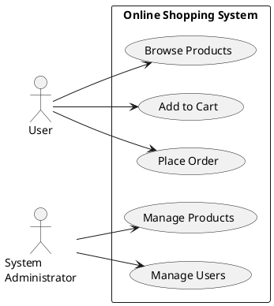

下面是关于"需求分析：明确标注目标和任务"的技术博客文章正文内容：

## 1.背景介绍

需求分析是软件开发生命周期中最关键的初始阶段之一。它旨在明确定义系统的目标、功能和约束,为后续的设计、实现和测试阶段奠定坚实的基础。在这个阶段,充分理解用户需求、业务流程和系统环境至关重要,因为任何疏忽或遗漏都可能导致严重的后果,如功能缺失、性能不佳或成本超支。

需求分析不仅需要收集和记录需求,更重要的是对需求进行审查、分析和优先级排序。这确保了需求的完整性、一致性和可实现性。明确的需求有助于所有利益相关方对系统的预期保持一致,从而减少沟通误解和返工。

## 2.核心概念与联系

### 2.1 需求

需求是对系统功能、性能、界面、数据、安全性、可靠性等方面的期望或约束的陈述。需求可分为以下几种类型:

- **功能需求**:描述系统应该执行的功能和行为。
- **非功能需求**:描述系统质量属性,如可用性、性能、安全性等。
- **约束**:限制系统设计和实现的条件或限制。

### 2.2 需求来源

需求可以来自多个来源,包括但不限于:

- **用户**:系统的最终用户。
- **利益相关方**:受系统影响的个人或组织。
- **现有系统**:遗留系统或需要集成的系统。
- **法规和标准**:必须遵守的法律、法规或行业标准。

### 2.3 需求层次

需求通常按照详细程度划分为不同层次:

- **商业需求**:高层次的业务目标和驱动因素。
- **用户需求**:用户对系统功能和行为的期望。
- **系统需求**:对整个系统的详细描述。
- **软件需求**:对软件组件的具体需求。

## 3.核心算法原理具体操作步骤

需求分析过程通常包括以下步骤:

1. **启动需求分析**:明确项目目标、范围和约束,识别利益相关方。
2. **收集需求**:通过面谈、调查、观察、研讨会等方式收集需求。
3. **分析需求**:审查需求的完整性、一致性、可行性和优先级。
4. **规格说明**:以标准格式记录需求,如用例、用户故事或需求规格说明书。
5. **需求验证**:与利益相关方确认需求的正确性和完整性。
6. **需求管理**:跟踪和控制需求的变更。

需求分析过程是迭代的,需要不断地收集、分析和验证需求,直到所有需求都被充分理解和记录。

## 4.数学模型和公式详细讲解举例说明

在需求分析过程中,可以使用一些数学模型和公式来量化和优化需求。例如:

**卡诺模型(Kano Model)**

卡诺模型用于区分不同类型的需求对客户满意度的影响。它将需求分为三类:

- 基本需求(Must-be) $M$
- 期望需求(One-dimensional) $O$  
- 激励需求(Attractive) $A$

客户满意系数(CS)可以用下式计算:

$$CS = \frac{A+O}{M+O+A} \times 100\%$$

较高的CS值表示更好的客户满意度。

**analyticHierarchyProcess(AHP)** 

AHP是一种将复杂决策问题分解为层次结构的方法,用于确定需求的优先级。它包括以下步骤:

1. 建立层次结构模型
2. 构造判断矩阵 $A = (a_{ij})_{n\times n}$
3. 计算特征向量 $W = (w_1, w_2, ..., w_n)^T$
4. 一致性检验

其中 $w_i$ 表示第i个需求的权重,满足 $\sum_{i=1}^n w_i = 1$。

这些模型和公式可以帮助需求分析人员更好地理解和优先排序需求。

## 4.项目实践:代码实例和详细解释说明

在需求分析阶段,通常不会编写代码。但是,我们可以使用一些工具来帮助收集、管理和记录需求。

例如,可以使用需求管理工具(如JIRA、Confluence等)来创建需求项目,添加需求描述、接受标准、优先级等属性。这些工具通常支持需求跟踪、变更管理和报告功能。

此外,我们还可以使用建模工具(如UML工具)来创建用例图、活动图、状态图等,以更好地可视化和理解需求。

下面是一个使用PlantUML创建用例图的示例:

这个示例展示了一个在线购物系统的用例图,包括用户可以浏览产品、添加到购物车和下单的用例,以及管理员可以管理产品和用户的用例。

## 5.实际应用场景

需求分析在各种软件开发项目中都扮演着重要角色,无论是传统的企业应用程序、Web应用程序、移动应用程序还是嵌入式系统。以下是一些常见的应用场景:

- **企业资源计划(ERP)系统**: 需求分析确保ERP系统能够满足组织的业务流程、数据集成和报告需求。
- **客户关系管理(CRM)系统**: 需求分析有助于确定CRM系统需要支持的销售、营销和客户服务功能。
- **电子商务网站**: 需求分析可以捕获用户对产品展示、购物车、支付和订单跟踪等功能的期望。
- **移动应用程序**: 需求分析有助于确定应用程序的目标用户、用例场景和设备兼容性需求。
- **物联网(IoT)系统**: 需求分析需要考虑硬件、通信协议、数据处理和安全性等方面的需求。

无论应用领域如何,需求分析都是确保软件系统满足用户和业务需求的关键。

## 6.工具和资源推荐

以下是一些常用的需求分析工具和资源:

- **需求管理工具**: JIRA, Confluence, IBM Rational DOORS, Caliber RM等。
- **建模工具**: Visual Paradigm, Enterprise Architect, StarUML, PlantUML等。
- **原型设计工具**: Axure RP, Justinmind, Marvel, InVision等。
- **在线资源**:
  - IBM Knowledge Center: https://www.ibm.com/docs/en/rationale
  - IREB (International Requirements Engineering Board): https://www.ireb.org/
  - Requirements Engineering Magazine: https://re-magazine.ireb.org/

此外,一些书籍和培训课程也可以帮助提高需求分析技能,例如:

- 《软件需求实践》(Karl Wiegers 等著)
- 《用户故事与敏捷需求》(Mike Cohn著)
- IREB认证培训课程

## 7.总结:未来发展趋势与挑战

需求分析在软件开发中扮演着至关重要的角色,但也面临着一些挑战和发展趋势:

- **敏捷和DevOps**: 敏捷方法和DevOps实践要求需求分析过程更加轻量级和迭代式,需要更好地支持需求的快速变更和反馈循环。
- **人工智能和自动化**: 利用自然语言处理和机器学习技术,可以自动化需求提取、分析和优先级排序的部分工作。
- **大数据和分析**: 通过分析用户行为数据和反馈,可以更好地发现隐性需求并优化需求。
- **需求可视化**: 使用交互式可视化工具来表示和探索需求,有助于提高需求的可理解性和可追溯性。

未来,需求分析将需要与新兴技术和实践相结合,以提高效率、质量和对业务价值的贡献。需求分析人员需要不断学习和适应,以保持相关技能。

## 8.附录:常见问题与解答

**Q: 需求分析和需求工程有什么区别?**

A: 需求分析是需求工程过程的一个关键阶段,重点是收集、分析和记录需求。需求工程是一个更广泛的概念,包括需求开发、需求管理和需求交付等活动。

**Q: 如何处理冲突的需求?**

A: 可以通过以下方式处理冲突的需求:
- 与利益相关方讨论,了解需求背后的动机和优先级。
- 尝试协调和折中,寻找满足所有需求的解决方案。
- 如果无法协调,则根据商业价值和技术可行性进行权衡和取舍。

**Q: 需求变更如何管理?**

A: 需求变更是不可避免的,应该建立正式的变更管理流程,包括:
- 记录和评估变更请求的影响。
- 与利益相关方沟通和批准变更。
- 跟踪和实施变更。
- 更新需求文档和相关工件。

**Q: 如何确保需求的可追溯性?**

A: 可追溯性意味着需求与其他工件(如设计、代码和测试用例)之间存在双向链接。可以采取以下措施:
- 为每个需求分配唯一ID。
- 使用需求管理工具跟踪需求与其他工件的关系。
- 在代码和测试用例中引用相关需求ID。
- 定期审查和报告需求覆盖情况。

需求分析是一个复杂的过程,需要不断实践和改进。希望这些问题和解答能够帮助您更好地理解和应用需求分析技术。