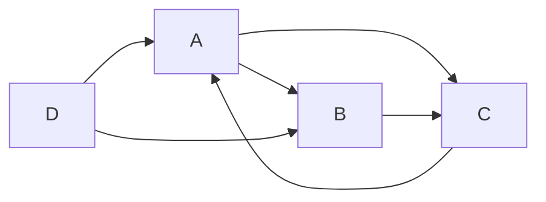

# 企业网站建设系统详细设计与具体代码实现

作者：禅与计算机程序设计艺术

## 1. 背景介绍

### 1.1 企业网站建设的重要性
在当今互联网时代,企业网站已成为企业形象展示、产品推广、客户互动的重要平台。一个高质量的企业网站不仅能够提升企业品牌形象,还能为企业带来更多的商机和客户。

### 1.2 企业网站建设面临的挑战
然而,企业网站建设并非易事。它涉及到需求分析、设计、开发、测试、部署等多个环节,需要前端、后端、UI设计、运维等多个角色的协同工作。同时,企业网站还需要考虑性能、安全、可扩展性、可维护性等诸多因素。

### 1.3 本文的目的和价值
本文将从技术角度,详细介绍一个企业网站建设系统的设计与实现。通过对系统架构、核心算法、关键代码的深入剖析,帮助读者全面理解企业网站的建设过程,掌握网站开发的最佳实践,从而能够开发出高质量的企业网站。

## 2. 核心概念与联系

### 2.1 前后端分离架构
前后端分离是指将网站的前端UI界面与后端业务逻辑和数据存储分离,通过API进行通信。这种架构有利于前后端的并行开发,提高开发效率,同时也使得前后端可以独立扩展。

### 2.2 响应式Web设计
响应式Web设计可以让网站在不同尺寸的设备上都有良好的显示效果,这对于企业网站尤为重要,因为用户可能通过PC、平板、手机等不同设备访问网站。

### 2.3 单页应用SPA
单页应用将所有的UI和交互集中在一个页面,通过JavaScript动态更新页面内容,避免了页面的重复加载,提供了更流畅的用户体验。

### 2.4 内容管理系统CMS
内容管理系统允许非技术人员通过可视化界面管理网站的内容,如发布新闻、管理产品信息等,大大降低了网站维护的成本。

### 2.5 搜索引擎优化SEO
搜索引擎优化通过优化网站的内容和结构,提高网站在搜索引擎中的排名,从而带来更多的自然流量。对于企业网站而言,SEO至关重要。

## 3. 核心算法原理具体操作步骤

### 3.1 页面渲染引擎工作原理
1. 解析HTML构建DOM树
2. 解析CSS构建CSSOM树 
3. 将DOM和CSSOM合并为渲染树
4. 布局(Layout):计算渲染树中每个节点的位置大小
5. 绘制(Paint):将渲染树节点绘制到屏幕上

### 3.2 浏览器缓存机制
1. 检查强缓存:比较Cache-Control和Expires
2. 协商缓存:发送请求,检查Last-Modified或ETag
3. 如果缓存有效则从缓存读取,否则从服务器获取最新资源

### 3.3 懒加载算法
1. 计算视口位置和资源位置
2. 判断资源是否在视口附近
3. 如果资源在视口附近,则加载资源
4. 随着页面滚动,重复步骤1-3

### 3.4 关键渲染路径优化
1. 最小化关键资源的数量(关键资源是可能阻止网页首次渲染的资源)
2. 优化关键字节数以缩短下载时间
3. 优化关键资源的加载顺序
4. 尽早加载关键资源以缩短关键路径长度

## 4. 数学模型和公式详细讲解举例说明

### 4.1 网站流量预测模型

我们可以使用时间序列分析的ARIMA模型来预测网站的流量趋势。ARIMA模型的一般形式为:

$$
y'_t = c + \phi_1 y'_{t-1} + \cdots + \phi_p y'_{t-p} + \theta_1 \varepsilon_{t-1} + \cdots + \theta_q \varepsilon_{t-q} + \varepsilon_t
$$

其中,$y'_t$是时间$t$的流量值,$\varepsilon_t$是白噪声,$c$是常数项,$p$和$q$分别是自回归项和移动平均项的阶数。

例如,假设我们通过分析历史数据,得到一个ARIMA(1,1,1)模型:

$$
y'_t = 0.8 y'_{t-1} + 0.2 \varepsilon_{t-1} + \varepsilon_t
$$

那么我们就可以用这个模型来预测未来一段时间内的网站流量。

### 4.2 网页排名算法

搜索引擎通常使用基于图的算法(如PageRank)来对网页进行排名。PageRank的基本思想是,一个网页的重要性取决于指向它的其他重要网页。

PageRank值$PR(u)$的计算公式为:

$$
PR(u) = \frac{1-d}{N} + d \sum_{v \in B_u} \frac{PR(v)}{L(v)}
$$

其中,$N$是所有网页的数量,$B_u$是指向网页$u$的网页集合,$L(v)$是网页$v$的出链数量,$d$是阻尼系数,通常取0.85。

例如,假设我们有4个网页A,B,C,D,它们的链接关系如下:



根据PageRank公式,我们可以建立如下方程组:

$$
\begin{cases}
PR(A) = \frac{1-d}{4} + d(\frac{PR(C)}{1}+\frac{PR(D)}{2}) \\
PR(B) = \frac{1-d}{4} + d(\frac{PR(A)}{2}+\frac{PR(D)}{2}) \\  
PR(C) = \frac{1-d}{4} + d(\frac{PR(A)}{2}+\frac{PR(B)}{1}) \\
PR(D) = \frac{1-d}{4}
\end{cases}
$$

求解这个方程组,就可以得到每个网页的PageRank值,从而确定它们的排名。

## 5. 项目实践：代码实例和详细解释说明

下面我们通过一个简单的新闻列表页面,来演示如何用React实现懒加载。

### 5.1 初始代码

```jsx
import React from 'react';

const NewsItem = ({ title, content }) => (
  <div className="news-item">
    <h3>{title}</h3>
    <p>{content}</p>
  </div>
);

const NewsList = ({ news }) => (
  <div className="news-list">
    {news.map(item => (
      <NewsItem key={item.id} title={item.title} content={item.content} />
    ))}
  </div>
);

export default NewsList;
```

这是一个普通的新闻列表组件,它会一次性渲染所有的新闻条目。

### 5.2 加入懒加载

```jsx
import React from 'react';
import { LazyLoad } from 'react-lazyload';

const NewsItem = ({ title, content }) => (
  <div className="news-item">
    <h3>{title}</h3>
    <p>{content}</p>
  </div>
);

const NewsList = ({ news }) => (
  <div className="news-list">
    {news.map(item => (
      <LazyLoad key={item.id} height={200} offset={100}>
        <NewsItem title={item.title} content={item.content} />
      </LazyLoad>
    ))}
  </div>
);

export default NewsList;
```

我们引入了`react-lazyload`库,将每个`NewsItem`包裹在`LazyLoad`组件中。`LazyLoad`组件有两个重要的属性:

- `height`:占位高度,在真实组件加载之前撑开页面高度
- `offset`:提前加载阈值,组件在距离视口`offset`像素时就开始加载

这样,页面初始加载时只会渲染可视区域内的新闻,其他新闻会在用户滚动页面时按需加载,大大提高了页面的初始加载速度。

## 6. 实际应用场景

企业网站建设系统可应用于各行各业的企业,帮助他们快速搭建高质量的网站。下面列举几个具体的应用场景:

### 6.1 中小企业官网
中小企业通常没有专业的技术团队,使用企业网站建设系统可以快速建立起专业的官方网站,展示企业形象,发布产品信息,吸引潜在客户。

### 6.2 电商网站
电商网站对性能、安全、用户体验有很高的要求,使用前后端分离架构、懒加载、CDN等技术,可以大大优化网站性能,提升转化率。

### 6.3 在线教育平台
在线教育平台需要管理大量的课程资源,使用内容管理系统可以方便地组织和发布课程。同时,还需要考虑视频的流畅播放、学员的互动交流等功能。

### 6.4 社区论坛
社区论坛需要处理大量的用户生成内容(UGC),使用NoSQL数据库可以更好地应对高并发和海量数据。同时,还需要防止垃圾信息、实现用户社交等功能。

## 7. 工具和资源推荐

### 7.1 前端框架
- React: 用于构建用户界面的JavaScript库
- Vue: 渐进式JavaScript框架
- Angular: 由Google维护的TypeScript框架

### 7.2 UI组件库
- Ant Design: 企业级UI设计语言和React组件库 
- Element: 基于Vue的桌面端组件库
- Bootstrap: 最流行的HTML、CSS和JS框架

### 7.3 后端框架
- Express: 基于Node.js平台的web应用开发框架
- Koa: 由Express幕后的原班人马打造的新一代web框架
- Laravel: 优雅的PHP Web开发框架
- Django: 高级Python Web框架

### 7.4 数据库
- MySQL: 最流行的关系型数据库
- MongoDB: 基于分布式文件存储的NoSQL数据库
- Redis: 开源的内存数据库,可用于数据缓存

### 7.5 开发工具
- VS Code: 微软开发的轻量级代码编辑器
- WebStorm: JetBrains公司旗下的JavaScript开发工具
- Postman: API开发协作平台

## 8. 总结：未来发展趋势与挑战

### 8.1 Serverless架构的兴起
Serverless架构让开发者无需关心底层资源,只需专注于业务逻辑的实现。未来,越来越多的企业网站可能会采用Serverless架构,以降低运维成本,提高开发效率。

### 8.2 AI技术的应用
人工智能技术在不断进步,未来可能应用到网站的各个方面,如智能客服、个性化推荐、自动生成内容等,给用户带来更好的体验。

### 8.3 WebAssembly的普及
WebAssembly是一种新的编码方式,可以让各种语言编译成在Web上运行的字节码。未来,WebAssembly可能会大大改变前端开发的生态,让更多的语言和框架能够运行在浏览器中。

### 8.4 Web安全问题
随着网站的复杂度不断提高,Web安全也面临更多的挑战。未来,企业需要更加重视Web安全问题,采用更先进的安全技术和管理措施,如双因素认证、数据加密、安全审计等。

### 8.5 Web性能优化
Web性能直接影响到用户体验和转化率。未来,企业需要在Web性能优化上投入更多的精力,采用更先进的优化技术,如HTTP/2、Service Worker、PWA等,给用户提供更快、更流畅的访问体验。

## 9. 附录：常见问题与解答

### 9.1 如何选择合适的前端框架？
选择前端框架需要考虑团队的技术栈、项目的需求、社区的支持等因素。React、Vue和Angular都是优秀的选择,可以根据具体情况进行选型。

### 9.2 如何进行前后端分离开发？
前后端分离开发需要制定清晰的接口规范,如RESTful API。前后端可以各自选择适合的技术栈,通过API进行通信。在开发过程中,可以使用Mock数据进行并行开发。

### 9.3 如何保证网站的安全性？
网站安全需要从多个方面入手,如使用HTTPS加密传输、对用户输入进行验证和过滤、定期进行安全扫描和渗透测试、及时更新补丁等。同时,还需要建立完善的安全管理制度和