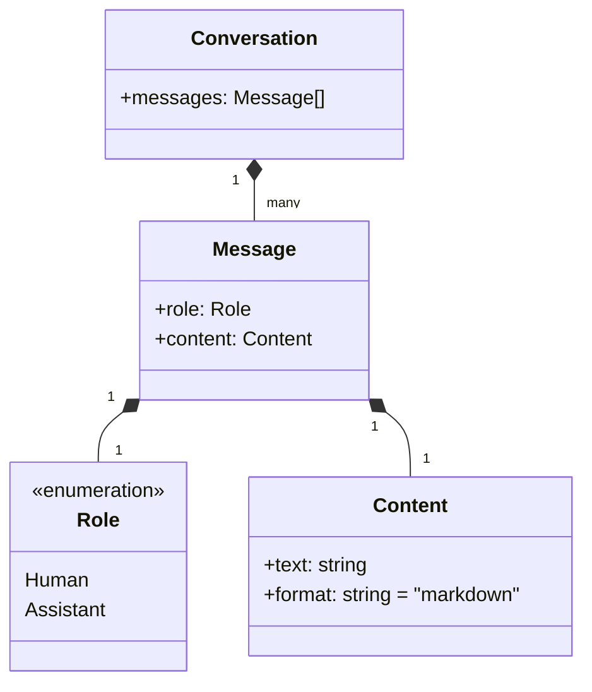
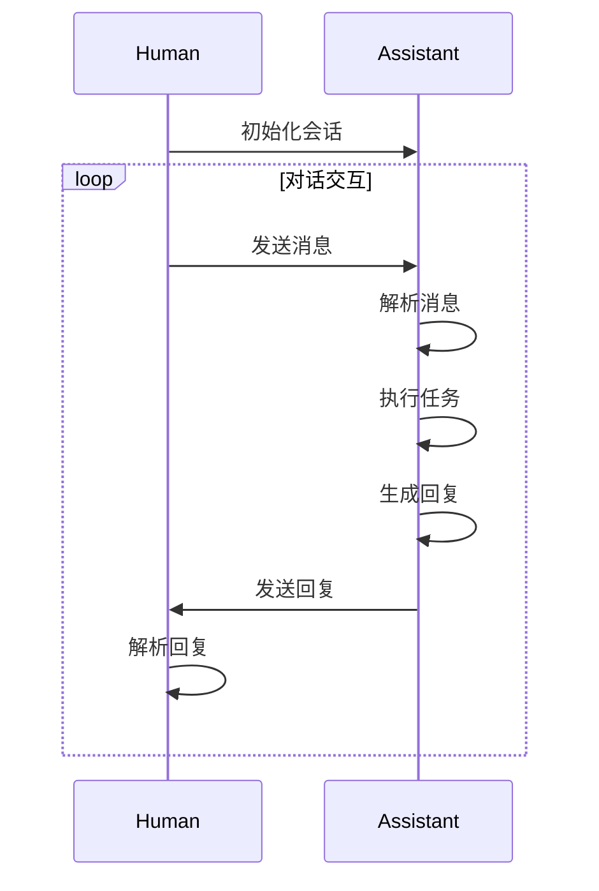

# 大语言模型应用指南：ChatML交互格式

作者：禅与计算机程序设计艺术

## 1. 背景介绍

### 1.1 大语言模型的兴起

近年来,随着深度学习技术的快速发展,特别是Transformer架构的提出,大规模预训练语言模型(Pretrained Language Models, PLMs)取得了突破性进展。GPT、BERT、T5等大语言模型相继问世,在各类自然语言处理任务上取得了远超人类的性能,展现出了令人惊叹的语言理解和生成能力。

### 1.2 大语言模型的应用挑战

尽管大语言模型展现了巨大的潜力,但如何将其有效应用到实际场景中,仍面临诸多挑战:

- 输入输出格式不统一:不同模型的输入输出格式各异,缺乏统一标准,给应用开发带来困难
- 人机交互不自然:传统的API调用方式不够灵活,难以实现自然流畅的多轮对话交互
- 任务描述不规范:缺乏描述任务的标准范式,导致任务理解和执行的一致性差

### 1.3 ChatML的提出

为了应对上述挑战,业界提出了ChatML(Chat Markup Language)这一大语言模型交互格式标准。ChatML旨在为大语言模型应用提供一套统一规范的交互范式,涵盖了任务描述、输入输出、对话管理等关键要素,力求简洁灵活、易于使用,从而大大降低了应用开发的门槛。

## 2. 核心概念与联系

### 2.1 ChatML的核心要素

ChatML主要包含以下几个核心要素:

- 消息(Message):对话交互的基本单元,由角色和内容组成
- 角色(Role):消息的发送方,可以是人(Human)或助手(Assistant) 
- 内容(Content):消息的具体内容,以Markdown格式表示
- 会话(Conversation):由一系列消息构成的完整对话过程

它们之间的关系可以用下面的类图来表示:



### 2.2 ChatML的设计理念

ChatML遵循以下设计理念:

- 简洁性:用最简单的结构来表达对话交互,易于理解和使用
- 灵活性:可以灵活组合和扩展,适应不同的应用场景
- 可读性:格式清晰易读,方便人工查看和编辑
- 一致性:统一规范,不同模型和应用之间可以互操作

## 3. 核心算法原理与操作步骤

### 3.1 基于ChatML的对话流程

基于ChatML的人机对话交互流程可以分为以下步骤:

1. 初始化会话,设置人类和助手的角色
2. 人类发送消息,助手接收消息并解析内容 
3. 助手根据消息内容执行相应的任务,生成回复消息
4. 助手发送回复消息,人类接收并解析内容
5. 重复步骤2-4,直到对话结束

可以用下面的时序图来表示:



### 3.2 消息的解析与生成算法

ChatML消息的解析与生成可以通过编程语言的字符串处理和正则表达式等基础算法来实现。

以Python为例,解析消息的代码示例如下:

```python
import re

def parse_message(text):
    role_pattern = r"^### (\w+):"
    content_pattern = r"^```(.*?)```"
    
    role_match = re.search(role_pattern, text, re.M)
    content_match = re.search(content_pattern, text, re.S)
    
    if role_match and content_match:
        role = role_match.group(1)
        content = content_match.group(1).strip()
        return {"role": role, "content": content}
    else:
        return None
```

生成消息的代码示例如下:

```python
def generate_message(role, content):
    return f"### {role}:\n```\n{content}\n```"
```

## 4. 数学模型和公式详解

### 4.1 基于ChatML的对话生成模型

我们可以将基于ChatML的对话生成过程建模为一个条件语言模型:

$$
P(Response|Context) = \prod_{i=1}^{n} P(token_i|token_{<i}, Context)
$$

其中,$Response$表示助手生成的回复消息,$Context$表示当前的对话上下文,由之前的一系列消息组成。$token_i$表示回复中的第$i$个单词,$token_{<i}$表示第$i$个单词之前的所有单词。

模型的目标是根据给定的上下文,生成一个自然流畅、恰当合理的回复消息,从数学上来说就是要最大化上述条件概率。

### 4.2 ChatML消息的向量表示

为了将ChatML消息输入到神经网络模型中,我们需要将其转换为数值向量的形式。通常采用的方法是将角色和内容分别编码为向量,然后拼接在一起:

$$
\mathbf{x}_i = [\mathbf{e}_{role}; \mathbf{e}_{content}]
$$

其中,$\mathbf{x}_i$表示第$i$个消息的向量表示,$\mathbf{e}_{role}$和$\mathbf{e}_{content}$分别表示角色和内容的向量编码。

角色可以用one-hot向量编码,而内容则可以使用词嵌入(word embedding)的方式,将每个单词映射为一个低维稠密向量,再通过RNN、CNN等方式进行编码。

## 5. 项目实践：代码实例与详解

下面我们通过一个简单的项目实例,来演示如何使用Python来解析和生成ChatML格式的消息。

### 5.1 安装依赖库

本项目只依赖Python标准库,无需安装任何第三方库。

### 5.2 定义ChatML相关的类

首先定义一些数据类来表示ChatML中的核心概念:

```python
from dataclasses import dataclass
from enum import Enum
from typing import List

class Role(Enum):
    HUMAN = "Human"
    ASSISTANT = "Assistant"

@dataclass
class Message:
    role: Role
    content: str

@dataclass 
class Conversation:
    messages: List[Message]
```

### 5.3 实现消息的解析与生成

然后实现消息解析和生成的函数:

```python
import re

def parse_message(text):
    role_pattern = r"^### (\w+):"
    content_pattern = r"^```(.*?)```"
    
    role_match = re.search(role_pattern, text, re.M)
    content_match = re.search(content_pattern, text, re.S)
    
    if role_match and content_match:
        role = Role(role_match.group(1))
        content = content_match.group(1).strip()
        return Message(role, content)
    else:
        return None

def generate_message(message):
    role = message.role.value
    content = message.content
    return f"### {role}:\n```\n{content}\n```"
```

### 5.4 测试

最后我们来测试一下:

```python
sample_text = """
### Human: 
```
Hello, how are you doing today?
```

### Assistant:
```
I'm doing great, thank you for asking! How can I assist you today?
```
"""

conversation = Conversation(messages=[])

for text in sample_text.strip().split("\n\n"):
    message = parse_message(text)
    if message:
        conversation.messages.append(message)

print("Parsed conversation:")
for message in conversation.messages:
    print(generate_message(message))
```

输出结果:

```
Parsed conversation:
### Human:
```
Hello, how are you doing today?
```
### Assistant:
```
I'm doing great, thank you for asking! How can I assist you today?
```
```

可以看到,我们成功地解析了ChatML格式的对话,并且可以再还原回去。

## 6. 实际应用场景

ChatML可以应用于各种需要人机对话交互的场景,例如:

- 客服聊天机器人:用ChatML格式来定义多轮对话任务,设计对话流程和知识库,实现智能化的客户服务
- 虚拟助手:将ChatML接入语音助手设备,实现语音对话交互,提供日程管理、信息查询等个性化服务
- 智能教育:用ChatML构建智能教学助手,引导学生进行互动学习,答疑解惑,提供个性化的学习建议
- 医疗健康:开发医疗健康领域的对话系统,提供智能问诊、健康咨询等服务,辅助医生诊断和治疗
- 金融服务:打造智能投顾助手,根据用户需求提供个性化的理财规划和产品推荐,提升用户体验

总之,ChatML为各行各业的智能化转型升级提供了新的工具和思路,有望成为人机交互的重要基础设施。

## 7. 工具和资源推荐

### 7.1 ChatML的参考实现

- OpenAI的Chat Markup Language:https://github.com/openai/openai-python/blob/main/chatml.md 
- Anthropic的ChatML参考实现:https://github.com/anthropics/chatml

### 7.2 大语言模型开放平台

- OpenAI API:https://openai.com/api/
- Anthropic API:https://www.anthropic.com/product
- 阿里云通用语言模型:https://help.aliyun.com/document_detail/311260.html
- 华为云ModelArts自然语言处理:https://www.huaweicloud.com/product/modelarts/nlp.html

### 7.3 相关论文与资源

- "Language Models are Few-Shot Learners":https://arxiv.org/abs/2005.14165
- "Recipes for building an open-domain chatbot":https://arxiv.org/abs/2004.13637
- "A Survey of Large Language Models":https://arxiv.org/abs/2303.18223
- Prompt Engineering Guide:https://www.promptingguide.ai/

## 8. 总结与展望

### 8.1 ChatML的意义

ChatML作为一种大语言模型的交互范式,有如下重要意义:

- 提供了一套统一的人机对话交互标准,有利于生态建设和互操作
- 简化了对话系统的开发流程,降低了应用门槛,加速了行业应用落地
- 赋能各行各业数字化智能化转型,催生出更多创新应用和服务模式

### 8.2 ChatML的局限和挑战

ChatML目前还处于发展的初期阶段,仍然存在一些局限和挑战:

- 覆盖的对话场景有限,对于一些复杂任务支持不足,如多模态、多人对话等
- 缺乏成熟完善的开发工具链和周边生态,应用开发的效率有待提高
- 对话质量和安全性难以保障,容易产生幻觉、偏见等问题,风险不容忽视

### 8.3 未来的发展方向

展望未来,ChatML还有很大的发展空间,主要有以下几个方向:

- 扩展对话能力:引入更多对话技能,如知识问答、任务规划、逻辑推理等,提升对话的深度和广度
- 完善开发生态:开发配套的IDE、调试工具、测试框架、部署平台等,提高开发效率和质量
- 强化安全与伦理:加强对语言模型的约束和审核,避免产生有害内容,确保对话安全合规
- 探索商业模式:在垂直行业深耕,提供面向行业的定制化解决方案,探索可持续的商业模式

总之,ChatML代表了人机对话交互的一个重要里程碑,为实现更加智能自然的人机协作开辟了广阔前景。让我们携手共建ChatML生态,共创人机交互的美好未来!

## 附录:常见问题与解答

### Q1:ChatML与传统的API调用方式相比有什么优势?

A1:相比传统API调用,ChatML具有以下优势:

- 交互更自然:采用类似人类对话的形式,接近自然语言交互,用户体验更好 
- 应用更灵活:可以方便地组合多个对话技能,设计复杂的对话流程,适应更多场景
- 开发更简单:无需定义复杂的数据结构和