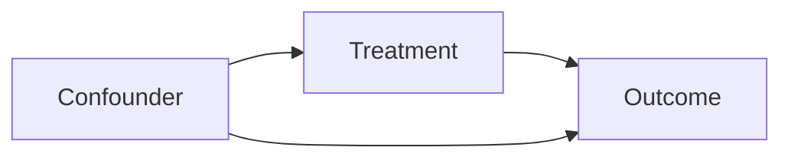

# LLMAgentOS的解释性:可解释的AI决策

作者：禅与计算机程序设计艺术

## 1. 背景介绍
### 1.1 人工智能的发展历程
#### 1.1.1 早期人工智能
#### 1.1.2 机器学习时代  
#### 1.1.3 深度学习的崛起
### 1.2 大语言模型(LLM)的出现
#### 1.2.1 Transformer架构
#### 1.2.2 GPT系列模型
#### 1.2.3 LLM的能力与局限
### 1.3 AI系统的可解释性问题
#### 1.3.1 黑盒模型的挑战
#### 1.3.2 可解释性的重要性
#### 1.3.3 现有的可解释性方法

## 2. 核心概念与联系
### 2.1 LLMAgentOS的定义
#### 2.1.1 基于LLM的智能代理操作系统
#### 2.1.2 LLMAgentOS的架构
#### 2.1.3 LLMAgentOS的特点
### 2.2 可解释性的定义与分类
#### 2.2.1 可解释性的定义
#### 2.2.2 全局可解释性与局部可解释性
#### 2.2.3 内在可解释性与事后可解释性
### 2.3 LLMAgentOS与可解释性的关系
#### 2.3.1 LLMAgentOS决策过程的复杂性
#### 2.3.2 可解释性对LLMAgentOS的重要性
#### 2.3.3 LLMAgentOS可解释性的挑战

## 3. 核心算法原理与具体操作步骤
### 3.1 基于注意力机制的可解释性方法
#### 3.1.1 注意力机制原理
#### 3.1.2 注意力可视化
#### 3.1.3 基于注意力的特征重要性分析
### 3.2 基于因果推理的可解释性方法
#### 3.2.1 因果推理基础
#### 3.2.2 因果模型构建
#### 3.2.3 反事实解释生成
### 3.3 基于知识图谱的可解释性方法 
#### 3.3.1 知识图谱构建
#### 3.3.2 基于知识图谱的推理
#### 3.3.3 知识图谱可视化解释

## 4. 数学模型和公式详细讲解举例说明
### 4.1 注意力机制的数学表示
#### 4.1.1 Scaled Dot-Product Attention
$$
Attention(Q,K,V) = softmax(\frac{QK^T}{\sqrt{d_k}})V
$$
其中，$Q$, $K$, $V$ 分别表示查询、键、值矩阵，$d_k$ 为键向量的维度。

#### 4.1.2 Multi-Head Attention
$$
MultiHead(Q,K,V) = Concat(head_1,...,head_h)W^O \\
head_i = Attention(QW_i^Q, KW_i^K, VW_i^V)
$$
其中，$W_i^Q$, $W_i^K$, $W_i^V$ 和 $W^O$ 为可学习的权重矩阵。

#### 4.1.3 注意力可视化示例


### 4.2 因果推理的数学基础
#### 4.2.1 因果图模型
因果图用有向无环图(DAG)表示变量之间的因果关系。例如：


#### 4.2.2 do-calculus
do-calculus是 Pearl 提出的一套因果推理规则，用于估计干预效应。三条规则如下：

- 规则1：$P(y|do(x),z,w) = P(y|do(x),w)$，如果 $(Y \perp\!\!\!\perp Z | X,W)_{G_{\overline{X}}}$

- 规则2：$P(y|do(x),do(z),w) = P(y|do(x),z,w)$，如果 $(Y \perp\!\!\!\perp Z | X,W)_{G_{\overline{X}\underline{Z}}}$

- 规则3：$P(y|do(x),do(z),w) = P(y|do(x),w)$，如果 $(Y \perp\!\!\!\perp Z | X,W)_{G_{\overline{X},\overline{Z(W)}}}$

#### 4.2.3 因果效应估计示例
假设我们要估计治疗 $X$ 对结果 $Y$ 的平均因果效应(ACE)：
$$
ACE = E[Y|do(X=1)] - E[Y|do(X=0)]
$$

### 4.3 知识图谱嵌入模型
#### 4.3.1 TransE
TransE 将关系看作实体之间的平移，目标是 $h+r \approx t$。损失函数为：
$$
L = \sum_{(h,r,t) \in S} \sum_{(h',r,t') \in S'} [γ + d(h+r,t) - d(h'+r,t')]_+
$$
其中，$S$ 为正样本三元组，$S'$ 为负样本三元组，$γ$ 为超参数，$d$ 为距离函数。

#### 4.3.2 ComplEx
ComplEx 在复数空间中对实体和关系进行建模。得分函数为：
$$
f(h,r,t) = Re(\langle \mathbf{h}, \mathbf{r}, \overline{\mathbf{t}} \rangle)
$$
其中，$\mathbf{h}$, $\mathbf{r}$, $\mathbf{t} \in \mathbb{C}^d$，$\overline{\mathbf{t}}$ 表示 $\mathbf{t}$ 的共轭复数。

#### 4.3.3 知识图谱推理示例


## 5. 项目实践：代码实例和详细解释说明
### 5.1 基于注意力机制的可解释性
```python
import torch
import torch.nn as nn

class AttentionExplainer(nn.Module):
    def __init__(self, model):
        super().__init__()
        self.model = model
        
    def forward(self, input_ids, attention_mask):
        outputs = self.model(input_ids, attention_mask, output_attentions=True)
        attentions = outputs.attentions
        
        # 计算注意力得分
        attention_scores = torch.mean(attentions[-1], dim=1).squeeze(0)
        
        # Softmax归一化
        attention_scores = torch.softmax(attention_scores, dim=-1)
        
        return attention_scores
```

以上代码实现了一个基于注意力机制的可解释性模块。通过提取模型最后一层的注意力权重，并进行归一化，得到每个输入token的重要性得分。

### 5.2 基于因果推理的可解释性
```python
import numpy as np
from pgmpy.models import BayesianNetwork
from pgmpy.inference import VariableElimination

# 构建因果图
model = BayesianNetwork([('Treatment', 'Outcome'), 
                         ('Confounder', 'Treatment'),
                         ('Confounder', 'Outcome')])

# 设置条件概率分布
cpd_confounder = TabularCPD('Confounder', 2, [[0.5], [0.5]])
cpd_treatment = TabularCPD('Treatment', 2, [[0.7, 0.3], 
                                            [0.4, 0.6]],
                           evidence=['Confounder'], evidence_card=[2])
cpd_outcome = TabularCPD('Outcome', 2, [[0.9, 0.6, 0.8, 0.2], 
                                        [0.1, 0.4, 0.2, 0.8]],
                         evidence=['Treatment', 'Confounder'], evidence_card=[2, 2])

model.add_cpds(cpd_confounder, cpd_treatment, cpd_outcome)

# 因果效应估计
infer = VariableElimination(model)
ace = (infer.query(['Outcome'], evidence={'Treatment': 1}).values[1] -
       infer.query(['Outcome'], evidence={'Treatment': 0}).values[1])

print(f'Average Causal Effect: {ace:.2f}')
```

以上代码展示了如何使用 pgmpy 库构建因果图模型，并估计治疗对结果的平均因果效应(ACE)。通过比较施加干预 $do(Treatment=1)$ 和 $do(Treatment=0)$ 下结果变量的概率分布差异，得到因果效应的估计值。

### 5.3 基于知识图谱的可解释性
```python
import torch
from torch.nn import functional as F

class KGReasoner(nn.Module):
    def __init__(self, num_entities, num_relations, embedding_dim):
        super().__init__()
        self.entity_embeddings = nn.Embedding(num_entities, embedding_dim)
        self.relation_embeddings = nn.Embedding(num_relations, embedding_dim)
        
    def forward(self, triples):
        head_embeddings = self.entity_embeddings(triples[:, 0])
        relation_embeddings = self.relation_embeddings(triples[:, 1]) 
        tail_embeddings = self.entity_embeddings(triples[:, 2])
        
        scores = torch.sum(head_embeddings * relation_embeddings * tail_embeddings, dim=-1)
        
        return scores

# 训练
model = KGReasoner(num_entities, num_relations, embedding_dim)
optimizer = torch.optim.Adam(model.parameters(), lr=0.001)
    
for epoch in range(num_epochs):
    model.train()
    for batch in train_loader:
        positive_triples, negative_triples = batch
        positive_scores = model(positive_triples)
        negative_scores = model(negative_triples)
        
        loss = F.margin_ranking_loss(positive_scores, negative_scores, target=torch.ones_like(positive_scores))
        
        optimizer.zero_grad()
        loss.backward()
        optimizer.step()
```

以上代码实现了一个简单的知识图谱推理模型，通过学习实体和关系的嵌入表示，对三元组的合理性进行打分。模型使用 TransE 的思想，即 $h+r \approx t$。训练时，通过最小化正样本和负样本的间隔排序损失，优化嵌入表示。推理时，可以根据嵌入的语义相似性，对看似合理的路径和解释赋予较高的分数。

## 6. 实际应用场景
### 6.1 智能客服系统
- 利用注意力机制解释客服对话系统的决策过程，突出关键词和上下文
- 基于知识图谱的推理，根据用户问题生成合理的解释路径

### 6.2 医疗诊断辅助
- 使用因果推理方法，估计不同治疗方案的因果效应，辅助医生决策
- 利用注意力机制解释诊断模型的推理过程，提高可信度

### 6.3 金融风控系统
- 基于因果图模型，分析各种风险因素之间的因果关系，识别关键风险点
- 利用知识图谱技术，构建全面的风险知识库，支持风险事件的可解释性分析

## 7. 工具和资源推荐
### 7.1 可解释性工具库
- Captum: PyTorch模型可解释性工具集
- Alibi: 多种可解释性算法的实现，支持多个机器学习框架
- InterpretML: 微软开源的可解释性工具包

### 7.2 因果推理工具
- DoWhy: 因果推理库，支持多种因果估计方法
- CausalNex: 贝叶斯网络和因果图建模工具
- pgmpy: Python概率图模型库，支持因果推理

### 7.3 知识图谱平台
- Neo4j: 图数据库，支持知识图谱存储和查询
- OpenKE: 知识图谱表示学习框架
- Amunsen: Airbnb开源的数据发现和元数据管理平台

## 8. 总结：未来发展趋势与挑战
### 8.1 可解释性与性能的权衡
- 可解释性方法可能带来额外的计算开销，需要在解释质量和推理效率间平衡
- 探索新的架构设计，在保证性能的同时提高模型的可解释性

### 8.2 因果推理的因果发现
- 现有因果推理方法大多依赖于先验因果知识，亟需因果发现技术自动构建因果图
- 将深度学习与因果推理相结合，探索从数据中学习因果关系的新方法

### 8.3 知识图谱的构建与更新
- 知识图谱的自动构建仍面临挑战，需要更有效的信息抽取和知识融合技术
- 探索知识图谱表示学习与因果推理的结合，支持更深层次的推理和解释

## 9. 附录：常见问题与解答
### 9.1 可解释性方法是否会降低模型性能？
- 一些可解释性方法（如注意力机制）可以无缝集成到现有模型中，不会显著影响性能
- 但过于复杂的可解释性技术可能带来额外开销，需要权衡解释质量和计算效率

### 9.2 因果推