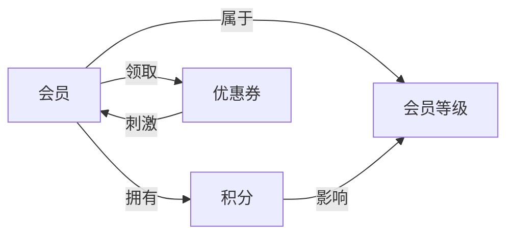

# 会员管理系统详细设计与具体代码实现

作者：禅与计算机程序设计艺术

## 1. 背景介绍
### 1.1 会员管理系统的重要性
在当今数字化时代,企业与客户之间的关系日益紧密。会员管理系统作为连接企业和客户的桥梁,在维护客户关系、提升客户忠诚度以及促进业务增长方面发挥着至关重要的作用。一个高效、可靠的会员管理系统能够帮助企业更好地了解客户需求,提供个性化服务,从而增强企业竞争力。

### 1.2 会员管理系统的核心功能
一个完善的会员管理系统通常包括以下核心功能:
1. 会员注册与登录:允许客户注册成为会员,并使用账号密码登录系统。
2. 会员信息管理:存储并管理会员的个人信息、联系方式、消费记录等。
3. 积分与优惠管理:记录会员消费,并根据消费金额计算积分,提供相应优惠。
4. 会员等级管理:根据会员的消费金额、积分等因素划分会员等级,提供差异化服务。
5. 会员互动与沟通:提供会员留言、反馈等互动渠道,加强与会员的沟通。
6. 数据分析与报表:对会员数据进行分析,生成各类报表,为企业决策提供依据。

### 1.3 本文的目标与结构
本文旨在详细阐述会员管理系统的设计与实现过程,为读者提供一个全面、系统的学习参考。文章将从核心概念入手,介绍系统架构与数据库设计,并重点讲解核心算法原理和关键代码实现。此外,本文还将结合实际应用场景,探讨会员管理系统的发展趋势与挑战。

文章的主要结构如下:
1. 背景介绍
2. 核心概念与联系
3. 核心算法原理具体操作步骤
4. 数学模型和公式详细讲解举例说明
5. 项目实践:代码实例和详细解释说明
6. 实际应用场景
7. 工具和资源推荐
8. 总结:未来发展趋势与挑战
9. 附录:常见问题与解答

## 2. 核心概念与联系
### 2.1 会员
会员是指注册并在系统中拥有账户的客户。每个会员都有唯一的标识(如会员ID),并与其个人信息、消费记录等数据相关联。

### 2.2 积分
积分是会员在消费过程中累积的一种虚拟货币,通常根据消费金额按照一定比例进行计算。积分可用于兑换优惠、礼品等,是吸引和留住客户的重要手段。

### 2.3 会员等级
会员等级是根据会员的消费金额、积分等因素划分的不同层级。不同等级的会员享受不同的优惠和服务,如折扣、专属客服等。会员等级体系能够激励客户提升消费,增强客户粘性。

### 2.4 优惠券
优惠券是一种常见的营销工具,通常以电子或实体形式提供给会员。优惠券可以是固定金额减免、折扣等,旨在刺激客户消费。

### 2.5 关系图
以下是会员管理系统中核心概念之间的关系图:



从关系图可以看出,会员、积分、会员等级和优惠券之间存在着紧密的联系。会员消费可以累积积分,积分多少又影响会员等级的划分。会员领取优惠券,优惠券则可以刺激会员消费。整个系统通过这些概念的相互作用,形成了一个完整的闭环。

## 3. 核心算法原理具体操作步骤
### 3.1 会员积分计算算法
会员积分计算是会员管理系统的核心功能之一。一般情况下,积分计算规则如下:
1. 设定积分换算比例,即每消费多少金额可以获得1积分。例如,每消费10元获得1积分。
2. 根据会员的消费金额,计算可获得的积分数。计算公式为:
   
   $积分 = \lfloor \frac{消费金额}{积分换算比例} \rfloor$

   其中,$\lfloor \rfloor$表示向下取整。

3. 将计算得到的积分数添加到会员账户的积分余额中。

具体操作步骤如下:
1. 获取会员的消费金额。
2. 根据积分换算比例,计算可获得的积分数。
3. 将积分数添加到会员账户的积分余额中。
4. 更新会员账户信息,保存新的积分余额。

### 3.2 会员等级升级算法
会员等级升级是根据会员的消费金额或积分,将会员划分到不同的等级。不同等级享受不同的优惠和服务。等级升级算法的基本原理如下:
1. 设定各个等级的门槛值,即达到该值即可升级到相应等级。门槛值可以是消费金额或积分。
2. 根据会员的消费金额或积分,判断会员达到了哪个等级的门槛值。
3. 将会员的等级更新为达到门槛值的等级。

具体操作步骤如下:
1. 获取会员的消费金额或积分。
2. 从高到低遍历等级门槛值,判断会员的消费金额或积分是否达到门槛值。
3. 找到第一个满足条件的等级,将其作为会员的新等级。
4. 更新会员账户信息,保存新的会员等级。

### 3.3 优惠券发放算法
优惠券发放是会员管理系统中常见的营销策略。优惠券可以根据不同的规则发放,例如:
- 新用户注册赠送优惠券
- 会员生日赠送优惠券
- 节日或促销活动赠送优惠券
- 会员等级升级赠送优惠券

优惠券发放算法的基本原理如下:
1. 确定优惠券发放的触发条件,例如新用户注册、会员生日等。
2. 当触发条件满足时,生成一张优惠券。
3. 将优惠券与会员账户关联,并设置优惠券的有效期。
4. 更新会员账户信息,保存新的优惠券信息。

具体操作步骤如下:
1. 监听优惠券发放的触发条件。
2. 当触发条件满足时,根据预设的优惠券模板生成一张新的优惠券。
3. 将优惠券与会员账户关联,设置优惠券的有效期。
4. 更新会员账户信息,保存新的优惠券信息。
5. 通知会员优惠券发放成功,提示会员查看和使用。

## 4. 数学模型和公式详细讲解举例说明
在会员管理系统中,数学模型和公式主要应用于积分计算、会员等级划分等方面。下面我们通过几个具体的例子,详细讲解相关的数学模型和公式。

### 4.1 积分计算模型
假设某商场的积分换算比例为每消费10元获得1积分,现有一位会员在该商场消费了358元。我们可以使用以下公式计算该会员可以获得的积分数:

$$积分 = \lfloor \frac{消费金额}{积分换算比例} \rfloor$$

代入数值:

$$积分 = \lfloor \frac{358}{10} \rfloor = 35$$

因此,该会员可以获得35个积分。

### 4.2 会员等级划分模型
假设某酒店的会员等级划分如下:
- 银卡会员:累计消费5000元以上
- 金卡会员:累计消费10000元以上
- 钻石会员:累计消费50000元以上

现有一位会员的累计消费金额为12000元,我们可以使用以下算法判断该会员的等级:
1. 检查累计消费金额是否达到钻石会员门槛(50000元)
   - 12000 < 50000,不满足钻石会员条件
2. 检查累计消费金额是否达到金卡会员门槛(10000元)
   - 12000 >= 10000,满足金卡会员条件
3. 将会员等级更新为金卡会员

通过逐级比较,我们可以确定该会员的等级为金卡会员。

### 4.3 优惠券发放模型
假设某电商平台在新用户注册时赠送一张10元无门槛优惠券,有效期为30天。当一位新用户注册时,我们可以使用以下步骤为其发放优惠券:
1. 生成一张面值为10元,无使用门槛的优惠券。
2. 设置优惠券的有效期为当前日期 + 30天。
3. 将优惠券与该用户的账户关联。
4. 更新用户账户信息,保存优惠券信息。

通过这一系列操作,我们完成了为新用户发放注册优惠券的过程。

## 5. 项目实践:代码实例和详细解释说明
下面我们通过几个具体的代码实例,演示如何实现会员管理系统的核心功能。本文使用Python语言进行示例,但同样的原理可以应用于其他编程语言。

### 5.1 会员积分计算
```python
def calculate_points(amount, ratio):
    """
    计算会员积分
    :param amount: 消费金额
    :param ratio: 积分换算比例(每消费ratio元获得1积分)
    :return: 获得的积分数
    """
    return int(amount / ratio)

# 示例:消费358元,每10元获得1积分
points = calculate_points(358, 10)
print(f"获得积分:{points}")
```

输出结果:
```
获得积分:35
```

在这个示例中,我们定义了一个`calculate_points`函数,用于根据消费金额和积分换算比例计算获得的积分数。函数使用`int()`函数对结果进行向下取整,确保积分为整数。

### 5.2 会员等级升级
```python
def upgrade_membership(current_level, total_consumption, thresholds):
    """
    会员等级升级
    :param current_level: 当前会员等级
    :param total_consumption: 累计消费金额
    :param thresholds: 等级门槛列表,从低到高排列
    :return: 新的会员等级
    """
    for i in range(len(thresholds) - 1, -1, -1):
        if total_consumption >= thresholds[i]:
            return i + 1
    return current_level

# 示例:当前等级为1,累计消费12000元,等级门槛为[5000, 10000, 50000]
new_level = upgrade_membership(1, 12000, [5000, 10000, 50000])
print(f"新的会员等级:{new_level}")
```

输出结果:
```
新的会员等级:2
```

在这个示例中,我们定义了一个`upgrade_membership`函数,用于根据累计消费金额和等级门槛列表判断会员的新等级。函数从高到低遍历等级门槛,找到第一个满足条件的等级作为新的会员等级。如果没有满足条件的等级,则返回当前等级。

### 5.3 优惠券发放
```python
import datetime

def issue_coupon(user_id, coupon_template):
    """
    发放优惠券
    :param user_id: 用户ID
    :param coupon_template: 优惠券模板
    """
    # 生成优惠券
    coupon = {
        "user_id": user_id,
        "coupon_id": generate_coupon_id(),
        "discount_amount": coupon_template["discount_amount"],
        "minimum_spend": coupon_template["minimum_spend"],
        "expiry_date": datetime.datetime.now() + datetime.timedelta(days=coupon_template["validity_days"])
    }
    
    # 保存优惠券到数据库
    save_coupon_to_database(coupon)
    
    # 发送优惠券发放通知
    send_coupon_notification(user_id, coupon)

def generate_coupon_id():
    """
    生成优惠券ID
    :return: 优惠券ID
    """
    # 实现生成唯一优惠券ID的逻辑
    # ...

def save_coupon_to_database(coupon):
    """
    保存优惠券到数据库
    :param coupon: 优惠券信息
    """
    # 实现保存优惠券到数据