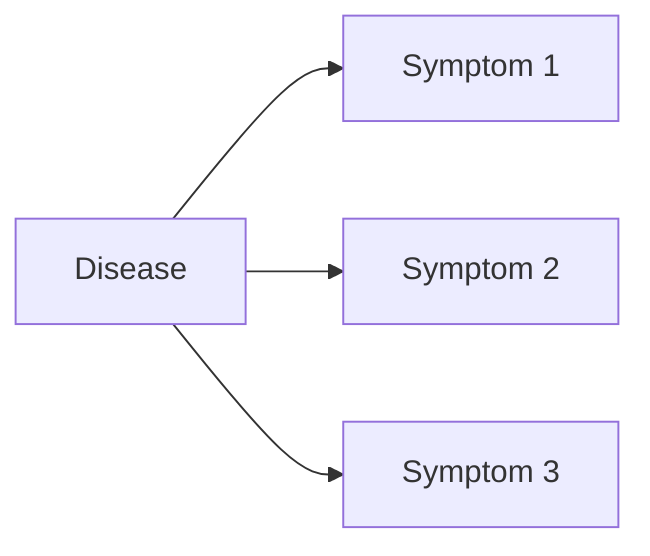

# 大语言模型原理与工程实践：自我一致性提示

作者：禅与计算机程序设计艺术

## 1. 背景介绍

### 1.1 大语言模型的发展历程
#### 1.1.1 早期语言模型
#### 1.1.2 神经网络语言模型 
#### 1.1.3 Transformer与预训练语言模型

### 1.2 大语言模型的应用现状
#### 1.2.1 自然语言处理中的应用
#### 1.2.2 知识问答系统
#### 1.2.3 对话生成与聊天机器人

### 1.3 自我一致性提示的研究意义
#### 1.3.1 提高大语言模型的可控性
#### 1.3.2 增强输出内容的逻辑一致性
#### 1.3.3 拓展大语言模型的应用场景

## 2. 核心概念与联系

### 2.1 大语言模型
#### 2.1.1 定义与特点
#### 2.1.2 训练数据与方法
#### 2.1.3 评估指标

### 2.2 自我一致性
#### 2.2.1 定义与内涵
#### 2.2.2 自我一致性在认知科学中的研究
#### 2.2.3 自我一致性在人工智能中的应用

### 2.3 提示工程
#### 2.3.1 提示的概念与分类
#### 2.3.2 提示工程的研究现状
#### 2.3.3 自我一致性提示的特点

## 3. 核心算法原理具体操作步骤

### 3.1 基于强化学习的自我一致性提示算法
#### 3.1.1 问题定义与目标函数
#### 3.1.2 策略网络的设计
#### 3.1.3 训练过程与优化算法

### 3.2 基于对比学习的自我一致性提示算法 
#### 3.2.1 正负样本构建方法
#### 3.2.2 对比损失函数的设计
#### 3.2.3 训练过程与优化算法

### 3.3 基于因果推理的自我一致性提示算法
#### 3.3.1 因果图模型的构建
#### 3.3.2 因果效应估计方法
#### 3.3.3 训练过程与优化算法

## 4. 数学模型和公式详细讲解举例说明

### 4.1 基于强化学习的数学模型
#### 4.1.1 马尔可夫决策过程(MDP)
MDP定义为一个五元组 $\langle \mathcal{S}, \mathcal{A}, \mathcal{P}, \mathcal{R}, \gamma \rangle$，其中：
- $\mathcal{S}$ 表示有限状态集
- $\mathcal{A}$ 表示有限动作集  
- $\mathcal{P}$ 表示状态转移概率矩阵，$\mathcal{P}_{ss'}^{a} = \mathbb{P}[S_{t+1}=s'|S_t=s, A_t=a]$
- $\mathcal{R}$ 表示奖励函数，$\mathcal{R}_s^a = \mathbb{E}[R_{t+1}|S_t=s, A_t=a]$
- $\gamma$ 表示折扣因子，$\gamma \in [0,1]$

强化学习的目标是学习一个最优策略 $\pi^*$，使得期望累积奖励最大化：

$$\pi^* = \arg\max_\pi \mathbb{E}\left[ \sum_{t=0}^{\infty} \gamma^t R_{t+1} | S_0, \pi \right]$$

#### 4.1.2 基于策略梯度的优化算法
令 $J(\theta) = \mathbb{E}_{\pi_\theta} \left[ \sum_{t=0}^{\infty} \gamma^t R_{t+1} \right]$ 表示期望累积奖励，策略梯度定理给出了 $J(\theta)$ 对于 $\theta$ 的梯度：

$$\nabla_\theta J(\theta) = \mathbb{E}_{\pi_\theta} \left[ \sum_{t=0}^{\infty} \nabla_\theta \log \pi_\theta (A_t|S_t) Q^{\pi_\theta}(S_t, A_t) \right]$$ 

其中 $Q^{\pi_\theta}(s,a) = \mathbb{E}_{\pi_\theta} \left[ \sum_{k=0}^{\infty} \gamma^k R_{t+k+1} | S_t=s, A_t=a \right]$。

结合蒙特卡罗采样，我们可以得到 $\nabla_\theta J(\theta)$ 的无偏估计：

$$\nabla_\theta J(\theta) \approx \frac{1}{N} \sum_{i=1}^N \sum_{t=0}^{T} \nabla_\theta \log \pi_\theta (a_{i,t}|s_{i,t}) \left( \sum_{k=0}^{T-t} \gamma^k r_{i, t+k+1} \right)$$

其中 $N$ 为采样轨迹数，$T$ 为每条轨迹的最大长度。我们可以基于上式来更新策略网络的参数。

### 4.2 基于对比学习的数学模型
#### 4.2.1 对比损失函数
给定一组正样本对 $\{(x_i, x_i^+)\}_{i=1}^N$ 和负样本对 $\{(x_i, x_{i,j}^-)\}_{i=1}^N$，对比损失函数定义为：

$$\mathcal{L} = -\sum_{i=1}^N \log \frac{\exp(f(x_i)^\top f(x_i^+)/ \tau)}{ \exp(f(x_i)^\top f(x_i^+) / \tau)  + \sum_{j=1}^M \exp(f(x_i)^\top f(x_{i,j}^-)/ \tau)}$$

其中 $f(\cdot)$ 为编码器网络，$\tau$ 为温度超参数。

直观地说，对比损失函数鼓励编码器学习到的表示，使得正样本对之间的相似度尽可能高，而负样本对之间的相似度尽可能低。

#### 4.2.2 对比表示学习框架
基于对比损失，我们可以构建一个对比表示学习框架，主要包含以下步骤：
1. 数据增强：从原始数据出发，构建正负样本对
2. 编码器：学习样本的低维表示
3. 对比损失：最小化正负样本对的对比损失
4. 表示应用：将学习到的表示应用到下游任务中

整个过程可以端到端地训练，得到具有判别性的样本表示。

### 4.3 基于因果推理的数学模型
#### 4.3.1 因果图模型
因果图是一种有向无环图，节点表示变量，边表示因果关系。例如下图描述了医疗诊断中的一个简单因果图：



其中疾病(Disease)是症状(Symptom 1-3)的共同原因。

#### 4.3.2 do算子与因果效应
在因果图中，do算子表示人为干预某个变量为特定取值。例如 $do(X=x)$ 表示将变量 $X$ 固定为 $x$，同时切断指向 $X$ 的所有边。

基于do算子，我们可以定义因果效应。$X$ 对 $Y$ 的因果效应定义为：

$$
\mathbb{E}[Y|do(X=x)] = \sum_y y \cdot P(y|do(X=x))
$$

它刻画了人为干预 $X$ 为 $x$ 时，$Y$ 的期望取值。

#### 4.3.3 后门准则
在许多实际场景中，我们无法直接干预某些变量。后门准则提供了一种利用观测数据估计因果效应的方法。

假设 $X$ 与 $Y$ 之间存在一组变量 $Z$，如果：
1. $Z$ 包含了 $X$ 的所有非后代的共同原因；
2. $Z$ 与 $Y$ 之间没有因果路径。

则称 $Z$ 满足后门准则。此时我们有：

$$
\mathbb{E}[Y|do(X=x)] = \sum_z \mathbb{E}[Y|X=x,Z=z] \cdot P(Z=z) 
$$

即可以利用观测数据来估计因果效应。

## 5.项目实践：代码实例与详细解释

下面我们通过一个简单的对话生成任务，来展示如何使用自我一致性提示来优化预训练语言模型。

### 5.1 数据准备

我们使用 [DailyDialog](http://yanran.li/dailydialog) 数据集，它包含 13k 多轮对话，平均每轮 7.9 句话。我们将其划分为训练集、验证集和测试集。

```python
from datasets import load_dataset

dataset = load_dataset("daily_dialog")
dataset = dataset.map(lambda example: {"turns": example["dialog"]})
dataset = dataset.train_test_split(test_size=0.1)
train_dataset = dataset["train"]
eval_dataset = dataset["test"].train_test_split(test_size=0.5)
```

### 5.2 模型微调

我们使用 GPT-2 作为预训练语言模型，并在特定任务上进行微调。为了控制对话的一致性，我们在输入中加入了历史对话的上下文。

```python
from transformers import AutoModelForCausalLM, AutoTokenizer, TrainingArguments, Trainer

model_name = "gpt2-medium"
tokenizer = AutoTokenizer.from_pretrained(model_name)
tokenizer.pad_token = tokenizer.eos_token
model = AutoModelForCausalLM.from_pretrained(model_name)

max_length = 128 
max_context_length = 256

def preprocess(example):
    context = example["turns"][:-1]
    context = [tokenizer.encode(turn, add_special_tokens=False) for turn in context]
    context = sum(context, [])[-max_context_length:]
    response = tokenizer.encode(example["turns"][-1], add_special_tokens=False)
    
    input_ids = tokenizer.build_inputs_with_special_tokens(context, response)
    labels = [tokenizer.pad_token_id] * (len(input_ids) - len(response)) + response
    return {"input_ids": input_ids, "labels": labels}

train_dataset = train_dataset.map(
    preprocess,
    batched=False,
    num_proc=4,
    remove_columns=train_dataset.column_names,
)

training_args = TrainingArguments(
    output_dir="my-dialog-model", 
    evaluation_strategy="epoch",
    num_train_epochs=3,
    learning_rate=1e-5,
    weight_decay=0.01,
    per_device_train_batch_size=4,
)

trainer = Trainer(
    model=model,
    args=training_args,
    train_dataset=train_dataset, 
    eval_dataset=eval_dataset,
)

trainer.train()
```

### 5.3 应用自我一致性提示

在生成阶段，我们可以使用自我一致性提示来优化模型输出。具体地，可以：

1. 让模型生成多个候选回复
2. 对每个候选回复，计算其与历史对话的一致性分数（例如 BLEU、Perplexity 等）
3. 选择一致性分数最高的回复作为最终输出

```python
def generate_consistent_response(model, tokenizer, context, num_candidates=5):
    candidate_responses = []
    for _ in range(num_candidates):
        inputs = tokenizer.encode(context, return_tensors="pt")
        outputs = model.generate(inputs, max_length=128, top_p=0.9) 
        response = tokenizer.decode(outputs[0], skip_special_tokens=True)
        candidate_responses.append(response)

    ranked_responses = rank_responses_by_consistency(candidate_responses, context) 
    return ranked_responses[0]
```

其中 `rank_responses_by_consistency` 函数可以基于一致性指标（如 BLEU、Perplexity）对候选回复进行排序。

## 6. 实际应用场景

自我一致性提示在以下应用场景中具有广泛的应用前景：

### 6.1 智能客服
在智能客服中，保证多轮对话的一致性至关重要。自我一致性提示可以帮助客服机器人生成前后一致、逻辑通顺的回复，提升用户体验。

### 6.2 医疗诊断
医疗诊断需要综合考虑患者的病史、症状等多方面信息。使用自我一致性提示，可以帮助诊断系统生成全面考虑各种证据、诊断结果一致的报告。

### 6.3 金融决策
金融决策通常需要考虑多个因素，如市场环境、公司财务状况等。自我一致性提示可以帮助金融分析系统生成兼顾各种信息、结论一致的决策建议。

### 6.4 创意写作
在创意写作中，保证文章脉络清晰、前后呼应非常重要。应用自我一致性提示，可以辅助作家生成思路连贯、