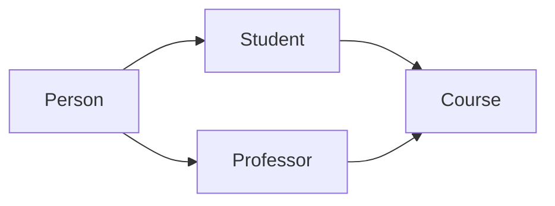
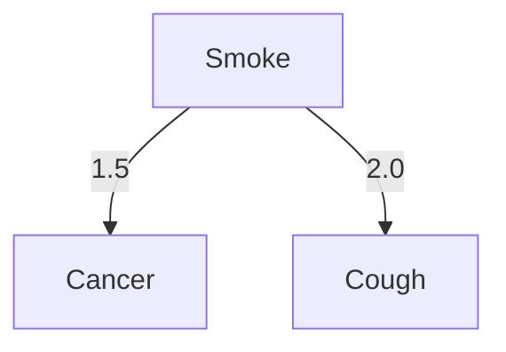

# 知识库集成:赋予Chatbot广博知识

作者：禅与计算机程序设计艺术

## 1. 背景介绍
### 1.1 人工智能与自然语言处理的发展
#### 1.1.1 人工智能的历史与现状
#### 1.1.2 自然语言处理技术的突破
#### 1.1.3 Chatbot的兴起与应用

### 1.2 知识库在人工智能中的重要性
#### 1.2.1 知识表示与存储
#### 1.2.2 知识推理与决策
#### 1.2.3 知识库与机器学习的结合

### 1.3 Chatbot面临的知识瓶颈
#### 1.3.1 知识覆盖范围有限
#### 1.3.2 知识深度不足
#### 1.3.3 知识更新与维护困难

## 2. 核心概念与联系
### 2.1 知识库
#### 2.1.1 定义与特点
#### 2.1.2 知识库的类型
#### 2.1.3 知识库的构建方法

### 2.2 知识图谱
#### 2.2.1 知识图谱的概念
#### 2.2.2 知识图谱的组成要素
#### 2.2.3 知识图谱的构建流程

### 2.3 知识库与Chatbot的关系  
#### 2.3.1 知识库为Chatbot提供知识基础
#### 2.3.2 Chatbot利用知识库进行问答与交互
#### 2.3.3 知识库与Chatbot的协同优化

## 3. 核心算法原理与具体操作步骤
### 3.1 知识抽取
#### 3.1.1 实体识别
#### 3.1.2 关系抽取  
#### 3.1.3 属性抽取

### 3.2 知识融合
#### 3.2.1 知识去重与对齐
#### 3.2.2 知识冲突检测与消解
#### 3.2.3 知识合并与更新

### 3.3 知识推理
#### 3.3.1 基于规则的推理
#### 3.3.2 基于图的推理
#### 3.3.3 基于表示学习的推理

### 3.4 知识问答
#### 3.4.1 问题理解与分析
#### 3.4.2 知识检索与匹配
#### 3.4.3 答案生成与优化

## 4. 数学模型和公式详细讲解举例说明
### 4.1 知识表示模型
#### 4.1.1 本体模型
本体模型是一种常用的知识表示方法,它使用一组概念和关系来描述特定领域的知识。本体可以形式化地定义为一个三元组 $O=\langle C,R,A \rangle$,其中:
- $C$ 表示概念的集合
- $R$ 表示关系的集合  
- $A$ 表示公理的集合

例如,在一个简单的大学本体中,我们可以定义以下概念:
$$
C=\{Person,Student,Professor,Course\}
$$
以及以下关系:
$$
R=\{takesCourse,teacherOf,advisorOf\}
$$
其中, $takesCourse \subseteq Student \times Course$ 表示学生选修课程的关系。

#### 4.1.2 语义网络模型
语义网络是另一种常见的知识表示方法,它使用节点表示概念,边表示概念之间的关系。形式化地,语义网络可以定义为一个有向图 $G=\langle V,E \rangle$,其中:
- $V$ 是节点的集合,每个节点表示一个概念
- $E \subseteq V \times V$ 是有向边的集合,每条边表示两个概念之间的关系

例如,下面是一个简单的语义网络:

其中,实线箭头表示 "is-a" 关系,虚线箭头可以表示其他自定义的关系。

### 4.2 知识融合模型
#### 4.2.1 相似度计算
在知识融合过程中,我们需要计算不同知识片段之间的相似度。常见的相似度计算方法包括:
- 编辑距离:两个字符串转换为相同所需的最少编辑操作次数
- 杰卡德相似度:两个集合的交集元素数除以并集元素数
- 余弦相似度:两个向量夹角的余弦值

例如,对于两个文本片段 $s_1$ 和 $s_2$,它们的 TF-IDF 向量分别为 $v_1$ 和 $v_2$,则它们的余弦相似度为:
$$
\cos (v_1,v_2)=\frac{v_1 \cdot v_2}{||v_1|| \cdot ||v_2||}
$$

#### 4.2.2 知识融合策略
常见的知识融合策略包括:
- 加权平均:对不同来源的知识片段赋予权重,然后加权平均
- 投票:对不同来源的知识片段进行投票,选择得票最多的结果
- 置信度选择:选择置信度最高的知识片段作为最终结果

例如,假设我们从3个不同的数据源获得了一个人的年龄信息,分别为 $\{35,0.8\},\{32,0.7\},\{36,0.9\}$,其中第二项为置信度。采用加权平均策略,该人的年龄为:
$$
age = \frac{35 \times 0.8 + 32 \times 0.7 + 36 \times 0.9}{0.8+0.7+0.9} \approx 35
$$

### 4.3 知识推理模型
#### 4.3.1 马尔可夫逻辑网络
马尔可夫逻辑网络(Markov Logic Network,MLN)是一种将一阶逻辑与概率图模型相结合的统计关系学习模型。它使用一阶逻辑公式来描述领域知识,同时为每个公式赋予权重以表示其重要性或可信度。

形式化地,一个 MLN 可以定义为一个二元组 $\langle F,W \rangle$,其中:
- $F$ 是一阶逻辑公式的集合
- $W$ 是对应于 $F$ 中每个公式的实数权重向量

给定一个 MLN,我们可以得到一个马尔可夫网络:对于每个一阶逻辑公式 $f_i \in F$,根据 $f_i$ 的具体形式生成对应的随机变量节点和因子节点,并将因子节点的权重设置为 $w_i$。

例如,考虑以下两个一阶逻辑公式:
$$
\begin{align*}
  \forall x \ Smoke(x) \Rightarrow Cancer(x) \quad w_1=1.5 \\
  \forall x \ Smoke(x) \Rightarrow Cough(x) \quad w_2=2.0
\end{align*}
$$
它们可以生成下面的马尔可夫网络片段:



#### 4.3.2 嵌入式推理
嵌入式推理(Embedding-based Inference)是一种基于知识图谱嵌入的推理方法。它首先学习知识图谱中实体和关系的低维向量表示,然后利用这些嵌入向量进行推理。

常见的知识图谱嵌入方法包括:
- TransE:它将关系看作实体之间的平移向量,即 $h+r \approx t$
- DistMult:它使用三线性张量分解来建模实体和关系,即 $h^\top \text{diag}(r) \cdot t$
- ComplEx:它在复数域上扩展 DistMult,能够建模非对称关系

例如,给定一个三元组 $(h,r,t)$,TransE 的得分函数为:
$$
f_r(h,t)= ||h+r-t||_2^2
$$
其中 $h,t \in \mathbb{R}^d$ 是实体的嵌入向量,$r \in \mathbb{R}^d$ 是关系的嵌入向量。TransE 的目标是最小化正三元组的得分,同时最大化负三元组的得分。

在推理阶段,对于一个查询 $(h,r,?)$,我们可以计算所有候选实体 $t'$ 的得分 $f_r(h,t')$,然后选择得分最小的实体作为答案。

## 5.项目实践:代码实例与详细解释说明
下面我们通过一个简单的示例来说明如何利用 Python 构建一个基于知识库的问答系统。

### 5.1 构建知识库
首先,我们需要构建一个简单的知识库。这里我们使用 Neo4j 图数据库来存储知识。
```python
from py2neo import Graph, Node, Relationship

# 连接 Neo4j 数据库
graph = Graph("http://localhost:7474", auth=("neo4j", "password"))

# 创建节点
alice = Node("Person", name="Alice")
bob = Node("Person", name="Bob")
carol = Node("Person", name="Carol")
graph.create(alice)
graph.create(bob)  
graph.create(carol)

# 创建关系
friend_ab = Relationship(alice, "KNOWS", bob)
friend_bc = Relationship(bob, "KNOWS", carol)
graph.create(friend_ab)
graph.create(friend_bc)
```
这段代码创建了三个人物节点 Alice,Bob 和 Carol,并在他们之间建立了朋友关系。

### 5.2 知识问答
接下来,我们编写一个简单的问答函数,它接受一个问题作为输入,然后在知识库中查找答案。
```python
def answer_question(question):
    # 对问题进行模式匹配
    if question == "Who are Alice's friends?":
        cypher_query = '''
        MATCH (alice:Person {name:"Alice"})-[:KNOWS]->(friend:Person)
        RETURN friend.name AS friend
        '''
    elif question == "Who knows Carol?":
        cypher_query = '''  
        MATCH (person:Person)-[:KNOWS]->(carol:Person {name:"Carol"})
        RETURN person.name AS person
        '''
    else:
        return "Sorry, I don't know the answer."

    # 执行 Cypher 查询  
    result = graph.run(cypher_query).data()

    # 格式化答案
    if result:
        answers = [item['friend'] for item in result]
        answer_str = ', '.join(answers)
        return f"The answer is: {answer_str}"
    else:
        return "Sorry, I could not find the answer."
```
这个函数首先对输入的问题进行模式匹配,生成相应的 Cypher 查询语句。然后它执行查询并格式化返回结果。

### 5.3 测试问答
最后,我们测试问答函数:
```python
question1 = "Who are Alice's friends?"
answer1 = answer_question(question1)
print(question1)
print(answer1)  

question2 = "Who knows Carol?"
answer2 = answer_question(question2)
print(question2)
print(answer2)

question3 = "What is the capital of France?"  
answer3 = answer_question(question3)
print(question3)
print(answer3)
```
运行结果:
```
Who are Alice's friends?
The answer is: Bob
Who knows Carol?  
The answer is: Bob
What is the capital of France?
Sorry, I don't know the answer.
```
可以看到,对于知识库中存在的问题,系统可以给出正确的答案;对于未知的问题,系统会给出默认的回复。

当然,这只是一个非常简单的示例。在实际应用中,我们需要处理更复杂的问题和更大规模的知识库。此外,我们还可以利用自然语言处理技术来实现问题的语义解析和匹配。

## 6.实际应用场景
知识库集成可以显著增强 Chatbot 的能力,使其能够回答更广泛领域的问题。下面是一些主要的应用场景:

### 6.1 智能客服
传统的客服系统往往只能处理有限的问题,而集成了知识库的智能客服系统可以利用知识库中的信息来回答客户的各种问题,提供更全面和个性化的服务。

### 6.2 个人助理
集成知识库的个人助理可以为用户提供各种信息和建议,如天气查询、路线规划、餐厅推荐等。知识库可以帮助助理更好地理解用户的需求和上下文。

### 6.3 教育辅导
在教育领域,Chatbot 可以充当私人辅导教师的角色。通过知识库,Chatbot 可以回答学生的各种问题,提供个性化的学习建议和资源推荐。

### 6.4 医疗咨询
医疗领域的 Chatbot 可以利用医学知识库为患者提供初步的诊断和建议,帮助患者了解疾病和治疗方案,减轻医生的工作负担。当然,对于