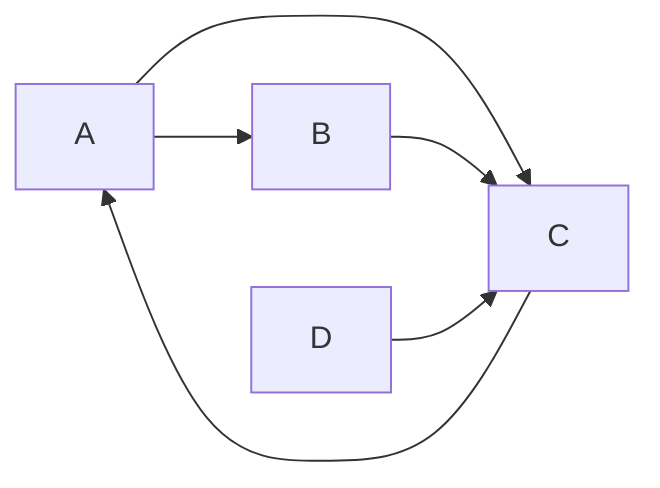

# PageRank的数学模型：线性代数的魅力

作者：禅与计算机程序设计艺术

## 1. 背景介绍

### 1.1 Web时代的搜索引擎之困

在互联网飞速发展的今天,信息的爆炸式增长给人们获取有效信息带来了巨大挑战。搜索引擎应运而生,成为人们获取网络信息的主要途径。然而,早期的搜索引擎主要基于网页内容进行检索排序,无法有效区分高质量网页和低质量网页,搜索结果常常泛滥而无用。如何从海量网页中挖掘出真正有价值的信息,成为搜索引擎亟待解决的难题。

### 1.2 PageRank的诞生与Google崛起

1996年,时任斯坦福大学博士生的Larry Page和Sergey Brin在思考如何构建一个更优秀的搜索引擎时,受到学术文献引用分析的启发,提出了一种革命性的网页排序算法——PageRank。该算法利用网页之间的链接关系,通过迭代计算每个网页的重要性得分,彻底改变了传统搜索引擎的排序机制。

基于PageRank算法,Page和Brin创立了Google, 迅速成长为全球最大的搜索引擎公司。PageRank为Google精准而高效的搜索服务奠定了基础,也引发了学术界和工业界对链接分析算法的广泛研究。

### 1.3 PageRank蕴含的数学之美

PageRank看似简单的背后,是以马尔可夫链、特征值等概念为基础的优雅数学模型。这个由简单线性代数构造出的模型,以其鲜明的几何直觉和巧妙的迭代求解,在海量复杂的网络中提炼出页面的重要性本质。PageRank是数学思想在工程实践中的典范应用,展现了数学尤其是线性代数的独特魅力。

本文将深入探讨PageRank的数学原理,用通俗易懂的语言剖析其中蕴含的代数思想,帮助读者领略数学在计算机科学尤其是信息检索领域的重要应用。

## 2. 核心概念与联系

### 2.1 有向图模型
 
要理解PageRank,首先需要引入有向图的概念。我们可以将整个Web看作一个巨大的有向图G(V,E):

- 节点集V:每个节点代表一个网页
- 有向边集E:如果页面i包含指向页面j的链接,则存在一条从节点i到节点j的有向边(i,j)

这种抽象让我们从复杂的网页内容中脱离出来,专注于网页之间的链接结构。

### 2.2 随机游走模型

PageRank的基本思想是通过模拟用户的浏览行为,估计每个页面被访问到的概率。我们假设一个"随机游走者"在网络中进行随机游走:

- 选择一个节点作为起点
- 在当前节点i,以等概率随机选择一条出边(i,j),沿该边跳转到节点j
- 重复上述过程,无限游走下去

从整体来看,该过程可以用一个转移概率矩阵P 描述:Pij代表从页面i转移到页面j的概率。假设页面i有个出链,其中Li j条指向页面j,则Pij=Li j/L i。

长期来看,这个随机游走的状态会收敛到一个平稳分布π,其中π i表示随机游走者最终访问页面i的概率。直观上,π 就反映了页面的重要性。

### 2.3 马尔可夫链

进一步引入马尔可夫链的概念。马尔可夫链是状态空间中的一个随机过程,下一个状态的概率分布只依赖于当前状态。PageRank模型实质上就是定义了一个马尔可夫链:

- 状态空间Ω 对应网络中的所有网页
- 转移概率矩阵P定义状态之间的转移概率
- 平稳分布π就是我们要求的PageRank值

马尔可夫链的一个重要性质是,对于某些条件较弱的P,平稳分布π总是唯一存在。求解π的过程,就是求解一个特定的线性方程组。

## 3. 核心算法原理和具体操作步骤

有了以上的概念基础,下面我们具体阐述PageRank的计算过程。

### 3.1 构建转移概率矩阵

首先根据网络结构构建转移概率矩阵P。具体步骤如下:

1. 初始化矩阵P,Pij=0
2. 对于图中每条边(i,j),累加Pij: Pij=Pij+1/Li  (L i为页面i的出度)
3. 对于某些出度为0的页面(称为悬挂节点),将其转移概率均分到所有页面

### 3.2 迭代计算

根据马尔可夫链理论,PageRank向量π满足:

$$
π=Pπ
$$

即π是矩阵P的特征向量,对应的特征值为1。我们可以通过以下迭代过程求解π:

1. 初始化π 0=e/n (n为页面总数,e为全1向量)
2. 迭代计算π t+1=Pπ t,直至π 收敛

可以证明,以上迭代过程在一定条件下会收敛到唯一的π。

### 3.3 随机重启

实际应用中,为了克服马尔可夫链周期性和减小悬挂节点的影响,在原始定义中引入随机重启(Random Teleport):在每一步转移时,以概率d按照转移矩阵P 转移,以概率1-d随机跳转到任意页面(通常称d为阻尼因子)。这相当于把原矩阵P做了如下修改:

$$
\overline{P}=dP+(1-d)E/n
$$

其中E为全1矩阵。修改后的迭代公式为:

$$
π_{t+1}=\overline{P}π_t=[dP+(1-d)E/n]π_t
$$

引入随机重启后,原本reducible的马尔可夫链变为irreducible, aperiodic,从而保证了收敛性。实践中d一般取值在0.8~0.9。PageRank的计算最终转化为求解如下线性方程组:

$$
π=[dP+(1-d)E/n]π
$$

## 4. 数学模型和公式详细讲解举例说明

下面我们以一个简单例子直观展示PageRank的计算过程。考虑如下由4个网页组成的链接结构:



### 4.1 构建转移概率矩阵

根据上述构建步骤,我们得到原始转移概率矩阵为:

$$
P=\begin{bmatrix} 
0 & 0 & 1 & 0\\ 
0.5 & 0 & 0.5 & 0\\
0.5 & 1 & 0 & 0\\  
0.25 & 0.25 & 0.25 & 0.25
\end{bmatrix}
$$

可以看出由于节点D没有外指边,会将其转移概率平均分配给所有节点。

### 4.2 引入随机重启

取d=0.8,则修正后的转移概率矩阵为:

$$
\overline{P}=dP+\frac{(1-d)}{n}E= 0.8 \cdot 
\begin{bmatrix}
0 & 0 & 1 & 0\\ 
0.5 & 0 & 0.5 & 0\\
0.5 & 1 & 0 & 0\\  
0.25 & 0.25 & 0.25 & 0.25
\end{bmatrix}
+0.05 \cdot 
\begin{bmatrix}
1 & 1 & 1 & 1\\  
1 & 1 & 1 & 1\\
1 & 1 & 1 & 1\\
1 & 1 & 1 & 1
\end{bmatrix}
$$
$$
=\begin{bmatrix} 
0.05 & 0.05 & 0.85 & 0.05\\ 
0.45 & 0.05 & 0.45 & 0.05\\
0.45 & 0.85 & 0.05 & 0.05\\ 
0.25 & 0.25 & 0.25 & 0.25
\end{bmatrix}
$$

### 4.3 迭代求解

取初始向量π0=[0.25,0.25,0.25,0.25], 开始迭代:

$$
π_1=\overline{P}π_0=\begin{bmatrix}
0.05 & 0.05 & 0.85 & 0.05\\
0.45 & 0.05 & 0.45 & 0.05 \\
0.45 & 0.85 & 0.05 & 0.05\\
0.25 & 0.25 & 0.25 & 0.25 
\end{bmatrix} 
\begin{bmatrix}
0.25\\0.25\\0.25\\0.25
\end{bmatrix}
=\begin{bmatrix}
0.3\\0.25\\0.375\\0.25
\end{bmatrix}
$$

同理可得:

$$
π_2≈\begin{bmatrix}
0.324\\0.259\\0.351\\0.256
\end{bmatrix},
π_3≈\begin{bmatrix}
0.330\\0.260\\0.341\\0.256
\end{bmatrix}
$$

继续迭代下去,最终收敛得到:

$$
π^*≈\begin{bmatrix}
0.333\\0.261\\0.333\\0.257
\end{bmatrix}
$$

从结果可以看出,页面A和C的PageRank值最高,页面D的最低,这与其在链接图中的地位是一致的。

## 5. 项目实践:代码实例和详细解释说明

下面给出一个Python实现的PageRank算法示例代码:

```python
import numpy as np

def pagerank(G, d=0.85, max_iter=100, tol=1e-6):
    """
    PageRank算法实现
    :param G: 有向图的邻接矩阵
    :param d: 阻尼因子
    :param max_iter: 最大迭代次数 
    :param tol: 收敛判断阈值
    :return: PageRank值向量
    """
    n = G.shape[0]  # 节点数
    # 处理悬挂节点
    is_dangling = np.ravel(G.sum(axis=1) == 0)
    G += 1.0 / n * np.outer(is_dangling, np.ones(n))
    # 概率转移矩阵
    P = G / G.sum(axis=1)[:, np.newaxis]
    # 引入随机重启构建P-hat
    P_hat = d * P + (1 - d) / n * np.ones((n, n))
    # 初始状态分布
    pi = np.ones(n) / n
    # 迭代计算
    for _ in range(max_iter):
        pi_new = P_hat.dot(pi)
        if np.linalg.norm(pi_new - pi) < tol:
            break
        pi = pi_new
    return pi
```

## 6. 实际应用场景

PageRank作为一种通用的节点重要性度量,在众多领域有着广泛应用。

### 6.1 网页排序

这是PageRank最经典的应用。Google利用PageRank对网页进行重要性评估,结合其他因素综合给出网页的排序。相比单纯的文本相关性,PageRank从链接结构挖掘页面质量,大大提升了搜索结果的准确性。

### 6.2 社交网络影响力分析

在社交网络中,用户可以看作节点,用户之间的关注、转发等交互可以看作有向边,构成一个社交图谱。运用PageRank定义用户影响力,可以发现网络中的意见领袖、热点话题等。类似的想法也可用于系统的用户推荐。

### 6.3 生物网络分析

蛋白质相互作用网络等生物学网络中,PageRank可以帮助评估某个基因、蛋白质的重要性。这为疾病基因预测、药物作用靶点发现等提供了新思路。

### 6.4 文本摘要与关键词提取

把文章看作一个有向图,句子看作节点,句子之间的相似性定义为边,则PageRank可以提取文章的关键句作为摘要输出。于此类似,也可以对词语网络使用PageRank得到关键词。

## 7. 工具和资源推荐

除了自己实现之外,目前已有许多开源工具包含了PageRank算法:

- NetworkX (Python) 提供了面向通用图分析的PageRank 实现。
- iGraph (R, Python, C ) 提供