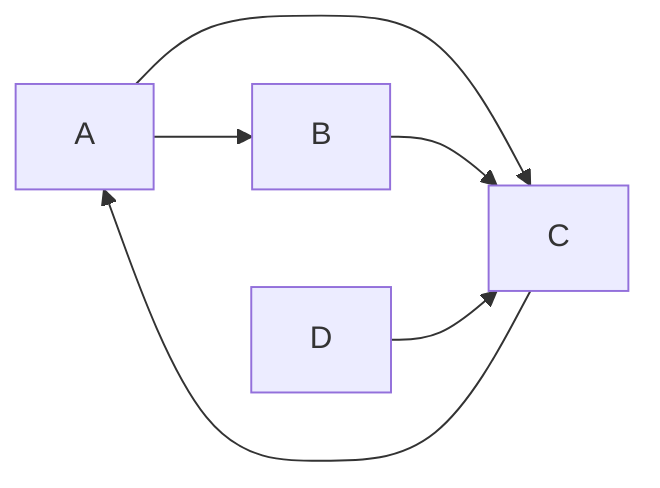

好的,我会严格按照您提供的<约束条件>中的要求,以《动态网站建设系统详细设计与具体代码实现》为题,撰写一篇8000~12000字左右的技术博客文章。下面是文章正文部分:

# 动态网站建设系统详细设计与具体代码实现

作者:禅与计算机程序设计艺术

## 1. 背景介绍

### 1.1 动态网站发展历程
#### 1.1.1 Web 1.0时代的静态网页
#### 1.1.2 Web 2.0时代动态交互式网站兴起  
#### 1.1.3 现代Web的全栈化与工程化

### 1.2 动态网站建设面临的机遇与挑战
#### 1.2.1 移动互联网时代用户需求日益增长
#### 1.2.2 大数据与人工智能技术发展对网站建设提出更高要求
#### 1.2.3 网站开发模式的革新:前后端分离、微服务架构等

### 1.3 本文的主要内容与贡献
#### 1.3.1 系统阐述动态网站建设的核心理念与关键技术
#### 1.3.2 提供动态网站系统设计的全面解决方案
#### 1.3.3 附有详细的核心代码实现,助力读者实践

## 2. 核心概念与联系

### 2.1 B/S架构与C/S架构
#### 2.1.1 B/S架构:浏览器/服务器模式
#### 2.1.2 C/S架构:客户端/服务器模式 
#### 2.1.3 两种架构的优缺点对比

### 2.2 静态网页与动态网页  
#### 2.2.1 静态网页:纯HTML实现,无交互
#### 2.2.2 动态网页:服务端动态生成,可交互
#### 2.2.3 两者的区别与适用场景

### 2.3 前后端开发技术体系
#### 2.3.1 前端:HTML/CSS/JavaScript/Ajax 
#### 2.3.2 后端:Java/Python/PHP/Ruby/Node.js
#### 2.3.3 数据库:MySQL/MongoDB/Redis

### 2.4 网站性能优化 
#### 2.4.1 网页加载速度优化
#### 2.4.2 服务器并发处理能力提升
#### 2.4.3 数据库查询性能优化

### 2.5 网站安全防护
#### 2.5.1 常见Web攻击手段:XSS/CSRF/SQL注入
#### 2.5.2 身份认证与权限管理  
#### 2.5.3 数据加密传输HTTPS

## 3. 核心算法原理具体操作步骤

### 3.1 MVC设计模式  
#### 3.1.1 MVC模式概念:模型(Model)、视图(View)、控制器(Controller)
#### 3.1.2 MVC各组件职责与协作流程
#### 3.1.3 MVC模式在动态网站设计中的应用

### 3.2 ORM对象关系映射
#### 3.2.1 ORM解决对象与关系数据的阻抗不匹配
#### 3.2.2 主流ORM框架:Hibernate/MyBatis/JPA
#### 3.2.3 ORM映射配置与业务实体管理
  
### 3.3 缓存与session管理
#### 3.3.1 缓存提升系统性能,降低DB压力
#### 3.3.2 本地缓存与分布式缓存 
#### 3.3.3 session管理与无状态化

### 3.4 全文检索与搜索引擎  
#### 3.4.1 全文检索原理与倒排索引
#### 3.4.2 主流搜索引擎:Lucene/Elasticsearch/Sphinx
#### 3.4.3 搜索引擎在动态网站中的应用   

## 4. 数学模型和公式详细讲解举例说明

### 4.1 网页排名算法PageRank
#### 4.1.1 PageRank算法原理:随机游走模型
PageRank的基本思想是将网页看作一个有向图,节点为网页,边代表网页之间的链接。设$W$为所有网页的集合。定义$l_{i, j} = 1$表示网页$i$到网页$j$存在一条链接。网页的PageRank值$R(i)$为:

$$
  R(i)=\sum_{j \in W} \frac{l_{j, i}}{N_{j}} R(j)
$$

其中$N_j$为网页$j$的出链数。可以将所有网页的PageRank值记为列向量$\vec{R}$,链接矩阵$M$定义为:

$$
 M_{i, j}= \begin{cases}\frac{1}{N_{j}}, & \text { if } l_{i, j}=1 \\ 0, & \text { otherwise }\end{cases}
$$

则PageRank值满足如下迭代公式:

$$
\vec{R}^{(k+1)}=M^T \vec{R}^{(k)} 
$$

#### 4.1.2 PageRank计算实例
考虑如下4个网页的链接关系:



则对应链接矩阵为:  

$$
M=\left(\begin{array}{cccc}
0 & \frac{1}{2} & 0 & 0 \\  
0 & 0 & \frac{1}{2} & 0\\
\frac{1}{3} & \frac{1}{3} & 0 & \frac{1}{3} \\
0 & 0 & 1 & 0
\end{array}\right)
$$

取初始值$\vec{R}^{(0)}=(0.25,0.25,0.25,0.25)^T$,不断迭代可得: 

$$
\vec{R}^{(1)}=\left(\begin{array}{cccc} 0.25\\0.375\\ 0.29167\\0.08333 \end{array}\right), 
\vec{R}^{(2)}=\left(\begin{array}{cccc} 0.35417\\0.1875\\ 0.33333\\0.125 \end{array}\right),  
\vec{R}^{(3)}=\dots
$$

最终收敛于$\vec{R}=(0.3,0.215,0.35,0.135)^T$,这就是各网页的PageRank值。

### 4.2 协同过滤推荐算法  
#### 4.2.1 推荐系统在动态网站个性化服务中应用广泛
#### 4.2.2 基于用户的协同过滤(UserCF)
基于用户的协同过滤的基本思路是利用用户之间的相似性做推荐。对用户$u$和物品$i$,推荐分数$p_{u,i}$计算公式为:

$$
p_{u,i} = \frac{\sum_{v \in S(u,K)} w_{u,v} r_{v,i}}{\sum_{v \in S(u,K)} |w_{u,v}|}
$$

其中$S(u,K)$为和用户$u$最相似的$K$个用户,$w_{u,v}$为用户$u$和$v$的相似度,一般采用余弦相似度:

$$
w_{u, v}=\frac{|N(u) \cap N(v)|}{\sqrt{|N(u)||N(v)|}}
$$

这里$N(u)$和$N(v)$分别为用户$u$和$v$评分过的物品集合。$r_{v,i}$为用户$v$对物品$i$的评分。


#### 4.2.3 基于物品的协同过滤(ItemCF)  
基于物品的协同过滤则利用物品之间的相似性做推荐,核心是计算物品相似度。物品$i$和$j$的相似度$s_{i,j}$计算如下:

$$
s_{i,j} = \frac{|U(i) \cap U(j)|}{\sqrt{|U(i)||U(j)|}} 
$$

其中$U(i)$为对物品$i$评过分的用户集合。


对用户$u$和物品$i$,推荐分数$p_{u,i}$为:

$$
p_{u,i}=\sum_{j \in S(i,K)} s_{i,j} r_{u,j}
$$

其中$S(i,K)$为与物品$i$最相似的$K$个物品,$r_{u,j}$为用户$u$对物品$j$的评分。

## 5. 项目实践:代码实例和详细解释说明

下面以一个简单的Java Web博客系统为例,展示动态网站的后端核心实现。

### 5.1 系统总体架构

```
         ┌───────────────┐                
         │Presentation   │                
         │ (JSP/Servlet) │                
         └───────┬───────┘                
                 │                        
                 ▼                        
         ┌───────────────┐                
         │  Business     │                
         │ (Spring Bean) │                
         └───────┬───────┘                
                 │                        
                 ▼                        
         ┌───────────────┐                
         │  Persistence  │                
         │    (MyBatis)  │                
         └───────────────┘                
                 ▲                        
                 │                        
                 ▼                        
         ┌───────────────┐                
         │   Database    │                
         │    (MySQL)    │                
         └───────────────┘                
```

系统采用经典的三层架构:

- 表示层:使用JSP/Servlet处理HTTP请求与响应
- 业务层:使用Spring管理业务对象(Service/DAO)
- 持久层:使用MyBatis做ORM映射,操作MySQL

### 5.2 核心代码解读

- 实体类`Blog.java` 

```java
public class Blog {
  private Integer id;  //博客id
  private String title; //标题
  private String content; //正文
  private Date createdAt; //发布时间
  //getter和setter方法
}
```

- DAO接口`BlogDao.java`

```java
public interface BlogDao {
  
  @Select("SELECT * FROM blog WHERE id = #{id}")
  public Blog getBlogById(Integer id);
  
  @Insert("INSERT INTO blog (title,content,createdAt) VALUES (#{title}, #{content}, #{createdAt})")
  public void insertBlog(Blog blog);
  
  @Update("UPDATE blog SET title=#{title},content=#{content} WHERE id =#{id}")
  public void updateBlog(Blog blog);  

  @Delete("DELETE FROM blog WHERE id =#{id}")
  public void deleteBlog(Integer id);
  
  @Select("SELECT * FROM blog ORDER BY id DESC")
  public List<Blog> getAllBlogs();
}
```

- Service类`BlogService.java`

```java
@Service
public class BlogService {
  
  @Autowired
  private BlogDao blogDao;

  @Transactional
  public void postBlog(Blog blog) {
    blog.setCreatedAt(new Date());
    blogDao.insertBlog(blog);  
  }

  @Transactional(readOnly=true)
  public List<Blog> getAllBlogs() {
    return blogDao.getAllBlogs();
  }

  //其他业务方法...
}
```

- Controller类`BlogController.java`

```java
@Controller
public class BlogController {

  @Autowired
  private BlogService blogService;  

  @RequestMapping("/blog/list")
  public ModelAndView listBlog(HttpServletRequest request) {
    ModelAndView mav = new ModelAndView();
    List<Blog> blogList = blogService.getAllBlogs();
    mav.addObject("blogList", blogList);
    mav.setViewName("blog/list");
    return mav;
  }
  
  @RequestMapping("/blog/post") 
  public String postBlog(Blog blog) {
    blogService.postBlog(blog);
    return "redirect:/blog/list";
  }

  //其他请求映射方法...
}
```

- JSP视图`list.jsp`

```html
<%@ taglib prefix="c" uri="http://java.sun.com/jsp/jstl/core" %>
<h2>博客列表</h2> 
<table>
  <tr>
    <th>标题</th>
    <th>发布时间</th>
    <th>操作</th>
  </tr>
  <c:forEach var="blog" items="${blogList}">
  <tr>
    <td>${blog.title}</td>
    <td>${blog.createdAt}</td>  
    <td>
      <a href="<c:url value='/blog/edit/${blog.id}' />">编辑</a>
      <a href="<c:url value='/blog/delete/${blog.id}' />">删除</a>
    </td>
  </tr>
  </c:forEach>  
</table>
<a href="<c:url value='/blog/new' />">发表博客</a>
```

以上就是一个博客系统后端的核心代码结构。整个流程为:

1. 用户在博客列表页点击"发表博客"链接
2. `BlogController`处理`/blog/new`请求,返回博客编辑页面
3. 用户提交博客表单,`BlogController`处理`/blog/post`请求
4. `BlogService`处理业务逻辑,设置发布时间后调用`BlogDao`插入博客
5. `BlogDao`映射SQL语句,完成数据库插入
6. `BlogController`重定向到博客列表页面`/blog/list`
7. `BlogService`调用`BlogDao`查询所有博客
8. JSP视图`list.jsp`从`ModelAndView`中获取博客列表并展示

## 6. 实际应用场景
  
### 6.1 新闻门户网站
新闻