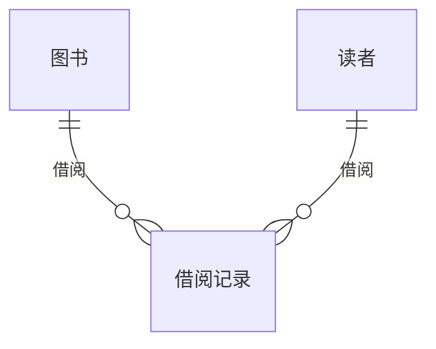

## 1. 背景介绍

### 1.1 图书馆管理系统的现状与挑战

随着信息技术的快速发展，图书馆的管理方式也在不断地更新和改进。传统的图书管理模式已经无法满足现代图书馆的需求，其主要面临以下挑战：

* **效率低下:**  手工记录图书信息、借阅记录等操作繁琐，容易出错，效率低下。
* **信息孤岛:**  不同部门之间数据难以共享，信息孤岛现象严重，难以进行有效的统计分析。
* **用户体验差:**  读者查询图书信息、借阅图书等操作不便，用户体验差。

### 1.2 图书库存管理系统的意义与价值

为了应对这些挑战，图书库存管理系统应运而生。它能够有效地解决传统图书管理模式的弊端，为图书馆的管理和服务带来以下价值：

* **提高效率:**  自动化管理图书信息、借阅记录等，减少人工操作，提高工作效率。
* **打破信息孤岛:**  实现数据共享，方便不同部门之间进行信息交流，提高管理效率。
* **提升用户体验:**  提供便捷的图书查询、借阅服务，提升用户体验。

## 2. 核心概念与联系

### 2.1 图书

* **ISBN:** 国际标准书号，用于唯一标识一本书籍。
* **书名:** 书籍的名称。
* **作者:** 书籍的作者。
* **出版社:** 书籍的出版社。
* **出版日期:** 书籍的出版日期。
* **分类号:** 用于对书籍进行分类的编码。
* **库存数量:**  图书馆中该书籍的库存数量。

### 2.2 读者

* **读者ID:** 用于唯一标识一位读者。
* **姓名:** 读者的姓名。
* **性别:** 读者的性别。
* **联系电话:** 读者的联系电话。
* **借阅权限:** 读者可借阅图书的数量和期限。

### 2.3 借阅记录

* **借阅ID:** 用于唯一标识一次借阅记录。
* **读者ID:** 借阅图书的读者ID。
* **ISBN:** 被借阅图书的ISBN。
* **借阅日期:** 借阅图书的日期。
* **应还日期:** 借阅图书应归还的日期。
* **归还日期:** 借阅图书实际归还的日期。

### 2.4 关系图



## 3. 核心算法原理具体操作步骤

### 3.1 图书入库

1. 获取新图书的ISBN、书名、作者、出版社、出版日期、分类号等信息。
2. 检查该ISBN是否已存在于数据库中，如果存在则更新库存数量，否则创建新的图书记录。
3. 设置新图书的库存数量。

### 3.2 图书查询

1. 接收用户输入的查询条件，例如ISBN、书名、作者等。
2. 根据查询条件，从数据库中检索符合条件的图书信息。
3. 将查询结果展示给用户。

### 3.3 图书借阅

1. 接收用户输入的读者ID和图书ISBN。
2. 检查读者ID是否存在，以及读者是否有足够的借阅权限。
3. 检查图书ISBN是否存在，以及是否有足够的库存数量。
4. 创建新的借阅记录，记录借阅日期、应还日期等信息。
5. 更新图书的库存数量。

### 3.4 图书归还

1. 接收用户输入的借阅ID。
2. 更新借阅记录的归还日期。
3. 更新图书的库存数量。

## 4. 数学模型和公式详细讲解举例说明

### 4.1 库存量计算

图书的库存量可以通过以下公式计算：

$$ 库存量 = 入库数量 - 借出数量 + 归还数量 $$

**举例说明:**

* 图书A的入库数量为10本。
* 借出数量为3本。
* 归还数量为1本。

则图书A的库存量为：

$$ 库存量 = 10 - 3 + 1 = 8 本 $$

### 4.2 借阅期限计算

借阅期限通常由图书馆设定，例如30天。

**举例说明:**

* 读者B借阅图书C的借阅日期为2024年5月1日。
* 图书馆设定的借阅期限为30天。

则读者B应归还图书C的日期为2024年5月31日。

## 5. 项目实践：代码实例和详细解释说明

### 5.1 数据库设计

```sql
-- 图书表
CREATE TABLE book (
  isbn VARCHAR(20) PRIMARY KEY,
  title VARCHAR(255) NOT NULL,
  author VARCHAR(255) NOT NULL,
  publisher VARCHAR(255) NOT NULL,
  publication_date DATE NOT NULL,
  category VARCHAR(50) NOT NULL,
  stock INT NOT NULL
);

-- 读者表
CREATE TABLE reader (
  reader_id INT PRIMARY KEY,
  name VARCHAR(255) NOT NULL,
  gender VARCHAR(10) NOT NULL,
  phone VARCHAR(20) NOT NULL,
  borrowing_limit INT NOT NULL
);

-- 借阅记录表
CREATE TABLE loan_record (
  loan_id INT PRIMARY KEY,
  reader_id INT NOT NULL,
  isbn VARCHAR(20) NOT NULL,
  borrow_date DATE NOT NULL,
  due_date DATE NOT NULL,
  return_date DATE
);
```

### 5.2 代码实现

```python
import sqlite3

# 连接数据库
conn = sqlite3.connect('library.db')
cursor = conn.cursor()

# 图书入库
def add_book(isbn, title, author, publisher, publication_date, category, stock):
    cursor.execute("INSERT INTO book VALUES (?, ?, ?, ?, ?, ?, ?)", (isbn, title, author, publisher, publication_date, category, stock))
    conn.commit()

# 图书查询
def search_book(keyword):
    cursor.execute("SELECT * FROM book WHERE isbn LIKE ? OR title LIKE ? OR author LIKE ?", ('%' + keyword + '%', '%' + keyword + '%', '%' + keyword + '%'))
    return cursor.fetchall()

# 图书借阅
def borrow_book(reader_id, isbn):
    # 检查读者是否存在
    cursor.execute("SELECT * FROM reader WHERE reader_id = ?", (reader_id,))
    reader = cursor.fetchone()
    if not reader:
        return "读者不存在"

    # 检查图书是否存在
    cursor.execute("SELECT * FROM book WHERE isbn = ?", (isbn,))
    book = cursor.fetchone()
    if not book:
        return "图书不存在"

    # 检查读者借阅权限和图书库存
    if reader[4] <= 0:
        return "读者借阅权限不足"
    if book[6] <= 0:
        return "图书库存不足"

    # 创建借阅记录
    cursor.execute("INSERT INTO loan_record (reader_id, isbn, borrow_date, due_date) VALUES (?, ?, date('now'), date('now', '+30 days'))", (reader_id, isbn))
    conn.commit()

    # 更新图书库存
    cursor.execute("UPDATE book SET stock = stock - 1 WHERE isbn = ?", (isbn,))
    conn.commit()

    return "借阅成功"

# 图书归还
def return_book(loan_id):
    # 更新借阅记录
    cursor.execute("UPDATE loan_record SET return_date = date('now') WHERE loan_id = ?", (loan_id,))
    conn.commit()

    # 更新图书库存
    cursor.execute("SELECT isbn FROM loan_record WHERE loan_id = ?", (loan_id,))
    isbn = cursor.fetchone()[0]
    cursor.execute("UPDATE book SET stock = stock + 1 WHERE isbn = ?", (isbn,))
    conn.commit()

    return "归还成功"
```

## 6. 实际应用场景

### 6.1 公共图书馆

公共图书馆可以使用图书库存管理系统来管理大量的图书和读者信息，提供便捷的图书借阅服务，提升用户体验。

### 6.2 学校图书馆

学校图书馆可以使用图书库存管理系统来管理学生的借阅记录，统计学生的阅读情况，为学校的教学和管理提供数据支持。

### 6.3 企业图书馆

企业图书馆可以使用图书库存管理系统来管理企业的技术资料、培训教材等，为员工提供学习和知识共享的平台。

## 7. 总结：未来发展趋势与挑战

### 7.1 未来发展趋势

* **智能化:**  利用人工智能技术，实现图书推荐、自动分类、智能搜索等功能，提升图书馆的智能化水平。
* **数字化:**  将纸质图书数字化，提供在线阅读服务，方便读者随时随地获取知识。
* **个性化:**  根据读者的阅读习惯和兴趣，提供个性化的图书推荐服务。

### 7.2 面临的挑战

* **数据安全:**  保护读者隐私和图书信息安全。
* **系统维护:**  确保系统的稳定运行和数据安全。
* **技术更新:**  不断学习和掌握新的技术，提升系统的性能和功能。

## 8. 附录：常见问题与解答

### 8.1 如何添加新书？

可以使用`add_book()`函数添加新书，例如：

```python
add_book('9787111641261', 'Python编程：从入门到实践', '埃里克·马瑟斯', '机械工业出版社', '2016-09-01', '计算机', 10)
```

### 8.2 如何查询图书信息？

可以使用`search_book()`函数查询图书信息，例如：

```python
books = search_book('Python')
for book in books:
    print(book)
```

### 8.3 如何借阅图书？

可以使用`borrow_book()`函数借阅图书，例如：

```python
result = borrow_book(123, '9787111641261')
print(result)
```

### 8.4 如何归还图书？

可以使用`return_book()`函数归还图书，例如：

```python
result = return_book(456)
print(result)
```