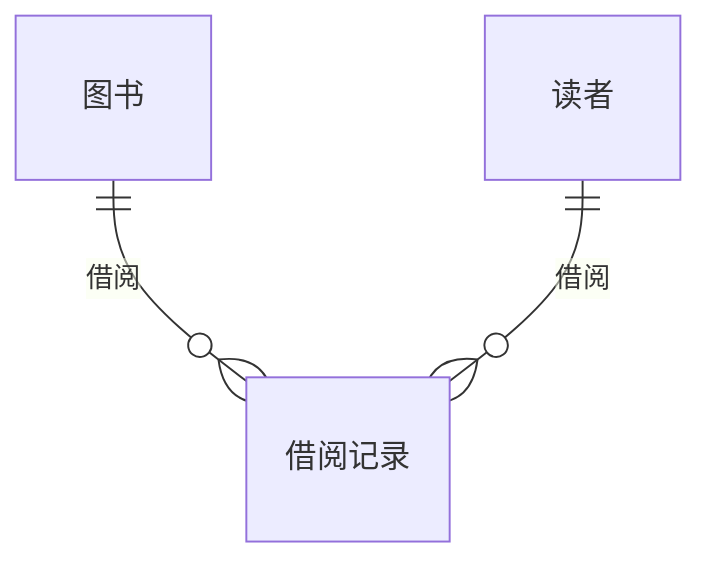

# 图书管理系统详细设计与具体代码实现

作者：禅与计算机程序设计艺术

## 1. 背景介绍

### 1.1 图书管理系统概述

图书管理系统是现代图书馆的核心组成部分，它用于管理图书馆的各种资源，包括书籍、期刊、电子资源等。一个高效的图书管理系统可以帮助图书馆提高工作效率，提升服务质量，为读者提供更便捷的借阅体验。

### 1.2 系统目标

本系统旨在设计和实现一个功能完善、易于使用、安全可靠的图书管理系统，满足现代图书馆的管理需求。具体目标包括：

*   **高效性:**  系统应能快速处理大量的图书信息，并提供便捷的查询、借阅、归还等功能。
*   **易用性:**  系统界面简洁直观，易于理解和操作，即使是没有IT背景的用户也能轻松上手。
*   **安全性:**  系统应具备完善的安全机制，保障图书信息和用户信息的安全。
*   **可扩展性:**  系统应具备良好的可扩展性，以便未来可以方便地添加新的功能和模块。

### 1.3 目标用户

本系统面向的用户群体包括：

*   **图书馆管理员:**  负责图书的录入、分类、编目、借阅管理等工作。
*   **读者:**  通过系统查询图书信息、借阅图书、归还图书等。

## 2. 核心概念与联系

### 2.1 图书

图书是图书馆管理系统的核心对象，它包含以下属性：

*   **ISBN:**  国际标准书号，唯一标识一本书籍。
*   **书名:**  书籍的名称。
*   **作者:**  书籍的作者。
*   **出版社:**  书籍的出版社。
*   **出版年:**  书籍的出版年份。
*   **分类号:**  书籍的分类号，用于将书籍归类到不同的类别。
*   **库存数量:**  图书馆当前拥有的该书籍的数量。
*   **可借阅数量:**  当前可供借阅的该书籍的数量。

### 2.2 读者

读者是指使用图书馆资源的用户，它包含以下属性：

*   **读者ID:**  唯一标识一位读者。
*   **姓名:**  读者的姓名。
*   **联系方式:**  读者的联系方式，例如电话号码、电子邮件地址等。
*   **借阅历史:**  读者借阅图书的历史记录。

### 2.3 借阅记录

借阅记录用于记录读者借阅图书的信息，它包含以下属性：

*   **借阅ID:**  唯一标识一次借阅记录。
*   **读者ID:**  借阅图书的读者ID。
*   **ISBN:**  借阅书籍的ISBN。
*   **借阅日期:**  借阅图书的日期。
*   **应还日期:**  借阅图书的应还日期。
*   **归还日期:**  借阅图书的实际归还日期。

### 2.4 实体关系图

下图展示了图书、读者、借阅记录之间的实体关系：



## 3. 核心算法原理具体操作步骤

### 3.1 图书管理

#### 3.1.1 图书录入

图书馆管理员可以通过系统录入新的图书信息，包括ISBN、书名、作者、出版社、出版年、分类号、库存数量等。

#### 3.1.2 图书查询

用户可以通过系统查询图书信息，支持按照ISBN、书名、作者等条件进行查询。

#### 3.1.3 图书编辑

图书馆管理员可以修改已录入的图书信息，例如更新库存数量、修改分类号等。

#### 3.1.4 图书删除

图书馆管理员可以删除不再需要的图书信息。

### 3.2 读者管理

#### 3.2.1 读者注册

新读者可以通过系统注册账号，提供读者ID、姓名、联系方式等信息。

#### 3.2.2 读者查询

图书馆管理员可以查询读者信息，支持按照读者ID、姓名等条件进行查询。

#### 3.2.3 读者编辑

图书馆管理员可以修改已注册的读者信息，例如更新联系方式等。

#### 3.2.4 读者删除

图书馆管理员可以删除不再需要的读者信息。

### 3.3 借阅管理

#### 3.3.1 借阅图书

读者可以通过系统借阅图书，系统会自动记录借阅信息，包括借阅日期、应还日期等。

#### 3.3.2 归还图书

读者可以通过系统归还图书，系统会自动更新借阅记录，记录归还日期。

#### 3.3.3 借阅查询

用户可以通过系统查询借阅记录，支持按照读者ID、ISBN、借阅日期等条件进行查询。

#### 3.3.4 逾期处理

系统会自动识别逾期未归还的图书，并生成逾期提醒。

## 4. 数学模型和公式详细讲解举例说明

### 4.1 图书借阅率

图书借阅率是指某一段时间内借阅图书数量与图书馆藏书数量的比率，可以使用以下公式计算：

$$
图书借阅率 = \frac{借阅图书数量}{图书馆藏书数量} \times 100\%
$$

**例如:**  某图书馆拥有藏书10000册，某个月借阅图书数量为2000册，则该月的图书借阅率为：

$$
图书借阅率 = \frac{2000}{10000} \times 100\% = 20\%
$$

### 4.2 读者活跃度

读者活跃度是指某一段时间内读者借阅图书的频率，可以使用以下公式计算：

$$
读者活跃度 = \frac{读者借阅图书数量}{读者数量}
$$

**例如:**  某图书馆拥有读者1000人，某个月读者借阅图书总数量为5000册，则该月的读者活跃度为：

$$
读者活跃度 = \frac{5000}{1000} = 5
$$

## 5. 项目实践：代码实例和详细解释说明

### 5.1 技术选型

本系统采用以下技术栈：

*   **后端:**  Python + Django
*   **前端:**  HTML + CSS + JavaScript
*   **数据库:**  MySQL

### 5.2 数据库设计

#### 5.2.1 图书表

| 字段名      | 数据类型    | 说明                                                         |
| :---------- | :---------- | :----------------------------------------------------------- |
| isbn       | VARCHAR(20) | 国际标准书号，主键                                           |
| title      | VARCHAR(255) | 书名                                                         |
| author     | VARCHAR(255) | 作者                                                         |
| publisher   | VARCHAR(255) | 出版社                                                     |
| pub_year   | INT          | 出版年                                                       |
| category    | VARCHAR(50)  | 分类号                                                       |
| stock      | INT          | 库存数量                                                     |
| available   | INT          | 可借阅数量                                                   |

#### 5.2.2 读者表

| 字段名        | 数据类型    | 说明                                                         |
| :------------ | :---------- | :----------------------------------------------------------- |
| reader_id    | VARCHAR(20) | 读者ID，主键                                                 |
| name         | VARCHAR(255) | 姓名                                                         |
| contact_info | VARCHAR(255) | 联系方式                                                     |

#### 5.2.3 借阅记录表

| 字段名        | 数据类型    | 说明                                                         |
| :------------ | :---------- | :----------------------------------------------------------- |
| borrow_id     | INT          | 借阅ID，主键，自增                                             |
| reader_id    | VARCHAR(20) | 借阅图书的读者ID，外键关联读者表                           |
| isbn       | VARCHAR(20) | 借阅书籍的ISBN，外键关联图书表                             |
| borrow_date  | DATE         | 借阅日期                                                     |
| due_date     | DATE         | 应还日期                                                     |
| return_date | DATE         | 归还日期                                                     |

### 5.3 代码实现

#### 5.3.1 后端代码示例

```python
from django.db import models

class Book(models.Model):
    isbn = models.CharField(max_length=20, primary_key=True)
    title = models.CharField(max_length=255)
    author = models.CharField(max_length=255)
    publisher = models.CharField(max_length=255)
    pub_year = models.IntegerField()
    category = models.CharField(max_length=50)
    stock = models.IntegerField()
    available = models.IntegerField()

class Reader(models.Model):
    reader_id = models.CharField(max_length=20, primary_key=True)
    name = models.CharField(max_length=255)
    contact_info = models.CharField(max_length=255)

class BorrowRecord(models.Model):
    reader = models.ForeignKey(Reader, on_delete=models.CASCADE)
    book = models.ForeignKey(Book, on_delete=models.CASCADE)
    borrow_date = models.DateField()
    due_date = models.DateField()
    return_date = models.DateField(null=True, blank=True)
```

#### 5.3.2 前端代码示例

```html
<!DOCTYPE html>
<html>
<head>
  <title>图书管理系统</title>
</head>
<body>
  <h1>图书列表</h1>
  <table>
    <thead>
      <tr>
        <th>ISBN</th>
        <th>书名</th>
        <th>作者</th>
        <th>操作</th>
      </tr>
    </thead>
    <tbody>
      
        <tr>
          <td>{{ book.isbn }}</td>
          <td>{{ book.title }}</td>
          <td>{{ book.author }}</td>
          <td>
            <a href="">查看</a>
            <a href="">编辑</a>
            <a href="">删除</a>
          </td>
        </tr>
      
    </tbody>
  </table>
</body>
</html>
```

## 6. 实际应用场景

### 6.1 公共图书馆

公共图书馆可以使用图书管理系统来管理大量的图书资源，为读者提供便捷的借阅服务。

### 6.2 学校图书馆

学校图书馆可以使用图书管理系统来管理学生的借阅记录，并提供图书推荐等功能。

### 6.3 企业图书馆

企业图书馆可以使用图书管理系统来管理公司内部的图书资源，方便员工借阅和学习。

## 7. 总结：未来发展趋势与挑战

### 7.1 未来发展趋势

*   **智能化:**  利用人工智能技术实现图书的自动分类、推荐、检索等功能。
*   **数字化:**  将纸质图书数字化，提供电子书借阅服务。
*   **云端化:**  将图书管理系统部署到云端，提高系统的可访问性和可扩展性。

### 7.2 面临的挑战

*   **数据安全:**  如何保障图书信息和用户信息的安全。
*   **版权保护:**  如何有效保护数字图书的版权。
*   **用户体验:**  如何提升用户的使用体验，使其更便捷、高效。

## 8. 附录：常见问题与解答

### 8.1 如何注册读者账号？

读者可以通过图书馆官网或手机APP进行注册，提供读者ID、姓名、联系方式等信息即可完成注册。

### 8.2 如何借阅图书？

读者可以通过系统查询图书信息，选择需要借阅的图书，然后到图书馆借阅窗口办理借阅手续。

### 8.3 如何归还图书？

读者可以将借阅的图书带到图书馆归还窗口办理归还手续，也可以通过自助借还机进行归还。

### 8.4 逾期未归还图书怎么办？

逾期未归还图书会产生逾期费用，读者需要及时归还图书并缴纳逾期费用。
