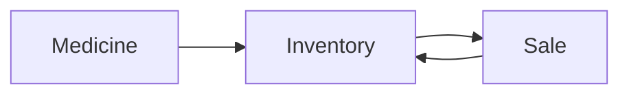

# 药店销售管理系统详细设计与具体代码实现

作者：禅与计算机程序设计艺术

## 1.背景介绍

### 1.1 药店销售管理系统的重要性
在现代社会中,药店是人们日常生活中不可或缺的一部分。为了更好地管理药店的销售业务,提高工作效率和客户满意度,开发一套功能完善、易于使用的药店销售管理系统势在必行。

### 1.2 系统开发的目标
药店销售管理系统旨在实现药品信息管理、库存管理、销售管理、统计报表等功能,使药店工作人员能够更加便捷、准确地处理日常销售业务,同时为管理层提供决策依据。

### 1.3 系统的主要功能模块
- 药品信息管理:包括药品的录入、修改、删除、查询等功能。
- 库存管理:对药品进行入库、出库等操作,实时掌握库存状况。 
- 销售管理:处理药品销售业务,包括开具处方、零售等。
- 统计报表:生成各类统计报表,如销售报表、库存报表等。

## 2.核心概念与联系

### 2.1 药品 (Medicine)
药品是系统的核心实体之一,包含药品编号、名称、规格、单价、库存量等属性。药品信息的准确性和完整性直接影响到系统的运行。

### 2.2 库存 (Inventory)
库存代表药店当前的药品储备情况。系统需要实时跟踪库存变化,当库存不足时及时预警,避免断货。

### 2.3 销售 (Sale) 
销售是药店的主要业务,包括处方销售和零售。每笔销售都会影响库存,因此销售与库存密切相关。

### 2.4 统计报表 (Report)
统计报表根据销售、库存等数据生成,为管理层提供经营情况分析,是决策的重要依据。

### 2.5 实体关系图
下图展示了药品、库存、销售三个核心实体间的关系:



## 3.核心算法原理具体操作步骤

### 3.1 药品查询算法

#### 3.1.1 顺序查找算法
顺序遍历药品列表,逐个比对要查询的药品信息,直至找到目标药品。

算法步骤:
1. 从头到尾遍历药品列表 
2. 比对当前药品的属性与目标属性
3. 如果匹配成功,返回该药品;否则继续遍历
4. 遍历结束,如未找到则返回空

#### 3.1.2 二分查找算法
将药品列表按编号排序,通过不断二分药品区间,快速锁定目标药品。适用于大规模药品数据的快速检索。

算法步骤:
1. 将药品列表按编号升序排序
2. 指定左右两个指针,分别指向列表的首尾
3. 对左右指针对应下标求中点 mid
4. 比对中点处药品编号与目标编号:
    - 如果相等,返回该药品
    - 如果中点编号更大,将右指针移到 mid-1 处,重复步骤 3
    - 如果中点编号更小,将左指针移到 mid+1 处,重复步骤 3
5. 直到左指针超过右指针,查找结束。如未找到则返回空

### 3.2 库存预警算法
定期扫描药品库存,发现库存不足的药品并及时预警。

算法步骤:
1. 设定每种药品的最低库存量 min_stock 
2. 遍历所有药品的当前库存量 current_stock
3. 对于每种药品,比较 current_stock 与 min_stock 的大小
4. 如果 current_stock < min_stock,将该药品加入预警列表
5. 遍历结束,返回库存预警药品列表 

## 4.数学模型和公式详细讲解举例说明

### 4.1 经济订货批量模型 (EOQ)
经济订货批量(Economic Order Quantity,EOQ)是一种确定最优订货量的存货管理模型,目标是在满足需求的同时最小化总库存成本。该模型适用于药品采购决策。

EOQ 公式为:

$$
EOQ = \sqrt{\frac{2DS}{H}}
$$

其中:
- $D$:年需求量
- $S$:每次订货的固定成本 
- $H$:单位商品的年持有成本

例如,某药品的年需求量为 1000 盒,每次订货的固定成本为 100 元,单位年持有成本为 20 元/盒。代入公式计算 EOQ:

$$
EOQ = \sqrt{\frac{2\times 1000 \times 100}{20}} = 100
$$

计算得到该药的最优订货批量为 100 盒。这意味着每次采购 100 盒可使总库存成本达到最低。药店可参考该结果制定采购计划。

## 5.项目实践:代码实例和详细解释说明

下面展示了使用 Python 实现的药店销售管理系统的部分核心代码,并附有详细注释。

### 5.1 药品类 (Medicine)

```python
class Medicine:
    """药品类,包含药品基本信息"""
    def __init__(self, id, name, spec, price, stock):
        self.id = id          # 药品编号
        self.name = name      # 药品名称
        self.spec = spec      # 药品规格
        self.price = price    # 药品单价
        self.stock = stock    # 药品库存量
        
    def __str__(self):
        return f"药品编号:{self.id}, 名称:{self.name}, 规格:{self.spec}, 单价:{self.price}, 库存:{self.stock}"
```

Medicine 类封装了药品的基本属性,构造函数 `__init__` 用于初始化药品实例。`__str__` 方法返回药品的详细信息,方便打印显示。

### 5.2 库存类 (Inventory)

```python
from collections import defaultdict

class Inventory:
    """库存类,管理药品库存"""
    def __init__(self):
        self.medicines = defaultdict(int)  # 使用defaultdict存储药品库存
        
    def add_stock(self, medicine, quantity):
        """添加药品库存"""
        self.medicines[medicine] += quantity
        
    def remove_stock(self, medicine, quantity):
        """减少药品库存"""
        if self.medicines[medicine] >= quantity:
            self.medicines[medicine] -= quantity
        else:
            raise ValueError("库存不足")
            
    def get_stock(self, medicine):
        """获取药品库存"""
        return self.medicines[medicine]
```

Inventory 类负责管理药品库存信息。内部使用 Python 内置的 defaultdict 存储每种药品及其库存量,defaultdict 可以自动处理药品不存在的情况。

`add_stock` 和 `remove_stock` 方法分别实现增加和减少药品库存的操作。`get_stock` 方法返回指定药品的当前库存量。

这部分代码展示了药店销售管理系统的一些关键组成部分。Medicine 和 Inventory 类封装了药品和库存的基本操作,是系统的核心数据结构。实际项目中还需要完善其他模块如销售、统计报表等的代码实现。

## 6.实际应用场景

### 6.1 药品信息录入与管理
- 场景描述:当新药品到货时,需要将药品信息录入系统。药品信息发生变化时,如价格调整,也需要及时更新系统数据。
- 解决方案:通过药品管理模块,提供药品信息的增删改查功能,支持批量导入导出,确保数据及时、准确。

### 6.2 处方销售
- 场景描述:医生开具处方后,药店根据处方内容为患者发药,同时记录销售信息,并更新库存。 
- 解决方案:销售管理模块读取处方内容,检查库存并根据药品单价计算总金额。完成销售后,更新库存数量,同时将销售记录存入数据库。

### 6.3 库存预警
- 场景描述:某些药品因销量大、采购周期长等原因,容易出现库存短缺。为避免断货,需要及时预警,提醒采购。
- 解决方案:系统定期自动检查库存,将库存量低于预设阈值的药品标记为预警状态。预警信息以弹窗、邮件等形式通知相关人员。

### 6.4 数据统计分析
- 场景描述:药店管理层需要定期查看各类统计数据,如销售额、利润、周转率等,以掌握经营状况,优化决策。
- 解决方案:系统自动收集销售、采购、库存等各环节数据,生成日报表、月报表、年报表等统计分析结果,以图表等直观形式展现。

以上应用场景体现了药店销售管理系统在药店日常运转中发挥的重要作用。通过信息化手段,该系统提升了药店管理效率,规避了人工操作的错误风险,为药店的健康经营保驾护航。

## 7.工具和资源推荐

### 7.1 开发语言及框架
- Python:简洁高效,生态丰富,适合快速开发。推荐使用 Python 3.6 及以上版本。
- Django:优秀的 Python Web 框架,MVC架构,自带 ORM,开发效率高。
- Flask:轻量级 Python Web 框架,适合小型项目。

### 7.2 数据库 
- MySQL:开源免费,性能稳定,适合中小规模应用。
- PostgreSQL:开源,功能强大,支持丰富的数据类型。
- SQLite:轻量级文件型数据库,适合桌面端和移动端。

### 7.3 开发工具
- PyCharm:功能强大的 Python IDE,提供智能代码补全、调试、重构等功能。
- Visual Studio Code:微软出品的轻量级代码编辑器,跨平台,插件丰富。
- Anaconda:Python 科学计算集成环境,包含常用库如 NumPy、Pandas 等。

### 7.4 学习资源
- 《Python 编程:从入门到实践》:适合 Python 入门学习的经典图书。
- 《流畅的 Python》:进阶学习 Python 语言特性的优秀读物。
- Django 官方文档:https://docs.djangoproject.com/
- Flask 官方文档:https://flask.palletsprojects.com/
- LeetCode:在线编程题库,可用于学习数据结构与算法。https://leetcode.com/

以上资源可为药店销售管理系统的开发提供参考,选择合适的工具和学习资源,有助于提高开发效率和代码质量。在实际项目中,要根据团队的技术水平、项目规模等因素进行选型。

## 8.总结:未来发展趋势与挑战

### 8.1 移动端支持
随着智能手机的普及,移动端已成为信息化的重要阵地。未来药店管理系统也要适应这一趋势,开发相应的手机 App,方便药店员工使用移动设备处理日常事务,同时为消费者提供用药查询、网上购药等服务。

### 8.2 云计算与大数据
医药行业数据量大、更新频繁,传统的单机部署模式难以满足需求。引入云计算技术可以提高系统的可扩展性和稳定性,利用分布式存储和计算框架处理海量数据。大数据分析有助于药店实现精准营销、智能医嘱等功能。

### 8.3 人工智能应用
人工智能技术如专家系统、自然语言处理等,可以赋予药店管理系统更多智能化功能。比如根据药品说明书自动生成用药咨询,通过智能语音实现药品查询等。随着 AI 技术的发展,药店系统必将越来越"聪明"。  

### 8.4 信息安全与隐私保护
药品信息涉及个人隐私,因此药店系统必须重视信息安全。建立严格的权限管理制度,对关键数据进行加密存储和传输,提高系统抵御网络攻击的能力,最大限度保护用户隐私,这些都是今后药店系统开发的重点和难点。

### 8.5 提升用户体验
药店销售系统的终端用户往往不是 IT 专业人士,因此系统在功能设计和交互体验上都要充分考虑易用性。界面布局要简洁友好,操作流程要符合用户习惯,尽可能减少学习成本。未来还可借助 VR/AR 等新技术,探索更加直观、沉浸式的用户体验。

综上所述,移动互联、