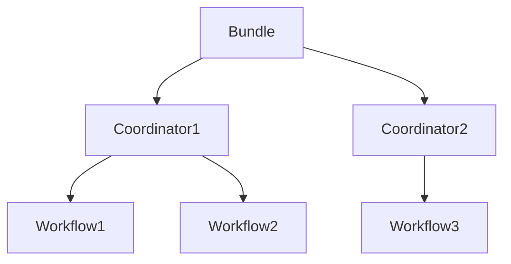

# "OozieBundle优化策略：提升作业性能"

作者：禅与计算机程序设计艺术

## 1. 背景介绍
### 1.1 Oozie简介
Apache Oozie是一个用于管理和协调Hadoop作业的工作流调度系统。它允许用户定义由多个动作组成的工作流,并按照指定的顺序执行这些动作。Oozie支持多种类型的Hadoop作业,包括MapReduce、Pig、Hive和Sqoop等。

### 1.2 OozieBundle概念
OozieBundle是Oozie中的一个重要概念,它允许用户将多个协调器(coordinator)作业打包在一起,作为一个逻辑单元进行管理和调度。Bundle可以包含一个或多个协调器,每个协调器又可以包含多个工作流(workflow)。通过使用Bundle,用户可以更方便地管理和调度复杂的Hadoop作业。

### 1.3 优化OozieBundle的必要性
随着大数据处理需求的增长,Hadoop集群的规模也在不断扩大。这导致Oozie所管理的作业数量和复杂度也在增加。如果不对OozieBundle进行优化,可能会出现以下问题:

1. 作业执行效率低下,完成时间长
2. 资源利用率不高,出现资源浪费
3. 作业失败率高,需要频繁重试
4. 运维成本增加,排查问题困难

因此,优化OozieBundle已经成为提升Hadoop作业性能的关键。下面我们将详细探讨几种优化策略。

## 2. 核心概念与联系
### 2.1 Oozie核心概念
要优化OozieBundle,首先需要理解Oozie的几个核心概念:

- **Workflow**: 由一系列动作(action)组成的有向无环图(DAG),定义了作业的执行流程。
- **Coordinator**: 根据时间和数据的可用性来触发workflow的执行。
- **Bundle**: 将多个coordinator打包在一起,作为一个整体进行管理和调度。

它们三者的关系如下图所示:



### 2.2 优化的核心思路
OozieBundle的优化主要围绕两个核心思路展开:

1. 提高bundle内部的并行度,尽可能让多个coordinator或workflow并行执行,减少作业总时长。
2. 减少不必要的依赖关系,简化workflow的DAG结构,避免由于个别作业失败导致整个bundle被阻塞。

## 3. 核心算法原理与具体操作步骤
### 3.1 基于关键路径的并行度优化
#### 3.1.1 关键路径算法原理
关键路径是指workflow中从开始节点到结束节点的最长路径。它决定了整个作业的最短完成时间。我们可以通过增加关键路径上的并行度来缩短作业执行时间。

关键路径算法的基本步骤如下:

1. 正向遍历DAG,计算每个节点的最早开始时间。
2. 反向遍历DAG,计算每个节点的最晚结束时间。
3. 关键路径是最早开始时间等于最晚结束时间的节点组成的路径。

#### 3.1.2 并行度优化操作步骤

1. 识别出workflow中的关键路径。
2. 分析关键路径上的action,找出可以并行执行的部分。
3. 通过fork和join节点,将这些action包装成并行执行的子workflow。
4. 在bundle和coordinator的配置中,合理设置并发度参数,如`oozie.bundle.parallel.max`和`oozie.coordinator.execution.parallel`。

### 3.2 基于任务聚类的依赖优化
#### 3.2.1 任务聚类算法原理
任务聚类的目标是将相似的任务组合在一起形成更大的任务,从而减少任务之间的依赖关系,提高并行度。

常见的任务聚类算法包括:

- K-means聚类
- 层次聚类
- 谱聚类

以K-means为例,其基本步骤如下:

1. 随机选择K个初始聚类中心。
2. 计算每个任务到各个聚类中心的距离,并将其分配到距离最近的聚类中。
3. 更新每个聚类的中心,即取聚类内所有任务的均值。
4. 重复步骤2和3,直到聚类结果收敛。

#### 3.2.2 依赖优化操作步骤

1. 根据任务的特征(如输入输出、资源需求等)对workflow中的action进行聚类。
2. 对于每个聚类,创建一个子workflow,将聚类内的action放入其中。
3. 分析子workflow之间的依赖关系,去除不必要的依赖。
4. 对bundle进行重构,用生成的子workflow替换原有的action。

## 4. 数学模型和公式详细讲解举例说明
### 4.1 关键路径算法的数学模型
设workflow的DAG为$G=(V,E)$,其中$V$为节点集合,$E$为有向边集合。定义以下变量:

- $es(i)$:节点$i$的最早开始时间
- $ef(i)$:节点$i$的最早结束时间
- $ls(i)$:节点$i$的最晚开始时间
- $lf(i)$:节点$i$的最晚结束时间
- $d(i)$:节点$i$的持续时间

则关键路径算法可以表示为:

$$
es(i) = 
\begin{cases}
0 & i是开始节点 \\
max\{ef(j)|(j,i)\in E\} & 其他
\end{cases}
$$

$$
ef(i) = es(i) + d(i)
$$

$$
lf(i) = 
\begin{cases}
ef(i) & i是结束节点 \\
min\{ls(j)|(i,j)\in E\} & 其他
\end{cases}
$$

$$
ls(i) = lf(i) - d(i)
$$

关键路径为满足$es(i)=ls(i)$的节点$i$组成的路径。

### 4.2 K-means聚类的数学模型
设$n$个待聚类的任务为$x_1,x_2,...,x_n$,聚类的数量为$K$。定义以下变量:

- $c_j$:第$j$个聚类的中心,$j=1,2,...,K$
- $w_{ij}\in \{0,1\}$:任务$x_i$是否属于第$j$个聚类

目标是最小化平方误差$E$:

$$
E = \sum_{i=1}^n\sum_{j=1}^Kw_{ij}||x_i-c_j||^2
$$

其中$||·||$表示欧几里得距离。

K-means算法通过迭代优化来求解$w_{ij}$和$c_j$:

1. 初始化聚类中心$c_1,c_2,...,c_K$
2. 重复直到收敛:
   - 对每个$x_i$,计算$j^*=argmin_j||x_i-c_j||^2$,并设$w_{ij^*}=1$,其他$w_{ij}=0$
   - 更新$c_j=\frac{\sum_{i=1}^nw_{ij}x_i}{\sum_{i=1}^nw_{ij}}$

### 4.3 优化效果分析举例
假设某个OozieBundle包含100个workflow,每个workflow平均有50个action。经过关键路径和任务聚类优化后,workflow数量减少到了20个,每个workflow平均action数量增加到250个。

设优化前平均每个action的执行时间为10分钟,workflow的平均执行时间为500分钟。优化后由于action粒度变大,平均执行时间增加到20分钟,但workflow的平均执行时间降低到了200分钟。

假设优化前bundle内workflow的平均并发度为5,优化后增加到20。则优化前整个bundle的执行时间为:

$$
\frac{100}{5} \times 500 = 10000(分钟)
$$

优化后bundle的执行时间为:

$$
\frac{20}{20} \times 200 = 200(分钟)
$$

可以看出,优化后bundle的执行时间大幅缩短,提升了50倍。当然实际提升效果还取决于优化的具体参数设置。

## 5. 项目实践：代码实例和详细解释说明
下面通过一个简单的示例来演示如何在Oozie中实现bundle优化。

### 5.1 优化前的bundle配置
```xml
<bundle-app name="example-bundle">
  <coordinator name="coordinator1">
    <app-path>hdfs://coordinator1.xml</app-path>
  </coordinator>
  
  <coordinator name="coordinator2">
    <app-path>hdfs://coordinator2.xml</app-path>
  </coordinator>
  
  ...
  
  <coordinator name="coordinator100">
    <app-path>hdfs://coordinator100.xml</app-path>
  </coordinator>
</bundle-app>
```

每个coordinator的配置如下:

```xml
<coordinator-app name="example-coordinator">
  <start>2023-01-01T00:00Z</start>
  <end>2023-12-31T00:00Z</end>
  
  <action>
    <workflow>
      <app-path>hdfs://workflow.xml</app-path>
    </workflow>
  </action>
</coordinator-app>
```

workflow的配置如下:

```xml
<workflow-app name="example-workflow">
  <start to="action1"/>
  
  <action name="action1">
    <map-reduce>
      <resource-manager>rm.example.com:8032</resource-manager>
      <name-node>hdfs://nn.example.com:8020</name-node>
      <configuration>
        <property>
          <name>mapred.mapper.class</name>
          <value>...</value>
        </property>
        ...
      </configuration>
    </map-reduce>
    <ok to="action2"/>
    <error to="kill"/>
  </action>
  
  ...
  
  <action name="action50">
    ...
  </action>
  
  <kill name="kill">
    <message>Workflow failed</message>
  </kill>
  
  <end name="end"/>
</workflow-app>
```

可以看出,这个bundle包含了100个coordinator,每个coordinator触发1个workflow,每个workflow包含50个action。

### 5.2 优化后的bundle配置
首先,我们将相似的action聚类成10个子workflow:

```xml
<workflow-app name="sub-workflow1">
  <start to="action1"/>
  
  <action name="action1">
    ...
  </action>
  
  ...
  
  <action name="action25">
    ...
  </action>
  
  <end name="end"/>
</workflow-app>

...

<workflow-app name="sub-workflow10">
  ...
</workflow-app>
```

然后,我们创建一个主workflow来协调这些子workflow:

```xml
<workflow-app name="main-workflow">
  <start to="fork1"/>
  
  <fork name="fork1">
    <path start="sub-workflow1"/>
    <path start="sub-workflow2"/>
    ...
    <path start="sub-workflow10"/>
  </fork>
  
  <action name="sub-workflow1">
    <sub-workflow>
      <app-path>hdfs://sub-workflow1.xml</app-path>
    </sub-workflow>
    <ok to="join1"/>
    <error to="kill"/>
  </action>
  
  ...
  
  <action name="sub-workflow10">
    ...
  </action>
  
  <join name="join1" to="end"/>
  
  <kill name="kill">
    <message>Workflow failed</message>
  </kill>
  
  <end name="end"/>
</workflow-app>
```

最后,我们修改bundle和coordinator的配置:

```xml
<bundle-app name="optimized-bundle">
  <coordinator name="coordinator1">
    <app-path>hdfs://optimized-coordinator.xml</app-path>
  </coordinator>
</bundle-app>
```

```xml
<coordinator-app name="optimized-coordinator">
  <start>2023-01-01T00:00Z</start>
  <end>2023-12-31T00:00Z</end>
  
  <action>
    <workflow>
      <app-path>hdfs://main-workflow.xml</app-path>
    </workflow>
  </action>
</coordinator-app>
```

可以看出,优化后的bundle只包含1个coordinator,触发1个主workflow。主workflow内部通过fork和join实现了10个子workflow的并行执行。

这样不仅减少了bundle内的coordinator数量,还提高了workflow的并行度,从而大幅缩短了作业的执行时间。

## 6. 实际应用场景
OozieBundle优化在许多实际场景中都有广泛应用,比如:

### 6.1 电商业务数据分析
电商平台每天会产生海量的用户行为日志、交易记录等数据。这些数据通常存储在HDFS中,需要定期进行分析和处理,如:

- 用户行为分析:统计PV、UV、跳出率、转化率等指标
- 商品分析:统计各个商品的销量、评分、评论等信息
- 订单分析:统计订单量、销