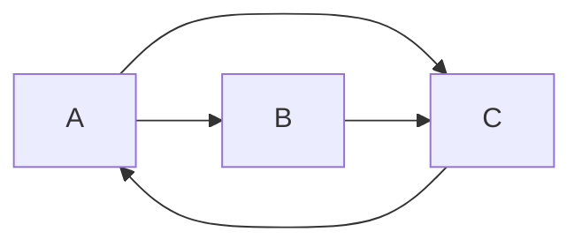

# GraphX案例实战：推荐系统，精准推荐商品

作者：禅与计算机程序设计艺术

## 1. 背景介绍
### 1.1 推荐系统的重要性
在当今信息爆炸的时代,推荐系统在各个领域发挥着越来越重要的作用。它可以帮助用户从海量的信息中快速找到自己感兴趣的内容,提高用户体验和满意度。对于企业来说,推荐系统可以增加用户粘性,提高转化率和销售额。
### 1.2 GraphX在推荐系统中的应用
GraphX是一个基于Spark的图计算框架,它提供了一套灵活的API和强大的图算法库,可以方便地实现各种图计算和图挖掘任务。在推荐系统领域,GraphX可以用于构建用户-商品二部图,挖掘用户和商品之间的隐含关系,实现精准推荐。
### 1.3 案例背景
本文将以一个电商平台的商品推荐为例,介绍如何使用GraphX构建推荐系统。我们将从数据准备、图构建、推荐算法、实验结果等方面进行详细讲解,帮助读者掌握GraphX在推荐系统中的应用。

## 2. 核心概念与联系
### 2.1 图的基本概念
在介绍GraphX之前,我们先回顾一下图的基本概念。图由顶点(Vertex)和边(Edge)组成,顶点表示实体,边表示实体之间的关系。在推荐系统中,顶点可以是用户或商品,边可以是用户对商品的评分或购买记录。
### 2.2 GraphX的核心抽象
GraphX使用RDD(弹性分布式数据集)来表示图,并提供了一套统一的API来操作和计算图。GraphX的核心抽象包括:

- VertexRDD:顶点RDD,每个顶点包含一个唯一的ID和属性。
- EdgeRDD:边RDD,每条边包含源顶点ID、目标顶点ID和属性。 
- Graph:由VertexRDD和EdgeRDD组成的图,提供了一系列图操作API。

### 2.3 GraphX与推荐系统的联系
GraphX非常适合用于构建推荐系统,主要有以下几个原因:

1. 图模型可以自然地表达用户和商品之间的交互关系。
2. GraphX提供了丰富的图算法库,如PageRank、连通分量、标签传播等,可以用于挖掘用户和商品的隐含关系。
3. GraphX基于Spark,可以方便地与其他Spark组件(如SparkSQL、SparkStreaming)集成,实现端到端的推荐系统。

## 3. 核心算法原理与具体操作步骤
### 3.1 数据准备
首先我们需要准备用户行为数据,包括用户ID、商品ID、行为类型(如点击、购买、评分等)、时间戳等。这里我们使用Spark SQL从Hive表中加载数据:

```scala
val userBehavior = spark.sql("SELECT user_id, item_id, behavior_type, timestamp FROM user_behavior")
```

### 3.2 构建图
接下来我们使用GraphX构建用户-商品二部图。我们将用户和商品作为顶点,用户行为作为边,行为类型作为边的属性:

```scala
val vertices = userBehavior.map(row => {
  val id = row.getLong(0) 
  val vType = "user"
  (id, (vType, row.getString(1)))
}).union(
  userBehavior.map(row => {
    val id = row.getLong(1)
    val vType = "item" 
    (id, (vType, row.getString(0)))
  })
).distinct()

val edges = userBehavior.map(row => {
  val srcId = row.getLong(0)
  val dstId = row.getLong(1)
  val attr = row.getString(2)
  Edge(srcId, dstId, attr)
})

val graph = Graph(vertices, edges)
```

### 3.3 协同过滤算法
协同过滤是推荐系统中最常用的算法之一。它的基本思想是利用用户之间的相似性来推荐商品。这里我们使用基于图的随机游走算法来计算顶点之间的相似性:

```scala
val numIter = 10
val resetProb = 0.15
val rankGraph = graph.pageRank(numIter, resetProb)

val userItemWeights = rankGraph.vertices.filter(v => v._2._1 == "user")
  .join(rankGraph.edges)((uid, userData, edge) => (edge.dstId, edge.attr.toDouble))
  .join(rankGraph.vertices.filter(_._2._1 == "item"))((iid, weightedEdge, itemData) => 
    (weightedEdge._1, iid, weightedEdge._2)
  )
  .map(x => (x._1, (x._2, x._3)))
  .groupByKey()
  .map(x => (x._1, x._2.toArray.sortBy(-_._2).take(10).map(_._1)))
```

上面的代码首先使用PageRank算法计算顶点的重要性,然后对每个用户,找到与其相连的商品,按照权重排序,取Top10作为推荐结果。

## 4. 数学模型和公式详细讲解举例说明
### 4.1 PageRank算法
PageRank是一种经典的图节点重要性评估算法,最初用于评估网页的重要性。它的基本思想是:如果一个节点有很多重要的节点指向它,那么它也很重要。PageRank值的计算公式如下:

$$PR(u) = \frac{1-d}{N} + d \sum_{v \in B_u} \frac{PR(v)}{L(v)}$$

其中,$PR(u)$表示节点$u$的PageRank值,$N$表示图中节点总数,$B_u$表示指向$u$的节点集合,$L(v)$表示节点$v$的出度,$d$是阻尼系数,一般取0.85。

举个例子,假设我们有下面这个图:



初始时,每个节点的PageRank值为$1/3$。第一轮迭代后:

$PR(A) = \frac{1-0.85}{3} + 0.85 \times \frac{1/3}{1} = 0.283$

$PR(B) = \frac{1-0.85}{3} + 0.85 \times \frac{1/3}{2} = 0.192$ 

$PR(C) = \frac{1-0.85}{3} + 0.85 \times (\frac{1/3}{2} + \frac{1/3}{1}) = 0.525$

可以看出,C的PageRank值最高,因为它有两个节点指向它。随着迭代的进行,PageRank值会收敛到一个稳定值。

### 4.2 随机游走算法
随机游走算法是一种计算节点相似性的方法。它的基本思想是:从一个节点出发,随机地沿着边游走,记录访问每个节点的频率,访问频率高的节点与出发节点更相似。

假设$P$是转移概率矩阵,$P_{ij}$表示从节点$i$转移到节点$j$的概率,则$P_{ij} = \frac{1}{d_i}$,其中$d_i$是节点$i$的出度。

随机游走的过程可以用下面的公式表示:

$$\vec{\pi}^{(t+1)} = \alpha \vec{\pi}^{(t)}P + (1-\alpha) \vec{v}$$

其中,$\vec{\pi}^{(t)}$是$t$时刻的访问概率分布,$\alpha$是继续游走的概率,$\vec{v}$是重启概率分布(一般是均匀分布)。

举个例子,还是上面那个图,假设从节点A开始游走,初始访问概率为$\vec{\pi}^{(0)} = [1, 0, 0]$,转移概率矩阵为:

$$P = \begin{bmatrix} 0 & 1/2 & 1/2 \\ 0 & 0 & 1 \\ 1 & 0 & 0 \end{bmatrix}$$

假设$\alpha=0.8$,则第一轮游走后:

$$\vec{\pi}^{(1)} = 0.8 \times [1, 0, 0] \times \begin{bmatrix} 0 & 1/2 & 1/2 \\ 0 & 0 & 1 \\ 1 & 0 & 0 \end{bmatrix} + 0.2 \times [1/3, 1/3, 1/3] = [0.4, 0.4, 0.2]$$

可以看出,节点B和C被访问的概率更高,因此与A更相似。

## 5. 项目实践：代码实例和详细解释说明
下面我们给出一个完整的GraphX推荐系统的代码实例:

```scala
import org.apache.spark.graphx._
import org.apache.spark.rdd.RDD
import org.apache.spark.sql.SparkSession

object GraphXRecommender {
  def main(args: Array[String]): Unit = {
    val spark = SparkSession.builder()
      .appName("GraphXRecommender")
      .getOrCreate()
    
    // 加载数据
    val userBehavior = spark.sql("SELECT user_id, item_id, behavior_type, timestamp FROM user_behavior")
    
    // 构建图
    val vertices = userBehavior.map(row => {
      val id = row.getLong(0) 
      val vType = "user"
      (id, (vType, row.getString(1)))
    }).union(
      userBehavior.map(row => {
        val id = row.getLong(1)
        val vType = "item" 
        (id, (vType, row.getString(0)))
      })
    ).distinct()

    val edges = userBehavior.map(row => {
      val srcId = row.getLong(0)
      val dstId = row.getLong(1)
      val attr = row.getString(2)
      Edge(srcId, dstId, attr)
    })

    val graph = Graph(vertices, edges)
    
    // PageRank
    val numIter = 10
    val resetProb = 0.15
    val rankGraph = graph.pageRank(numIter, resetProb)
    
    // 生成推荐
    val userItemWeights = rankGraph.vertices.filter(v => v._2._1 == "user")
      .join(rankGraph.edges)((uid, userData, edge) => (edge.dstId, edge.attr.toDouble))
      .join(rankGraph.vertices.filter(_._2._1 == "item"))((iid, weightedEdge, itemData) => 
        (weightedEdge._1, iid, weightedEdge._2)
      )
      .map(x => (x._1, (x._2, x._3)))
      .groupByKey()
      .map(x => (x._1, x._2.toArray.sortBy(-_._2).take(10).map(_._1)))
      
    userItemWeights.take(10).foreach(println)
  }
}
```

代码解释:

1. 首先创建SparkSession,用于加载数据和执行Spark任务。
2. 使用Spark SQL从Hive表中加载用户行为数据。
3. 构建用户-商品二部图,将用户和商品作为顶点,用户行为作为边。注意要对顶点去重。
4. 调用GraphX的pageRank API计算顶点的PageRank值,迭代10次,重启概率为0.15。
5. 对每个用户,找到其关联的商品,按照PageRank值加权,选取Top10作为推荐结果。
6. 打印推荐结果。

## 6. 实际应用场景
GraphX推荐系统可以应用于多个领域,包括:

1. 电商平台:为用户推荐可能感兴趣的商品,提高转化率和GMV。
2. 社交网络:推荐好友、社区、话题等,增强用户粘性。
3. 内容平台:推荐文章、视频、音乐等,延长用户访问时长。
4. 金融领域:推荐股票、基金、理财产品等,提升用户资产。

以电商平台为例,我们可以将GraphX推荐系统集成到现有的业务流程中:

1. 实时数据采集:将用户的浏览、收藏、加购、购买等行为数据实时写入Kafka。
2. 离线数据处理:每天定时将Kafka中的数据导入Hive表,构建用户-商品图,计算PageRank,生成Top N推荐,写入HBase。
3. 在线服务:提供HTTP接口,根据用户ID实时查询HBase,返回推荐结果。
4. 效果评估:对推荐结果进行AB测试,分析CTR、转化率等指标,不断优化模型和策略。

## 7. 工具和资源推荐
如果你想深入学习GraphX和推荐系统,这里推荐一些工具和资源:

1. Spark官方文档:https://spark.apache.org/docs/latest/graphx-programming-guide.html
2. GraphX源码:https://github.com/apache/spark/tree/master/graphx
3. Spark Recommender:https://github.com/jamenlong/SparkRecommender
4. 《推荐系统实践》:项亮 著,人民邮电出版社
5. Coursera