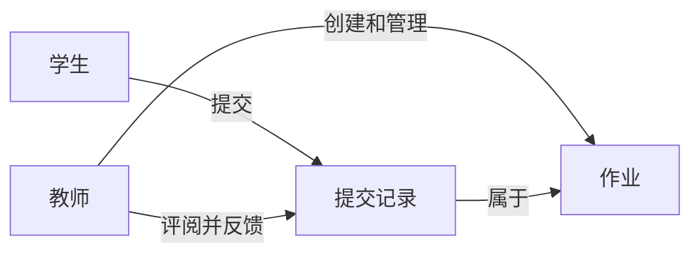

# 作业提交系统详细设计与具体代码实现

作者：禅与计算机程序设计艺术

## 1. 背景介绍

### 1.1 作业提交系统的重要性

在现代教育领域,尤其是高等教育领域,作业提交系统扮演着至关重要的角色。它不仅能够方便学生提交作业,还能帮助教师高效地管理和评阅作业,极大地提高了教学效率。一个设计良好的作业提交系统能够显著改善教与学的体验。

### 1.2 作业提交系统的主要功能

一个完善的作业提交系统通常包含以下主要功能:

1. 学生提交作业:允许学生在线提交各种格式的作业文件。
2. 教师管理作业:教师可以创建作业,设置截止日期,并对提交的作业进行评阅和打分。
3. 反馈与交流:系统应支持教师对学生的作业提供反馈意见,并允许师生之间就作业进行交流和讨论。
4. 成绩管理:自动计算和记录学生的作业成绩,并生成成绩报告。

### 1.3 开发作业提交系统的技术选型

开发一个现代化的作业提交系统,需要合理选择各种技术:

1. 前端:可选用 React、Vue 或 Angular 等流行的 JavaScript 框架。
2. 后端:可使用 Node.js、Python(Django/Flask)、Java(Spring) 等语言和框架。
3. 数据库:MySQL、PostgreSQL 等关系型数据库,或 MongoDB 等 NoSQL 数据库。
4. 文件存储:可采用本地文件系统存储,或使用 AWS S3、阿里云 OSS 等云存储服务。

## 2. 核心概念与联系

### 2.1 用户角色

作业提交系统主要涉及两类用户角色:

1. 学生:提交作业,查看成绩和反馈。
2. 教师:创建和管理作业,评阅作业并提供反馈。

### 2.2 作业

作业是系统的核心实体之一,包含以下主要属性:

- 标题:作业的题目或名称。
- 描述:对作业内容和要求的详细说明。 
- 截止日期:规定学生提交作业的最后期限。
- 附件:教师可上传作业相关的附件材料。

### 2.3 提交记录

提交记录表示学生对某个作业的一次提交,包含:

- 所属作业:该提交对应的作业。
- 提交学生:进行提交的学生。
- 提交时间:学生提交作业的时间。
- 提交文件:学生上传的作业文件。
- 成绩:教师评阅后给出的成绩。
- 反馈:教师对该提交的评语和反馈意见。

### 2.4 核心概念之间的关系

下图展示了作业提交系统的核心概念以及它们之间的关系:



学生提交作业,形成提交记录;教师创建和管理作业,同时对学生的提交记录进行评阅并给出反馈。每个提交记录都对应一个特定的作业。

## 3. 核心算法原理与具体操作步骤

### 3.1 文件上传与存储

文件上传是作业提交系统的关键功能之一。以下是使用 Node.js 和 Multer 中间件处理文件上传的核心步骤:

1. 客户端通过 HTTP POST 请求将文件上传到服务器指定的接口。

2. 服务器使用 Multer 中间件处理上传的文件:

```javascript
const multer = require('multer');

const upload = multer({
  storage: multer.diskStorage({
    destination: function (req, file, cb) {
      cb(null, 'uploads/');
    },
    filename: function (req, file, cb) {
      cb(null, Date.now() + path.extname(file.originalname));
    }
  })
});

app.post('/upload', upload.single('file'), (req, res) => {
  // 处理上传后的文件
  console.log(req.file);
  res.send('File uploaded successfully');
});
```

3. Multer 会将上传的文件保存到服务器指定的目录(如 `uploads/`),并将文件信息存储在 `req.file` 对象中。

4. 服务器可将文件信息(如文件名、大小等)存储到数据库中,与对应的提交记录关联起来。

### 3.2 作业评阅算法

教师在评阅学生提交的作业时,可参考以下基本算法步骤:

1. 教师打开学生提交的作业文件。

2. 根据作业要求,对照评分标准,逐项评估学生的完成情况。可考虑的评估维度包括:
   - 完成度:作业是否完整完成了所有要求的内容。
   - 正确性:作业的内容是否准确无误。
   - 格式规范:作业的格式、结构是否符合规范要求。
   - 创新性:作业是否有独到的见解和创新点。

3. 根据各项评估结果,给出一个总成绩。可采用加权平均的方法,对各评估维度的得分进行加权,然后相加得到总成绩:

$$
总成绩 = \sum_{i=1}^{n} w_i \times score_i
$$

其中,$w_i$为第$i$项评估维度的权重,$score_i$为该维度的得分。

4. 在系统中记录成绩,并编写反馈意见,提交评阅结果。

### 3.3 成绩统计与分析

为了帮助教师全面了解学生的作业完成情况,系统需提供成绩统计与分析功能。以下是一些常用的统计指标和算法:

1. 平均成绩:计算全班学生的作业平均成绩。设$x_i$为第$i$个学生的成绩,$n$为学生总数,则平均成绩为:

$$
\bar{x} = \frac{1}{n} \sum_{i=1}^{n} x_i
$$

2. 成绩分布:统计各分数段的学生人数和占比。可将分数划分为若干区间(如 0-59, 60-69, 70-79, 80-89, 90-100),然后统计落在各区间的学生数量,并计算占总人数的百分比。

3. 成绩排名:对学生的成绩进行排序,得到每个学生的班级排名。可使用快速排序等高效的排序算法。

4. 成绩趋势分析:统计学生历次作业的成绩,绘制成绩趋势图,反映学生的进步或退步情况。可使用折线图等可视化方式呈现。

## 4. 数学模型和公式详细讲解举例说明

在作业提交系统中,我们可以使用数学模型和公式来量化评估学生的作业完成情况。以下是一个综合评分模型的详细说明:

设一个作业有$n$个评估维度,每个维度的满分为$M_i$(可以是不同的分值)。令$x_i$表示学生在第$i$个维度的得分,满足$0 \leq x_i \leq M_i$。

定义第$i$个维度的得分率$r_i$为:

$$
r_i = \frac{x_i}{M_i}
$$

则$r_i$的取值范围为$[0, 1]$,表示学生在该维度上的完成程度。

假设每个评估维度都有一个权重系数$w_i$,表示该维度在总评分中的重要程度。权重系数满足以下约束:

$$
\sum_{i=1}^{n} w_i = 1, \quad w_i \geq 0
$$

综合评分$S$的计算公式为:

$$
S = \sum_{i=1}^{n} w_i \times r_i \times 100
$$

上式表示,综合评分等于各评估维度得分率的加权平均值乘以100(换算为百分制)。

举例说明:

假设一个作业有三个评估维度:完成度(满分50分)、正确性(满分30分)、创新性(满分20分),权重系数分别为0.5, 0.3, 0.2。某学生的得分情况如下:

- 完成度:45分
- 正确性:25分
- 创新性:18分

则各维度的得分率为:

$$
r_1 = \frac{45}{50} = 0.9, \quad r_2 = \frac{25}{30} \approx 0.83, \quad r_3 = \frac{18}{20} = 0.9
$$

该学生的综合评分为:

$$
S = (0.5 \times 0.9 + 0.3 \times 0.83 + 0.2 \times 0.9) \times 100 \approx 88.4
$$

因此,该学生的作业综合评分为88.4分(百分制)。

通过这种数学模型,我们可以比较客观、准确地评估学生的作业完成情况,并方便地进行成绩统计和分析。

## 5. 项目实践:代码实例和详细解释说明

下面我们通过一个简单的代码实例,演示如何使用 Node.js、Express 和 Multer 实现文件上传功能。

### 5.1 后端代码

```javascript
const express = require('express');
const multer = require('multer');
const path = require('path');

const app = express();

// 配置 Multer
const storage = multer.diskStorage({
  destination: function (req, file, cb) {
    cb(null, 'uploads/');
  },
  filename: function (req, file, cb) {
    cb(null, Date.now() + path.extname(file.originalname));
  }
});

const upload = multer({ storage: storage });

// 文件上传接口
app.post('/upload', upload.single('file'), (req, res) => {
  if (!req.file) {
    return res.status(400).send('No file uploaded.');
  }
  
  // 在此处可以将文件信息存储到数据库
  console.log(req.file);
  
  res.send('File uploaded successfully.');
});

// 启动服务器
app.listen(3000, () => {
  console.log('Server started on port 3000');
});
```

代码解释:

1. 首先,我们导入了必要的模块:Express、Multer 和 Path。

2. 创建一个 Express 应用实例 `app`。

3. 使用 `multer.diskStorage` 配置 Multer 的存储选项。其中,`destination` 指定上传文件的保存目录,`filename` 定义保存的文件名(这里使用时间戳+原始文件扩展名)。

4. 创建 Multer 实例 `upload`,传入配置好的存储选项。

5. 定义文件上传接口 `/upload`,使用 `upload.single('file')` 中间件处理单个文件上传。

6. 在接口处理函数中,首先检查 `req.file` 是否存在,如果不存在,说明没有上传文件,返回错误响应。

7. 如果文件上传成功,可以在此处将文件信息(如文件名、大小、上传时间等)存储到数据库中,与对应的提交记录关联起来。

8. 向客户端发送成功响应,表示文件上传成功。

9. 最后,启动服务器,监听指定端口(这里是3000)。

### 5.2 前端代码

下面是一个简单的 HTML 表单,用于上传文件:

```html
<form action="/upload" method="post" enctype="multipart/form-data">
  <input type="file" name="file">
  <input type="submit" value="Upload">
</form>
```

当用户选择文件并点击提交按钮时,浏览器会将文件上传到服务器的 `/upload` 接口。

通过以上代码示例,我们实现了一个基本的文件上传功能。在实际的作业提交系统中,还需要进一步完善错误处理、身份验证、权限控制等功能,以确保系统的安全性和可靠性。

## 6. 实际应用场景

作业提交系统在教育领域有广泛的应用,下面列举几个典型场景:

### 6.1 高校课程作业管理

在大学课程教学中,教师经常需要布置作业,学生需要在规定时间内完成并提交。使用作业提交系统,可以实现:

- 教师在系统中创建作业,设置截止时间,上传相关资料。
- 学生在系统中提交作业文件,如果超过截止时间,系统会自动标记为迟交。
- 教师在系统中批阅作业,给出成绩和评语,学生可以及时查看反馈。
- 系统自动汇总成绩,生成成绩单,方便教师进行成绩管理。

###