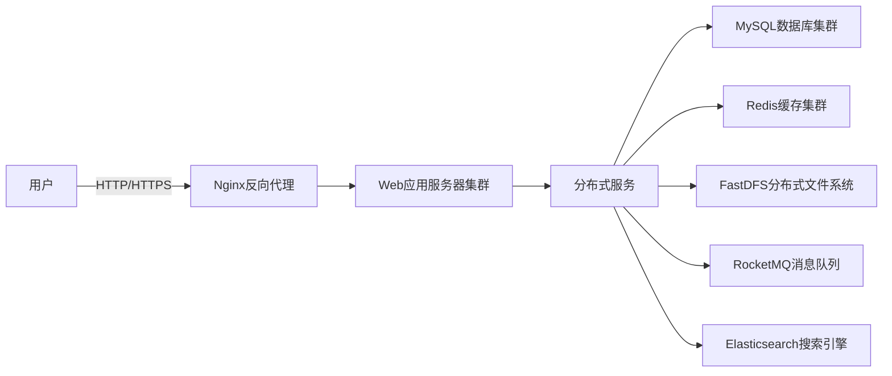

# 珠宝购物网站的建设系统详细设计与具体代码实现

作者：禅与计算机程序设计艺术

## 1. 背景介绍
### 1.1 珠宝电商行业现状
#### 1.1.1 市场规模与增长趋势
#### 1.1.2 用户消费习惯与需求分析  
#### 1.1.3 行业竞争格局

### 1.2 珠宝购物网站建设的意义
#### 1.2.1 拓展销售渠道,提升品牌影响力
#### 1.2.2 优化用户购物体验,提高转化率
#### 1.2.3 降低运营成本,提升运营效率

### 1.3 珠宝购物网站建设面临的挑战  
#### 1.3.1 产品信息展示的专业性与丰富性
#### 1.3.2 用户信任度与支付安全性
#### 1.3.3 物流配送与售后服务质量

## 2. 核心概念与联系
### 2.1 电子商务系统架构
#### 2.1.1 B/S架构与C/S架构对比
#### 2.1.2 分层架构设计原则
#### 2.1.3 高可用与高并发设计考量

### 2.2 业务流程与功能模块划分
#### 2.2.1 用户注册登录与个人中心
#### 2.2.2 商品浏览、搜索与详情展示
#### 2.2.3 购物车与订单管理
#### 2.2.4 支付与物流配送
#### 2.2.5 售后服务与评价管理
#### 2.2.6 营销推广与数据分析

### 2.3 数据库设计 
#### 2.3.1 ER图与数据库表结构设计
#### 2.3.2 索引优化与查询性能调优
#### 2.3.3 数据库安全与备份方案

## 3. 核心算法原理具体操作步骤
### 3.1 商品推荐算法
#### 3.1.1 协同过滤推荐原理
#### 3.1.2 基于用户行为的隐语义模型
#### 3.1.3 推荐系统冷启动问题解决方案

### 3.2 商品搜索算法
#### 3.2.1 倒排索引原理与构建
#### 3.2.2 相关度排序算法 
#### 3.2.3 查询性能优化技巧

### 3.3 订单风控算法
#### 3.3.1 规则引擎与专家系统
#### 3.3.2 机器学习算法模型
#### 3.3.3 大数据实时计算框架应用

## 4. 数学模型和公式详细讲解举例说明
### 4.1 协同过滤推荐算法模型
#### 4.1.1 用户相似度计算
$sim(u,v) = \frac{\sum_{i \in I_{uv}} r_{ui}r_{vi}}{\sqrt{\sum_{i \in I_u} r_{ui}^2} \sqrt{\sum_{i \in I_v}r_{vi}^2}}$
其中$I_{uv}$是用户u和v共同评分的物品集合，$r_{ui}$是用户u对物品i的评分，$r_{vi}$是用户v对物品i的评分。

#### 4.1.2 物品相似度计算
$sim(i,j) = \frac{\sum_{u \in U_{ij}} r_{ui}r_{uj}}{\sqrt{\sum_{u \in U_i} r_{ui}^2} \sqrt{\sum_{u \in U_j}r_{uj}^2}}$
其中$U_{ij}$是对物品i和j都有评分的用户集合，$r_{ui}$是用户u对物品i的评分，$r_{uj}$是用户u对物品j的评分。

#### 4.1.3 用户对物品的评分预测
$$P(u,i) = \overline{r_u} + \frac{\sum_{v \in S^k(u,i)}sim(u,v) \cdot (r_{vi} - \overline{r_v})}{\sum_{v \in S^k(u,i)} |sim(u,v)|}$$
其中$\overline{r_u}$和$\overline{r_v}$分别是用户u和v的平均评分，$S^k(u,i)$是与用户u最相似的k个用户中对物品i有评分的用户集合。

### 4.2 逻辑回归模型
#### 4.2.1 逻辑回归模型定义
$$y = \frac{1}{1+e^{-z}}$$
其中$z=w_0+w_1x_1+w_2x_2+...+w_nx_n$，$w_i$为模型参数，$x_i$为特征。

#### 4.2.2 参数估计与优化方法
使用极大似然估计和梯度下降法等优化算法求解模型参数。
$$\ell(\mathbf{w}) = \sum_{i=1}^n \left[ y_i \log p(y_i|\mathbf{x}_i,\mathbf{w}) + (1-y_i) \log (1-p(y_i|\mathbf{x}_i,\mathbf{w})) \right]$$
$$\mathbf{w} := \mathbf{w} + \alpha \nabla_{\mathbf{w}} \ell(\mathbf{w})$$

#### 4.2.3 正则化解决过拟合
加入L1或L2正则化项控制模型复杂度。
$$\ell(\mathbf{w}) = \sum_{i=1}^n \left[ y_i \log p(y_i|\mathbf{x}_i,\mathbf{w}) + (1-y_i) \log (1-p(y_i|\mathbf{x}_i,\mathbf{w})) \right] - \lambda\sum_{j=1}^m |w_j|$$

## 5. 项目实践：代码实例和详细解释说明
### 5.1 系统总体架构图


### 5.2 核心代码模块展示
#### 5.2.1 用户注册登录
```java
@Controller
public class UserController {
    @Autowired
    private UserService userService;

    @PostMapping("/register")
    public String register(User user) {
        userService.register(user);
        return "redirect:/login";
    }
    
    @PostMapping("/login")
    public String login(String username, String password, HttpSession session) {
        User user = userService.login(username, password);
        session.setAttribute("user", user);
        return "redirect:/index";
    }
}
```

#### 5.2.2 商品搜索功能
```java
@Service
public class ProductServiceImpl implements ProductService {
    @Autowired
    private ProductMapper productMapper;
    
    @Autowired
    private SearchService searchService;
    
    @Override
    public PageInfo<Product> search(String keyword, int pageNum, int pageSize) {
        // 从ES中搜索商品
        List<Integer> productIds = searchService.searchProduct(keyword, pageNum, pageSize);
        
        // 根据商品id查询商品详情
        Example example = new Example(Product.class);
        example.createCriteria().andIn("id", productIds);
        List<Product> products = productMapper.selectByExample(example);
        
        // 封装分页结果
        PageInfo<Product> pageInfo = new PageInfo<>(products);
        return pageInfo;
    }
}
```

#### 5.2.3 订单提交与支付
```java
@Service
public class OrderServiceImpl implements OrderService {
    @Autowired
    private OrderMapper orderMapper;
    
    @Autowired
    private ProductMapper productMapper;
    
    @Autowired
    private RocketMQTemplate rocketMQTemplate;
    
    @Override
    @Transactional
    public String submitOrder(OrderVO orderVO) {
        // 插入订单表
        Order order = new Order();
        // ...
        orderMapper.insertSelective(order);
        
        // 更新商品库存
        List<OrderItem> orderItems = orderVO.getOrderItems();
        for (OrderItem orderItem : orderItems) {
            Product product = productMapper.selectByPrimaryKey(orderItem.getProductId());
            if (product.getStock() < orderItem.getCount()) {
                throw new RuntimeException("商品库存不足");
            }
            product.setStock(product.getStock() - orderItem.getCount());
            productMapper.updateByPrimaryKeySelective(product);
        }
        
        // 发送延迟消息,30分钟后检查订单是否已支付
        rocketMQTemplate.syncSend("order-timeout-check", order.getOrderNo(), 30, TimeUnit.MINUTES);
        
        return order.getOrderNo();
    }
    
    @Override
    public void pay(String orderNo) {
        Order order = orderMapper.selectByPrimaryKey(orderNo);
        if (order == null) {
            throw new RuntimeException("订单不存在");
        }
        if (order.getStatus() != OrderStatus.UNPAID) {
            throw new RuntimeException("订单状态异常");
        }
        
        // 调用第三方支付接口
        // ...
        
        // 更新订单状态
        order.setStatus(OrderStatus.PAID);
        order.setPayTime(new Date());
        orderMapper.updateByPrimaryKeySelective(order);
    }
}
```

### 5.3 系统测试与性能优化
#### 5.3.1 单元测试
编写单元测试用例，对Service、Mapper等模块进行测试，保证代码逻辑的正确性。使用Mockito等框架模拟依赖，提高测试的独立性和可维护性。

#### 5.3.2 压力测试
使用JMeter等工具模拟高并发场景，对系统进行压力测试。通过分析测试报告，找出系统的性能瓶颈，并进行针对性的优化。

#### 5.3.3 性能优化
- 使用Redis缓存热点数据，减轻数据库压力
- 使用ElasticSearch实现商品搜索，提高搜索效率
- 对数据库进行分库分表，实现水平扩展
- 使用RocketMQ实现异步解耦，提高系统吞吐量
- 对关键代码进行性能分析和优化，如使用多线程、优化算法等

## 6. 实际应用场景
### 6.1 个性化商品推荐
利用用户行为数据和商品元数据，通过协同过滤、基于内容的推荐等算法，为用户提供个性化的商品推荐，提高转化率和客单价。

### 6.2 智能客服
接入第三方智能客服系统，利用自然语言处理和知识图谱技术，为用户提供智能化的客服服务，提高客服效率和用户满意度。

### 6.3 直播带货
引入直播带货功能，通过网红直播、明星直播等方式，为商品引流，提高商品曝光度和销量。

### 6.4 社交裂变营销
利用社交网络进行裂变式营销，鼓励用户分享商品、邀请好友注册等，提高用户粘性和活跃度。

## 7. 工具和资源推荐
### 7.1 开发工具
- IntelliJ IDEA：Java IDE
- Visual Studio Code：前端开发工具
- Navicat：数据库管理工具
- Postman：API测试工具

### 7.2 技术框架
- Spring Boot：Java Web开发框架
- MyBatis：数据库ORM框架
- Vue.js：前端JavaScript框架
- Element UI：前端UI组件库
- RocketMQ：分布式消息队列
- ElasticSearch：分布式搜索引擎
- Redis：内存数据库
- FastDFS：分布式文件系统

### 7.3 学习资源
- 《Spring Boot实战》
- 《MyBatis从入门到精通》
- 《深入浅出Vue.js》
- 《RocketMQ实战与原理解析》
- 《Elasticsearch权威指南》
- 《Redis设计与实现》

## 8. 总结：未来发展趋势与挑战
### 8.1 技术趋势
- 微服务架构的普及
- 人工智能技术的应用
- 大数据分析与应用
- 云原生架构的发展
- 区块链技术的探索

### 8.2 业务趋势
- 线上线下融合发展
- 社交电商的兴起
- 直播带货的普及
- 跨境电商的发展
- 供应链金融的创新

### 8.3 挑战与机遇
- 用户体验提升
- 数据安全与隐私保护
- 技术架构升级与优化
- 业务模式创新
- 人才培养与团队建设

## 9. 附录：常见问题与解答
### 9.1 如何提高网站的访问速度？
- 使用CDN加速静态资源访问
- 优化前端页面，减少HTTP请求
- 启用GZIP压缩传输
- 使用缓存技术，如浏览器缓存、服务端缓存等

### 9.2 如何保证网站的安全性？
- 使用HTTPS加密传输
- 对用户输入进行严格校验，防止SQL注入、XSS等攻击
- 对用户密码进行加密存储