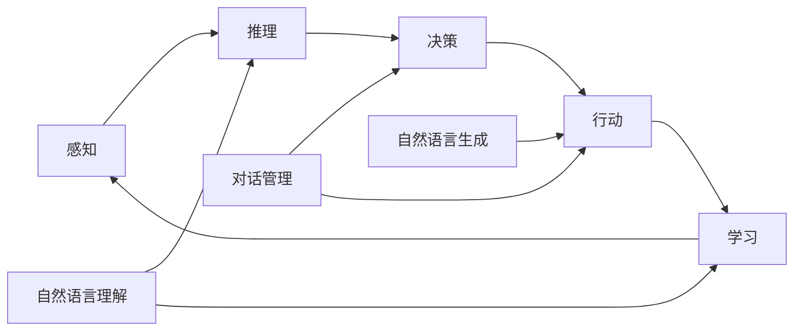

## 1. 背景介绍

### 1.1  AI Agent 的崛起

近年来，人工智能 (AI) 领域取得了显著的进步，特别是在自然语言处理 (NLP) 领域。随着大型语言模型 (LLM) 的出现，如 GPT-3 和 BERT，AI 系统能够理解和生成越来越像人类的文本。这种能力为 AI Agent 的出现铺平了道路，AI Agent 是一种能够感知环境、进行推理、做出决策并采取行动以实现特定目标的自主实体。

### 1.2 NLP 在 AI Agent 中的作用

NLP 在 AI Agent 的开发中起着至关重要的作用。它使 Agent 能够：

* **理解自然语言指令:**  用户可以使用自然语言与 Agent 交流，而无需学习复杂的命令或编程语言。
* **从文本数据中提取信息:** Agent 可以从各种来源（如网页、文档和数据库）收集信息，并利用这些信息做出更明智的决策。
* **生成自然语言响应:** Agent 可以以清晰、简洁和信息丰富的方式与用户交流。

### 1.3 AI Agent 的潜在应用

AI Agent 具有广泛的潜在应用，包括：

* **客户服务:** AI Agent 可以充当虚拟客服代表，回答客户的问题并解决他们的问题。
* **个人助理:** AI Agent 可以帮助用户管理他们的日程安排、预订旅行和执行其他任务。
* **教育:** AI Agent 可以作为虚拟导师，为学生提供个性化的学习体验。
* **医疗保健:** AI Agent 可以帮助医生诊断疾病、推荐治疗方案并监测患者的健康状况。


## 2. 核心概念与联系

### 2.1 AI Agent 架构

AI Agent 的架构通常包括以下组件：

* **感知:** Agent 通过传感器或其他数据源感知其环境。
* **推理:** Agent 使用其知识和感知信息来推断其环境的状态和采取最佳行动。
* **决策:** Agent 根据其推理选择要执行的行动。
* **行动:** Agent 执行其选择的行动以改变其环境或实现其目标。
* **学习:** Agent 可以从其经验中学习并改进其未来的表现。

### 2.2 NLP 技术

AI Agent 中使用的关键 NLP 技术包括：

* **自然语言理解 (NLU):** 理解文本的含义，包括识别实体、关系和意图。
* **自然语言生成 (NLG):** 生成自然语言文本，例如回复用户的问题或生成摘要。
* **对话管理:** 管理与用户的对话流程，包括跟踪对话历史、识别对话状态和生成适当的响应。

### 2.3 核心概念联系

AI Agent 的架构和 NLP 技术相互关联。感知组件依赖于 NLP 来理解自然语言输入，而推理和决策组件利用 NLP 从文本数据中提取信息。行动组件可以使用 NLP 生成自然语言响应，学习组件可以利用 NLP 提高 Agent 的语言理解和生成能力。




## 3. 核心算法原理具体操作步骤

### 3.1 基于规则的 AI Agent

基于规则的 AI Agent 使用一组预定义规则来做出决策。这些规则由人类专家创建，并定义 Agent 在特定情况下应该如何行动。

**具体操作步骤：**

1. **定义规则:** 专家根据领域知识创建一组规则，例如“如果用户询问天气，则提供天气预报”。
2. **匹配规则:**  Agent 接收用户输入后，将其与规则库进行匹配。
3. **执行规则:** 如果找到匹配的规则，则 Agent 执行相应的行动。

**优点:**

* 简单易懂
* 容易实现

**缺点:**

* 难以处理复杂情况
* 规则库可能变得庞大且难以维护

### 3.2 基于学习的 AI Agent

基于学习的 AI Agent 使用机器学习算法从数据中学习决策规则。

**具体操作步骤：**

1. **收集数据:** 收集包含 Agent 与环境交互的示例数据。
2. **训练模型:** 使用机器学习算法在收集的数据上训练模型。
3. **预测行动:**  Agent 接收用户输入后，使用训练好的模型预测最佳行动。

**优点:**

* 可以处理复杂情况
* 可以从经验中学习

**缺点:**

* 需要大量数据进行训练
* 训练过程可能耗时且计算成本高


## 4. 数学模型和公式详细讲解举例说明

### 4.1 决策树

决策树是一种用于分类和回归的机器学习模型。它是一种树形结构，其中每个内部节点表示一个属性上的测试，每个分支代表测试的结果，每个叶节点代表一个类别或值。

**公式:**

熵：
$$
E(S) = -\sum_{i=1}^{C} p_i \log_2(p_i)
$$

信息增益：
$$
IG(S,A) = E(S) - \sum_{v \in Values(A)} \frac{|S_v|}{|S|} E(S_v)
$$

其中：

* $S$ 是数据集
* $C$ 是类别数
* $p_i$ 是类别 $i$ 的样本比例
* $A$ 是属性
* $Values(A)$ 是属性 $A$ 的所有可能值
* $S_v$ 是属性 $A$ 的值为 $v$ 的子集

**举例说明:**

假设我们有一个数据集，其中包含有关客户的信息，例如年龄、收入和购买历史。我们想构建一个决策树来预测客户是否会购买特定产品。

1. **计算熵:**  我们首先计算整个数据集的熵，它衡量数据集的混乱程度。
2. **选择最佳属性:** 我们计算每个属性的信息增益，它衡量使用该属性分割数据集可以减少多少熵。
3. **创建分支:** 我们选择信息增益最高的属性作为根节点，并根据其值创建分支。
4. **递归构建树:**  我们对每个分支重复步骤 1-3，直到所有叶节点都属于同一类别或达到最大深度。

### 4.2 朴素贝叶斯

朴素贝叶斯是一种基于贝叶斯定理的概率分类器。它假设每个特征都相互独立，给定类别。

**公式:**

$$
P(C|F_1, F_2, ..., F_n) = \frac{P(C) P(F_1, F_2, ..., F_n|C)}{P(F_1, F_2, ..., F_n)}
$$

其中：

* $C$ 是类别
* $F_1, F_2, ..., F_n$ 是特征
* $P(C|F_1, F_2, ..., F_n)$ 是给定特征的后验概率
* $P(C)$ 是先验概率
* $P(F_1, F_2, ..., F_n|C)$ 是似然度
* $P(F_1, F_2, ..., F_n)$ 是证据

**举例说明:**

假设我们有一个数据集，其中包含有关电子邮件的信息，例如发件人、主题和内容。我们想构建一个朴素贝叶斯分类器来检测垃圾邮件。

1. **计算先验概率:**  我们计算垃圾邮件和非垃圾邮件的先验概率。
2. **计算似然度:**  我们计算每个特征在垃圾邮件和非垃圾邮件中的似然度。
3. **计算后验概率:** 给定一封电子邮件，我们使用贝叶斯定理计算它是垃圾邮件的后验概率。
4. **分类:** 如果后验概率高于阈值，则我们将电子邮件分类为垃圾邮件。


## 5. 项目实践：代码实例和详细解释说明

### 5.1 聊天机器人

以下是一个使用 Python 和 Rasa 框架构建简单聊天机器人的示例：

```python
# 导入必要的库
from rasa_sdk import Action, Tracker
from rasa_sdk.executor import CollectingDispatcher

# 定义一个动作类
class ActionGreetUser(Action):
    def name(self):
        return "action_greet_user"

    def run(self, dispatcher: CollectingDispatcher, tracker: Tracker, domain):
        # 获取用户姓名
        user_name = tracker.get_slot("user_name")

        # 如果用户提供了姓名，则使用它进行问候
        if user_name:
            dispatcher.utter_message(f"你好，{user_name}！")
        else:
            dispatcher.utter_message("你好！")

# 定义故事
stories = [
    """
    * greet
      - action_greet_user
    """
]

# 定义领域文件
domain = {
    "intents": ["greet"],
    "actions": ["action_greet_user"],
    "slots": {"user_name": {"type": "text"}},
}

# 训练模型
from rasa.train import train_nlu

train_nlu(domain=domain, stories=stories, output="models")

# 启动聊天机器人
from rasa.core.agent import Agent

agent = Agent.load("models")

while True:
    user_input = input("你：")
    responses = agent.handle_text(user_input)
    for response in responses:
        print(f"机器人：{response['text']}")
```

**代码解释:**

* 该代码首先导入必要的库，包括 Rasa SDK 和 Rasa 训练模块。
* 然后定义一个动作类 `ActionGreetUser`，它继承自 `Action` 类。
* `name()` 方法返回动作的名称，`run()` 方法包含动作的逻辑。
* 该动作获取用户姓名，并根据是否提供姓名进行不同的问候。
* 接下来，定义故事和领域文件，它们描述了聊天机器人的行为和意图。
* `train_nlu()` 函数用于训练 NLU 模型。
* 最后，`Agent.load()` 函数加载训练好的模型，并启动聊天机器人。

### 5.2 文本摘要

以下是一个使用 Python 和 NLTK 库进行文本摘要的示例：

```python
# 导入必要的库
import nltk
from nltk.tokenize import sent_tokenize
from nltk.probability import FreqDist

# 定义要摘要的文本
text = """
自然语言处理 (NLP) 是人工智能的一个领域，专注于使计算机能够理解、解释和生成人类语言。
NLP 应用广泛，包括机器翻译、情感分析和文本摘要。
"""

# 将文本分成句子
sentences = sent_tokenize(text)

# 计算每个词的频率
word_frequencies = {}
for sentence in sentences:
    words = nltk.word_tokenize(sentence)
    for word in words:
        if word not in word_frequencies.keys():
            word_frequencies[word] = 0
        word_frequencies[word] += 1

# 获取频率最高的词
max_frequency = max(word_frequencies.values())

# 对每个句子进行评分
sentence_scores = {}
for sent in sentences:
    for word in nltk.word_tokenize(sent.lower()):
        if word in word_frequencies.keys():
            if sent not in sentence_scores.keys():
                sentence_scores[sent] = 0
            sentence_scores[sent] += word_frequencies[word] / max_frequency

# 获取得分最高的句子
summary_sentences = sorted(sentence_scores, key=sentence_scores.get, reverse=True)[:2]

# 将摘要句子连接成字符串
summary = ' '.join(summary_sentences)

# 打印摘要
print(summary)
```

**代码解释:**

* 该代码首先导入必要的库，包括 NLTK。
* 然后定义要摘要的文本。
* `sent_tokenize()` 函数将文本分成句子。
* 接下来，计算每个词的频率。
* 然后，对每个句子进行评分，评分基于句子中词的频率。
* 最后，获取得分最高的句子，并将它们连接成字符串以生成摘要。

## 6. 实际应用场景

### 6.1 客户服务

AI Agent 可以作为虚拟客服代表，回答客户的问题并解决他们的问题。例如，聊天机器人可以处理简单的查询，例如订单状态和产品信息。更高级的 AI Agent 可以处理更复杂的问题，例如技术支持和投诉处理。

### 6.2 个人助理

AI Agent 可以帮助用户管理他们的日程安排、预订旅行和执行其他任务。例如，虚拟助理可以提醒用户即将到来的约会、预订航班和酒店，以及提供个性化的建议。

### 6.3 教育

AI Agent 可以作为虚拟导师，为学生提供个性化的学习体验。例如，AI 导师可以根据学生的学习进度提供定制的学习材料和练习，并提供即时反馈和支持。

### 6.4 医疗保健

AI Agent 可以帮助医生诊断疾病、推荐治疗方案并监测患者的健康状况。例如，AI 助手可以分析患者的医疗记录和症状，以识别潜在的疾病，并建议适当的治疗方案。


## 7. 工具和资源推荐

### 7.1 Rasa

Rasa 是一个用于构建对话式 AI Agent 的开源框架。它提供了一套工具和库，用于自然语言理解、对话管理和动作执行。

### 7.2 Dialogflow

Dialogflow 是 Google Cloud Platform 提供的对话式 AI 平台。它提供了一个基于 Web 的界面，用于构建和部署聊天机器人和虚拟助理。

### 7.3 Microsoft Bot Framework

Microsoft Bot Framework 是 Microsoft 提供的用于构建聊天机器人的平台。它提供了一套 SDK 和工具，用于创建、连接、测试和部署机器人。

### 7.4 OpenAI API

OpenAI API 提供对 GPT-3 等大型语言模型的访问。开发人员可以使用 API 生成文本、翻译语言和编写不同类型的创意内容。


## 8. 总结：未来发展趋势与挑战

### 8.1 未来发展趋势

* **更强大的 NLP 模型:** 随着 NLP 模型的不断发展，AI Agent 将能够理解和生成更复杂和细致的语言。
* **多模态 AI Agent:** AI Agent 将能够处理多种类型的数据，例如文本、图像和音频，以提供更丰富的用户体验。
* **个性化 AI Agent:** AI Agent 将能够根据用户的个人喜好和需求提供个性化的体验。

### 8.2 挑战

* **数据偏差:** AI Agent 的性能受到训练数据的影响。如果训练数据存在偏差，则 Agent 可能会表现出不公平或歧视性的行为。
* **安全性:** AI Agent 可能会被恶意行为者利用，例如传播虚假信息或执行未经授权的操作。
* **可解释性:** 了解 AI Agent 如何做出决策非常重要，以便我们能够信任他们的行为。


## 9. 附录：常见问题与解答

### 9.1 什么是 AI Agent？

AI Agent 是一种能够感知环境、进行推理、做出决策并采取行动以实现特定目标的自主实体。

### 9.2 NLP 如何用于 AI Agent？

NLP 使 AI Agent 能够理解自然语言指令、从文本数据中提取信息并生成自然语言响应。

### 9.3 AI Agent 的一些实际应用是什么？

AI Agent 的实际应用包括客户服务、个人助理、教育和医疗保健。

### 9.4 构建 AI Agent 的一些工具和资源是什么？

构建 AI Agent 的工具和资源包括 Rasa、Dialogflow、Microsoft Bot Framework 和 OpenAI API。

### 9.5 AI Agent 开发中的一些挑战是什么？

AI Agent 开发中的一些挑战包括数据偏差、安全性和可解释性。
