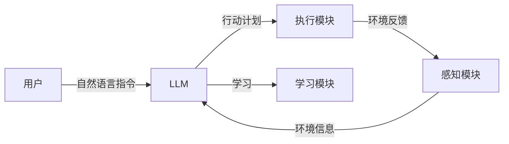

## 1. 背景介绍

### 1.1 人工智能的演进与局限性

人工智能（AI）近年来取得了显著的进展，尤其是在机器学习和深度学习领域。从图像识别、自然语言处理到机器翻译，AI 已经在各个领域展现出强大的能力。然而，目前的 AI 系统仍然存在一些局限性，例如：

* **缺乏常识推理能力:**  AI 系统难以理解现实世界的常识性知识，例如物理规律、社会规范等。
* **泛化能力不足:** AI 系统在训练数据之外的环境中表现 often 不佳，难以应对新的、未曾见过的情况。
* **缺乏自主学习能力:**  AI 系统需要大量标注数据进行训练，难以像人类一样自主地学习和探索新知识。

### 1.2 AI Agent 的崛起：迈向通用人工智能

为了克服这些局限性，AI Agent 的概念应运而生。AI Agent 指的是能够感知环境、自主决策并执行动作的智能体。与传统的 AI 系统相比，AI Agent 具备以下优势：

* **主动感知和交互:** AI Agent 能够主动感知环境变化，并与环境进行交互，不断获取新的信息。
* **自主决策和行动:** AI Agent 能够根据自身目标和环境信息，自主地做出决策并执行相应的行动。
* **持续学习和进化:** AI Agent 能够从经验中学习，不断优化自身的行为策略，提高应对复杂环境的能力。

### 1.3 LLM 的赋能：AI Agent 的强大引擎

近年来，大型语言模型 (LLM) 的快速发展为 AI Agent 的实现提供了强大的引擎。LLM 具备强大的自然语言理解和生成能力，能够帮助 AI Agent：

* **理解和处理自然语言指令:**  AI Agent 可以利用 LLM 理解用户的自然语言指令，并将其转化为可执行的行动计划。
* **进行推理和规划:** LLM 可以帮助 AI Agent 进行复杂的推理和规划，例如制定行动计划、预测未来事件等。
* **生成自然语言解释和反馈:** AI Agent 可以利用 LLM 生成自然语言解释，向用户解释其行为背后的逻辑，并提供反馈信息。

## 2. 核心概念与联系

### 2.1 AI Agent 的基本要素

一个典型的 AI Agent 通常包含以下基本要素：

* **感知模块:** 负责感知环境信息，例如图像、声音、文本等。
* **决策模块:** 负责根据感知到的信息和自身目标，做出决策并制定行动计划。
* **执行模块:** 负责执行决策模块制定的行动计划，例如控制机器人的运动、发送网络请求等。
* **学习模块:** 负责从经验中学习，不断优化 AI Agent 的行为策略。

### 2.2 LLM 与 AI Agent 的关系

LLM 可以作为 AI Agent 的核心组件，赋予 AI Agent 强大的自然语言理解和生成能力。具体来说，LLM 可以：

* **作为感知模块的一部分:** LLM 可以帮助 AI Agent 理解和处理自然语言信息，例如用户指令、网页内容等。
* **作为决策模块的一部分:** LLM 可以帮助 AI Agent 进行推理和规划，例如制定行动计划、预测未来事件等。
* **作为执行模块的一部分:** LLM 可以帮助 AI Agent 生成自然语言指令，控制其他系统或设备。
* **作为学习模块的一部分:** LLM 可以帮助 AI Agent 从自然语言文本中学习，例如学习新的知识、理解新的概念等。

## 3. 核心算法原理具体操作步骤

### 3.1 基于 LLM 的 AI Agent 架构

一个典型的基于 LLM 的 AI Agent 架构如下所示：



### 3.2 具体操作步骤

1. **用户输入自然语言指令:** 用户向 AI Agent 输入自然语言指令，例如“请帮我预订明天上午 10 点的航班”。
2. **LLM 理解指令并制定行动计划:** LLM 理解用户指令，并根据自身知识和经验，制定相应的行动计划，例如查询航班信息、选择合适的航班、填写预订信息等。
3. **执行模块执行行动计划:** 执行模块根据 LLM 制定的行动计划，执行相应的操作，例如访问航空公司网站、填写预订表单等。
4. **感知模块感知环境反馈:** 感知模块感知环境反馈，例如航班预订是否成功、预订信息是否正确等。
5. **LLM 学习和优化:** LLM 根据环境反馈，学习和优化自身的行为策略，例如改进航班查询算法、优化预订流程等。

## 4. 数学模型和公式详细讲解举例说明

### 4.1 强化学习

强化学习是 AI Agent 学习和优化行为策略的核心算法之一。在强化学习中，AI Agent 通过与环境交互，不断试错并学习最优的行为策略。

#### 4.1.1 马尔可夫决策过程 (MDP)

马尔可夫决策过程 (MDP) 是强化学习的数学基础。一个 MDP 由以下要素组成：

* **状态空间:** 所有可能的环境状态的集合。
* **行动空间:** AI Agent 可以采取的所有行动的集合。
* **状态转移概率:**  $P(s'|s, a)$，表示在状态 $s$ 下采取行动 $a$ 后转移到状态 $s'$ 的概率。
* **奖励函数:** $R(s, a, s')$，表示在状态 $s$ 下采取行动 $a$ 后转移到状态 $s'$ 所获得的奖励。

#### 4.1.2 Q-learning 算法

Q-learning 是一种常用的强化学习算法。Q-learning 算法的目标是学习一个 Q 函数，该函数表示在状态 $s$ 下采取行动 $a$ 的长期累积奖励。Q 函数的更新公式如下：

$$Q(s, a) \leftarrow Q(s, a) + \alpha [R(s, a, s') + \gamma \max_{a'} Q(s', a') - Q(s, a)]$$

其中：

* $\alpha$ 是学习率，控制 Q 函数更新的速度。
* $\gamma$ 是折扣因子，控制未来奖励对当前决策的影响。

### 4.2  举例说明

假设一个 AI Agent 的任务是控制一个机器人在迷宫中找到出口。迷宫的状态空间由迷宫中的所有格子组成，行动空间由机器人的四个方向的移动组成（上、下、左、右）。奖励函数定义为：

* 到达出口：+10
* 撞墙：-1
* 其他情况：0

AI Agent 可以使用 Q-learning 算法学习最优的行为策略，找到迷宫的出口。

## 5. 项目实践：代码实例和详细解释说明

### 5.1 Python 代码实例

```python
import gym
import numpy as np

# 创建迷宫环境
env = gym.make('Maze-v0')

# 初始化 Q 函数
Q = np.zeros([env.observation_space.n, env.action_space.n])

# 设置学习参数
alpha = 0.1
gamma = 0.9
epsilon = 0.1

# 训练 AI Agent
for episode in range(1000):
    # 初始化环境
    state = env.reset()

    # 循环直到游戏结束
    done = False
    while not done:
        # 选择行动
        if np.random.uniform(0, 1) < epsilon:
            action = env.action_space.sample()
        else:
            action = np.argmax(Q[state, :])

        # 执行行动并获取环境反馈
        next_state, reward, done, info = env.step(action)

        # 更新 Q 函数
        Q[state, action] = Q[state, action] + alpha * (reward + gamma * np.max(Q[next_state, :]) - Q[state, action])

        # 更新状态
        state = next_state

# 测试 AI Agent
state = env.reset()
done = False
while not done:
    # 选择行动
    action = np.argmax(Q[state, :])

    # 执行行动并获取环境反馈
    next_state, reward, done, info = env.step(action)

    # 更新状态
    state = next_state

    # 渲染环境
    env.render()

# 关闭环境
env.close()
```

### 5.2 代码解释

* `gym` 是一个用于开发和比较强化学习算法的工具包。
* `Maze-v0` 是 `gym` 中的一个迷宫环境。
* `Q` 是 Q 函数，用于存储每个状态-行动对的长期累积奖励。
* `alpha` 是学习率，控制 Q 函数更新的速度。
* `gamma` 是折扣因子，控制未来奖励对当前决策的影响。
* `epsilon` 是探索率，控制 AI Agent 随机选择行动的概率。
* `env.reset()` 用于初始化环境。
* `env.step(action)` 用于执行行动并获取环境反馈。
* `env.render()` 用于渲染环境。
* `env.close()` 用于关闭环境。

## 6. 实际应用场景

### 6.1  智能助理

AI Agent 可以作为智能助理，帮助用户完成各种任务，例如：

* **日程管理:**  AI Agent 可以帮助用户安排日程、提醒重要事项、预订会议室等。
* **旅行规划:** AI Agent 可以帮助用户规划旅行路线、预订机票和酒店、推荐景点等。
* **客户服务:** AI Agent 可以作为客服机器人，回答用户问题、解决用户投诉、提供技术支持等。

### 6.2 自动驾驶

AI Agent 可以作为自动驾驶系统的核心组件，负责感知环境、做出驾驶决策并控制车辆行驶。

### 6.3 游戏 AI

AI Agent 可以作为游戏中的 NPC，与玩家进行交互，并根据游戏规则做出智能的决策。

## 7. 工具和资源推荐

### 7.1  LangChain

LangChain 是一个用于构建 LLM 应用的框架，可以帮助开发者轻松地将 LLM 集成到 AI Agent 中。

### 7.2  Transformers

Transformers 是一个用于自然语言处理的 Python 库，提供了各种预训练的 LLM 模型，例如 GPT-3、BERT 等。

### 7.3  Gym

Gym 是一个用于开发和比较强化学习算法的工具包，提供了各种模拟环境，例如迷宫、 Atari 游戏等。

## 8. 总结：未来发展趋势与挑战

### 8.1 未来发展趋势

* **更加智能的 AI Agent:** 随着 LLM 和强化学习技术的不断发展，AI Agent 将变得更加智能，能够处理更加复杂的任务。
* **更广泛的应用场景:** AI Agent 将被应用于更广泛的领域，例如医疗、教育、金融等。
* **人机协同:** AI Agent 将与人类更加紧密地协同工作，共同完成任务。

### 8.2  挑战

* **安全性和可靠性:** AI Agent 的安全性 and 可靠性至关重要，需要确保 AI Agent 的行为符合伦理道德和法律法规。
* **可解释性:**  AI Agent 的决策过程需要具有可解释性，以便用户理解 AI Agent 的行为逻辑。
* **数据隐私:** AI Agent 需要保护用户的数据隐私，防止数据泄露和滥用。

## 9. 附录：常见问题与解答

### 9.1  什么是 AI Agent？

AI Agent 指的是能够感知环境、自主决策并执行动作的智能体。

### 9.2  LLM 如何赋能 AI Agent？

LLM 可以赋予 AI Agent 强大的自然语言理解和生成能力，帮助 AI Agent 理解用户指令、进行推理和规划、生成自然语言解释和反馈等。

### 9.3  AI Agent 的应用场景有哪些？

AI Agent 的应用场景非常广泛，例如智能助理、自动驾驶、游戏 AI 等。

### 9.4  AI Agent 的未来发展趋势是什么？

AI Agent 将变得更加智能，应用于更广泛的领域，并与人类更加紧密地协同工作。
