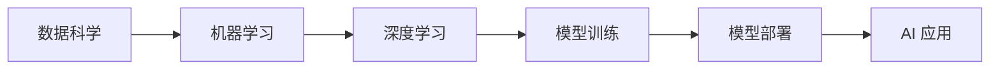

## 1. 背景介绍

### 1.1 人工智能的兴起与挑战

人工智能 (AI) 正迅速改变着我们的世界，从自动驾驶汽车到医疗诊断，AI 的应用日益广泛。然而，构建和部署高效、可靠的 AI 系统并非易事。AI 工程作为一个新兴领域，旨在解决将 AI 研究成果转化为实际应用过程中的挑战。

### 1.2 AI 工程的定义与目标

AI 工程是指应用工程原则和实践来开发、部署和维护 AI 系统的学科。其目标是：

* **提高 AI 系统的可靠性、可扩展性和可维护性**
* **降低 AI 系统的开发成本和时间**
* **促进 AI 技术的普及和应用**

### 1.3 AI 工程的核心原则

AI 工程的核心原则是：

* **数据为中心:**  AI 系统的性能高度依赖于数据的质量和数量。
* **迭代开发:**  AI 系统的开发是一个迭代的过程，需要不断地评估和改进。
* **协作与沟通:**  AI 工程需要跨学科的团队合作，包括数据科学家、软件工程师和领域专家。


## 2. 核心概念与联系

### 2.1 数据科学与 AI 工程

数据科学侧重于从数据中提取知识和洞察，而 AI 工程则侧重于将这些知识应用于实际系统。两者相辅相成，共同推动 AI 技术的发展。

### 2.2 机器学习与深度学习

机器学习是 AI 的一个子领域，它使用算法从数据中学习模式并做出预测。深度学习是机器学习的一种高级形式，它使用多层神经网络来学习复杂的模式。

### 2.3 模型训练与部署

模型训练是 AI 工程中的关键步骤，它包括选择合适的算法、优化模型参数和评估模型性能。模型部署是指将训练好的模型集成到实际系统中，使其能够处理实时数据并生成预测结果。

### 2.4  Mermaid 流程图：AI 工程核心概念关系




## 3. 核心算法原理具体操作步骤

### 3.1 数据预处理

* **数据清洗:**  识别和处理缺失值、异常值和重复值。
* **特征工程:**  从原始数据中提取有意义的特征，用于模型训练。
* **数据归一化:**  将数据缩放到相同的范围，提高模型的稳定性。

### 3.2 模型选择

* **线性回归:**  用于预测连续值目标变量。
* **逻辑回归:**  用于预测二元分类目标变量。
* **决策树:**  用于预测分类目标变量，可解释性强。
* **支持向量机:**  用于分类和回归任务，对高维数据有效。
* **神经网络:**  用于学习复杂的非线性关系，适用于图像、语音和文本数据。

### 3.3 模型训练

* **梯度下降:**  一种常用的优化算法，用于最小化模型的损失函数。
* **正则化:**  防止模型过拟合，提高泛化能力。
* **交叉验证:**  将数据集分成多个子集，用于评估模型的性能。

### 3.4 模型评估

* **准确率:**  预测正确的样本比例。
* **精确率:**  预测为正例的样本中真正例的比例。
* **召回率:**  所有正例样本中被正确预测的比例。
* **F1 分数:**  精确率和召回率的调和平均值。


## 4. 数学模型和公式详细讲解举例说明

### 4.1 线性回归

线性回归模型假设目标变量与自变量之间存在线性关系。其数学模型为：

$$ y = w_0 + w_1x_1 + w_2x_2 + ... + w_nx_n $$

其中，$y$ 是目标变量，$x_i$ 是自变量，$w_i$ 是模型参数。

**举例说明:**

假设我们想预测房价，自变量包括房屋面积、卧室数量和地理位置。线性回归模型可以用来学习这些变量与房价之间的关系。

### 4.2 逻辑回归

逻辑回归模型用于预测二元分类目标变量。其数学模型为：

$$ p = \frac{1}{1 + e^{-(w_0 + w_1x_1 + w_2x_2 + ... + w_nx_n)}} $$

其中，$p$ 是正例的概率，$x_i$ 是自变量，$w_i$ 是模型参数。

**举例说明:**

假设我们想预测用户是否会点击广告，自变量包括用户的年龄、性别和浏览历史。逻辑回归模型可以用来学习这些变量与点击概率之间的关系。

### 4.3 决策树

决策树是一种树形结构，它根据一系列规则将数据划分成不同的类别。其数学模型可以通过一系列 if-else 语句来表示。

**举例说明:**

假设我们想预测顾客是否会购买产品，自变量包括顾客的年龄、收入和职业。决策树模型可以用来学习这些变量与购买概率之间的关系。


## 5. 项目实践：代码实例和详细解释说明

### 5.1 数据集

我们使用著名的 Iris 数据集来演示 AI 工程的最佳实践。该数据集包含 150 个样本，每个样本有 4 个特征：花萼长度、花萼宽度、花瓣长度和花瓣宽度。目标变量是花的种类，有三种：山鸢尾、变色鸢尾和维吉尼亚鸢尾。

### 5.2 代码实例

```python
import pandas as pd
from sklearn.model_selection import train_test_split
from sklearn.linear_model import LogisticRegression
from sklearn.metrics import accuracy_score

# 加载数据集
df = pd.read_csv('iris.csv')

# 划分训练集和测试集
X = df.drop('species', axis=1)
y = df['species']
X_train, X_test, y_train, y_test = train_test_split(X, y, test_size=0.2)

# 训练逻辑回归模型
model = LogisticRegression()
model.fit(X_train, y_train)

# 预测测试集
y_pred = model.predict(X_test)

# 评估模型性能
accuracy = accuracy_score(y_test, y_pred)
print('Accuracy:', accuracy)
```

### 5.3 代码解释

* 首先，我们使用 pandas 库加载 Iris 数据集。
* 然后，我们将数据集划分成训练集和测试集。
* 接下来，我们使用 scikit-learn 库训练逻辑回归模型。
* 最后，我们使用训练好的模型预测测试集，并评估模型的准确率。


## 6. 实际应用场景

### 6.1 图像识别

AI 工程可以用于构建图像识别系统，例如人脸识别、物体检测和医学影像分析。

### 6.2 自然语言处理

AI 工程可以用于构建自然语言处理系统，例如机器翻译、情感分析和文本摘要。

### 6.3 推荐系统

AI 工程可以用于构建推荐系统，例如商品推荐、音乐推荐和电影推荐。

### 6.4 自动驾驶

AI 工程可以用于构建自动驾驶系统，例如感知、决策和控制。


## 7. 工具和资源推荐

### 7.1 TensorFlow

TensorFlow 是一个开源的机器学习平台，提供了丰富的工具和库，用于构建和部署 AI 系统。

### 7.2 PyTorch

PyTorch 是另一个开源的机器学习平台，它以其灵活性和易用性而闻名。

### 7.3 Scikit-learn

Scikit-learn 是一个 Python 库，提供了各种机器学习算法和工具，用于数据预处理、模型训练和模型评估。

### 7.4 Keras

Keras 是一个高级神经网络 API，它运行在 TensorFlow 或 Theano 之上，简化了深度学习模型的构建过程。


## 8. 总结：未来发展趋势与挑战

### 8.1 AI 工程的未来发展趋势

* **自动化机器学习 (AutoML):**  自动化机器学习旨在自动化 AI 工程中的关键步骤，例如模型选择、参数优化和模型评估。
* **可解释人工智能 (XAI):**  可解释人工智能旨在使 AI 系统的决策过程更加透明和易于理解。
* **边缘人工智能 (Edge AI):**  边缘人工智能是指在边缘设备上部署 AI 模型，例如智能手机、传感器和物联网设备。

### 8.2 AI 工程面临的挑战

* **数据隐私和安全:**  AI 系统需要处理大量的敏感数据，因此数据隐私和安全至关重要。
* **模型偏差:**  AI 模型可能会受到训练数据中偏差的影响，导致不公平或歧视性的结果。
* **模型可解释性:**  AI 模型的决策过程通常难以理解，这使得评估模型的可靠性和安全性变得困难。


## 9. 附录：常见问题与解答

### 9.1 什么是 AI 工程？

AI 工程是指应用工程原则和实践来开发、部署和维护 AI 系统的学科。

### 9.2 AI 工程的核心原则是什么？

AI 工程的核心原则是数据为中心、迭代开发和协作与沟通。

### 9.3 AI 工程有哪些实际应用场景？

AI 工程的实际应用场景包括图像识别、自然语言处理、推荐系统和自动驾驶。

### 9.4 AI 工程面临哪些挑战？

AI 工程面临的挑战包括数据隐私和安全、模型偏差和模型可解释性。
