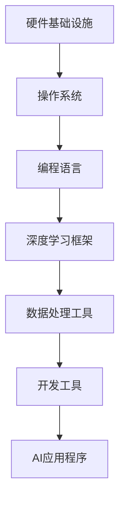

## 1. 背景介绍

### 1.1 人工智能的崛起与开发环境的重要性

近年来，人工智能（AI）技术取得了惊人的进展，从图像识别、自然语言处理到自动驾驶，AI 正在深刻地改变着我们的生活。随着 AI 应用的不断普及，构建一个高效、稳定、易用的 AI 开发环境变得越来越重要。

### 1.2 AI 开发环境的构成要素

一个完整的 AI 开发环境通常包括以下几个核心要素：

* **硬件基础设施:**  包括高性能计算服务器、GPU 加速器、大容量存储设备等。
* **软件平台:** 包括操作系统、编程语言、深度学习框架、数据处理工具等。
* **数据资源:**  包括训练数据集、测试数据集、模型参数等。
* **开发工具:** 包括代码编辑器、调试器、版本控制工具等。

### 1.3 本文目的和结构

本文旨在深入探讨 AI 开发环境搭建的原理和最佳实践，并通过代码实战案例讲解，帮助读者快速掌握 AI 开发环境的搭建方法。

## 2. 核心概念与联系

### 2.1 操作系统

操作系统是 AI 开发环境的基础，它负责管理计算机硬件资源，并为应用程序提供运行环境。常见的 AI 开发操作系统包括：

* **Linux:**  开源、稳定、安全，广泛应用于服务器和云计算领域。
* **Windows:**  用户友好、易于上手，适合个人开发者和小型团队。
* **macOS:**  苹果公司开发的操作系统，拥有良好的图形界面和开发工具。

### 2.2 编程语言

编程语言是 AI 开发的核心工具，用于编写 AI 算法和应用程序。常用的 AI 开发编程语言包括：

* **Python:**  语法简洁、易于学习，拥有丰富的 AI 库和框架。
* **R:**  统计分析和数据可视化领域的利器，也常用于 AI 模型开发。
* **C++:**  性能强大、执行效率高，适合开发高性能 AI 应用程序。

### 2.3 深度学习框架

深度学习框架是 AI 开发的利器，它提供了一系列预定义的函数和工具，简化了 AI 模型的构建、训练和部署过程。常用的深度学习框架包括：

* **TensorFlow:**  由 Google 开发，支持多种编程语言和硬件平台。
* **PyTorch:**  由 Facebook 开发，以其灵活性和易用性著称。
* **Keras:**  基于 TensorFlow 或 Theano 构建，提供简洁的 API 接口。

### 2.4 数据处理工具

数据处理工具用于清洗、转换、分析和可视化数据，为 AI 模型的训练和评估提供高质量的数据输入。常用的数据处理工具包括：

* **Pandas:**  Python 数据分析库，提供高效的数据结构和操作函数。
* **NumPy:**  Python 科学计算库，提供多维数组对象和数学函数。
* **Scikit-learn:**  Python 机器学习库，提供各种机器学习算法和数据预处理工具。

### 2.5 开发工具

开发工具用于编写、调试、测试和部署 AI 应用程序。常用的开发工具包括：

* **代码编辑器:**  例如 VS Code、Sublime Text、Atom 等。
* **调试器:**  例如 Python Debugger (pdb)、GDB 等。
* **版本控制工具:**  例如 Git、SVN 等。

## 3. 核心算法原理具体操作步骤

### 3.1 深度学习算法

深度学习是 AI 领域最热门的技术之一，其核心原理是利用多层神经网络模拟人脑的学习过程。常见的深度学习算法包括：

* **卷积神经网络 (CNN):**  擅长处理图像和视频数据，应用于图像分类、目标检测、人脸识别等领域。
* **循环神经网络 (RNN):**  擅长处理序列数据，应用于自然语言处理、语音识别、机器翻译等领域。
* **生成对抗网络 (GAN):**  用于生成逼真的图像、视频、音频等数据，应用于图像生成、视频合成、文本创作等领域。

### 3.2 深度学习模型训练步骤

深度学习模型的训练通常包括以下步骤：

* **数据准备:**  收集、清洗、标注数据，并将数据划分为训练集、验证集和测试集。
* **模型构建:**  选择合适的深度学习框架和算法，构建模型结构。
* **模型训练:**  使用训练数据训练模型，调整模型参数，使其能够准确地预测目标变量。
* **模型评估:**  使用验证集评估模型性能，并根据评估结果调整模型结构或参数。
* **模型部署:**  将训练好的模型部署到实际应用环境，例如 Web 服务器、移动设备等。

## 4. 数学模型和公式详细讲解举例说明

### 4.1 线性回归

线性回归是一种用于预测连续目标变量的机器学习算法。其数学模型如下：

$$y = w_0 + w_1 x_1 + w_2 x_2 + ... + w_n x_n$$

其中， $y$ 是目标变量， $x_1, x_2, ..., x_n$ 是特征变量， $w_0, w_1, w_2, ..., w_n$ 是模型参数。

**举例说明：**

假设我们要预测房屋价格，特征变量包括房屋面积、卧室数量、浴室数量等。我们可以使用线性回归模型来预测房屋价格，模型参数可以通过最小二乘法估计。

### 4.2 逻辑回归

逻辑回归是一种用于预测二分类目标变量的机器学习算法。其数学模型如下：

$$p = \frac{1}{1 + e^{-(w_0 + w_1 x_1 + w_2 x_2 + ... + w_n x_n)}}$$

其中， $p$ 是目标变量为正类的概率， $x_1, x_2, ..., x_n$ 是特征变量， $w_0, w_1, w_2, ..., w_n$ 是模型参数。

**举例说明：**

假设我们要预测用户是否会点击广告，特征变量包括用户年龄、性别、兴趣爱好等。我们可以使用逻辑回归模型来预测用户点击广告的概率，模型参数可以通过最大似然估计法估计。

## 5. 项目实践：代码实例和详细解释说明

### 5.1 图像分类

**代码实例：**

```python
import tensorflow as tf

# 加载 MNIST 数据集
(x_train, y_train), (x_test, y_test) = tf.keras.datasets.mnist.load_data()

# 构建 CNN 模型
model = tf.keras.models.Sequential([
  tf.keras.layers.Conv2D(32, (3, 3), activation='relu', input_shape=(28, 28, 1)),
  tf.keras.layers.MaxPooling2D((2, 2)),
  tf.keras.layers.Conv2D(64, (3, 3), activation='relu'),
  tf.keras.layers.MaxPooling2D((2, 2)),
  tf.keras.layers.Flatten(),
  tf.keras.layers.Dense(10, activation='softmax')
])

# 编译模型
model.compile(optimizer='adam',
              loss='sparse_categorical_crossentropy',
              metrics=['accuracy'])

# 训练模型
model.fit(x_train, y_train, epochs=5)

# 评估模型
test_loss, test_acc = model.evaluate(x_test, y_test, verbose=2)
print('\nTest accuracy:', test_acc)
```

**详细解释说明：**

* 代码首先加载 MNIST 数据集，该数据集包含 60,000 张训练图像和 10,000 张测试图像，每张图像都是 28x28 像素的手写数字灰度图像。
* 然后，代码构建了一个 CNN 模型，该模型包含两个卷积层、两个最大池化层、一个扁平化层和一个密集层。
* 编译模型时，我们使用 Adam 优化器、稀疏分类交叉熵损失函数和准确率指标。
* 训练模型时，我们将训练数据输入模型，并训练 5 个 epochs。
* 最后，我们使用测试数据评估模型，并打印测试准确率。

### 5.2 自然语言处理

**代码实例：**

```python
import tensorflow as tf

# 加载 IMDB 数据集
(train_data, train_labels), (test_data, test_labels) = tf.keras.datasets.imdb.load_data(num_words=10000)

# 构建 RNN 模型
model = tf.keras.models.Sequential([
  tf.keras.layers.Embedding(10000, 16),
  tf.keras.layers.LSTM(128),
  tf.keras.layers.Dense(1, activation='sigmoid')
])

# 编译模型
model.compile(optimizer='adam',
              loss='binary_crossentropy',
              metrics=['accuracy'])

# 训练模型
model.fit(train_data, train_labels, epochs=10)

# 评估模型
test_loss, test_acc = model.evaluate(test_data, test_labels, verbose=2)
print('\nTest accuracy:', test_acc)
```

**详细解释说明：**

* 代码首先加载 IMDB 数据集，该数据集包含 25,000 条电影评论，每条评论都被标记为正面或负面。
* 然后，代码构建了一个 RNN 模型，该模型包含一个嵌入层、一个 LSTM 层和一个密集层。
* 编译模型时，我们使用 Adam 优化器、二元交叉熵损失函数和准确率指标。
* 训练模型时，我们将训练数据输入模型，并训练 10 个 epochs。
* 最后，我们使用测试数据评估模型，并打印测试准确率。

## 6. 实际应用场景

### 6.1 图像识别

* **人脸识别:**  用于身份验证、安防监控、人机交互等领域。
* **目标检测:**  用于自动驾驶、机器人视觉、医学影像分析等领域。
* **图像分类:**  用于电商商品识别、图片搜索、垃圾邮件过滤等领域。

### 6.2 自然语言处理

* **机器翻译:**  用于跨语言沟通、文献翻译、网站本地化等领域。
* **语音识别:**  用于语音助手、智能家居、语音输入等领域。
* **情感分析:**  用于舆情监测、产品评论分析、客户服务等领域。

## 7. 工具和资源推荐

### 7.1 深度学习框架

* **TensorFlow:**  https://www.tensorflow.org/
* **PyTorch:**  https://pytorch.org/
* **Keras:**  https://keras.io/

### 7.2 数据处理工具

* **Pandas:**  https://pandas.pydata.org/
* **NumPy:**  https://numpy.org/
* **Scikit-learn:**  https://scikit-learn.org/

### 7.3 开发工具

* **VS Code:**  https://code.visualstudio.com/
* **Sublime Text:**  https://www.sublimetext.com/
* **Atom:**  https://atom.io/

### 7.4 在线学习资源

* **Coursera:**  https://www.coursera.org/
* **edX:**  https://www.edx.org/
* **Udacity:**  https://www.udacity.com/

## 8. 总结：未来发展趋势与挑战

### 8.1 未来发展趋势

* **自动化机器学习 (AutoML):**  自动化机器学习旨在简化 AI 模型的构建、训练和部署过程，降低 AI 开发门槛。
* **边缘计算:**  将 AI 模型部署到边缘设备，例如智能手机、传感器等，可以提高 AI 应用的响应速度和效率。
* **量子计算:**  量子计算可以加速 AI 算法的执行速度，为 AI 发展带来新的突破。

### 8.2 挑战

* **数据隐私和安全:**  AI 模型的训练和部署需要大量数据，如何保护数据隐私和安全是一个重要挑战。
* **模型可解释性:**  AI 模型的决策过程往往难以理解，如何提高模型的可解释性是一个重要挑战。
* **人才缺口:**  AI 领域人才需求旺盛，如何培养更多 AI 人才是一个重要挑战。

## 9. 附录：常见问题与解答

### 9.1 如何选择合适的深度学习框架？

选择深度学习框架需要考虑以下因素：

* **易用性:**  框架的 API 是否简洁易懂，文档是否完善。
* **灵活性:**  框架是否支持多种编程语言和硬件平台。
* **性能:**  框架的执行效率如何，是否支持 GPU 加速。
* **社区支持:**  框架的社区是否活跃，是否有丰富的学习资源。

### 9.2 如何提高 AI 模型的准确率？

提高 AI 模型的准确率可以尝试以下方法：

* **收集更多数据:**  更多的数据可以提高模型的泛化能力。
* **数据增强:**  通过对现有数据进行旋转、缩放、裁剪等操作，可以生成更多训练数据。
* **特征工程:**  设计更有效的特征可以提高模型的预测能力。
* **模型调参:**  调整模型的超参数可以优化模型性能。

### 9.3 如何将 AI 模型部署到实际应用环境？

将 AI 模型部署到实际应用环境可以采用以下方式：

* **云端部署:**  将模型部署到云计算平台，例如 AWS、Azure、GCP 等。
* **边缘部署:**  将模型部署到边缘设备，例如智能手机、传感器等。
* **本地部署:**  将模型部署到本地服务器或个人电脑。

## 10. 核心概念原理架构 Mermaid流程图


