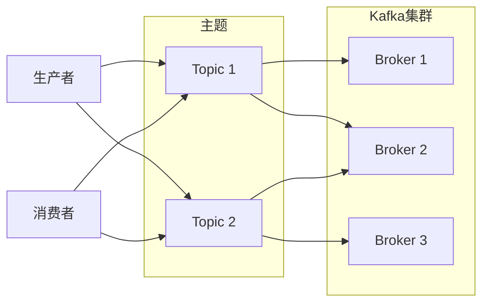

## 1. 背景介绍

### 1.1 AI系统的数据管道

现代AI系统通常依赖于庞大的数据集进行训练和推理。这些数据集往往分布在不同的数据源中，需要高效、可靠地进行采集、处理和传输。数据管道作为AI系统的数据流转通道，扮演着至关重要的角色。

### 1.2 Kafka：高吞吐量分布式流处理平台

Kafka是一个开源的分布式流处理平台，以其高吞吐量、低延迟和可扩展性而闻名。它能够处理海量数据流，并提供发布-订阅消息传递模式，非常适合构建实时数据管道。

### 1.3 Kafka在AI系统中的应用

Kafka在AI系统中有着广泛的应用，例如：

* **数据采集:** 从各种数据源（如传感器、数据库、日志文件等）采集数据，并将其发布到Kafka主题。
* **数据预处理:** 对原始数据进行清洗、转换、特征提取等操作，为模型训练和推理做好准备。
* **模型训练:** 将预处理后的数据传递给模型训练框架，例如TensorFlow、PyTorch等。
* **模型推理:** 将实时数据输入模型进行推理，并将结果输出到Kafka主题，供其他系统消费。
* **监控与日志记录:** 收集系统运行指标和日志信息，并将其发布到Kafka主题，以便进行监控和故障排除。


## 2. 核心概念与联系

### 2.1 主题（Topic）

主题是Kafka中的逻辑概念，用于对消息进行分类。每个主题可以包含多个分区，每个分区存储一部分消息数据。

### 2.2 生产者（Producer）

生产者负责将消息发布到Kafka主题。生产者可以指定消息的键和值，以及要发布到的主题和分区。

### 2.3 消费者（Consumer）

消费者订阅Kafka主题，并从主题中读取消息。消费者可以按顺序或并行地消费消息。

### 2.4 分区（Partition）

分区是Kafka主题的物理存储单元，每个分区存储一部分消息数据。分区可以分布在不同的服务器上，以实现数据冗余和高可用性。

### 2.5 代理（Broker）

代理是Kafka集群中的服务器节点，负责存储消息数据、处理生产者和消费者的请求。

### 2.6 联系

生产者将消息发布到主题，代理将消息存储在分区中，消费者订阅主题并从分区中读取消息。




## 3. 核心算法原理具体操作步骤

### 3.1 生产者发送消息

1. 生产者将消息序列化为字节数组。
2. 生产者根据消息的键计算分区号。
3. 生产者将消息发送到目标代理。
4. 代理将消息写入分区日志文件。

### 3.2 消费者消费消息

1. 消费者订阅目标主题。
2. 消费者从代理获取消息的偏移量。
3. 消费者从分区日志文件中读取消息。
4. 消费者将消息反序列化为对象。
5. 消费者更新消息的偏移量。


## 4. 数学模型和公式详细讲解举例说明

### 4.1 消息吞吐量

消息吞吐量是指单位时间内Kafka集群能够处理的消息数量。它可以用以下公式计算：

$$
吞吐量 = \frac{消息数量}{时间}
$$

例如，如果Kafka集群每秒可以处理1000条消息，那么它的吞吐量就是1000条消息/秒。

### 4.2 消息延迟

消息延迟是指消息从生产者发送到消费者接收所花费的时间。它可以用以下公式计算：

$$
延迟 = 接收时间 - 发送时间
$$

例如，如果一条消息在10:00:00发送，并在10:00:01接收，那么它的延迟就是1秒。


## 5. 项目实践：代码实例和详细解释说明

### 5.1 Python Kafka Producer

```python
from kafka import KafkaProducer

# 创建 Kafka 生产者
producer = KafkaProducer(bootstrap_servers='localhost:9092')

# 发送消息
for i in range(10):
    message = f'Message {i}'.encode('utf-8')
    producer.send('my_topic', message)

# 关闭生产者
producer.close()
```

### 5.2 Python Kafka Consumer

```python
from kafka import KafkaConsumer

# 创建 Kafka 消费者
consumer = KafkaConsumer('my_topic', bootstrap_servers='localhost:9092')

# 消费消息
for message in consumer:
    print(f'Received message: {message.value.decode("utf-8")}')
```


## 6. 实际应用场景

### 6.1 实时数据分析

Kafka可以用于构建实时数据分析管道，例如：

* 收集用户行为数据，并实时分析用户行为模式。
* 监控系统指标，并实时检测异常情况。

### 6.2 机器学习模型训练

Kafka可以用于将训练数据传递给机器学习模型，例如：

* 将图像数据传递给图像分类模型进行训练。
* 将文本数据传递给自然语言处理模型进行训练。

### 6.3 微服务通信

Kafka可以作为微服务之间的通信通道，例如：

* 将订单数据从订单服务传递到支付服务。
* 将用户数据从用户服务传递到推荐服务。


## 7. 工具和资源推荐

### 7.1 Kafka 官方文档

Kafka官方文档提供了Kafka的详细介绍、安装指南、配置选项等信息。

### 7.2 Confluent Platform

Confluent Platform是一个商业化的Kafka发行版，提供了额外的功能，例如：

* Schema Registry：用于管理Kafka消息的模式。
* Kafka Connect：用于连接Kafka与其他数据系统。

### 7.3 Kafka Python客户端

Kafka Python客户端提供了Python API，用于与Kafka集群进行交互。


## 8. 总结：未来发展趋势与挑战

### 8.1 未来发展趋势

* **云原生Kafka:** Kafka正在向云原生方向发展，例如Confluent Cloud、Amazon MSK等。
* **Kafka Streams:** Kafka Streams是一个用于构建流处理应用程序的库，它可以与Kafka集成，并提供强大的流处理功能。
* **Kafka与机器学习的集成:** Kafka正在与机器学习平台进行更紧密的集成，例如TensorFlow、PyTorch等。

### 8.2 挑战

* **数据安全:** Kafka需要确保数据的安全性和完整性。
* **可扩展性:** Kafka需要能够处理不断增长的数据量。
* **运维复杂性:** Kafka集群的运维需要一定的专业知识和技能。


## 9. 附录：常见问题与解答

### 9.1 Kafka与其他消息队列的区别？

Kafka与其他消息队列（例如RabbitMQ、ActiveMQ）的主要区别在于：

* **高吞吐量:** Kafka能够处理更高的消息吞吐量。
* **持久化:** Kafka将消息持久化到磁盘，即使代理宕机，消息也不会丢失。
* **分布式:** Kafka是一个分布式系统，可以扩展到多个代理。

### 9.2 Kafka如何保证消息的顺序？

Kafka通过分区来保证消息的顺序。每个分区内的消息都按照顺序存储和消费。

### 9.3 Kafka如何处理消息重复？

Kafka可以通过消息的键来处理消息重复。如果两条消息具有相同的键，那么Kafka只会保留其中一条消息。
