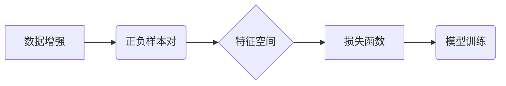

## 1. 背景介绍

### 1.1 深度学习的表征学习

深度学习的成功很大程度上归功于其强大的表征学习能力。通过多层神经网络，深度学习模型可以从原始数据中提取出抽象的、高级的特征表示，这些特征表示能够更好地捕捉数据的本质信息，从而提升模型在下游任务上的性能。传统的监督学习方法需要大量的标注数据来训练模型，而标注数据的获取成本高昂且耗时。为了解决这个问题，近年来无监督学习和自监督学习方法得到了广泛关注。

### 1.2 自监督学习的兴起

自监督学习是一种特殊的无监督学习方法，它利用数据本身的结构信息来生成标签，从而避免了对人工标注数据的依赖。对比学习作为自监督学习的一种重要方法，近年来取得了显著进展，并在图像识别、自然语言处理等领域展现出巨大的潜力。

### 1.3 对比学习的核心思想

对比学习的核心思想是通过构造正负样本对，学习一个能够区分正负样本的特征表示空间。具体来说，对比学习方法会将一个样本经过不同的数据增强方法得到两个增广样本，这两个增广样本被视为正样本对，而其他样本则被视为负样本。通过优化目标函数，使得正样本对在特征空间中彼此靠近，而负样本对彼此远离。

## 2. 核心概念与联系

### 2.1 数据增强

数据增强是指对原始数据进行一系列变换，以生成新的数据样本。数据增强是对比学习中至关重要的一环，它可以增加数据的多样性，提高模型的泛化能力。常用的数据增强方法包括：

- **图像领域**: 随机裁剪、翻转、旋转、缩放、颜色抖动等
- **文本领域**: 同义词替换、随机插入、删除、交换词序等

### 2.2 正负样本对

正样本对是指来自同一个样本经过不同数据增强方法得到的两个增广样本。负样本对是指来自不同样本的增广样本。

### 2.3 特征空间

特征空间是指由模型学习到的特征表示所构成的空间。在对比学习中，目标是学习一个能够区分正负样本的特征空间，使得正样本对在特征空间中彼此靠近，而负样本对彼此远离。

### 2.4 损失函数

损失函数用于衡量模型预测值与真实值之间的差异。在对比学习中，常用的损失函数包括：

- **InfoNCE Loss**: 
 $$
 \mathcal{L} = -\sum_{i=1}^{N} \log \frac{\exp(sim(z_i, z_i^+)/\tau)}{\sum_{j=1}^{N} \exp(sim(z_i, z_j)/\tau)}
 $$

其中 $sim(z_i, z_j)$ 表示样本 $i$ 和样本 $j$ 的特征表示之间的相似度，$\tau$ 是温度参数。

- **NT-X Loss**: 
 $$
 \mathcal{L} = -\sum_{i=1}^{N} \log \frac{\exp(sim(z_i, z_i^+))}{\sum_{j=1}^{N} \exp(sim(z_i, z_j))} - \sum_{i=1}^{N} \log \frac{\exp(sim(z_i^+, z_i))}{\sum_{j=1}^{N} \exp(sim(z_i^+, z_j))}
 $$

### 2.5 核心概念联系图



## 3. 核心算法原理具体操作步骤

### 3.1 SimCLR 算法

SimCLR 是一种简单的对比学习算法，其具体操作步骤如下：

1. 对每个样本进行两次随机数据增强，得到两个增广样本，这两个增广样本构成一个正样本对。
2. 将所有样本的增广样本输入到编码器网络中，得到每个增广样本的特征表示。
3. 使用 InfoNCE Loss 计算损失函数，并通过反向传播算法更新编码器网络的参数。
4. 重复步骤 1-3，直到模型收敛。

### 3.2 MoCo 算法

MoCo 算法是一种基于 momentum contrast 的对比学习算法，其具体操作步骤如下：

1. 使用两个编码器网络：一个查询编码器和一个关键编码器。
2. 对每个样本进行两次随机数据增强，得到两个增广样本。
3. 将其中一个增广样本输入到查询编码器中，得到查询特征。将另一个增广样本输入到关键编码器中，得到关键特征。
4. 使用队列存储历史的关键特征，并将当前的关键特征添加到队列中。
5. 使用 InfoNCE Loss 计算损失函数，并通过反向传播算法更新查询编码器网络的参数。关键编码器网络的参数通过 momentum 更新，即：

$$
\theta_k \leftarrow m \theta_k + (1-m) \theta_q
$$

其中 $\theta_k$ 和 $\theta_q$ 分别表示关键编码器和查询编码器的参数，$m$ 是 momentum 系数。

6. 重复步骤 2-5，直到模型收敛。

## 4. 数学模型和公式详细讲解举例说明

### 4.1 InfoNCE Loss

InfoNCE Loss 的公式如下：

$$
\mathcal{L} = -\sum_{i=1}^{N} \log \frac{\exp(sim(z_i, z_i^+)/\tau)}{\sum_{j=1}^{N} \exp(sim(z_i, z_j)/\tau)}
$$

其中 $sim(z_i, z_j)$ 表示样本 $i$ 和样本 $j$ 的特征表示之间的相似度，$\tau$ 是温度参数。

InfoNCE Loss 的目标是最大化正样本对之间的相似度，同时最小化负样本对之间的相似度。

**举例说明：**

假设我们有一个包含 10 个样本的数据集，每个样本有两个增广样本，则共有 20 个增广样本。我们使用 InfoNCE Loss 计算损失函数，其中 $\tau=0.5$。

对于样本 1，其两个增广样本的特征表示分别为 $z_1$ 和 $z_1^+$。则样本 1 的 InfoNCE Loss 为：

$$
\mathcal{L}_1 = -\log \frac{\exp(sim(z_1, z_1^+)/0.5)}{\sum_{j=1}^{20} \exp(sim(z_1, z_j)/0.5)}
$$

### 4.2 NT-X Loss

NT-X Loss 的公式如下：

$$
\mathcal{L} = -\sum_{i=1}^{N} \log \frac{\exp(sim(z_i, z_i^+))}{\sum_{j=1}^{N} \exp(sim(z_i, z_j))} - \sum_{i=1}^{N} \log \frac{\exp(sim(z_i^+, z_i))}{\sum_{j=1}^{N} \exp(sim(z_i^+, z_j))}
$$

NT-X Loss 与 InfoNCE Loss 类似，但它同时考虑了正样本对和负样本对之间的相似度。

## 5. 项目实践：代码实例和详细解释说明

### 5.1 SimCLR 代码实例

```python
import torch
import torch.nn as nn
import torchvision
import torchvision.transforms as transforms

# 定义编码器网络
class Encoder(nn.Module):
    def __init__(self):
        super(Encoder, self).__init__()
        self.conv = nn.Sequential(
            nn.Conv2d(3, 32, kernel_size=3, padding=1),
            nn.ReLU(inplace=True),
            nn.MaxPool2d(kernel_size=2, stride=2),
            nn.Conv2d(32, 64, kernel_size=3, padding=1),
            nn.ReLU(inplace=True),
            nn.MaxPool2d(kernel_size=2, stride=2),
            nn.Conv2d(64, 128, kernel_size=3, padding=1),
            nn.ReLU(inplace=True),
            nn.MaxPool2d(kernel_size=2, stride=2)
        )
        self.fc = nn.Linear(128 * 4 * 4, 128)

    def forward(self, x):
        x = self.conv(x)
        x = x.view(x.size(0), -1)
        x = self.fc(x)
        return x

# 定义数据增强方法
train_transforms = transforms.Compose([
    transforms.RandomResizedCrop(32),
    transforms.RandomHorizontalFlip(),
    transforms.ToTensor(),
    transforms.Normalize((0.5, 0.5, 0.5), (0.5, 0.5, 0.5))
])

# 加载 CIFAR10 数据集
trainset = torchvision.datasets.CIFAR10(root='./data', train=True, download=True, transform=train_transforms)
trainloader = torch.utils.data.DataLoader(trainset, batch_size=256, shuffle=True, num_workers=2)

# 初始化编码器网络
encoder = Encoder()

# 定义优化器
optimizer = torch.optim.Adam(encoder.parameters(), lr=0.001)

# 定义 InfoNCE Loss
criterion = nn.CrossEntropyLoss()

# 训练模型
for epoch in range(10):
    for i, data in enumerate(trainloader, 0):
        # 获取输入数据
        inputs, _ = data

        # 对每个样本进行两次数据增强
        inputs1 = train_transforms(inputs)
        inputs2 = train_transforms(inputs)

        # 将增广样本输入到编码器网络中
        outputs1 = encoder(inputs1)
        outputs2 = encoder(inputs2)

        # 计算相似度矩阵
        similarity_matrix = torch.matmul(outputs1, outputs2.t())

        # 创建标签
        labels = torch.arange(inputs.size(0)).long()

        # 计算 InfoNCE Loss
        loss = criterion(similarity_matrix / 0.5, labels)

        # 反向传播和参数更新
        optimizer.zero_grad()
        loss.backward()
        optimizer.step()

        # 打印训练信息
        if i % 100 == 0:
            print('[%d, %5d] loss: %.3f' % (epoch + 1, i + 1, loss.item()))
```

### 5.2 MoCo 代码实例

```python
import torch
import torch.nn as nn
import torchvision
import torchvision.transforms as transforms

# 定义编码器网络
class Encoder(nn.Module):
    def __init__(self):
        super(Encoder, self).__init__()
        self.conv = nn.Sequential(
            nn.Conv2d(3, 32, kernel_size=3, padding=1),
            nn.ReLU(inplace=True),
            nn.MaxPool2d(kernel_size=2, stride=2),
            nn.Conv2d(32, 64, kernel_size=3, padding=1),
            nn.ReLU(inplace=True),
            nn.MaxPool2d(kernel_size=2, stride=2),
            nn.Conv2d(64, 128, kernel_size=3, padding=1),
            nn.ReLU(inplace=True),
            nn.MaxPool2d(kernel_size=2, stride=2)
        )
        self.fc = nn.Linear(128 * 4 * 4, 128)

    def forward(self, x):
        x = self.conv(x)
        x = x.view(x.size(0), -1)
        x = self.fc(x)
        return x

# 定义数据增强方法
train_transforms = transforms.Compose([
    transforms.RandomResizedCrop(32),
    transforms.RandomHorizontalFlip(),
    transforms.ToTensor(),
    transforms.Normalize((0.5, 0.5, 0.5), (0.5, 0.5, 0.5))
])

# 加载 CIFAR10 数据集
trainset = torchvision.datasets.CIFAR10(root='./data', train=True, download=True, transform=train_transforms)
trainloader = torch.utils.data.DataLoader(trainset, batch_size=256, shuffle=True, num_workers=2)

# 初始化查询编码器和关键编码器
query_encoder = Encoder()
key_encoder = Encoder()

# 定义队列
queue = torch.randn(128, 65536)

# 定义 momentum 系数
m = 0.999

# 定义优化器
optimizer = torch.optim.Adam(query_encoder.parameters(), lr=0.001)

# 定义 InfoNCE Loss
criterion = nn.CrossEntropyLoss()

# 训练模型
for epoch in range(10):
    for i, data in enumerate(trainloader, 0):
        # 获取输入数据
        inputs, _ = data

        # 对每个样本进行两次数据增强
        inputs1 = train_transforms(inputs)
        inputs2 = train_transforms(inputs)

        # 将增广样本输入到编码器网络中
        query_outputs = query_encoder(inputs1)
        with torch.no_grad():
            key_outputs = key_encoder(inputs2)

        # 将关键特征添加到队列中
        queue = torch.cat((queue[:, 1:], key_outputs.unsqueeze(1)), dim=1)

        # 计算相似度矩阵
        similarity_matrix = torch.matmul(query_outputs, queue.t())

        # 创建标签
        labels = torch.zeros(inputs.size(0)).long()

        # 计算 InfoNCE Loss
        loss = criterion(similarity_matrix / 0.07, labels)

        # 反向传播和参数更新
        optimizer.zero_grad()
        loss.backward()
        optimizer.step()

        # 使用 momentum 更新关键编码器网络的参数
        for param_q, param_k in zip(query_encoder.parameters(), key_encoder.parameters()):
            param_k.data = param_k.data * m + param_q.data * (1. - m)

        # 打印训练信息
        if i % 100 == 0:
            print('[%d, %5d] loss: %.3f' % (epoch + 1, i + 1, loss.item()))
```

## 6. 实际应用场景

### 6.1 图像分类

对比学习可以用于图像分类任务，例如 ImageNet 分类。通过对比学习训练得到的模型，可以在下游图像分类任务上取得优异的性能。

### 6.2 目标检测

对比学习可以用于目标检测任务，例如 COCO 目标检测。通过对比学习训练得到的模型，可以提高目标检测的精度和效率。

### 6.3 语义分割

对比学习可以用于语义分割任务，例如 Cityscapes 语义分割。通过对比学习训练得到的模型，可以提高语义分割的精度。

### 6.4 自然语言处理

对比学习可以用于自然语言处理任务，例如文本分类、情感分析等。通过对比学习训练得到的模型，可以提高自然语言处理任务的性能。

## 7. 工具和资源推荐

### 7.1 PyTorch

PyTorch 是一个开源的机器学习框架，它提供了丰富的工具和资源，可以方便地实现对比学习算法。

### 7.2 TensorFlow

TensorFlow 是另一个开源的机器学习框架，它也提供了丰富的工具和资源，可以方便地实现对比学习算法。

### 7.3 SimCLR 库

SimCLR 库是一个专门用于实现 SimCLR 算法的 Python 库，它提供了方便的接口和高效的实现。

### 7.4 MoCo 库

MoCo 库是一个专门用于实现 MoCo 算法的 Python 库，它提供了方便的接口和高效的实现。

## 8. 总结：未来发展趋势与挑战

### 8.1 未来发展趋势

- **更强大的数据增强方法**: 研究更强大的数据增强方法，以进一步提高对比学习模型的泛化能力。
- **更有效的损失函数**: 研究更有效的损失函数，以更好地捕捉正负样本对之间的差异。
- **与其他自监督学习方法的结合**: 将对比学习与其他自监督学习方法相结合，例如掩码语言模型、自回归模型等，以进一步提高模型的性能。

### 8.2 挑战

- **对数据量的需求**: 对比学习方法通常需要大量的训练数据才能取得良好的性能。
- **计算复杂度**: 对比学习方法的计算复杂度较高，需要大量的计算资源。
- **理论解释**: 对比学习方法的理论解释尚不完善，需要进一步研究其工作原理。

## 9. 附录：常见问题与解答

### 9.1 什么是温度参数？

温度参数 $\tau$ 用于控制相似度矩阵的平滑程度。较小的 $\tau$ 值会使得相似度矩阵更加尖锐，从而更容易区分正负样本对。

### 9.2 什么是 momentum contrast？

Momentum contrast 是 MoCo 算法中使用的一种技术，它通过使用 momentum 更新关键编码器网络的参数，使得关键特征更加稳定，从而提高模型的性能。

### 9.3 如何选择合适的损失函数？

选择合适的损失函数取决于具体的应用场景和数据特点。InfoNCE Loss 和 NT-X Loss 是常用的对比学习损失函数，可以根据实际情况进行选择。

### 9.4 如何评估对比学习模型的性能？

