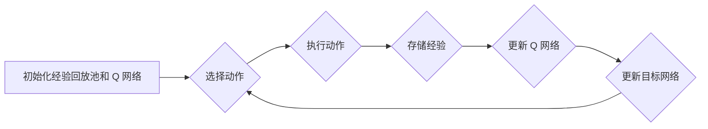

# DQN的调参经验分享：优化模型性能的秘诀

作者：禅与计算机程序设计艺术

## 1. 背景介绍

### 1.1 强化学习的兴起与挑战

近年来，强化学习 (Reinforcement Learning, RL) 作为机器学习的一个重要分支，在游戏 AI、机器人控制、推荐系统等领域取得了显著成果。强化学习的核心思想是让智能体 (agent) 通过与环境的交互，不断学习和改进自身的策略，以最大化累积奖励。然而，强化学习算法的训练过程往往伴随着诸多挑战，其中之一便是超参数的调整。

### 1.2 DQN算法及其重要性

深度 Q 网络 (Deep Q-Network, DQN) 作为强化学习领域的里程碑式算法，成功将深度学习与 Q 学习相结合，极大地提升了强化学习算法的性能。DQN 通过使用深度神经网络来逼近价值函数，并采用经验回放 (experience replay) 和目标网络 (target network) 等技巧来稳定训练过程，在 Atari 游戏等任务上取得了超越人类水平的表现。

### 1.3 DQN调参的重要性

尽管 DQN 算法取得了巨大成功，但其性能的优劣很大程度上取决于超参数的设置。不恰当的超参数选择可能导致模型训练缓慢、收敛困难，甚至无法学习到有效的策略。因此，深入理解 DQN 算法的各个超参数及其对模型性能的影响至关重要。

## 2. 核心概念与联系

### 2.1 DQN算法的核心概念

* **状态 (State):**  描述环境当前状况的信息。
* **动作 (Action):**  智能体在特定状态下可以采取的操作。
* **奖励 (Reward):**  智能体在执行某个动作后从环境中获得的反馈信号。
* **策略 (Policy):**  智能体根据当前状态选择动作的规则。
* **价值函数 (Value Function):**  衡量在特定状态下采取特定动作的长期价值。
* **Q 函数:**  衡量在特定状态下采取特定动作后所能获得的累积奖励的期望值。

### 2.2 DQN算法的流程

1.  **初始化:** 初始化经验回放池和 Q 网络。
2.  **选择动作:** 根据当前状态和 Q 网络选择动作。
3.  **执行动作:** 在环境中执行选择的动作，并观察新的状态和奖励。
4.  **存储经验:** 将状态、动作、奖励和新的状态存储到经验回放池中。
5.  **更新 Q 网络:** 从经验回放池中随机抽取一批经验，并使用梯度下降算法更新 Q 网络的参数。
6.  **更新目标网络:**  定期将 Q 网络的参数复制到目标网络中。

### 2.3 DQN算法的关键技术

* **经验回放:**  将经验存储到回放池中，并从中随机抽取样本进行训练，打破数据之间的相关性，提高训练效率。
* **目标网络:**  使用一个独立的网络来计算目标 Q 值，提高训练稳定性。
* **深度神经网络:**  使用深度神经网络来逼近 Q 函数，提升模型的表达能力。

## 3. 核心算法原理具体操作步骤

### 3.1 算法流程图



### 3.2 算法伪代码

```python
# 初始化经验回放池 D 和 Q 网络 Q
D = []
Q = initialize_Q_network()

# 初始化目标网络 Q'
Q' = copy(Q)

# 循环训练
for episode in range(num_episodes):
    # 初始化状态 s
    s = env.reset()

    # 循环执行动作
    while True:
        # 根据 ε-greedy 策略选择动作 a
        a = epsilon_greedy_policy(s, Q)

        # 执行动作 a，并观察新的状态 s' 和奖励 r
        s', r, done = env.step(a)

        # 将经验 (s, a, r, s', done) 存储到经验回放池 D 中
        D.append((s, a, r, s', done))

        # 从经验回放池 D 中随机抽取一批经验
        batch = random.sample(D, batch_size)

        # 计算目标 Q 值 y
        y = calculate_target_Q_values(batch, Q', gamma)

        # 使用梯度下降算法更新 Q 网络的参数
        update_Q_network(Q, batch, y, learning_rate)

        # 更新目标网络 Q'
        if step % update_frequency == 0:
            Q' = copy(Q)

        # 更新状态
        s = s'

        # 判断是否结束
        if done:
            break
```

### 3.3 算法关键步骤详解

* **ε-greedy 策略:**  以概率 ε 选择随机动作，以概率 1-ε 选择 Q 值最大的动作。
* **计算目标 Q 值:**  使用目标网络 Q' 计算目标 Q 值，公式如下：

$$
y_i = r_i + \gamma \max_{a'} Q'(s_{i+1}, a')
$$

其中，$r_i$ 表示第 i 个经验的奖励，$\gamma$ 表示折扣因子，$s_{i+1}$ 表示第 i 个经验的下一个状态。

* **更新 Q 网络:**  使用梯度下降算法最小化 Q 网络的损失函数，损失函数定义如下：

$$
L = \frac{1}{N} \sum_{i=1}^N (y_i - Q(s_i, a_i))^2
$$

其中，$N$ 表示批次大小，$s_i$ 表示第 i 个经验的状态，$a_i$ 表示第 i 个经验的动作。

## 4. 数学模型和公式详细讲解举例说明

### 4.1 贝尔曼方程

DQN 算法的核心是贝尔曼方程，它描述了价值函数之间的迭代关系。对于一个状态-动作对 (s, a)，其价值函数 Q(s, a) 可以表示为：

$$
Q(s, a) = E[r + \gamma \max_{a'} Q(s', a') | s, a]
$$

其中，E 表示期望，r 表示在状态 s 下采取动作 a 后获得的奖励，s' 表示下一个状态，a' 表示下一个状态下可以采取的动作，γ 表示折扣因子。

### 4.2 Q 学习

Q 学习是一种基于值的强化学习算法，它通过迭代更新 Q 函数来学习最优策略。Q 学习的更新规则如下：

$$
Q(s, a) \leftarrow Q(s, a) + \alpha (r + \gamma \max_{a'} Q(s', a') - Q(s, a))
$$

其中，α 表示学习率，r 表示在状态 s 下采取动作 a 后获得的奖励，s' 表示下一个状态，a' 表示下一个状态下可以采取的动作，γ 表示折扣因子。

### 4.3 深度 Q 网络

DQN 算法使用深度神经网络来逼近 Q 函数，并采用经验回放和目标网络等技巧来稳定训练过程。

## 5. 项目实践：代码实例和详细解释说明

### 5.1 使用 TensorFlow 实现 DQN

```python
import tensorflow as tf
import numpy as np
import random
from collections import deque

# 定义超参数
learning_rate = 0.001
gamma = 0.99
epsilon = 1.0
epsilon_decay = 0.995
epsilon_min = 0.01
batch_size = 32
update_frequency = 100

# 定义环境
env = gym.make('CartPole-v0')

# 定义 Q 网络
class QNetwork:
    def __init__(self, state_size, action_size):
        self.state_size = state_size
        self.action_size = action_size

        # 定义网络结构
        self.inputs = tf.placeholder(tf.float32, [None, state_size])
        self.fc1 = tf.layers.dense(self.inputs, 24, activation=tf.nn.relu)
        self.fc2 = tf.layers.dense(self.fc1, 24, activation=tf.nn.relu)
        self.outputs = tf.layers.dense(self.fc2, action_size)

        # 定义损失函数
        self.target_Q = tf.placeholder(tf.float32, [None, action_size])
        self.loss = tf.reduce_mean(tf.square(self.target_Q - self.outputs))

        # 定义优化器
        self.optimizer = tf.train.AdamOptimizer(learning_rate).minimize(self.loss)

    # 预测 Q 值
    def predict(self, state, session):
        return session.run(self.outputs, feed_dict={self.inputs: state})

    # 训练 Q 网络
    def train(self, state, target_Q, session):
        session.run(self.optimizer, feed_dict={self.inputs: state, self.target_Q: target_Q})

# 创建 Q 网络和目标网络
Q_network = QNetwork(env.observation_space.shape[0], env.action_space.n)
target_network = QNetwork(env.observation_space.shape[0], env.action_space.n)

# 初始化经验回放池
replay_buffer = deque(maxlen=10000)

# 初始化 TensorFlow 会话
with tf.Session() as sess:
    # 初始化变量
    sess.run(tf.global_variables_initializer())

    # 循环训练
    for episode in range(1000):
        # 初始化状态
        state = env.reset()

        # 循环执行动作
        while True:
            # 根据 ε-greedy 策略选择动作
            if random.random() < epsilon:
                action = env.action_space.sample()
            else:
                action = np.argmax(Q_network.predict(state.reshape((1, -1)), sess))

            # 执行动作，并观察新的状态和奖励
            next_state, reward, done, _ = env.step(action)

            # 将经验存储到经验回放池中
            replay_buffer.append((state, action, reward, next_state, done))

            # 更新状态
            state = next_state

            # 判断是否结束
            if done:
                break

            # 从经验回放池中随机抽取一批经验
            if len(replay_buffer) > batch_size:
                batch = random.sample(replay_buffer, batch_size)
                states, actions, rewards, next_states, dones = zip(*batch)

                # 计算目标 Q 值
                target_Qs = []
                for i in range(batch_size):
                    if dones[i]:
                        target_Qs.append(rewards[i])
                    else:
                        target = rewards[i] + gamma * np.max(target_network.predict(next_states[i].reshape((1, -1)), sess))
                        target_Qs.append(target)

                # 训练 Q 网络
                Q_network.train(np.array(states), np.array(target_Qs).reshape((-1, env.action_space.n)), sess)

            # 更新目标网络
            if episode % update_frequency == 0:
                target_network.set_weights(Q_network.get_weights())

        # 更新 ε
        if epsilon > epsilon_min:
            epsilon *= epsilon_decay

        # 打印训练进度
        print("Episode: {}, Epsilon: {}".format(episode, epsilon))
```

### 5.2 代码解释

* **超参数:** 定义学习率、折扣因子、ε-greedy 策略的参数、批次大小和目标网络更新频率。
* **环境:** 使用 OpenAI Gym 创建 CartPole 环境。
* **Q 网络:** 定义 Q 网络的结构，包括输入层、隐藏层和输出层。
* **目标网络:** 创建一个与 Q 网络结构相同的目标网络。
* **经验回放池:** 使用 deque 创建一个经验回放池，用于存储经验。
* **训练循环:** 在每个 episode 中，执行以下步骤：
    * 初始化状态。
    * 循环执行动作，直到 episode 结束。
    * 将经验存储到经验回放池中。
    * 从经验回放池中随机抽取一批经验。
    * 计算目标 Q 值。
    * 训练 Q 网络。
    * 更新目标网络。
* **ε-greedy 策略:**  使用 ε-greedy 策略选择动作。
* **目标 Q 值计算:**  使用目标网络计算目标 Q 值。
* **Q 网络训练:**  使用梯度下降算法训练 Q 网络。
* **目标网络更新:**  定期将 Q 网络的参数复制到目标网络中。

## 6. 实际应用场景

DQN 算法在游戏 AI、机器人控制、推荐系统等领域有着广泛的应用。

* **游戏 AI:**  DQN 算法可以用于训练游戏 AI，例如 Atari 游戏、围棋、星际争霸等。
* **机器人控制:**  DQN 算法可以用于训练机器人控制策略，例如机械臂控制、无人机控制等。
* **推荐系统:**  DQN 算法可以用于构建个性化推荐系统，例如商品推荐、新闻推荐等。

## 7. 工具和资源推荐

* **TensorFlow:**  一个开源的机器学习平台，提供了丰富的工具和资源，用于构建和训练 DQN 模型。
* **OpenAI Gym:**  一个用于开发和比较强化学习算法的工具包，提供了各种各样的环境，例如 Atari 游戏、机器人控制等。
* **Keras-RL:**  一个基于 Keras 的强化学习库，提供了 DQN、DDPG、A3C 等算法的实现。

## 8. 总结：未来发展趋势与挑战

### 8.1 DQN算法的未来发展趋势

* **更强大的模型架构:**  探索更强大的深度神经网络架构，例如卷积神经网络、循环神经网络等，以提升 DQN 模型的表达能力。
* **更高效的训练算法:**  研究更 efficient 的训练算法，例如异步优势 actor-critic (A3C) 算法、分布式 DQN 算法等，以加速 DQN 模型的训练速度。
* **更鲁棒的学习策略:**  探索更鲁棒的学习策略，例如探索-利用均衡、好奇心驱动学习等，以提升 DQN 模型的泛化能力。

### 8.2 DQN算法的挑战

* **样本效率:**  DQN 算法需要大量的训练数据才能学习到有效的策略，如何提升样本效率是一个重要的研究方向。
* **泛化能力:**  DQN 模型在训练环境中表现良好，但在新的环境中可能表现不佳，如何提升模型的泛化能力是一个挑战。
* **可解释性:**  DQN 模型的决策过程难以解释，如何提升模型的可解释性是一个重要的研究方向。

## 9. 附录：常见问题与解答

### 9.1  为什么 DQN 需要使用经验回放？

经验回放可以打破数据之间的相关性，提高训练效率。在强化学习中，智能体与环境的交互会产生一系列连续的经验，这些经验之间存在很强的相关性。如果直接使用这些连续的经验进行训练，会导致模型过度拟合当前的策略，难以学习到更优的策略。经验回放通过将经验存储到回放池中，并从中随机抽取样本进行训练，可以有效地打破数据之间的相关性，提高训练效率。

### 9.2 为什么 DQN 需要使用目标网络？

目标网络可以提高训练稳定性。在 DQN 算法中，Q 网络的参数不断更新，导致目标 Q 值也在不断变化。如果直接使用 Q 网络来计算目标 Q 值，会导致训练过程不稳定，模型难以收敛。目标网络通过使用一个独立的网络来计算目标 Q 值，可以有效地提高训练稳定性。

### 9.3 如何选择 DQN 的超参数？

DQN 算法的超参数选择对模型性能至关重要。一些常用的超参数选择方法包括：

* **网格搜索:**  尝试不同的超参数组合，并选择性能最好的组合。
* **随机搜索:**  随机选择超参数组合，并选择性能最好的组合。
* **贝叶斯优化:**  使用贝叶斯优化算法自动搜索最优的超参数组合。

### 9.4 如何评估 DQN 模型的性能？

DQN 模型的性能可以通过以下指标进行评估：

* **平均奖励:**  衡量智能体在多个 episode 中获得的平均奖励。
* **最大奖励:**  衡量智能体在单个 episode 中获得的最大奖励。
* **训练时间:**  衡量模型训练所需的时间。

### 9.5 DQN 算法有哪些应用？

DQN 算法在游戏 AI、机器人控制、推荐系统等领域有着广泛的应用。