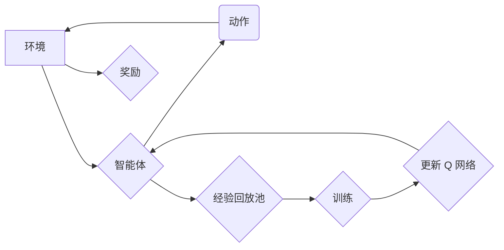

## 1. 背景介绍

### 1.1 深度强化学习的崛起

近年来，深度强化学习 (Deep Reinforcement Learning, DRL) 在游戏、机器人控制、资源管理等领域取得了瞩目的成就。DRL 结合了深度学习强大的表征能力和强化学习的决策能力，使得智能体能够直接从高维的感知输入中学习解决复杂的任务。

### 1.2  DQN 的局限性

深度 Q 网络 (Deep Q-Network, DQN) 作为 DRL 的先驱算法之一，通过学习一个深度神经网络来近似状态-动作价值函数 (Q 函数)，从而指导智能体的决策。然而，传统的 DQN 存在一些局限性：

* **难以区分状态价值和动作优势**:  Q 函数同时包含了状态价值 (state value) 和动作优势 (action advantage) 信息。状态价值指的是处于某个状态的长期收益，而动作优势指的是在该状态下选择某个动作相对于其他动作的额外收益。DQN 难以将这两种信息有效地分离，导致学习效率低下。
* **过估计问题**: DQN 容易受到过估计问题的影响，即对某些状态-动作对的价值估计过高，导致学习过程不稳定。

### 1.3 DuelingDQN 的提出

为了解决上述问题，DuelingDQN 算法被提出。DuelingDQN 通过修改 DQN 的网络结构，将 Q 函数分解为状态价值和动作优势两部分，从而提高了学习效率和稳定性。

## 2. 核心概念与联系

### 2.1 状态价值函数

状态价值函数 $V^{\pi}(s)$ 表示在状态 $s$ 下，遵循策略 $\pi$ 的情况下，智能体所能获得的期望累积回报。

### 2.2 动作优势函数

动作优势函数 $A^{\pi}(s, a)$ 表示在状态 $s$ 下，选择动作 $a$ 相对于遵循策略 $\pi$ 的平均期望回报的额外收益。

### 2.3 Q 函数与状态价值、动作优势的关系

Q 函数、状态价值函数和动作优势函数之间存在以下关系:

$$
Q^{\pi}(s, a) = V^{\pi}(s) + A^{\pi}(s, a)
$$

这意味着，Q 函数可以分解为状态价值和动作优势之和。

## 3. 核心算法原理具体操作步骤

### 3.1 DuelingDQN 网络结构

DuelingDQN 的核心思想是将 DQN 的网络结构进行修改，将 Q 函数分解为状态价值和动作优势两部分。具体来说，DuelingDQN 的网络结构包含两个分支：

* **状态价值分支**: 该分支输出一个标量，表示状态 $s$ 的价值 $V(s)$。
* **动作优势分支**: 该分支输出一个向量，表示在状态 $s$ 下选择每个动作的优势 $A(s, a)$。

最终的 Q 值通过将状态价值和动作优势相加得到：

$$
Q(s, a) = V(s) + A(s, a)
$$

### 3.2 优势函数的归一化

为了避免状态价值和动作优势的尺度差异过大，影响学习效果，DuelingDQN 对动作优势函数进行归一化处理。常用的归一化方法包括：

* **平均值归一化**: 将动作优势减去其平均值。
* **最大值归一化**: 将动作优势除以其最大值的绝对值。

### 3.3 算法流程

DuelingDQN 的算法流程与 DQN 类似，主要包括以下步骤：

1. 初始化经验回放池和 Q 网络。
2. 循环迭代：
    * 从环境中获取状态 $s$。
    * 根据 Q 网络选择动作 $a$。
    * 执行动作 $a$，获得奖励 $r$ 和下一状态 $s'$。
    * 将经验 $(s, a, r, s')$ 存储到经验回放池中。
    * 从经验回放池中随机抽取一批经验进行训练。
    * 使用目标 Q 网络计算目标 Q 值。
    * 使用梯度下降更新 Q 网络的参数。

## 4. 数学模型和公式详细讲解举例说明

### 4.1 损失函数

DuelingDQN 使用均方误差 (Mean Squared Error, MSE) 作为损失函数，其表达式为：

$$
L(\theta) = \frac{1}{N} \sum_{i=1}^{N} (Q(s_i, a_i; \theta) - y_i)^2
$$

其中，$\theta$ 表示 Q 网络的参数，$N$ 表示批次大小，$s_i$ 和 $a_i$ 表示经验样本中的状态和动作，$y_i$ 表示目标 Q 值。

### 4.2 目标 Q 值

目标 Q 值的计算方式与 DQN 相同，使用目标 Q 网络计算：

$$
y_i = r_i + \gamma \max_{a'} Q(s'_i, a'; \theta^-)
$$

其中，$r_i$ 表示经验样本中的奖励，$s'_i$ 表示经验样本中的下一状态，$\gamma$ 表示折扣因子，$\theta^-$ 表示目标 Q 网络的参数。

### 4.3 举例说明

假设有一个简单的游戏，智能体需要控制一个角色在迷宫中移动，目标是找到出口。迷宫中有四个方向可以移动：上、下、左、右。智能体在每个状态下可以选择一个方向移动，并获得相应的奖励。

我们可以使用 DuelingDQN 来训练一个智能体玩这个游戏。首先，我们需要定义网络结构。假设我们使用一个简单的两层神经网络，状态价值分支输出一个标量，动作优势分支输出一个四维向量，分别表示四个方向的优势。

```python
import torch
import torch.nn as nn

class DuelingDQN(nn.Module):
    def __init__(self, input_dim, output_dim):
        super(DuelingDQN, self).__init__()
        self.fc1 = nn.Linear(input_dim, 128)
        self.fc2_adv = nn.Linear(128, output_dim)
        self.fc2_val = nn.Linear(128, 1)

    def forward(self, x):
        x = torch.relu(self.fc1(x))
        adv = self.fc2_adv(x)
        val = self.fc2_val(x)
        return val + adv - adv.mean()
```

接下来，我们可以使用 DuelingDQN 算法训练智能体。训练过程中，智能体会不断与环境交互，收集经验并更新 Q 网络的参数。

## 5. 项目实践：代码实例和详细解释说明

### 5.1  CartPole 环境

在本节中，我们将使用 OpenAI Gym 中的 CartPole 环境来演示 DuelingDQN 的实现。CartPole 环境是一个经典的控制问题，目标是控制一根杆子使其保持平衡。

### 5.2 代码实现

```python
import gym
import torch
import torch.nn as nn
import torch.optim as optim
import random
from collections import deque

# 定义 DuelingDQN 网络
class DuelingDQN(nn.Module):
    def __init__(self, input_dim, output_dim):
        super(DuelingDQN, self).__init__()
        self.fc1 = nn.Linear(input_dim, 128)
        self.fc2_adv = nn.Linear(128, output_dim)
        self.fc2_val = nn.Linear(128, 1)

    def forward(self, x):
        x = torch.relu(self.fc1(x))
        adv = self.fc2_adv(x)
        val = self.fc2_val(x)
        return val + adv - adv.mean()

# 定义经验回放池
class ReplayBuffer:
    def __init__(self, capacity):
        self.buffer = deque(maxlen=capacity)

    def push(self, transition):
        self.buffer.append(transition)

    def sample(self, batch_size):
        return random.sample(self.buffer, batch_size)

    def __len__(self):
        return len(self.buffer)

# 定义 DuelingDQN Agent
class DuelingDQNAgent:
    def __init__(self, state_dim, action_dim, lr, gamma, epsilon, target_update, buffer_size):
        self.state_dim = state_dim
        self.action_dim = action_dim
        self.lr = lr
        self.gamma = gamma
        self.epsilon = epsilon
        self.target_update = target_update
        self.buffer_size = buffer_size

        self.q_net = DuelingDQN(state_dim, action_dim)
        self.target_q_net = DuelingDQN(state_dim, action_dim)
        self.optimizer = optim.Adam(self.q_net.parameters(), lr=lr)
        self.replay_buffer = ReplayBuffer(buffer_size)

        self.update_target_network()

    def update_target_network(self):
        self.target_q_net.load_state_dict(self.q_net.state_dict())

    def choose_action(self, state):
        if random.random() < self.epsilon:
            return random.randrange(self.action_dim)
        else:
            state = torch.tensor(state, dtype=torch.float32)
            q_values = self.q_net(state)
            return torch.argmax(q_values).item()

    def learn(self, batch_size):
        if len(self.replay_buffer) < batch_size:
            return

        transitions = self.replay_buffer.sample(batch_size)
        states, actions, rewards, next_states, dones = zip(*transitions)

        states = torch.tensor(states, dtype=torch.float32)
        actions = torch.tensor(actions, dtype=torch.int64)
        rewards = torch.tensor(rewards, dtype=torch.float32)
        next_states = torch.tensor(next_states, dtype=torch.float32)
        dones = torch.tensor(dones, dtype=torch.bool)

        q_values = self.q_net(states).gather(1, actions.unsqueeze(1)).squeeze(1)

        next_q_values = self.target_q_net(next_states).max(1)[0]
        target_q_values = rewards + self.gamma * next_q_values * (~dones)

        loss = nn.MSELoss()(q_values, target_q_values.detach())

        self.optimizer.zero_grad()
        loss.backward()
        self.optimizer.step()

# 创建 CartPole 环境
env = gym.make('CartPole-v1')

# 定义超参数
state_dim = env.observation_space.shape[0]
action_dim = env.action_space.n
lr = 1e-3
gamma = 0.99
epsilon = 0.1
target_update = 10
buffer_size = 10000

# 创建 DuelingDQN Agent
agent = DuelingDQNAgent(state_dim, action_dim, lr, gamma, epsilon, target_update, buffer_size)

# 训练智能体
num_episodes = 1000
for episode in range(num_episodes):
    state = env.reset()
    done = False
    total_reward = 0

    while not done:
        action = agent.choose_action(state)
        next_state, reward, done, _ = env.step(action)

        agent.replay_buffer.push((state, action, reward, next_state, done))
        agent.learn(batch_size=64)

        state = next_state
        total_reward += reward

    if episode % target_update == 0:
        agent.update_target_network()

    print(f"Episode: {episode+1}, Total Reward: {total_reward}")

# 测试智能体
state = env.reset()
done = False
total_reward = 0

while not done:
    action = agent.choose_action(state)
    next_state, reward, done, _ = env.step(action)

    state = next_state
    total_reward += reward

print(f"Total Reward: {total_reward}")

env.close()
```

### 5.3 代码解释

* **DuelingDQN 网络**: 我们定义了一个 DuelingDQN 网络，它包含两个分支：状态价值分支和动作优势分支。
* **经验回放池**: 我们使用了一个经验回放池来存储智能体与环境交互的经验。
* **DuelingDQN Agent**: 我们定义了一个 DuelingDQN Agent，它负责选择动作、学习和更新 Q 网络的参数。
* **训练智能体**: 我们使用 DuelingDQN Agent 训练智能体玩 CartPole 游戏。
* **测试智能体**: 训练完成后，我们测试了智能体的性能。

## 6. 实际应用场景

DuelingDQN 在许多实际应用场景中都取得了成功，例如：

* **游戏**: DuelingDQN 在 Atari 游戏中取得了比 DQN 更高的分数。
* **机器人控制**: DuelingDQN 可以用于控制机器人的运动，例如让机器人学习抓取物体。
* **资源管理**: DuelingDQN 可以用于优化资源分配，例如在云计算中动态调整虚拟机的资源。

## 7. 工具和资源推荐

* **OpenAI Gym**: 一个用于开发和比较强化学习算法的工具包。
* **Stable Baselines3**: 一个包含各种 DRL 算法实现的 Python 库。
* **Ray RLlib**: 一个用于分布式强化学习的框架。

## 8. 总结：未来发展趋势与挑战

DuelingDQN 是一种有效的 DRL 算法，它通过分离状态价值和动作优势，提高了学习效率和稳定性。未来，DuelingDQN 的研究方向包括：

* **更有效的归一化方法**: 探索更有效的优势函数归一化方法，进一步提高学习效率。
* **结合其他 DRL 算法**: 将 DuelingDQN 与其他 DRL 算法结合，例如 A3C、DDPG 等，以解决更复杂的任务。
* **应用于更广泛的领域**: 将 DuelingDQN 应用于更广泛的领域，例如自然语言处理、计算机视觉等。

## 9. 附录：常见问题与解答

### 9.1 为什么 DuelingDQN 比 DQN 更好？

DuelingDQN 通过分离状态价值和动作优势，使得网络能够更有效地学习。此外，DuelingDQN 的归一化方法可以减少过估计问题，提高学习稳定性。

### 9.2  DuelingDQN 的局限性是什么？

DuelingDQN 仍然存在一些局限性，例如：

* **对网络结构敏感**: DuelingDQN 的性能对网络结构比较敏感，需要仔细调整网络参数。
* **训练时间较长**: DuelingDQN 的训练时间比 DQN 更长，因为它需要学习两个分支的网络参数。


## 10. Mermaid 流程图



**图例:**

* 环境:  提供状态和奖励。
* 智能体:  选择动作并接收奖励。
* 动作:  智能体在环境中执行的动作。
* 奖励:  环境给予智能体的奖励。
* 经验回放池:  存储智能体与环境交互的经验。
* 训练:  使用经验回放池中的经验训练 Q 网络。
* 更新 Q 网络:  根据训练结果更新 Q 网络的参数。
