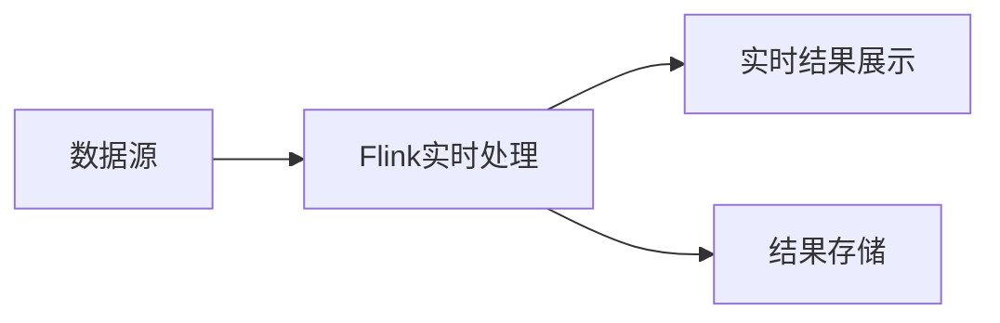

# Flink实战案例：实时交通流量分析系统

作者：禅与计算机程序设计艺术

## 1. 背景介绍

### 1.1 实时交通流量分析的重要性
在现代城市中,交通拥堵已成为一个日益严重的问题。实时交通流量分析可以帮助交通管理部门及时了解道路状况,优化交通信号灯的时间,引导车流,缓解拥堵。同时,实时交通数据也可用于交通规划、公共交通调度等领域。

### 1.2 传统交通流量分析方法的局限性
传统的交通流量分析通常依赖于定点探测器,如线圈探测器、视频监控等。这些方法存在以下局限:

- 覆盖范围有限,难以全面了解整个路网的交通状况
- 数据实时性不足,难以支持实时决策
- 数据处理能力有限,难以应对海量数据

### 1.3 基于Flink的实时交通流量分析优势
Apache Flink是一个高性能的分布式流处理框架,具有低延迟、高吞吐、强一致性等特点。基于Flink构建实时交通流量分析系统具有以下优势:

- 支持多种数据源接入,如车辆GPS、手机信令等,可获得全面的交通状况信息
- 毫秒级延迟,可实现实时数据处理和分析
- 良好的水平扩展能力,可轻松应对海量数据
- 丰富的流处理API,简化了复杂的流处理逻辑的实现

## 2. 核心概念与联系

### 2.1 Flink核心概念
#### 2.1.1 DataStream
以无界数据流为核心,支持对流数据的各种转换操作。

#### 2.1.2 State
Flink中的状态可以是Operator State或Keyed State,支持exactly-once一致性。

#### 2.1.3 Time
Flink支持三种时间概念:Processing Time、Event Time和Ingestion Time。

#### 2.1.4 Window
Flink支持Time Window、Count Window、Session Window等多种窗口类型。

### 2.2 实时交通流量分析中的关键概念
#### 2.2.1 路段
将道路网络划分为多个路段,每个路段有唯一ID。交通流量分析的基本单位是路段。

#### 2.2.2 车辆轨迹
车辆轨迹由一系列时空点组成,每个时空点包含时间戳、经纬度、速度等信息。

#### 2.2.3 路段车流量
一定时间内通过某路段的车辆数。路段车流量可进一步区分方向,如东向西、西向东等。

#### 2.2.4 路段平均速度
一定时间内通过某路段的车辆的平均速度。

### 2.3 概念之间的关系
- 车辆在道路网络中运动,形成车辆轨迹
- 车辆轨迹数据经Map操作映射到路段,并在一定时间窗口内进行聚合,得到路段车流量和平均速度
- 路段车流量和平均速度可作为衡量交通状况的关键指标

## 3. 核心算法原理与具体操作步骤

### 3.1 系统架构
实时交通流量分析系统的整体架构如下:



### 3.2 数据源
系统支持多种类型的数据源,包括但不限于:

- 车辆GPS数据:车载GPS设备上报的位置、速度等信息
- 手机信令数据:移动运营商基于手机信令数据得到的用户位置信息
- 线圈探测器数据:固定探测器实时上报的车辆通过情况

### 3.3 数据预处理
原始数据通常包含噪声和异常值,需要进行预处理:

1. 数据清洗:去除明显错误的数据,如位置超出道路范围、速度异常等
2. 数据补全:对缺失数据进行插值或估计
3. 数据格式转换:将异构数据源转换为统一的格式

### 3.4 地图匹配
地图匹配(Map Matching)是将车辆轨迹数据映射到数字地图上的过程。常见算法包括:

- 点到线匹配:将轨迹点匹配到最近的道路线段上
- 基于隐马尔可夫模型的匹配:考虑轨迹点前后关系,提高匹配准确率

匹配后,得到每个轨迹点所在的路段ID。

### 3.5 路段车流量和速度计算
对于每个路段,在一定时间窗口(如5分钟)内,统计通过该路段的车辆数和平均速度:

1. 按路段ID对轨迹点进行分组
2. 设置滑动窗口,如5分钟
3. 在每个窗口内,计算通过车辆数(车流量)和车速平均值
4. 将结果以路段ID为key写入结果存储

Flink代码示例:

```java
// 假设mapMatched是已完成地图匹配的数据流
DataStream<Tuple3<String, Double, Long>> segFlow = mapMatched
    .keyBy(data -> data.roadId) 
    .window(SlidingEventTimeWindows.of(Time.minutes(5), Time.minutes(1)))
    .aggregate(new SegmentFlowAgg());

// 自定义聚合函数
class SegmentFlowAgg implements AggregateFunction<Tuple3<String, Double, Long>, Tuple4<String, Double, Double, Long>, Tuple3<String, Double, Long>> {
    @Override
    public Tuple4<String, Double, Double, Long> createAccumulator() {
        return new Tuple4<>("", 0.0, 0.0, 0L);
    }
    
    @Override
    public Tuple4<String, Double, Double, Long> add(Tuple3<String, Double, Long> value, Tuple4<String, Double, Double, Long> accumulator) {
        return new Tuple4<>(value.f0, accumulator.f1 + value.f1, accumulator.f2 + value.f2, accumulator.f3 + 1);
    }
    
    @Override
    public Tuple3<String, Double, Long> getResult(Tuple4<String, Double, Double, Long> accumulator) {
        return new Tuple3<>(accumulator.f0, accumulator.f2 / accumulator.f3, accumulator.f3);
    }
    
    @Override
    public Tuple4<String, Double, Double, Long> merge(Tuple4<String, Double, Double, Long> a, Tuple4<String, Double, Double, Long> b) {
        return new Tuple4<>(a.f0, a.f1 + b.f1, a.f2 + b.f2, a.f3 + b.f3);
    }
}
```

## 4. 数学模型和公式详细讲解举例说明

### 4.1 平均速度计算
路段平均速度$v$的计算公式为:

$$v = \frac{\sum_{i=1}^{n} v_i}{n}$$

其中,$v_i$为第$i$辆车的速度,$n$为通过车辆总数。

举例:某路段5分钟内通过3辆车,速度分别为36km/h、42km/h、39km/h,则平均速度为:

$$v = \frac{36+42+39}{3} = 39 km/h$$

### 4.2 车流量估算
除了直接统计通过车辆数外,还可根据平均速度和车头时距估算车流量。

假设平均车头时距为$h$,平均速度为$v$,则单位时间内通过的车辆数$q$为:

$$q = \frac{1}{h} = \frac{v}{d}$$

其中,$d$为平均车头间距,由$v$和$h$决定:$d = v \times h$。

举例:某路段平均时速为40km/h,平均车头时距为2.5秒,则平均车头间距为:

$$d = 40 \times \frac{2.5}{3600} = 0.0278 km = 27.8 m$$

该路段单位时间内通过车辆数为:

$$q = \frac{40}{0.0278} = 1440 辆/小时$$

## 5. 项目实践:代码实例和详细解释说明

下面给出一个简单的Flink项目,实现对车辆轨迹数据的实时处理和流量计算。

### 5.1 项目依赖
项目使用Maven管理依赖,主要依赖如下:

```xml
<dependencies>
    <dependency>
        <groupId>org.apache.flink</groupId>
        <artifactId>flink-java</artifactId>
        <version>1.12.0</version>
    </dependency>
    <dependency>
        <groupId>org.apache.flink</groupId>
        <artifactId>flink-streaming-java_2.12</artifactId>
        <version>1.12.0</version>
    </dependency>
</dependencies>
```

### 5.2 数据源
使用Flink的`SourceFunction`接口自定义数据源,模拟产生车辆轨迹数据。每条数据包含车辆ID、时间戳、经度、纬度和速度。

```java
class TrajectorySource implements SourceFunction<Trajectory> {
    private volatile boolean isRunning = true;
    
    @Override
    public void run(SourceContext<Trajectory> ctx) throws Exception {
        Random random = new Random();
        while (isRunning) {
            Trajectory traj = new Trajectory(
                random.nextInt(1000),
                System.currentTimeMillis(),
                random.nextDouble() * 180 - 90,
                random.nextDouble() * 360 - 180,
                random.nextDouble() * 100
            );
            ctx.collect(traj);
            Thread.sleep(100);
        }
    }
    
    @Override
    public void cancel() {
        isRunning = false;
    }
}
```

### 5.3 地图匹配
使用`FlatMapFunction`对轨迹数据进行地图匹配,得到每个轨迹点所在的路段。这里使用随机数模拟路段ID。

```java
class MapMatchFunction implements FlatMapFunction<Trajectory, Tuple3<String, Double, Long>> {
    @Override
    public void flatMap(Trajectory value, Collector<Tuple3<String, Double, Long>> out) throws Exception {
        out.collect(new Tuple3<>("road_" + new Random().nextInt(100), value.speed, 1L));
    }
}
```

### 5.4 车流量和速度计算
对地图匹配后的数据按路段分组,并在5分钟滑动窗口内进行聚合,得到每个路段的车流量和平均速度。

```java
DataStream<Tuple3<String, Double, Long>> segFlow = mapMatched
    .keyBy(data -> data.f0) 
    .window(SlidingEventTimeWindows.of(Time.minutes(5), Time.minutes(1)))
    .aggregate(new SegmentFlowAgg());
```

### 5.5 结果输出
将计算结果打印到控制台,或写入其他存储系统如数据库、消息队列等。

```java
segFlow.print();
```

### 5.6 完整代码
完整的Flink程序如下:

```java
public class TrafficFlowAnalysis {
    public static void main(String[] args) throws Exception {
        StreamExecutionEnvironment env = StreamExecutionEnvironment.getExecutionEnvironment();
        
        DataStream<Trajectory> trajectoryStream = env.addSource(new TrajectorySource());
        
        DataStream<Tuple3<String, Double, Long>> mapMatched = trajectoryStream
            .flatMap(new MapMatchFunction());
        
        DataStream<Tuple3<String, Double, Long>> segFlow = mapMatched
            .keyBy(data -> data.f0) 
            .window(SlidingEventTimeWindows.of(Time.minutes(5), Time.minutes(1)))
            .aggregate(new SegmentFlowAgg());
        
        segFlow.print();
        
        env.execute("Traffic Flow Analysis");
    }
}
```

## 6. 实际应用场景

实时交通流量分析在智慧交通领域有广泛应用,主要场景包括:

### 6.1 交通信号灯优化
根据道路交通流量实时调整信号灯配时方案,缓解拥堵,提高通行效率。

### 6.2 交通诱导引导
实时计算路网中每条路的通行状况,并通过交通诱导屏、导航APP等方式引导车辆选择最优路线。

### 6.3 交通事件检测
通过异常交通流量变化实时发现交通事故、施工等事件,并及时处置。

### 6.4 公交调度优化
根据客流量数据实时调整公交车发车频率和运力投放,提高公交服务水平。

### 6.5 交通规划仿真
将实时交通流量数据输入交通仿真模型,评估不同交通规划方案的效果。

## 7. 工具和资源推荐

### 7.1 Flink官方文档
Flink官网提供了详尽的用户手册和API文档,是学习和使用Flink的权威资料。

### 7.2 Flink中文社区
Flink中文社区提供了大量高质量的博客文章、视频教程等学习资源。

### 7.3 地图服务API