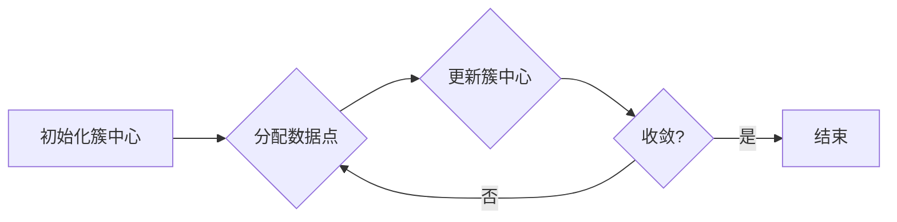

# K-Means聚类的Top10论文与研究热点解读

作者：禅与计算机程序设计艺术

## 1. 背景介绍

### 1.1 聚类分析概述

聚类分析是一种无监督学习方法，旨在将数据集中的对象分组到不同的簇中，使得同一簇内的对象彼此相似，而不同簇之间的对象则不相似。它是数据挖掘、机器学习和模式识别领域中的一项基本任务，广泛应用于市场营销、客户细分、图像分割、生物信息学等领域。

### 1.2 K-Means聚类算法简介

K-Means聚类算法是一种简单且广泛使用的聚类算法。其基本思想是将数据集划分为K个簇，其中K是用户预先指定的参数。算法通过迭代地将每个数据点分配到距离其最近的簇中心，并更新簇中心，直到收敛为止。K-Means算法易于理解和实现，但其性能受到初始簇中心选择和K值选择的影响。

## 2. 核心概念与联系

### 2.1 距离度量

K-Means算法依赖于距离度量来确定数据点之间的相似性。常用的距离度量包括欧几里得距离、曼哈顿距离和余弦相似度等。

#### 2.1.1 欧几里得距离

欧几里得距离是两点之间最短的直线距离，其计算公式如下：

$$
d(x,y) = \sqrt{\sum_{i=1}^{n}(x_i-y_i)^2}
$$

其中，$x$ 和 $y$ 是两个 n 维数据点。

#### 2.1.2 曼哈顿距离

曼哈顿距离是两点之间沿着坐标轴移动的距离，其计算公式如下：

$$
d(x,y) = \sum_{i=1}^{n}|x_i-y_i|
$$

#### 2.1.3 余弦相似度

余弦相似度是两个向量之间夹角的余弦值，其计算公式如下：

$$
similarity(x,y) = \frac{x \cdot y}{||x|| ||y||}
$$

其中，$x \cdot y$ 是两个向量的点积，$||x||$ 和 $||y||$ 分别是两个向量的范数。

### 2.2 簇中心

簇中心是每个簇的代表点，它通常是簇中所有数据点的平均值。

### 2.3 迭代优化

K-Means算法通过迭代地更新簇中心和数据点分配来最小化目标函数。目标函数通常是簇内平方误差和（WCSS），其计算公式如下：

$$
WCSS = \sum_{k=1}^{K}\sum_{x_i \in C_k}||x_i - \mu_k||^2
$$

其中，$C_k$ 是第 k 个簇，$\mu_k$ 是第 k 个簇的中心。

## 3. 核心算法原理具体操作步骤

### 3.1 算法步骤

K-Means算法的具体操作步骤如下：

1. **初始化:** 随机选择 K 个数据点作为初始簇中心。
2. **分配:** 将每个数据点分配到距离其最近的簇中心。
3. **更新:** 计算每个簇中所有数据点的平均值，并将簇中心更新为该平均值。
4. **重复步骤 2 和 3，直到收敛。** 收敛条件可以是簇中心不再变化，或者目标函数 WCSS 不再减小。

### 3.2 算法流程图



## 4. 数学模型和公式详细讲解举例说明

### 4.1 目标函数

K-Means算法的目标函数是簇内平方误差和（WCSS），其计算公式如下：

$$
WCSS = \sum_{k=1}^{K}\sum_{x_i \in C_k}||x_i - \mu_k||^2
$$

其中，$C_k$ 是第 k 个簇，$\mu_k$ 是第 k 个簇的中心。

### 4.2 举例说明

假设我们有一个包含 5 个数据点的数据集：

```
x1 = (1, 2)
x2 = (2, 1)
x3 = (3, 4)
x4 = (4, 3)
x5 = (5, 5)
```

我们想要将这些数据点聚类到 2 个簇中。假设初始簇中心为：

```
mu1 = (1, 2)
mu2 = (5, 5)
```

**第一次迭代：**

* **分配：**
    * x1 被分配到簇 1，因为 ||x1 - mu1|| < ||x1 - mu2||
    * x2 被分配到簇 1，因为 ||x2 - mu1|| < ||x2 - mu2||
    * x3 被分配到簇 2，因为 ||x3 - mu2|| < ||x3 - mu1||
    * x4 被分配到簇 2，因为 ||x4 - mu2|| < ||x4 - mu1||
    * x5 被分配到簇 2，因为 ||x5 - mu2|| < ||x5 - mu1||
* **更新：**
    * mu1 = ((1+2)/2, (2+1)/2) = (1.5, 1.5)
    * mu2 = ((3+4+5)/3, (4+3+5)/3) = (4, 4)

**第二次迭代：**

* **分配：**
    * x1 被分配到簇 1，因为 ||x1 - mu1|| < ||x1 - mu2||
    * x2 被分配到簇 1，因为 ||x2 - mu1|| < ||x2 - mu2||
    * x3 被分配到簇 2，因为 ||x3 - mu2|| < ||x3 - mu1||
    * x4 被分配到簇 2，因为 ||x4 - mu2|| < ||x4 - mu1||
    * x5 被分配到簇 2，因为 ||x5 - mu2|| < ||x5 - mu1||
* **更新：**
    * mu1 = (1.5, 1.5)
    * mu2 = (4, 4)

由于簇中心不再变化，因此算法收敛。最终的聚类结果为：

* **簇 1：** {x1, x2}
* **簇 2：** {x3, x4, x5}

## 5. 项目实践：代码实例和详细解释说明

### 5.1 Python 代码实例

```python
import numpy as np
from sklearn.cluster import KMeans

# 创建数据集
X = np.array([[1, 2], [2, 1], [3, 4], [4, 3], [5, 5]])

# 创建 KMeans 模型
kmeans = KMeans(n_clusters=2, random_state=0)

# 训练模型
kmeans.fit(X)

# 获取聚类标签
labels = kmeans.labels_

# 获取簇中心
centers = kmeans.cluster_centers_

# 打印结果
print("聚类标签:", labels)
print("簇中心:", centers)
```

### 5.2 代码解释说明

* 首先，我们使用 `numpy` 库创建了一个包含 5 个数据点的二维数组 `X`。
* 然后，我们使用 `sklearn.cluster` 模块中的 `KMeans` 类创建了一个 KMeans 模型。我们将 `n_clusters` 参数设置为 2，表示我们要将数据聚类到 2 个簇中。`random_state` 参数用于确保结果的可重复性。
* 接下来，我们使用 `fit()` 方法训练 KMeans 模型。
* 训练完成后，我们可以使用 `labels_` 属性获取每个数据点的聚类标签，使用 `cluster_centers_` 属性获取簇中心。
* 最后，我们打印聚类标签和簇中心。

## 6. 实际应用场景

### 6.1 市场营销

K-Means聚类可以用于客户细分，将客户群体划分为不同的细分市场，以便企业可以针对不同的客户群体制定不同的营销策略。

### 6.2 图像分割

K-Means聚类可以用于图像分割，将图像中的像素分组到不同的区域，以便识别图像中的不同对象。

### 6.3 生物信息学

K-Means聚类可以用于基因表达数据分析，将基因分组到不同的簇，以便识别具有相似功能的基因。

## 7. 工具和资源推荐

### 7.1 Scikit-learn

Scikit-learn 是一个 Python 机器学习库，提供了 KMeans 算法的实现。

### 7.2 Weka

Weka 是一个 Java 机器学习工具，提供了 KMeans 算法的实现。

### 7.3 R

R 是一种统计计算语言，提供了 KMeans 算法的实现。

## 8. 总结：未来发展趋势与挑战

### 8.1 未来发展趋势

* **大规模数据聚类:** 随着数据量的不断增加，开发高效的大规模数据聚类算法变得越来越重要。
* **高维数据聚类:** 高维数据聚类仍然是一个具有挑战性的问题，需要开发新的算法和技术。
* **流数据聚类:** 流数据聚类需要处理不断到达的数据流，需要开发在线聚类算法。

### 8.2 挑战

* **K 值的选择:** K 值的选择对 K-Means 算法的性能有很大影响。
* **初始簇中心的选择:** 初始簇中心的选择也会影响 K-Means 算法的性能。
* **局部最优解:** K-Means 算法容易陷入局部最优解，需要开发避免局部最优解的技术。

## 9. 附录：常见问题与解答

### 9.1 如何选择 K 值？

* **肘部法则:** 绘制 WCSS 与 K 值的关系图，找到 WCSS 下降速度变慢的“肘部”，对应的 K 值即为最佳 K 值。
* **轮廓系数:** 计算每个数据点的轮廓系数，选择平均轮廓系数最高的 K 值。

### 9.2 如何避免局部最优解？

* **多次运行 K-Means 算法，选择 WCSS 最低的聚类结果。**
* **使用 K-Means++ 算法初始化簇中心。**
* **使用模拟退火或遗传算法等全局优化算法。**
