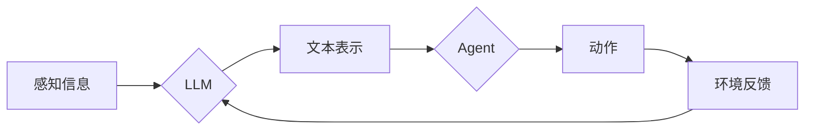

# LLM-based Agent 的社区建设与生态发展

作者：禅与计算机程序设计艺术

## 1. 背景介绍

### 1.1  LLM 崛起与 Agent 崭露头角

近年来，大型语言模型（LLM）取得了显著的进展，展现出强大的语言理解和生成能力。与此同时，Agent 技术也日益成熟，能够自主地与环境交互并完成特定任务。将 LLM 与 Agent 结合，赋予 Agent 更强大的认知和决策能力，催生了 LLM-based Agent 这一新兴领域。

### 1.2 LLM-based Agent 的优势与挑战

LLM-based Agent 具备以下优势：

* **强大的语言理解和生成能力：**  LLM 赋予 Agent 理解自然语言指令、生成流畅文本的能力，使其能够与人类更自然地交互。
* **灵活的知识获取和推理能力：** LLM 能够从海量数据中学习知识，并进行推理和决策，使 Agent 能够应对复杂多变的环境。
* **可解释性和可控性：** LLM-based Agent 的决策过程可追溯，便于理解和调试，也更容易控制其行为。

然而，LLM-based Agent 也面临一些挑战：

* **安全性和可靠性：** LLM 生成的内容可能存在偏差、错误或不安全因素，需要采取措施确保 Agent 的安全性和可靠性。
* **效率和可扩展性：** LLM 的计算成本较高，需要优化 Agent 的架构和算法，提高效率和可扩展性。
* **伦理和社会影响：** LLM-based Agent 的应用可能引发伦理和社会问题，需要制定相应的规范和指南。

### 1.3 社区建设与生态发展的意义

为了推动 LLM-based Agent 技术的进步和应用，构建一个活跃的社区和繁荣的生态至关重要。社区能够促进知识共享、协同创新，加速技术发展；生态能够提供丰富的工具、资源和服务，降低应用门槛，推动产业繁荣。

## 2. 核心概念与联系

### 2.1 LLM

#### 2.1.1 定义与功能

大型语言模型（LLM）是指基于深度学习技术训练的、拥有海量参数的语言模型。LLM 能够理解和生成自然语言，完成各种语言任务，例如：

* 文本生成：写作、翻译、摘要等
* 对话系统：聊天机器人、问答系统等
* 代码生成：自动编程、代码补全等

#### 2.1.2  主流模型

* GPT-3
* BERT
* LaMDA

### 2.2 Agent

#### 2.2.1 定义与功能

Agent 是指能够自主地与环境交互并完成特定任务的智能体。Agent 通常包含以下组件：

* 感知器：接收环境信息
* 执行器：执行动作
* 控制器：根据感知信息和目标，做出决策

#### 2.2.2  类型

* 反射型 Agent：根据当前感知信息做出决策
* 目标导向型 Agent：根据目标状态做出决策
* 学习型 Agent：通过经验学习改进决策

### 2.3 LLM-based Agent

#### 2.3.1  定义与架构

LLM-based Agent 是指利用 LLM 作为核心组件的 Agent。LLM 赋予 Agent 强大的语言理解和生成能力，使其能够更好地与环境交互。

#### 2.3.2  工作原理

LLM-based Agent 的工作原理如下：

1. Agent 接收来自环境的感知信息。
2. LLM 处理感知信息，并生成相应的文本表示。
3. Agent 根据 LLM 生成的文本表示，做出决策并执行动作。
4. Agent 接收环境反馈，并更新 LLM 的知识。

## 3. 核心算法原理具体操作步骤

### 3.1  Prompt Engineering

#### 3.1.1  定义与作用

Prompt Engineering 是指设计和优化 LLM 输入提示，以引导 LLM 生成期望输出的技术。Prompt Engineering 能够提高 LLM-based Agent 的性能和效率。

#### 3.1.2  技巧

* 任务描述：清晰地描述 Agent 的目标和任务。
* 上下文信息：提供与任务相关的背景信息。
* 示例：提供期望输出的示例，引导 LLM 生成类似的输出。
* 约束条件：设定 LLM 生成输出的约束条件，例如长度、格式等。

### 3.2  Reinforcement Learning

#### 3.2.1  定义与作用

Reinforcement Learning (RL) 是一种机器学习方法，通过试错学习，让 Agent 在与环境交互的过程中学习最佳策略。RL 能够提高 LLM-based Agent 的适应性和鲁棒性。

#### 3.2.2  算法

* Q-learning
* SARSA
* Deep Q-Network (DQN)

### 3.3  Knowledge Distillation

#### 3.3.1  定义与作用

Knowledge Distillation 是指将大型模型的知识迁移到小型模型的技术。Knowledge Distillation 能够降低 LLM-based Agent 的计算成本，提高效率。

#### 3.3.2  方法

* Teacher-Student Training
* Patient Knowledge Distillation
* Online Knowledge Distillation

## 4. 数学模型和公式详细讲解举例说明

### 4.1  Markov Decision Process (MDP)

#### 4.1.1  定义

MDP 是用于描述 Agent 与环境交互的数学框架。MDP 包含以下要素：

* 状态集合 S：Agent 所处的状态
* 动作集合 A：Agent 可以执行的动作
* 转移概率函数 P：状态转移的概率
* 奖励函数 R：Agent 在特定状态下执行特定动作获得的奖励

#### 4.1.2  公式

$$
P(s'|s, a) = \text{Probability of transitioning to state } s' \text{ from state } s \text{ after taking action } a
$$

$$
R(s, a) = \text{Reward received for taking action } a \text{ in state } s
$$

#### 4.1.3  示例

假设一个 Agent 在迷宫中寻找出口，则：

* 状态集合 S：迷宫中的所有位置
* 动作集合 A：向上、向下、向左、向右移动
* 转移概率函数 P：根据迷宫的结构，确定 Agent 移动到下一个位置的概率
* 奖励函数 R：找到出口时获得正奖励，撞墙时获得负奖励

### 4.2  Bellman Equation

#### 4.2.1  定义

Bellman Equation 是用于计算 MDP 中状态价值函数和动作价值函数的方程。

#### 4.2.2  公式

状态价值函数：

$$
V(s) = \max_{a \in A} \sum_{s' \in S} P(s'|s, a) [R(s, a) + \gamma V(s')]
$$

动作价值函数：

$$
Q(s, a) = R(s, a) + \gamma \sum_{s' \in S} P(s'|s, a) \max_{a' \in A} Q(s', a')
$$

其中，$\gamma$ 为折扣因子，用于衡量未来奖励的价值。

#### 4.2.3  示例

在迷宫示例中，状态价值函数表示 Agent 在特定位置找到出口的期望奖励；动作价值函数表示 Agent 在特定位置执行特定动作找到出口的期望奖励。

## 5. 项目实践：代码实例和详细解释说明

### 5.1  LangChain

#### 5.1.1  简介

LangChain 是一个用于构建 LLM-based Agent 的 Python 库。LangChain 提供了丰富的工具和组件，简化了 Agent 的开发流程。

#### 5.1.2  代码实例

```python
from langchain.agents import load_tools
from langchain.agents import initialize_agent
from langchain.llms import OpenAI

# 加载工具
tools = load_tools(["serpapi", "llm-math"], llm=OpenAI(temperature=0))

# 初始化 Agent
agent = initialize_agent(tools, OpenAI(temperature=0), agent="zero-shot-react-description", verbose=True)

# 执行任务
agent.run("What is the capital of France?")
```

#### 5.1.3  解释说明

* `load_tools` 函数用于加载 Agent 使用的工具，例如搜索引擎、计算器等。
* `initialize_agent` 函数用于初始化 Agent，指定使用的 LLM、Agent 类型等参数。
* `agent.run` 方法用于执行 Agent 的任务，例如回答问题、生成文本等。

### 5.2  Transformers

#### 5.2.1  简介

Transformers 是一个用于自然语言处理的 Python 库，提供了各种预训练的 LLM 模型。

#### 5.2.2  代码实例

```python
from transformers import pipeline

# 加载 LLM 模型
generator = pipeline('text-generation', model='gpt2')

# 生成文本
text = generator("The capital of France is", max_length=20, num_return_sequences=1)[0]['generated_text']

# 打印结果
print(text)
```

#### 5.2.3  解释说明

* `pipeline` 函数用于加载 LLM 模型，指定任务类型和模型名称。
* `generator` 对象用于生成文本，指定输入提示、最大长度等参数。
* `generated_text` 属性包含 LLM 生成的文本。

## 6. 实际应用场景

### 6.1  智能客服

LLM-based Agent 可以用于构建智能客服系统，提供自然流畅的对话体验，自动解答用户问题，提高客服效率。

### 6.2  游戏 AI

LLM-based Agent 可以用于构建游戏 AI，赋予游戏角色更智能的行为，例如对话、决策、规划等，增强游戏的趣味性和挑战性。

### 6.3  教育辅助

LLM-based Agent 可以用于构建教育辅助工具，例如自动批改作业、个性化学习推荐等，提高教育效率和质量。

### 6.4  内容创作

LLM-based Agent 可以用于辅助内容创作，例如自动生成文章、摘要、翻译等，提高创作效率和质量。

## 7. 工具和资源推荐

### 7.1  LangChain

https://github.com/hwchase17/langchain

### 7.2  Transformers

https://github.com/huggingface/transformers

### 7.3  OpenAI API

https://beta.openai.com/

### 7.4  Hugging Face Hub

https://huggingface.co/

## 8. 总结：未来发展趋势与挑战

### 8.1  发展趋势

* **个性化和定制化：** LLM-based Agent 将更加个性化和定制化，以满足不同用户和场景的需求。
* **多模态交互：** LLM-based Agent 将支持多模态交互，例如语音、图像、视频等，提供更丰富的交互体验。
* **协同学习：** LLM-based Agent 将能够协同学习，共同完成复杂任务，提高效率和智能水平。

### 8.2  挑战

* **安全性和可靠性：** 确保 LLM-based Agent 的安全性和可靠性仍然是一个重大挑战。
* **效率和可扩展性：** 提高 LLM-based Agent 的效率和可扩展性，使其能够处理大规模数据和复杂任务。
* **伦理和社会影响：** 应对 LLM-based Agent 带来的伦理和社会影响，制定相应的规范和指南。

## 9. 附录：常见问题与解答

### 9.1  什么是 LLM-based Agent？

LLM-based Agent 是指利用 LLM 作为核心组件的 Agent，LLM 赋予 Agent 强大的语言理解和生成能力，使其能够更好地与环境交互。

### 9.2  LLM-based Agent 的优势有哪些？

LLM-based Agent 具备强大的语言理解和生成能力、灵活的知识获取和推理能力、可解释性和可控性等优势。

### 9.3  LLM-based Agent 的应用场景有哪些？

LLM-based Agent 可以应用于智能客服、游戏 AI、教育辅助、内容创作等领域。


## 10.  LLM-basedAgent 的社区建设与生态发展

### 10.1 社区建设

#### 10.1.1  开源社区

* **GitHub:**  鼓励开发者在 GitHub 上开源 LLM-based Agent 相关的项目，例如模型、代码、数据集等。
* **Hugging Face:**  鼓励开发者在 Hugging Face 上分享 LLM-based Agent 相关的模型和数据集。
* **Reddit:**  创建 LLM-based Agent 相关的 subreddit，方便开发者交流和分享经验。

#### 10.1.2  学术会议和研讨会

* **举办 LLM-based Agent 相关的学术会议和研讨会，促进学术交流和合作。**
* **鼓励学者发表 LLM-based Agent 相关的论文，推动技术发展。**

#### 10.1.3  开发者社区

* **组织 LLM-based Agent 相关的开发者 meetups 和 workshops，分享最佳实践和案例。**
* **创建 LLM-based Agent 相关的论坛和 Slack 频道，方便开发者交流和寻求帮助。**

### 10.2  生态发展

#### 10.2.1  工具和平台

* **开发 LLM-based Agent 相关的工具和平台，简化 Agent 的开发和部署流程。**
* **提供 LLM-based Agent 相关的云服务，方便开发者快速构建和部署 Agent。**

#### 10.2.2  数据集和基准

* **构建 LLM-based Agent 相关的标准化数据集和基准，用于评估和比较不同 Agent 的性能。**
* **鼓励开发者贡献和分享 LLM-based Agent 相关的数据集。**

#### 10.2.3  应用案例和最佳实践

* **收集和分享 LLM-based Agent 的成功应用案例，为开发者提供参考和借鉴。**
* **总结 LLM-based Agent 的最佳实践，帮助开发者更好地构建和应用 Agent。**

#### 10.2.4  教育和培训

* **提供 LLM-based Agent 相关的教育和培训课程，帮助开发者掌握相关技术和知识。**
* **编写 LLM-based Agent 相关的书籍和教程，方便开发者学习和参考。**

### 10.3  总结

LLM-based Agent 技术发展迅速，应用前景广阔。构建一个活跃的社区和繁荣的生态，对于推动 LLM-based Agent 技术的进步和应用至关重要。通过开源社区、学术会议、开发者社区、工具和平台、数据集和基准、应用案例和最佳实践、教育和培训等方面的努力，可以促进 LLM-based Agent 技术的快速发展，使其更好地服务于人类社会。

## 11. Mermaid 流程图



## 12.  展望

LLM-based Agent 作为一种新兴的技术，未来将会在更多领域发挥重要作用。随着 LLM 技术的不断发展，Agent 的能力也将不断提升，为人类社会创造更大的价值。

* **更强大的 LLM：**  未来 LLM 将拥有更强大的语言理解和生成能力，能够处理更复杂的任务。
* **更丰富的 Agent 架构：**  未来 LLM-based Agent 的架构将更加灵活和多样化，以适应不同的应用场景。
* **更广泛的应用领域：**  未来 LLM-based Agent 将应用于更多领域，例如医疗、金融、交通等。

LLM-based Agent 技术的发展，将推动人工智能技术的进步，为人类社会带来更美好的未来。