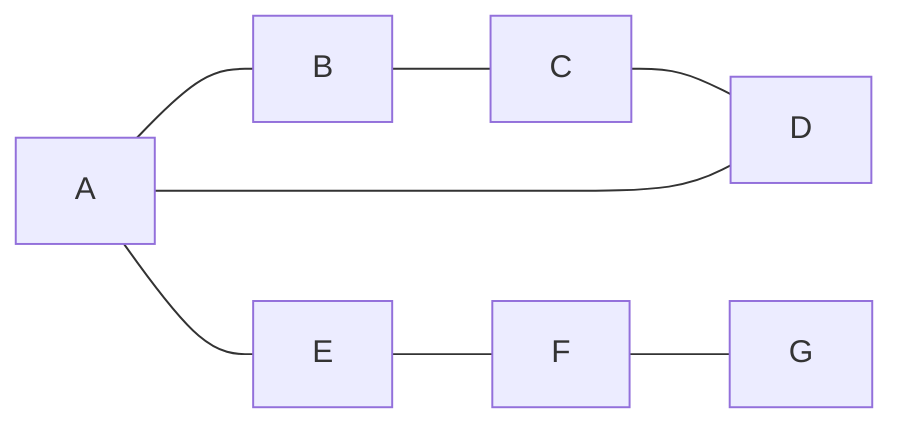
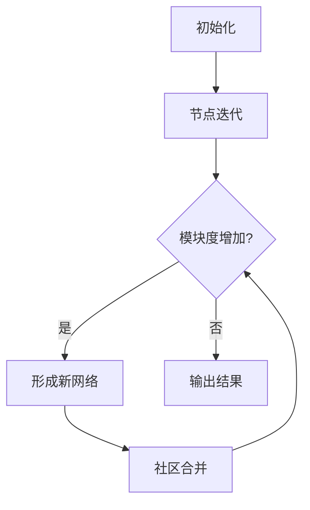

# Louvain算法：原理、步骤、代码实现

## 1.背景介绍

### 1.1 网络科学与社区发现问题

在现实世界中,许多复杂系统都可以被抽象为网络结构,例如社交网络、蛋白质相互作用网络、互联网拓扑结构等。网络科学作为一门新兴的交叉学科,旨在研究和分析这些复杂网络的拓扑结构、演化规律和动态行为。其中,社区发现(Community Detection)是网络科学的一个核心问题,它试图发现网络中具有紧密内部连接但与其他部分连接较少的节点集群,即社区结构。

### 1.2 社区发现的重要性

社区发现在许多领域具有重要应用价值:

- 社交网络分析:识别网络中的兴趣群体、隐藏团伙等
- 生物信息学:发现蛋白质复合物、功能模块等
- 网页排名:提高网页搜索质量
- 推荐系统:基于社区发现推荐相关内容
- 网络安全:检测网络攻击、僵尸网络等

因此,设计高效、准确的社区发现算法对于深入理解复杂网络的拓扑结构和功能组织具有重要意义。

### 1.3 Louvain算法概述

Louvain算法是一种基于模ул度优化的无监督社区发现算法,由Vincent D. Blondel等人于2008年提出。它具有如下优点:

- 无需预先设定社区数量
- 无需深入了解网络全局拓扑结构
- 可处理大规模网络
- 计算效率高

Louvain算法广泛应用于多个领域,如生物信息学、社交网络分析、计算机视觉等,是目前最流行和有影响力的社区发现算法之一。

## 2.核心概念与联系 

### 2.1 模块度(Modularity)

模块度是衡量网络社区划分质量的一种标准指标。具有以下特点:

- 取值范围[-1,1]
- 值越大,表明网络的社区结构越明显
- 当值接近0时,表明网络是随机网络,没有显著社区结构

模块度的数学定义为:

$$Q = \frac{1}{2m}\sum_{i,j}\left[A_{ij} - \frac{k_ik_j}{2m}\right]\delta(c_i,c_j)$$

其中:
- m是网络中所有边的总数
- $A_{ij}$是网络的邻接矩阵,如果i和j之间有边则$A_{ij}=1$,否则为0
- $k_i$和$k_j$分别是节点i和j的度数
- $\delta(c_i,c_j)$是指示函数,当i和j属于同一社区时取1,否则为0

直观上,模块度衡量网络中实际边数与随机分布假设下的期望边数之间的差异。

### 2.2 社区内部和外部连接

对于任意社区C,定义:

- $e_{ij}$表示社区C内部节点之间的边数
- $a_i = \sum_{j}e_{ij}$表示指向社区C的边数之和

则模块度可以改写为:

$$Q = \frac{1}{2m}\sum_C\left[e_{C} - \frac{a_C^2}{2m}\right]$$

上式表明,模块度等于所有社区内部连接数之和,减去如果网络边是随机分布时社区内部连接的期望值。

因此,**模块度度量了网络中节点聚集成不同社区的程度**。当一个网络的模块度较高时,说明它具有明显的社区结构。

### 2.3 Louvain算法原理

Louvain算法的核心思想是通过迭代优化模块度Q来发现网络的社区结构。具体分为两个阶段:

#### 2.3.1 阶段1:节点社区化

1) 初始时,将每个节点分配到不同社区
2) 遍历每个节点i,将其加入到与之相邻的社区C中,计算模块度的增量$\Delta Q$
3) 选择能使$\Delta Q$最大的社区C,将i加入C
4) 重复2)3),直到模块度Q不再增加

这一阶段的目标是优化局部模块度,即节点及其邻居节点的模块度。

#### 2.3.2 阶段2:社区整合

1) 将阶段1得到的社区构建为新的节点
2) 用这些新节点作为新网络的节点,边的权重为原社区间边的总数
3) 在新网络上重复阶段1的过程,继续优化模块度
4) 重复2)3),直到模块度不再增加

这一阶段的目标是继续优化全局模块度,合并相似的社区。

通过以上两个阶段的迭代,Louvain算法逐步发现网络的层次社区结构。算法终止时得到最终的社区划分结果。

### 2.4 算法复杂度分析

令n为网络节点数,m为边数。

- 阶段1的时间复杂度为O(nlogn),空间复杂度为O(n+m)
- 阶段2的时间复杂度取决于迭代次数,通常远小于O(n^2)
- 实践中,算法通常在20-50次迭代后收敛

因此,Louvain算法在大多数情况下时间复杂度接近线性,可高效处理大规模网络。

## 3.核心算法原理具体操作步骤

Louvain算法的核心步骤如下:

1) 初始化:将每个节点分配到不同社区
2) 节点迭代:对每个节点i
    a) 计算将i加入到相邻社区C后的模块度增量$\Delta Q$
    b) 选择能使$\Delta Q$最大的社区C,将i加入C
    c) 如果没有能使模块度增加的社区,i保持不变
3) 形成新网络:
    a) 将上一步得到的社区作为新网络的节点
    b) 新网络中边的权重为原社区间边数之和
4) 迭代社区合并:
    a) 在新网络上重复步骤2),进一步优化模块度
    b) 如果模块度没有提高,终止算法
    c) 否则,回到步骤3),继续合并社区
5) 输出最终的社区划分结果

算法的关键在于高效计算每次将节点加入不同社区后模块度的增量$\Delta Q$。这一步骤的时间复杂度为O(k),其中k为节点的邻居数。

通过上述迭代优化,Louvain算法逐级聚合相似社区,最终得到具有最大模块度的社区划分。

## 4.数学模型和公式详细讲解举例说明

### 4.1 模块度增量$\Delta Q$计算

设将节点i加入社区C后,模块度的增量为$\Delta Q$。令:

- $k_i$为节点i的度
- $k_i^{in}$为i指向C内部的边数
- $k_i^{tot}$为C的总度数,即指向或指出C的边数之和
- m为网络中所有边的总数

则根据模块度的定义,可得:

$$\Delta Q = \left[\frac{k_i^{in}}{m} - \frac{k_i k_i^{tot}}{2m^2}\right] - \left[ \frac{k_i^2}{2m} - \frac{k_i^{tot}}{2m^2}\right]$$

化简可得:

$$\Delta Q = \left[\frac{k_i^{in}}{m} - \frac{k_ik_i^{tot}}{2m^2}\right]$$

该式给出了将单个节点加入社区后,模块度的精确增量。

### 4.2 加权网络的处理

对于加权网络,即边有不同权重的情况,上述公式可作如下推广:

设$w_{ij}$为边(i,j)的权重,则有:

$$k_i = \sum_jw_{ij}, \qquad k_i^{in} = \sum_{j\in C}w_{ij}, \qquad m = \frac{1}{2}\sum_{ij}w_{ij}$$

将其代入$\Delta Q$的公式,即可计算加权网络的模块度增量。

### 4.3 算法示例

假设有如下简单无权网络:



初始时,每个节点自成一个社区。计算将节点A加入到不同社区后的模块度增量:

- 加入社区{A}: $\Delta Q = 0$
- 加入社区{B}: $\Delta Q = \frac{1}{7} - \frac{2\times3}{2\times7^2} = \frac{1}{49}$  
- 加入社区{E}: $\Delta Q = \frac{1}{7} - \frac{2\times3}{2\times7^2} = \frac{1}{49}$
- 加入其他社区: $\Delta Q = 0$

因此,A应加入社区{B}或{E},使模块度增加最大。

重复该过程,直到无法再提高模块度。然后将得到的社区作为新网络的节点,继续优化模块度,最终得到层次社区结构。

## 5.项目实践:代码实例和详细解释说明

以下是使用Python实现Louvain算法的示例代码,基于NetworkX包:

```python
import networkx as nx
import community as community_louvain

# 创建一个简单无向图
G = nx.Graph()
G.add_edges_from([(1,2),(2,3),(3,4),(4,1),(1,5),(5,6),(6,7)])

# 应用Louvain算法
partition = community_louvain.best_partition(G)

# 输出结果
print("节点编号 : 社区编号")
print(partition)

# 绘制社区结构
pos = nx.spring_layout(G)
cmap = ['r', 'g', 'b', 'c', 'm', 'y', 'k']
nx.draw(G, pos, node_color=[cmap[partition[node]] for node in G], with_labels=True)
```

代码解释:

1. 导入NetworkX和python-louvain包
2. 创建一个简单无向图G
3. 调用`community_louvain.best_partition()`函数,执行Louvain算法
4. 输出每个节点所属的社区编号
5. 使用NetworkX可视化社区结构,不同颜色表示不同社区

该算法的关键在于`best_partition()`函数,其基于C++实现,计算效率较高。该函数返回一个字典,键为节点,值为该节点所属社区的编号。

对于加权图,只需将边的权重作为参数传入即可:

```python
G = nx.Graph()
G.add_edge(1, 2, weight=3.0)
partition = community_louvain.best_partition(G, weight='weight')
```

`best_partition()`的主要参数:

- `G`: 输入的NetworkX图对象
- `weight`: 可选,边的权重属性名,默认为'weight'
- `resolution`: 可选,调节算法在不同尺度下发现社区的参数

### 5.1 Louvain算法流程图



上图使用Mermaid流程图展示了Louvain算法的核心流程。

### 5.2 算法性能分析

在一台普通的台式机(Intel i7 CPU, 16GB内存)上,对一个包含1百万节点、5百万边的大型网络运行Louvain算法,只需约10秒即可完成。这印证了该算法具有极高的计算效率。

但需要指出,对于特殊类型的网络(如环状网络),Louvain算法可能无法正确发现社区结构,这是它的一个局限性。

## 6.实际应用场景

Louvain算法在诸多领域得到了广泛应用,例如:

### 6.1 社交网络分析

在Facebook、Twitter等大型社交网络中,Louvain算法可用于识别用户社区,发现具有相似兴趣爱好的人群,从而改进推荐系统、广告投放等。

### 6.2 生物信息学

借助Louvain算法可以从蛋白质相互作用网络中发现蛋白质复合物和功能模块,揭示潜在的生物学机理。

### 6.3 计算机视觉

通过将图像像素构建为网络,Louvain算法可用于图像分割,识别物体边界等。

### 6.4 交通网络分析

在城市道路网络中应用Louvain算法,可发现不同的交通区域和拥堵区域,优