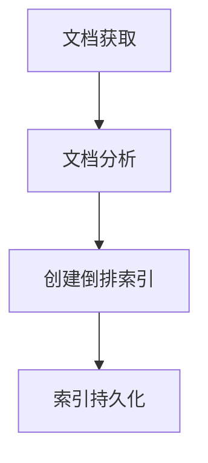
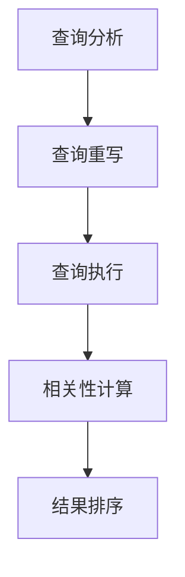

# Lucene搜索的基本概念与核心原理

## 1.背景介绍

### 1.1 什么是Lucene

Lucene是一个基于Java的开源全文搜索引擎库,它不是一个完整的搜索应用程序,而是一个可嵌入的核心库,可用于为应用程序添加全文搜索功能。Lucene提供了强大的索引和搜索功能,可以高效地执行结构化和全文搜索。

### 1.2 全文搜索的重要性

在当今信息时代,数据量呈指数级增长,有效地搜索和检索信息变得至关重要。全文搜索技术能够从大量非结构化的数据(如文本文件、PDF文件、Word文档等)中快速找到相关信息。它广泛应用于网站搜索、电子邮件存档、知识管理系统、数字图书馆等领域。

### 1.3 Lucene的优势

Lucene具有以下优势:

- 高性能:使用倒排索引和多线程技术,能够快速搜索大量数据。
- 高可扩展性:可通过分片和复制实现水平扩展。
- 跨平台:基于Java开发,可运行在任何Java虚拟机上。
- 多语言支持:支持多种语言的分词和相关性排名。
- 开源免费:Apache开源项目,可免费使用和修改源代码。

## 2.核心概念与联系

### 2.1 倒排索引

倒排索引是Lucene的核心数据结构,它将文档中的词项与文档的对应关系倒过来存储,从而实现快速搜索。倒排索引由以下几部分组成:

1. **术语词典(Term Dictionary)**:存储所有唯一的词项,并为每个词项分配一个唯一的编号(TermID)。
2. **文档存储(Document Storage)**:存储原始文档的内容。
3. **倒排文件(Inverted File)**:记录每个词项在哪些文档中出现过,以及词频(TF)信息。

通过倒排索引,可以快速找到包含查询词项的文档集合。

### 2.2 分词器

分词器(Analyzer)用于将文本拆分为单个的词项(Term),并进行标准化处理(如小写、去除标点符号等)。Lucene提供了多种分词器,如标准分词器(StandardAnalyzer)、白空格分词器(WhitespaceAnalyzer)等。

```java
Analyzer analyzer = new StandardAnalyzer();
TokenStream tokenStream = analyzer.tokenStream("myField", new StringReader("This is a test"));
```

### 2.3 索引和搜索

Lucene将文档的内容转换为倒排索引的过程称为索引(Indexing),搜索(Searching)则是根据查询词从倒排索引中找到相关文档的过程。

```java
IndexWriter indexWriter = new IndexWriter(directory, new IndexWriterConfig(analyzer));
Document doc = new Document();
doc.add(new TextField("content", "This is a test document", Store.YES));
indexWriter.addDocument(doc);

IndexReader indexReader = DirectoryReader.open(directory);
IndexSearcher indexSearcher = new IndexSearcher(indexReader);
Query query = new TermQuery(new Term("content", "test"));
TopDocs topDocs = indexSearcher.search(query, 10);
```

## 3.核心算法原理具体操作步骤

### 3.1 索引构建过程

Lucene的索引构建过程包括以下步骤:

1. **文档获取**:从数据源(如文件系统、数据库等)获取原始文档。
2. **文档分析**:使用分词器将文档内容拆分为词项(Term)序列,并进行标准化处理。
3. **创建倒排索引**:遍历每个文档,将词项与文档ID、词频等信息存储在倒排索引中。
4. **索引持久化**:将内存中的倒排索引数据结构写入磁盘文件。

索引构建过程如下图所示:



### 3.2 查询处理过程

当进行搜索查询时,Lucene会执行以下步骤:

1. **查询分析**:使用分词器将查询字符串拆分为词项序列。
2. **查询重写**:将原始查询重写为更加高效的底层查询表示形式。
3. **查询执行**:遍历倒排索引,找到与查询词项相关的文档集合。
4. **相关性计算**:根据相关性算分函数(如TF-IDF、BM25等)计算每个文档与查询的相关程度。
5. **结果排序**:按照相关性分数对文档进行排序。

查询处理过程如下图所示:



## 4.数学模型和公式详细讲解举例说明

### 4.1 TF-IDF算法

TF-IDF(Term Frequency-Inverse Document Frequency)是一种常用的相关性算分函数,用于计算一个词项在文档集合中的重要程度。TF-IDF值由两部分组成:

1. **词频(TF)**:词项在文档中出现的次数,反映了该词项在当前文档中的重要程度。
2. **逆向文档频率(IDF)**:词项在整个文档集合中出现的文档数的倒数,用于降低常见词项的权重。

TF-IDF的公式如下:

$$\mathrm{TF-IDF}(t,d,D) = \mathrm{TF}(t,d) \times \mathrm{IDF}(t,D)$$

其中:

- $\mathrm{TF}(t,d)$表示词项$t$在文档$d$中的词频。
- $\mathrm{IDF}(t,D) = \log\left(\frac{N}{|\{d \in D : t \in d\}|}\right)$表示词项$t$在文档集合$D$中的逆向文档频率,其中$N$是文档总数,$|\{d \in D : t \in d\}|$是包含词项$t$的文档数量。

例如,假设文档集合$D$包含10个文档,其中有5个文档包含词项"lucene",则"lucene"的IDF值为:

$$\mathrm{IDF}(\text{"lucene"},D) = \log\left(\frac{10}{5}\right) = 0.301$$

### 4.2 BM25算法

BM25是另一种常用的相关性算分函数,它在TF-IDF的基础上引入了一些调整因子,以更好地估计词项对文档的重要性。BM25的公式如下:

$$\mathrm{BM25}(d,q) = \sum_{t \in q} \mathrm{IDF}(t) \cdot \frac{(k_1 + 1) \cdot \mathrm{TF}(t,d)}{k_1 \cdot \left(1 - b + b \cdot \frac{|d|}{avgdl}\right) + \mathrm{TF}(t,d)}$$

其中:

- $\mathrm{IDF}(t)$是词项$t$的逆向文档频率。
- $\mathrm{TF}(t,d)$是词项$t$在文档$d$中的词频。
- $k_1$和$b$是调整因子,用于控制词频和文档长度对相关性分数的影响。
- $|d|$是文档$d$的长度(词项数量)。
- $avgdl$是文档集合的平均文档长度。

通常情况下,可以使用$k_1 = 1.2$和$b = 0.75$作为BM25的默认参数值。

例如,假设查询为"lucene search",文档$d_1$包含词项"lucene"出现5次,词项"search"出现3次,文档长度为1000词项,平均文档长度为500词项,则$d_1$对于该查询的BM25分数为:

$$\begin{align*}
\mathrm{BM25}(d_1, \text{"lucene search"}) &= \mathrm{IDF}(\text{"lucene"}) \cdot \frac{(1.2 + 1) \cdot 5}{1.2 \cdot \left(1 - 0.75 + 0.75 \cdot \frac{1000}{500}\right) + 5} \\
&+ \mathrm{IDF}(\text{"search"}) \cdot \frac{(1.2 + 1) \cdot 3}{1.2 \cdot \left(1 - 0.75 + 0.75 \cdot \frac{1000}{500}\right) + 3}
\end{align*}$$

## 4.项目实践:代码实例和详细解释说明

以下是使用Lucene进行索引和搜索的Java代码示例:

```java
// 创建索引
Directory directory = FSDirectory.open(Paths.get("index"));
Analyzer analyzer = new StandardAnalyzer();
IndexWriterConfig config = new IndexWriterConfig(analyzer);
IndexWriter indexWriter = new IndexWriter(directory, config);

// 添加文档到索引
Document doc1 = new Document();
doc1.add(new TextField("title", "Lucene in Action", Store.YES));
doc1.add(new TextField("content", "This book explains Lucene concepts and features.", Store.YES));
indexWriter.addDocument(doc1);

Document doc2 = new Document();
doc2.add(new TextField("title", "Lucene for Dummies", Store.YES));
doc2.add(new TextField("content", "This is a beginner's guide to Lucene.", Store.YES));
indexWriter.addDocument(doc2);

indexWriter.close();

// 搜索
DirectoryReader reader = DirectoryReader.open(directory);
IndexSearcher searcher = new IndexSearcher(reader);

// 构建查询
QueryParser parser = new QueryParser("content", analyzer);
Query query = parser.parse("Lucene");

// 执行搜索并获取前5个结果
TopDocs topDocs = searcher.search(query, 5);
ScoreDoc[] hits = topDocs.scoreDocs;

// 输出结果
for (ScoreDoc hit : hits) {
    Document doc = searcher.doc(hit.doc);
    System.out.println("Title: " + doc.get("title"));
    System.out.println("Content: " + doc.get("content"));
    System.out.println("Score: " + hit.score);
    System.out.println("---");
}

reader.close();
```

代码解释:

1. 创建`Directory`对象,用于存储索引文件。
2. 创建`Analyzer`对象,用于文档和查询的分词处理。
3. 创建`IndexWriter`对象,用于构建索引。
4. 使用`Document`对象表示文档,并添加字段(如标题、内容等)。
5. 调用`IndexWriter.addDocument()`方法将文档添加到索引中。
6. 关闭`IndexWriter`以完成索引构建。
7. 创建`DirectoryReader`和`IndexSearcher`对象,用于搜索索引。
8. 使用`QueryParser`构建查询对象。
9. 调用`IndexSearcher.search()`方法执行查询,获取前5个搜索结果。
10. 遍历搜索结果,输出文档标题、内容和相关性分数。

## 5.实际应用场景

Lucene广泛应用于以下场景:

1. **网站搜索**:为网站提供全文搜索功能,如电子商务网站的产品搜索、新闻网站的文章搜索等。
2. **企业搜索**:为企业内部的文档、邮件、知识库等提供搜索功能,方便员工查找所需信息。
3. **移动应用搜索**:在移动应用中集成搜索功能,如手机通讯录搜索、笔记应用搜索等。
4. **日志分析**:对系统日志进行全文搜索和分析,用于故障诊断和性能优化。
5. **垂直搜索**:针对特定领域(如医疗、法律等)构建专门的搜索引擎。

Lucene的应用场景非常广泛,无论是大型网站还是小型应用程序,都可以使用Lucene为用户提供高效的搜索体验。

## 6.工具和资源推荐

### 6.1 Lucene生态圈

Lucene是一个核心库,周围还有许多相关的工具和项目,构成了完整的Lucene生态圈:

- **Solr**:基于Lucene构建的企业级搜索服务器,提供分布式索引、复制、负载均衡等高级功能。
- **Elasticsearch**:开源分布式搜索和分析引擎,基于Lucene,提供RESTful API和聚合分析等功能。
- **Nutch**:开源的网页爬虫和搜索引擎,使用Lucene作为索引和搜索组件。
- **Apache Tika**:用于从各种文件格式(如PDF、Word、Excel等)中提取文本内容,与Lucene配合使用。

### 6.2 Lucene资源

以下是一些学习Lucene的有用资源:

- **Lucene官方文档**:https://lucene.apache.org/
- **Lucene入门书籍**:"Lucene in Action"、"Lucene实战指南"等。
- **Lucene在线课程