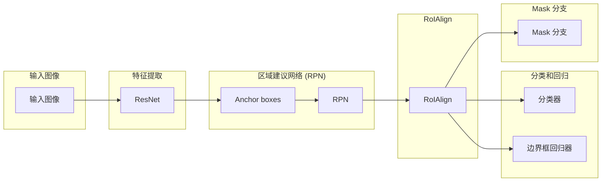

## 1. 背景介绍

### 1.1 计算机视觉的挑战

计算机视觉是人工智能领域的一个重要分支，其目标是使计算机能够“看到”和理解图像和视频。近年来，随着深度学习技术的快速发展，计算机视觉领域取得了突破性进展，并在人脸识别、物体检测、图像分类等任务中取得了令人瞩目的成果。然而，计算机视觉仍然面临着许多挑战，其中之一就是**实例分割**。

### 1.2 实例分割的定义和意义

实例分割是指在图像中将每个物体实例（instance）进行像素级别的分割，并为每个实例分配一个唯一的类别标签。与传统的图像分类和物体检测任务不同，实例分割不仅需要识别图像中的物体，还需要确定每个物体的精确边界。这使得实例分割成为一项更具挑战性的任务，但也具有更广泛的应用价值。

### 1.3 Mask R-CNN的提出和优势

为了解决实例分割问题，Facebook AI Research (FAIR) 于 2017 年提出了 **Mask R-CNN** 算法。Mask R-CNN 是一种基于深度学习的实例分割算法，它在 Faster R-CNN 的基础上进行了改进，并取得了显著的性能提升。Mask R-CNN 的主要优势在于：

* **高精度:** Mask R-CNN 在 COCO 数据集上取得了 state-of-the-art 的实例分割结果。
* **高效:** Mask R-CNN 能够实时进行实例分割，并可以应用于各种场景。
* **灵活:** Mask R-CNN 可以很容易地扩展到其他任务，例如人体姿态估计和关键点检测。

## 2. 核心概念与联系

### 2.1 Faster R-CNN

Mask R-CNN 是基于 Faster R-CNN 的，因此我们需要先了解 Faster R-CNN 的核心概念和工作原理。Faster R-CNN 是一种 two-stage 的物体检测算法，其主要步骤如下：

1. **特征提取:** 使用卷积神经网络 (CNN) 提取输入图像的特征图。
2. **区域建议网络 (RPN):** RPN 是 Faster R-CNN 的核心组件，它用于生成候选物体区域 (Region of Interest, RoI)。RPN 通过在特征图上滑动一个小型网络来预测每个位置是否存在物体，并生成相应的边界框。
3. **RoI Pooling:** 对每个 RoI 进行池化操作，将其转换为固定大小的特征图。
4. **分类和回归:** 使用全连接网络对每个 RoI 进行分类和边界框回归，最终得到物体的类别和精确位置。

### 2.2 Mask R-CNN 的改进

Mask R-CNN 在 Faster R-CNN 的基础上进行了以下改进：

* **添加 mask 分支:** Mask R-CNN 在 Faster R-CNN 的基础上添加了一个 mask 分支，用于预测每个 RoI 的像素级别的 mask。
* **使用 RoIAlign:** Mask R-CNN 使用 RoIAlign 代替 RoI Pooling，以提高 mask 的预测精度。
* **使用 ResNet:** Mask R-CNN 使用 ResNet 作为 backbone 网络，以提高特征提取能力。

## 3. 核心算法原理具体操作步骤

### 3.1 网络架构

Mask R-CNN 的网络架构如下图所示：



### 3.2 算法流程

Mask R-CNN 的算法流程如下：

1. **特征提取:** 使用 ResNet 提取输入图像的特征图。
2. **区域建议网络 (RPN):** RPN 在特征图上滑动，预测每个位置是否存在物体，并生成相应的边界框。
3. **RoIAlign:** 对每个 RoI 进行 RoIAlign 操作，将其转换为固定大小的特征图。
4. **分类和回归:** 使用全连接网络对每个 RoI 进行分类和边界框回归，得到物体的类别和精确位置。
5. **Mask 分支:** 使用 mask 分支预测每个 RoI 的像素级别的 mask。

### 3.3 损失函数

Mask R-CNN 的损失函数包含三个部分：

* **分类损失:** 用于衡量分类器的预测结果与真实类别之间的差距。
* **边界框回归损失:** 用于衡量边界框回归器的预测结果与真实边界框之间的差距。
* **Mask 损失:** 用于衡量 mask 分支的预测结果与真实 mask 之间的差距。

## 4. 数学模型和公式详细讲解举例说明

### 4.1 RoIAlign

RoIAlign 是 Mask R-CNN 的核心组件之一，它用于将 RoI 转换为固定大小的特征图。与 RoI Pooling 不同，RoIAlign 使用双线性插值来计算每个 RoI 中的特征值，从而提高 mask 的预测精度。

假设 RoI 的大小为 $H \times W$，目标特征图的大小为 $h \times w$。RoIAlign 的步骤如下：

1. 将 RoI 划分为 $h \times w$ 个子区域。
2. 对每个子区域，使用双线性插值计算其特征值。
3. 将所有子区域的特征值组合起来，得到目标特征图。

### 4.2 Mask 损失

Mask 损失用于衡量 mask 分支的预测结果与真实 mask 之间的差距。Mask R-CNN 使用交叉熵损失函数来计算 mask 损失。

假设 mask 分支的预测结果为 $p_{ij}$，真实 mask 为 $y_{ij}$，则 mask 损失可以表示为：

$$
L_{mask} = -\frac{1}{N} \sum_{i=1}^{H} \sum_{j=1}^{W} y_{ij} \log p_{ij} + (1 - y_{ij}) \log (1 - p_{ij})
$$

其中 $N$ 为 RoI 中的像素数量。

## 5. 项目实践：代码实例和详细解释说明

### 5.1 环境配置

在运行 Mask R-CNN 代码之前，需要先配置好相应的环境。Mask R-CNN 的代码基于 Python 3 和 TensorFlow 框架。

### 5.2 数据准备

Mask R-CNN 的训练需要大量的标注数据。COCO 数据集是一个常用的实例分割数据集，它包含了大量的图像和标注信息。

### 5.3 模型训练

可以使用以下代码训练 Mask R-CNN 模型：

```python
import tensorflow as tf
from mask_rcnn import MaskRCNN

# 定义模型参数
config = MaskRCNNConfig()

# 创建模型
model = MaskRCNN(config)

# 加载 COCO 数据集
dataset = COCODataset()

# 训练模型
model.train(dataset)
```

### 5.4 模型评估

可以使用以下代码评估 Mask R-CNN 模型的性能：

```python
# 加载训练好的模型
model = MaskRCNN(config)

# 加载 COCO 数据集
dataset = COCODataset()

# 评估模型
results = model.evaluate(dataset)

# 打印评估结果
print(results)
```

## 6. 实际应用场景

### 6.1 自动驾驶

Mask R-CNN 可以用于自动驾驶中的物体识别和场景理解。例如，Mask R-CNN 可以识别道路上的车辆、行人、交通信号灯等物体，并为每个物体生成精确的 mask。

### 6.2 医疗影像分析

Mask R-CNN 可以用于医学影像分析，例如识别肿瘤、器官等医学影像中的目标区域。Mask R-CNN 可以为每个目标区域生成精确的 mask，从而帮助医生进行诊断和治疗。

### 6.3 机器人视觉

Mask R-CNN 可以用于机器人视觉，例如识别物体、抓取物体等。Mask R-CNN 可以为每个物体生成精确的 mask，从而帮助机器人进行精细的操作。

## 7. 总结：未来发展趋势与挑战

### 7.1 未来发展趋势

* **更高效的模型:** 研究人员正在努力开发更高效的 Mask R-CNN 模型，以提高其推理速度和效率。
* **更精确的 mask 预测:** 研究人员正在探索新的方法来提高 mask 的预测精度，例如使用更复杂的网络架构和损失函数。
* **更广泛的应用:** Mask R-CNN 的应用领域正在不断扩展，例如视频分析、3D 场景理解等。

### 7.2 挑战

* **数据标注成本高:** 实例分割需要大量的标注数据，而数据标注成本高昂。
* **模型复杂度高:** Mask R-CNN 模型复杂度高，需要大量的计算资源进行训练和推理。
* **实时性要求高:** 一些应用场景需要实时进行实例分割，这对 Mask R-CNN 的推理速度提出了更高的要求。

## 8. 附录：常见问题与解答

### 8.1 Mask R-CNN 与 Faster R-CNN 的区别是什么？

Mask R-CNN 在 Faster R-CNN 的基础上添加了一个 mask 分支，用于预测每个 RoI 的像素级别的 mask。此外，Mask R-CNN 使用 RoIAlign 代替 RoI Pooling，以提高 mask 的预测精度。

### 8.2 Mask R-CNN 的应用场景有哪些？

Mask R-CNN 可以应用于各种场景，例如自动驾驶、医疗影像分析、机器人视觉等。

### 8.3 Mask R-CNN 的未来发展趋势是什么？

Mask R-CNN 的未来发展趋势包括更高效的模型、更精确的 mask 预测、更广泛的应用等。