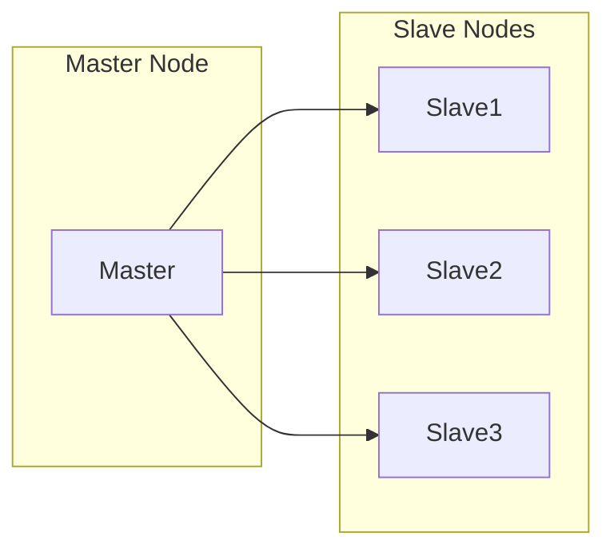

## 1. 背景介绍

### 1.1 分布式系统与资源管理挑战
随着互联网的快速发展，数据中心规模越来越大，应用程序也越来越复杂。传统的单机系统已经无法满足日益增长的计算需求，分布式系统应运而生。分布式系统将计算任务分散到多个节点上进行处理，能够有效提高系统的吞吐量、可扩展性和容错性。

然而，分布式系统也带来了新的挑战，其中最突出的就是资源管理问题。如何高效地分配和管理集群中的计算资源，是构建高性能、高可靠性分布式系统的关键。

### 1.2 Mesos的诞生与发展
为了解决分布式系统资源管理难题，Apache Mesos应运而生。Mesos是一个开源的集群管理器，它能够高效地管理集群中的计算资源，并将这些资源提供给各种分布式应用程序使用。

Mesos最初由加州大学伯克利分校的研究人员开发，并在Twitter等大型互联网公司得到广泛应用。Mesos的设计目标是构建一个灵活、高效、可靠的资源管理平台，能够支持各种类型的分布式应用程序，包括大数据处理、Web服务、机器学习等。

## 2. 核心概念与联系

### 2.1 Mesos架构
Mesos采用主从架构，由一个Master节点和多个Slave节点组成。

- **Master节点**：负责管理集群中的所有资源，并将资源分配给不同的Framework。
- **Slave节点**：负责执行Framework提交的任务，并向Master节点汇报资源使用情况。
- **Framework**：是一个分布式应用程序，它向Mesos申请资源，并在获得资源后启动任务。

Mesos的架构图如下所示：



### 2.2 资源抽象
Mesos将集群中的资源抽象为CPU、内存、磁盘空间等，并以“资源Offer”的形式提供给Framework。资源Offer包含了可用资源的数量、资源所在的Slave节点等信息。

### 2.3 任务调度
Framework根据自身需求，选择合适的资源Offer，并将任务提交到对应的Slave节点上执行。Mesos支持多种任务调度策略，例如FIFO、公平调度、优先级调度等。

### 2.4 资源隔离
Mesos使用Linux Container技术对不同Framework的任务进行隔离，确保不同Framework之间不会相互干扰。

## 3. 核心算法原理具体操作步骤

### 3.1 资源Offer机制
Master节点定期向所有Slave节点发送资源Offer，Slave节点将可用资源信息汇报给Master节点。Master节点根据Framework的资源需求，将合适的资源Offer发送给Framework。

### 3.2 两级调度
Mesos采用两级调度机制，首先由Master节点将资源Offer发送给Framework，然后由Framework决定接受哪些资源Offer，并将任务提交到对应的Slave节点上执行。

### 3.3 资源回收
当任务执行完毕后，Mesos会将资源回收，并重新分配给其他Framework使用。

## 4. 数学模型和公式详细讲解举例说明

### 4.1 资源分配模型
Mesos的资源分配模型基于 Dominant Resource Fairness (DRF) 算法，该算法旨在确保不同Framework之间公平地共享集群资源。

DRF算法的核心思想是计算每个Framework的 dominant resource share，即该Framework占用的资源比例最高的资源类型。例如，如果一个Framework主要使用CPU资源，则其dominant resource share就是CPU资源占用的比例。

DRF算法会根据每个Framework的dominant resource share，为其分配相应的资源。

### 4.2 资源分配公式
假设集群中有 $n$ 个Framework，每个Framework $i$ 的 dominant resource share 为 $d_i$，则Framework $i$ 应该获得的资源比例为：

$$
\frac{d_i}{\sum_{j=1}^{n} d_j}
$$

## 5. 项目实践：代码实例和详细解释说明

### 5.1 编写Framework
以下是编写一个简单Framework的示例代码：

```python
from mesos.interface import Scheduler, Executor
from mesos.native import MesosSchedulerDriver

class MyScheduler(Scheduler):
    def registered(self, driver, frameworkId, masterInfo):
        print("Registered with framework ID:", frameworkId)

    def resourceOffers(self, driver, offers):
        for offer in offers:
            # 检查资源Offer是否满足需求
            # ...
            # 构建任务
            task = {
                'task_id': {
                    'value': 'my_task_id'
                },
                'slave_id': offer.slave_id,
                'resources': [
                    {
                        'name': 'cpus',
                        'type': 'SCALAR',
                        'scalar': {'value': 1}
                    },
                    {
                        'name': 'mem',
                        'type': 'SCALAR',
                        'scalar': {'value': 1024}
                    }
                ],
                'command': {
                    'value': 'echo "Hello, world!"'
                }
            }
            # 提交任务
            driver.launchTasks(offer.id, [task])

class MyExecutor(Executor):
    def launchTask(self, driver, task):
        # 执行任务
        # ...
        # 任务执行完毕后，发送状态更新
        driver.sendStatusUpdate(task.task_id, 'TASK_FINISHED')

if __name__ == "__main__":
    framework = {
        'user': 'user',
        'name': 'my_framework'
    }
    scheduler = MyScheduler()
    executor = MyExecutor()
    driver = MesosSchedulerDriver(scheduler, framework, 'master:5050')
    driver.run()
```

### 5.2 代码解释
- `MyScheduler` 类实现了 `Scheduler` 接口，负责处理资源Offer、提交任务等操作。
- `resourceOffers` 方法会在收到资源Offer时被调用，该方法会遍历所有资源Offer，并检查是否满足Framework的需求。如果满足需求，则构建任务并提交到对应的Slave节点上执行。
- `MyExecutor` 类实现了 `Executor` 接口，负责执行任务。
- `launchTask` 方法会在任务被调度到Slave节点上执行时被调用，该方法会执行任务，并在任务执行完毕后发送状态更新。
- `MesosSchedulerDriver` 类负责与Mesos Master节点进行通信。

## 6. 实际应用场景

### 6.1 大数据处理
Mesos被广泛应用于大数据处理领域，例如Hadoop、Spark等。Mesos能够高效地管理集群资源，并将资源提供给大数据处理框架使用，从而提高数据处理效率。

### 6.2 Web服务
Mesos也适用于Web服务场景，例如部署和管理Web服务器、数据库等。Mesos能够根据Web服务负载动态调整资源分配，确保Web服务的稳定性和可靠性。

### 6.3 机器学习
Mesos还被用于机器学习领域，例如训练和部署机器学习模型。Mesos能够将集群资源分配给机器学习框架使用，从而加速模型训练和部署过程。

## 7. 工具和资源推荐

### 7.1 Apache Mesos官网
https://mesos.apache.org/

### 7.2 Mesos文档
https://mesos.apache.org/documentation/

### 7.3 Mesos社区
https://mesos.apache.org/community/

## 8. 总结：未来发展趋势与挑战

### 8.1 容器化
随着容器技术的快速发展，Mesos也开始支持容器化部署。未来，Mesos将更加紧密地与容器技术集成，提供更加灵活、高效的资源管理方案。

### 8.2 云原生
Mesos也在积极拥抱云原生技术，例如Kubernetes。未来，Mesos将更加适应云原生环境，为云原生应用程序提供更加强大的资源管理能力。

### 8.3 人工智能
随着人工智能技术的快速发展，Mesos也开始探索在人工智能领域的应用。未来，Mesos将更加智能地管理集群资源，为人工智能应用提供更加高效的资源调度和管理方案。

## 9. 附录：常见问题与解答

### 9.1 Mesos与Kubernetes的区别是什么？
Mesos和Kubernetes都是集群管理平台，但它们的设计目标和应用场景有所不同。Mesos更加注重资源管理的效率和灵活性，而Kubernetes更加注重应用部署的便捷性和可移植性。

### 9.2 如何学习Mesos？
学习Mesos可以参考官方文档、社区论坛、相关书籍等资源。此外，还可以通过实践项目来加深对Mesos的理解。


---

希望这篇文章能够帮助你更好地理解Mesos的原理和应用。如果你有任何问题或建议，欢迎留言讨论。
