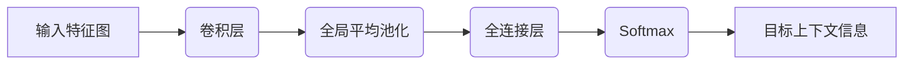

## 1. 背景介绍

### 1.1 OCR技术的应用与挑战

光学字符识别（OCR）是指电子设备检查纸上打印的字符，通过检测暗、亮的模式确定其形状，然后用字符识别方法将形状翻译成计算机文字的过程，是模式识别、人工智能和计算机视觉领域中的一个重要分支。OCR技术的应用场景非常广泛，例如：

* **文档数字化:** 将纸质文档转换为可编辑和可搜索的数字格式，方便存储、检索和管理。
* **车牌识别:** 自动识别车辆的车牌号码，用于交通管理、停车收费等场景。
* **身份证识别:** 自动识别身份证上的个人信息，用于身份验证、金融服务等场景。
* **票据识别:** 自动识别各种票据上的关键信息，用于财务管理、报销等场景。

然而，OCR技术也面临着诸多挑战，例如：

* **文字的多样性:** 不同语言、字体、大小、颜色、背景的文字识别难度较大。
* **图像质量问题:** 光照不均、噪声、模糊、扭曲等图像质量问题会影响识别精度。
* **版面布局复杂:**  表格、图形、公式等复杂版面布局会增加识别难度。

### 1.2 深度学习推动OCR技术发展

近年来，深度学习技术的快速发展为OCR技术带来了新的突破。基于深度学习的OCR方法具有以下优势：

* **特征提取能力强:** 深度神经网络能够自动学习图像的特征，无需人工设计特征。
* **泛化能力强:** 深度学习模型能够适应不同类型的文字和图像，具有较强的泛化能力。
* **识别精度高:** 深度学习方法在OCR任务上取得了显著的性能提升，识别精度不断提高。


### 1.3 OCRNet的提出与优势

OCRNet (Object-Contextual Representations for Semantic Segmentation) 是近年来提出的一种基于深度学习的语义分割网络，在OCR领域取得了显著的成果。OCRNet的主要优势在于：

* **引入目标上下文信息:** OCRNet通过引入目标上下文信息，能够更好地识别图像中的文字区域，提高识别精度。
* **端到端训练:** OCRNet可以进行端到端的训练，简化了训练过程，提高了模型的效率。
* **开源代码和预训练模型:** OCRNet的代码和预训练模型已开源，方便研究者和开发者使用。


## 2. 核心概念与联系

### 2.1 语义分割

语义分割是指将图像中的每个像素分类到预定义的类别中，例如：人、车、树、天空等。与图像分类不同，语义分割不仅要识别图像中的物体，还要确定物体的边界和位置。

### 2.2 目标上下文信息

目标上下文信息是指图像中与目标物体相关的周围信息，例如：目标物体的形状、颜色、纹理、位置等。目标上下文信息可以帮助模型更好地理解图像内容，提高识别精度。

### 2.3 OCRNet的网络架构

OCRNet的网络架构主要由三部分组成：

* **特征提取网络:** 用于提取图像的特征，例如：ResNet、VGG等。
* **目标上下文模块:** 用于提取目标上下文信息，并将其与特征图融合。
* **语义分割头:** 用于预测每个像素的类别。


## 3. 核心算法原理具体操作步骤

OCRNet的核心算法原理是利用目标上下文信息来提高语义分割的精度。具体操作步骤如下：

1. **特征提取:** 使用特征提取网络提取图像的特征图。
2. **目标上下文提取:**  使用目标上下文模块提取目标上下文信息。
3. **特征融合:** 将特征图和目标上下文信息融合，得到融合后的特征图。
4. **语义分割:** 使用语义分割头预测每个像素的类别。

### 3.1 目标上下文模块

目标上下文模块是OCRNet的核心组件，其作用是提取目标上下文信息。目标上下文模块的结构如下图所示：



目标上下文模块的输入是特征提取网络输出的特征图，输出是目标上下文信息。目标上下文模块的工作流程如下：

1. **卷积层:** 对输入特征图进行卷积操作，提取局部特征。
2. **全局平均池化:** 对卷积后的特征图进行全局平均池化操作，得到全局特征向量。
3. **全连接层:** 对全局特征向量进行全连接操作，得到目标上下文信息。
4. **Softmax:** 对目标上下文信息进行Softmax操作，得到每个类别的概率分布。

### 3.2 特征融合

特征融合是指将特征图和目标上下文信息融合，得到融合后的特征图。特征融合的方法有很多种，OCRNet中使用的是元素级相加的方法，即将特征图和目标上下文信息对应位置的元素相加。

### 3.3 语义分割头

语义分割头用于预测每个像素的类别。语义分割头的结构通常是一个卷积层， followed by a softmax activation function.

## 4. 数学模型和公式详细讲解举例说明

### 4.1 全局平均池化

全局平均池化 (Global Average Pooling, GAP) 是一种池化操作，其作用是将输入特征图的每个通道的平均值作为输出特征图的对应通道的值。全局平均池化的公式如下：

$$
GAP(x) = \frac{1}{H \times W} \sum_{i=1}^{H} \sum_{j=1}^{W} x_{i,j}
$$

其中，$x$ 是输入特征图，$H$ 和 $W$ 分别是输入特征图的高度和宽度。

### 4.2 Softmax函数

Softmax函数是一种激活函数，其作用是将输入向量转换为概率分布。Softmax函数的公式如下：

$$
Softmax(x_i) = \frac{e^{x_i}}{\sum_{j=1}^{n} e^{x_j}}
$$

其中，$x$ 是输入向量，$n$ 是输入向量的维度。

## 5. 项目实践：代码实例和详细解释说明

### 5.1 OCRNet的代码实现

OCRNet的代码实现可以使用PyTorch框架。以下是一个简单的OCRNet代码示例：

```python
import torch
import torch.nn as nn

class OCRNet(nn.Module):
    def __init__(self, num_classes):
        super(OCRNet, self).__init__()

        # 特征提取网络
        self.backbone = ResNet50()

        # 目标上下文模块
        self.object_context = nn.Sequential(
            nn.Conv2d(2048, 512, kernel_size=3, padding=1),
            nn.AdaptiveAvgPool2d(1),
            nn.Linear(512, num_classes),
            nn.Softmax(dim=1)
        )

        # 语义分割头
        self.segmentation_head = nn.Conv2d(2048, num_classes, kernel_size=1)

    def forward(self, x):
        # 特征提取
        features = self.backbone(x)

        # 目标上下文提取
        object_context = self.object_context(features)

        # 特征融合
        features = features + object_context[:, :, None, None]

        # 语义分割
        segmentation = self.segmentation_head(features)

        return segmentation
```

### 5.2 代码解释

* `backbone`: 特征提取网络，这里使用的是ResNet50。
* `object_context`: 目标上下文模块，由卷积层、全局平均池化层、全连接层和Softmax层组成。
* `segmentation_head`: 语义分割头，由卷积层组成。
* `forward()`: 前向传播函数，定义了OCRNet的网络结构和计算流程。

## 6. 实际应用场景

OCRNet可以应用于各种OCR任务，例如：

* **文档数字化:** 将纸质文档转换为可编辑和可搜索的数字格式。
* **车牌识别:** 自动识别车辆的车牌号码。
* **身份证识别:** 自动识别身份证上的个人信息。
* **票据识别:** 自动识别各种票据上的关键信息。

## 7. 工具和资源推荐

* **PyTorch:** 深度学习框架，用于实现OCRNet。
* **OCRNet GitHub repository:** OCRNet的代码和预训练模型。
* **Labelme:** 图像标注工具，用于创建OCR数据集。

## 8. 总结：未来发展趋势与挑战

OCRNet是一种有效的基于深度学习的OCR方法，其引入目标上下文信息能够显著提高识别精度。未来，OCR技术将朝着以下方向发展：

* **更高效的网络架构:** 研究更高效的网络架构，提高OCR模型的效率。
* **更强大的目标上下文信息:** 探索更强大的目标上下文信息，进一步提高识别精度。
* **多模态OCR:** 将OCR技术与其他模态信息（例如：语音、文本）相结合，实现更强大的OCR系统。

## 9. 附录：常见问题与解答

### 9.1 OCRNet的训练技巧

* **数据增强:** 使用数据增强技术，例如：随机裁剪、翻转、旋转等，可以增加训练数据的多样性，提高模型的泛化能力。
* **学习率调整:** 使用合适的学习率调整策略，例如：学习率衰减、warm-up等，可以加速模型的收敛速度，提高模型的性能。
* **正则化:** 使用正则化技术，例如：L2正则化、dropout等，可以防止模型过拟合，提高模型的泛化能力。

### 9.2 OCRNet的应用技巧

* **预处理:** 对输入图像进行预处理，例如：灰度化、