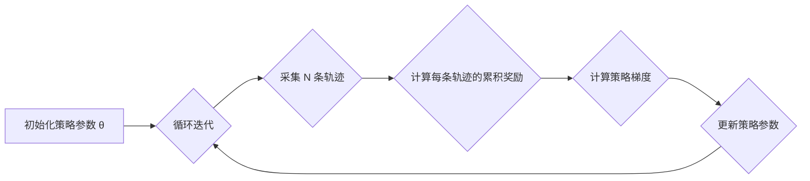

## 1. 背景介绍

### 1.1 强化学习的崛起

强化学习（Reinforcement Learning，RL）作为机器学习的一个重要分支，近年来取得了令人瞩目的成就，AlphaGo、AlphaStar 等人工智能技术的突破更是将其推向了新的高度。强化学习的核心思想是让智能体（Agent）通过与环境交互，不断学习最优策略，从而在复杂多变的环境中取得最大化的累积奖励。

### 1.2 Policy Gradients方法的优势

在强化学习领域，策略梯度（Policy Gradients）方法是一种重要的策略优化方法，它直接对策略进行参数化建模，并通过梯度上升的方式更新策略参数，以最大化累积奖励。相比于基于值函数的方法，策略梯度方法具有以下优势：

* **可以直接优化策略**:  Policy Gradients 方法直接对策略进行参数化建模，避免了值函数估计带来的误差，使得策略优化更加直接和高效。
* **适用于连续动作空间**:  Policy Gradients 方法可以处理连续动作空间，而基于值函数的方法通常需要对动作空间进行离散化，这会损失一定的精度。
* **可以处理高维状态空间**:  Policy Gradients 方法可以结合深度神经网络等强大的函数逼近器，处理高维状态空间，使得其在复杂环境中具有更强的适应能力。

### 1.3 本文目标

本文将深入浅出地介绍 Policy Gradients 方法的原理，并结合代码实例，帮助读者理解其工作机制以及如何应用于实际问题。

## 2. 核心概念与联系

### 2.1 Markov 决策过程（MDP）

强化学习问题通常被建模为 Markov 决策过程（Markov Decision Process，MDP）。MDP 是一个五元组 <S, A, P, R, γ>，其中：

* **S**: 状态空间，表示智能体可能处于的所有状态的集合。
* **A**: 动作空间，表示智能体可以采取的所有动作的集合。
* **P**: 状态转移概率，表示在状态 s 采取动作 a 后，转移到状态 s' 的概率，记为 P(s'|s, a)。
* **R**: 奖励函数，表示在状态 s 采取动作 a 后，智能体获得的奖励，记为 R(s, a)。
* **γ**: 折扣因子，用于衡量未来奖励对当前决策的影响，取值范围为 [0, 1]。

### 2.2 策略（Policy）

策略是指智能体在给定状态下，选择动作的规则。策略可以是确定性的，也可以是随机的。

* **确定性策略**:  将状态映射到唯一的动作，记为 π(s) = a。
* **随机性策略**:  将状态映射到动作的概率分布，记为 π(a|s)。

### 2.3 轨迹（Trajectory）

轨迹是指智能体与环境交互过程中，所经历的一系列状态、动作和奖励，记为 τ = (s_0, a_0, r_0, s_1, a_1, r_1, ..., s_T, a_T, r_T)。

### 2.4 累积奖励（Return）

累积奖励是指智能体从某个状态开始，沿着某个轨迹，所获得的总奖励，记为 G_t = r_t + γ * r_{t+1} + γ^2 * r_{t+2} + ... + γ^{T-t} * r_T。

### 2.5 目标函数（Objective Function）

Policy Gradients 方法的目标是找到一个最优策略，使得智能体在与环境交互过程中，能够获得最大化的累积奖励。因此，其目标函数可以定义为：

$$J(\theta) = E_{\tau \sim \pi_\theta}[G_0]$$

其中，θ 表示策略的参数，π_θ 表示参数为 θ 的策略，E 表示期望。

## 3. 核心算法原理具体操作步骤

### 3.1 策略梯度定理

Policy Gradients 方法的核心是策略梯度定理，该定理给出了目标函数 J(θ) 关于策略参数 θ 的梯度：

$$\nabla_\theta J(\theta) = E_{\tau \sim \pi_\theta}[\sum_{t=0}^T \nabla_\theta \log \pi_\theta(a_t|s_t) G_t]$$

该公式表明，目标函数的梯度等于在策略 π_θ 下，所有轨迹的累积奖励 G_t 与动作概率对数梯度 \nabla_\theta \log \pi_\theta(a_t|s_t) 的乘积的期望。

### 3.2 蒙特卡洛策略梯度（REINFORCE）

REINFORCE 算法是 Policy Gradients 方法的一种经典实现，其具体操作步骤如下：

1. 初始化策略参数 θ。
2. 循环迭代：
    * 从环境中采集 N 条轨迹 τ_i = (s_{i,0}, a_{i,0}, r_{i,0}, s_{i,1}, a_{i,1}, r_{i,1}, ..., s_{i,T}, a_{i,T}, r_{i,T})，i = 1, 2, ..., N。
    * 计算每条轨迹的累积奖励 G_{i,t}。
    * 计算策略梯度：
    $$\nabla_\theta J(\theta) \approx \frac{1}{N} \sum_{i=1}^N \sum_{t=0}^T \nabla_\theta \log \pi_\theta(a_{i,t}|s_{i,t}) G_{i,t}$$
    * 更新策略参数：
    $$\theta \leftarrow \theta + \alpha \nabla_\theta J(\theta)$$

其中，α 表示学习率。

### 3.3 流程图



## 4. 数学模型和公式详细讲解举例说明

### 4.1 策略梯度定理的推导

为了更好地理解策略梯度定理，我们对其进行推导。

首先，将目标函数 J(θ) 展开：

$$J(\theta) = E_{\tau \sim \pi_\theta}[G_0] = \sum_{\tau} P(\tau|\theta) G_0(\tau)$$

其中，P(τ|θ) 表示在策略 π_θ 下，轨迹 τ 出现的概率。

对 J(θ) 求导：

$$\nabla_\theta J(\theta) = \sum_{\tau} \nabla_\theta P(\tau|\theta) G_0(\tau)$$

利用链式法则：

$$\nabla_\theta J(\theta) = \sum_{\tau} P(\tau|\theta) \nabla_\theta \log P(\tau|\theta) G_0(\tau)$$

将轨迹 τ 展开：

$$\nabla_\theta J(\theta) = \sum_{\tau} P(\tau|\theta) \nabla_\theta \log \prod_{t=0}^T P(s_{t+1}|s_t, a_t) \pi_\theta(a_t|s_t) G_0(\tau)$$

化简：

$$\nabla_\theta J(\theta) = \sum_{\tau} P(\tau|\theta) \sum_{t=0}^T \nabla_\theta \log \pi_\theta(a_t|s_t) G_0(\tau)$$

最后，将求和转换为期望：

$$\nabla_\theta J(\theta) = E_{\tau \sim \pi_\theta}[\sum_{t=0}^T \nabla_\theta \log \pi_\theta(a_t|s_t) G_t]$$

### 4.2 举例说明

假设有一个简单的游戏，智能体可以采取两种动作：向左移动或向右移动。环境有两个状态：状态 A 和状态 B。智能体在状态 A 时，采取向左移动的动作会得到 +1 的奖励，采取向右移动的动作会得到 -1 的奖励；智能体在状态 B 时，采取向左移动的动作会得到 -1 的奖励，采取向右移动的动作会得到 +1 的奖励。

我们使用 REINFORCE 算法来训练智能体的策略。假设策略参数 θ = [0.5, 0.5]，表示智能体在状态 A 和状态 B 时，采取向左移动和向右移动的概率均为 0.5。

我们采集 10 条轨迹，每条轨迹包含 5 个时间步。计算每条轨迹的累积奖励，并计算策略梯度。假设学习率 α = 0.1，更新策略参数。

重复上述步骤，直到策略收敛。

## 5. 项目实践：代码实例和详细解释说明

### 5.1 CartPole 游戏

CartPole 游戏是一个经典的强化学习环境，其目标是控制一根杆子使其不倒下。

### 5.2 代码实例

```python
import gym
import numpy as np
import torch
import torch.nn as nn
import torch.optim as optim

# 定义策略网络
class PolicyNetwork(nn.Module):
    def __init__(self, state_dim, action_dim):
        super(PolicyNetwork, self).__init__()
        self.fc1 = nn.Linear(state_dim, 128)
        self.fc2 = nn.Linear(128, action_dim)

    def forward(self, state):
        x = torch.relu(self.fc1(state))
        x = torch.softmax(self.fc2(x), dim=1)
        return x

# 定义 REINFORCE 算法
class REINFORCE:
    def __init__(self, state_dim, action_dim, learning_rate):
        self.policy_network = PolicyNetwork(state_dim, action_dim)
        self.optimizer = optim.Adam(self.policy_network.parameters(), lr=learning_rate)

    def select_action(self, state):
        state = torch.from_numpy(state).float().unsqueeze(0)
        probs = self.policy_network(state)
        action = torch.multinomial(probs, num_samples=1).item()
        return action

    def update_policy(self, rewards, log_probs):
        discounted_rewards = []
        running_add = 0
        for r in rewards[::-1]:
            running_add = r + 0.99 * running_add
            discounted_rewards.insert(0, running_add)

        discounted_rewards = torch.tensor(discounted_rewards)
        discounted_rewards = (discounted_rewards - discounted_rewards.mean()) / (discounted_rewards.std() + 1e-9)

        policy_gradient = []
        for log_prob, Gt in zip(log_probs, discounted_rewards):
            policy_gradient.append(-log_prob * Gt)

        self.optimizer.zero_grad()
        policy_gradient = torch.stack(policy_gradient).sum()
        policy_gradient.backward()
        self.optimizer.step()

# 创建 CartPole 环境
env = gym.make('CartPole-v1')

# 获取状态空间和动作空间维度
state_dim = env.observation_space.shape[0]
action_dim = env.action_space.n

# 创建 REINFORCE 算法实例
reinforce = REINFORCE(state_dim, action_dim, learning_rate=0.01)

# 训练智能体
for episode in range(1000):
    state = env.reset()
    rewards = []
    log_probs = []

    for t in range(1000):
        # 选择动作
        action = reinforce.select_action(state)

        # 执行动作
        next_state, reward, done, _ = env.step(action)

        # 保存奖励和动作概率对数
        rewards.append(reward)
        log_probs.append(torch.log(reinforce.policy_network(torch.from_numpy(state).float().unsqueeze(0))[0][action]))

        # 更新状态
        state = next_state

        # 如果游戏结束，则更新策略
        if done:
            reinforce.update_policy(rewards, log_probs)
            break

    # 打印 episode 的总奖励
    print('Episode: {}, Reward: {}'.format(episode, np.sum(rewards)))

# 关闭环境
env.close()
```

### 5.3 代码解释

* **策略网络**:  策略网络是一个神经网络，它将状态作为输入，输出动作的概率分布。
* **REINFORCE 算法**:  REINFORCE 算法使用策略网络来选择动作，并根据累积奖励更新策略网络的参数。
* **CartPole 环境**:  CartPole 环境是一个经典的强化学习环境，其目标是控制一根杆子使其不倒下。
* **训练循环**:  在每个 episode 中，智能体与环境交互，收集奖励和动作概率对数，并使用 REINFORCE 算法更新策略网络的参数。

## 6. 实际应用场景

Policy Gradients 方法在机器人控制、游戏 AI、推荐系统等领域具有广泛的应用。

* **机器人控制**:  Policy Gradients 方法可以用于训练机器人控制策略，例如控制机械臂抓取物体、控制无人机飞行等。
* **游戏 AI**:  Policy Gradients 方法可以用于训练游戏 AI，例如训练 AlphaGo、AlphaStar 等。
* **推荐系统**:  Policy Gradients 方法可以用于训练推荐系统，例如根据用户的历史行为，推荐用户可能感兴趣的商品或内容。

## 7. 总结：未来发展趋势与挑战

Policy Gradients 方法作为强化学习领域的一种重要方法，近年来取得了显著的进展。未来，Policy Gradients 方法的研究方向主要包括：

* **提高样本效率**:  Policy Gradients 方法通常需要大量的样本才能收敛，如何提高样本效率是一个重要的研究方向。
* **解决高方差问题**:  Policy Gradients 方法的梯度估计通常具有较高的方差，如何降低方差是一个重要的研究方向。
* **探索与利用**:  Policy Gradients 方法需要平衡探索新策略和利用已知策略之间的关系，如何有效地进行探索与利用是一个重要的研究方向。

## 8. 附录：常见问题与解答

### 8.1 Policy Gradients 方法和值函数方法的区别是什么？

Policy Gradients 方法直接对策略进行参数化建模，并通过梯度上升的方式更新策略参数，以最大化累积奖励。值函数方法则是通过学习值函数来估计状态或状态-动作对的价值，然后根据值函数选择动作。

### 8.2 Policy Gradients 方法有哪些优点？

Policy Gradients 方法可以直接优化策略，适用于连续动作空间，可以处理高维状态空间。

### 8.3 REINFORCE 算法有哪些缺点？

REINFORCE 算法的梯度估计通常具有较高的方差，收敛速度较慢。

### 8.4 如何提高 Policy Gradients 方法的样本效率？

可以使用重要性采样、信赖域策略优化等方法来提高 Policy Gradients 方法的样本效率。

### 8.5 如何降低 Policy Gradients 方法的方差？

可以使用基线、优势函数等方法来降低 Policy Gradients 方法的方差。
