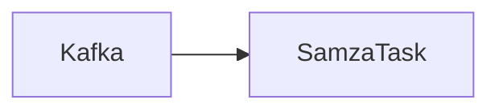

# SamzaTask在气象数据处理中的应用

作者：禅与计算机程序设计艺术

## 1. 背景介绍

### 1.1 气象数据处理的挑战

气象数据具有规模庞大、实时性强、数据种类繁多等特点，对其进行高效处理是气象预测、灾害预警等领域的关键。传统的批处理方式难以满足实时性要求，而基于消息队列的流处理技术逐渐成为主流。

### 1.2 Samza的优势

Apache Samza是一个分布式流处理框架，具有高吞吐、低延迟、容错性强等特点，非常适合处理气象数据。SamzaTask是Samza的基本处理单元，可以灵活地处理各种数据格式和数据流。

### 1.3 本文目标

本文将介绍SamzaTask在气象数据处理中的应用，包括核心概念、算法原理、代码实例、应用场景等，旨在帮助读者了解Samza在气象领域的应用价值。

## 2. 核心概念与联系

### 2.1 Samza架构

Samza采用基于Kafka的发布-订阅模式，数据流通过Kafka进行传输，SamzaTask订阅Kafka主题，对数据进行处理。



### 2.2 SamzaTask

SamzaTask是Samza的基本处理单元，负责处理数据流中的消息。每个SamzaTask都包含一个输入流和一个输出流，可以执行各种数据转换、过滤、聚合等操作。

### 2.3 气象数据格式

气象数据通常以JSON、CSV、NetCDF等格式存储，SamzaTask可以通过自定义序列化器和反序列化器来处理各种数据格式。

## 3. 核心算法原理具体操作步骤

### 3.1 数据清洗

气象数据中可能存在缺失值、异常值等，需要进行数据清洗以保证数据质量。SamzaTask可以使用过滤器来去除异常值，使用插值算法来填充缺失值。

### 3.2 数据转换

气象数据需要转换为适合分析的格式，例如将时间戳转换为日期格式，将温度转换为摄氏度。SamzaTask可以使用映射函数来进行数据转换。

### 3.3 数据聚合

气象数据需要进行聚合操作，例如计算平均温度、降雨量等。SamzaTask可以使用聚合函数来进行数据聚合。

### 3.4 数据存储

处理后的气象数据可以存储到数据库、文件系统等，供后续分析使用。SamzaTask可以使用输出流将数据写入到目标存储系统。

## 4. 数学模型和公式详细讲解举例说明

### 4.1 线性回归模型

线性回归模型可以用来预测气温、降雨量等气象指标。

$$
y = \beta_0 + \beta_1 x_1 + \beta_2 x_2 + ... + \beta_n x_n
$$

其中，$y$表示预测值，$x_i$表示特征值，$\beta_i$表示模型参数。

### 4.2 时间序列分析

时间序列分析可以用来分析气象数据的周期性、趋势性等。

例如，可以使用ARIMA模型来预测气温变化趋势。

## 5. 项目实践：代码实例和详细解释说明

### 5.1 数据读取

```java
// 创建Kafka consumer
KafkaConsumer<String, String> consumer = new KafkaConsumer<>(props);

// 订阅Kafka主题
consumer.subscribe(Arrays.asList("weather_data"));

// 读取数据
while (true) {
  ConsumerRecords<String, String> records = consumer.poll(Duration.ofMillis(100));
  for (ConsumerRecord<String, String> record : records) {
    // 处理数据
  }
}
```

### 5.2 数据处理

```java
// 解析JSON数据
JSONObject jsonObject = new JSONObject(record.value());

// 提取温度值
double temperature = jsonObject.getDouble("temperature");

// 将温度转换为摄氏度
double celsius = temperature - 273.15;

// 输出处理后的数据
System.out.println("Temperature: " + celsius);
```

### 5.3 数据存储

```java
// 创建数据库连接
Connection conn = DriverManager.getConnection(url, user, password);

// 创建PreparedStatement
PreparedStatement stmt = conn.prepareStatement("INSERT INTO weather_data (temperature) VALUES (?)");

// 设置参数值
stmt.setDouble(1, celsius);

// 执行插入操作
stmt.executeUpdate();
```

## 6. 实际应用场景

### 6.1 气象预报

SamzaTask可以用来处理气象数据，预测未来天气状况。

### 6.2 灾害预警

SamzaTask可以用来监测气象数据，及时发出灾害预警信息。

### 6.3 环境监测

SamzaTask可以用来分析环境数据，监测环境污染状况。

## 7. 工具和资源推荐

### 7.1 Apache Kafka

Apache Kafka是一个分布式发布-订阅消息系统，可以用来传输气象数据。

### 7.2 Apache Samza

Apache Samza是一个分布式流处理框架，可以用来处理气象数据。

### 7.3 NetCDF

NetCDF是一种用于存储科学数据的格式，常用于存储气象数据。

## 8. 总结：未来发展趋势与挑战

### 8.1 未来发展趋势

- 更高吞吐量、更低延迟的流处理技术
- 更智能的算法模型
- 更广泛的应用场景

### 8.2 面临挑战

- 海量数据的处理效率
- 算法模型的准确性和可靠性
- 数据安全和隐私保护

## 9. 附录：常见问题与解答

### 9.1 SamzaTask如何处理数据延迟？

SamzaTask可以通过设置窗口时间来处理数据延迟。

### 9.2 SamzaTask如何保证数据一致性？

SamzaTask可以通过设置检查点来保证数据一致性。

### 9.3 SamzaTask如何处理数据倾斜？

SamzaTask可以通过数据分区来处理数据倾斜。
