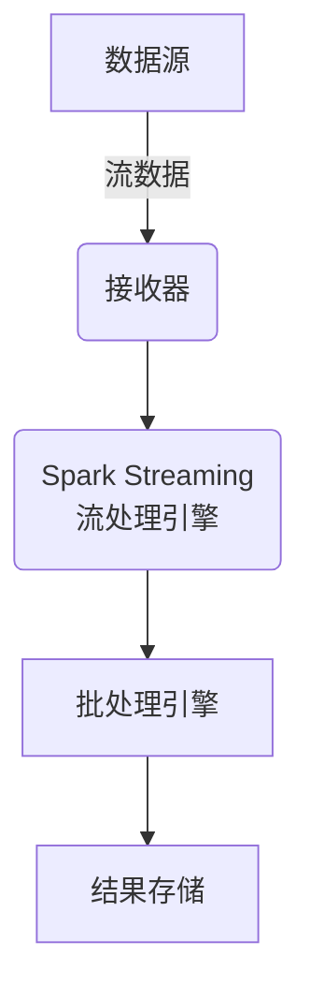
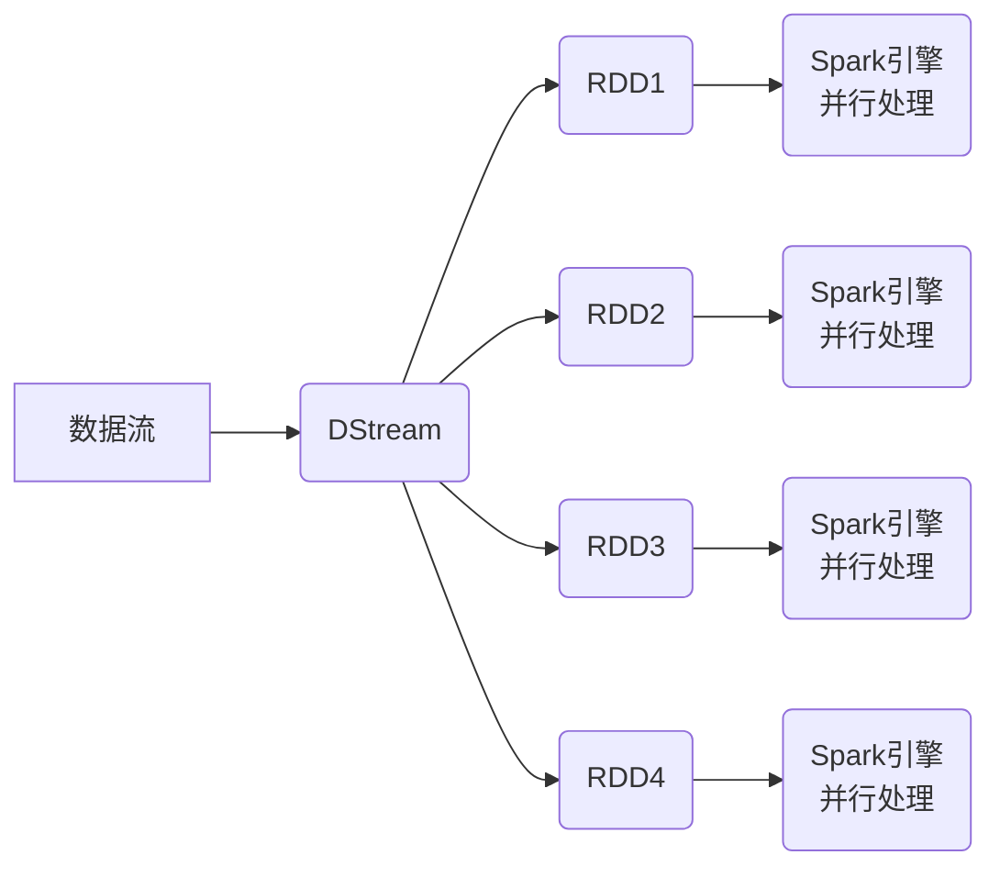
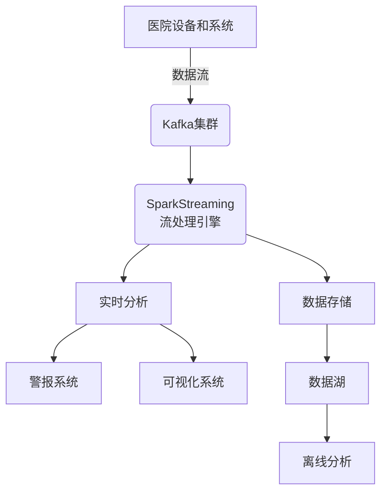

# SparkStreaming在医疗保健领域的应用

## 1. 背景介绍

### 1.1 医疗保健数据的挑战

随着医疗保健行业的快速发展,医疗数据的规模和种类也在不断增长。传统的数据处理方式已经难以满足实时性、可扩展性和数据处理能力的需求。医疗保健数据具有以下特点:

- 数据量大且种类繁多(结构化数据、半结构化数据和非结构化数据)
- 需要实时处理和分析,以及快速响应
- 需要集成和处理来自不同来源的数据
- 需要高可扩展性和容错性,以应对数据量的快速增长

### 1.2 SparkStreaming的优势

Apache SparkStreaming作为流数据处理的领先技术,为医疗保健数据的处理和分析提供了高效、可扩展和容错的解决方案。它具有以下优势:

- 高吞吐量和低延迟
- 支持各种数据源(Kafka、Flume、Kinesis等)
- 与Spark生态系统无缝集成(Spark SQL、Spark MLlib等)
- 提供了有状态流处理、窗口操作等高级特性
- 具有高容错性和可扩展性

## 2. 核心概念与联系

### 2.1 SparkStreaming架构

SparkStreaming将流数据切分为一系列的小批次(micro-batches),并使用Spark引擎对这些小批次进行高效处理。这种架构设计使得SparkStreaming能够充分利用Spark的分布式计算能力和容错机制。



### 2.2 Spark Streaming编程模型

SparkStreaming提供了简单而强大的编程模型,使开发人员能够轻松构建流处理应用。它包括以下几个核心概念:

- **DStream(Discretized Stream)**: 代表一个持续的数据流,由一系列RDD(Resilient Distributed Dataset)组成。
- **输入DStream**: 从数据源(如Kafka、Flume等)创建的输入DStream。
- **转换操作**: 对DStream执行各种转换操作(如map、filter、reduceByKey等)。
- **输出操作**: 将处理结果写入外部系统(如HDFS、数据库等)。

## 3. 核心算法原理具体操作步骤

### 3.1 DStream的运行原理

DStream由一系列连续的RDD组成,每个RDD包含一段时间内的数据。SparkStreaming将数据流切分为小批次,并为每个小批次创建一个RDD,然后使用Spark引擎并行处理这些RDD。



### 3.2 DStream转换操作

DStream支持丰富的转换操作,包括:

- **无状态转换**: map、filter、flatMap等,将DStream中的每个RDD应用相同的操作。
- **有状态转换**: updateStateByKey、reduceByKeyAndWindow等,需要跨RDD维护状态。
- **窗口操作**: window、countByWindow等,对源DStream中的数据进行窗口化处理。

这些操作可以组合使用,构建复杂的流处理管道。

### 3.3 容错和恢复机制

SparkStreaming采用了Spark RDD的容错和恢复机制,可以在出现故障时自动恢复计算。它通过以下方式实现容错:

- **数据源重播**: 在发生故障时,可以从可靠的数据源(如Kafka)重新获取数据。
- **检查点**: 定期将DStream的状态保存到可靠存储中(如HDFS),以便在出现故障时进行恢复。

## 4. 数学模型和公式详细讲解举例说明

在医疗保健领域,SparkStreaming可以应用于各种场景,如实时监控、预测分析等。下面我们以心率监测为例,介绍一种基于SparkStreaming的实时异常检测算法。

### 4.1 问题描述

给定一个心率数据流,我们需要实时检测心率异常,并及时发出警报。我们将使用基于概率密度函数的异常检测算法。

### 4.2 概率密度函数

我们假设心率数据服从正态分布,概率密度函数如下:

$$
f(x) = \frac{1}{\sqrt{2\pi\sigma^2}} e^{-\frac{(x-\mu)^2}{2\sigma^2}}
$$

其中$\mu$是平均心率,$\sigma$是标准差。

### 4.3 异常检测算法

1. 使用滑动窗口计算最近$n$个心率值的平均值$\mu$和标准差$\sigma$。
2. 对于每个新的心率值$x$,计算它的概率密度$f(x)$。
3. 如果$f(x)$小于给定的阈值$\epsilon$,则认为$x$是异常值,发出警报。

### 4.4 Scala代码实现

```scala
import org.apache.spark.streaming.{Seconds, StreamingContext}
import org.apache.spark.streaming.StreamingContext._

val ssc = new StreamingContext(sc, Seconds(5))
val heartRateStream = ssc.socketTextStream(...)

val abnormalHeartRates = heartRateStream
  .map(_.toDouble)
  .window(Seconds(60), Seconds(5))
  .map(windowData => {
    val mean = windowData.sum / windowData.size
    val variance = windowData.map(x => math.pow(x - mean, 2)).sum / (windowData.size - 1)
    val stddev = math.sqrt(variance)
    (mean, stddev)
  })
  .flatMap {
    case (mean, stddev) =>
      heartRateStream
        .map(_.toDouble)
        .map(x => (x, mean, stddev))
        .filter {
          case (x, mean, stddev) =>
            val pdf = 1.0 / (stddev * math.sqrt(2 * math.Pi)) * math.exp(-math.pow(x - mean, 2) / (2 * stddev * stddev))
            pdf < 0.001
        }
        .map(_._1)
  }

abnormalHeartRates.print()
```

在上面的代码中,我们首先使用`window`操作计算最近60秒内的心率平均值和标准差。然后,对于每个新的心率值,我们计算它的概率密度函数值,如果小于阈值0.001,则认为是异常值。

通过这种方式,我们可以实时检测心率异常,并及时发出警报。

## 5. 项目实践:代码实例和详细解释说明

在本节中,我们将介绍一个基于SparkStreaming的医疗保健实时数据处理项目。该项目旨在从医院的各种设备和系统中实时收集数据,并进行集成、处理和分析。

### 5.1 项目架构



在这个架构中,医院的各种设备和系统(如心率监测仪、电子病历系统等)将数据实时发送到Kafka集群中。SparkStreaming从Kafka中读取数据流,进行实时处理和分析。处理结果将被发送到警报系统、可视化系统和数据存储系统。同时,数据也被存储在数据湖中,以供离线分析使用。

### 5.2 数据收集和预处理

我们首先需要从不同的数据源收集数据,并进行预处理和清洗。下面是一个示例代码,展示如何从Kafka中读取心率数据流:

```scala
import org.apache.spark.streaming.kafka010._
import org.apache.spark.streaming.kafka010.LocationStrategies.PreferConsistent
import org.apache.spark.streaming.kafka010.ConsumerStrategies.Subscribe

val kafkaParams = Map(
  "bootstrap.servers" -> "kafka1:9092,kafka2:9092",
  "key.deserializer" -> classOf[StringDeserializer],
  "value.deserializer" -> classOf[StringDeserializer],
  "group.id" -> "heartrate-consumer",
  "auto.offset.reset" -> "latest",
  "enable.auto.commit" -> (false: java.lang.Boolean)
)

val topics = Array("heartrate-topic")
val stream = KafkaUtils.createDirectStream[String, String](
  streamingContext,
  PreferConsistent,
  Subscribe[String, String](topics, kafkaParams)
)

val heartRateStream = stream.map(record => record.value.toDouble)
```

在这个例子中,我们使用`KafkaUtils.createDirectStream`从Kafka中读取心率数据流。然后,我们将数据流转换为`Double`类型,以便进行后续处理。

### 5.3 实时处理和分析

接下来,我们将对心率数据流进行实时处理和分析。我们将使用前面介绍的基于概率密度函数的异常检测算法。

```scala
val abnormalHeartRates = heartRateStream
  .map(_.toDouble)
  .window(Seconds(60), Seconds(5))
  .map(windowData => {
    val mean = windowData.sum / windowData.size
    val variance = windowData.map(x => math.pow(x - mean, 2)).sum / (windowData.size - 1)
    val stddev = math.sqrt(variance)
    (mean, stddev)
  })
  .flatMap {
    case (mean, stddev) =>
      heartRateStream
        .map(_.toDouble)
        .map(x => (x, mean, stddev))
        .filter {
          case (x, mean, stddev) =>
            val pdf = 1.0 / (stddev * math.sqrt(2 * math.Pi)) * math.exp(-math.pow(x - mean, 2) / (2 * stddev * stddev))
            pdf < 0.001
        }
        .map(_._1)
  }
```

在上面的代码中,我们首先使用`window`操作计算最近60秒内的心率平均值和标准差。然后,对于每个新的心率值,我们计算它的概率密度函数值,如果小于阈值0.001,则认为是异常值。

### 5.4 结果输出和存储

处理和分析完成后,我们需要将结果输出到不同的系统,如警报系统、可视化系统和数据存储系统。

```scala
// 发送警报
abnormalHeartRates.foreachRDD(rdd => {
  if (!rdd.isEmpty()) {
    val abnormalValues = rdd.collect()
    // 发送警报消息
    ...
  }
})

// 存储到数据湖
val dataLakeOutputPath = "hdfs://namenode:9000/datalake/heartrate"
abnormalHeartRates.foreachRDD(rdd => {
  if (!rdd.isEmpty()) {
    rdd.saveAsTextFile(dataLakeOutputPath)
  }
})
```

在上面的代码中,我们使用`foreachRDD`操作来处理每个RDD。对于异常心率值,我们可以发送警报消息。同时,我们也将异常心率值存储到数据湖中,以供离线分析使用。

## 6. 实际应用场景

SparkStreaming在医疗保健领域有广泛的应用场景,包括但不限于:

1. **实时监控**: 实时监控患者的生命体征(如心率、血压、体温等),及时发现异常并发出警报。
2. **预测分析**: 基于历史数据和实时数据,进行疾病风险预测、治疗效果预测等分析。
3. **医疗设备管理**: 实时监控医疗设备的使用情况和故障情况,优化设备利用率和维护计划。
4. **电子病历分析**: 分析和整合来自不同系统的电子病历数据,提供更全面的患者信息。
5. **医疗保险欺诈检测**: 实时分析医疗保险索赔数据,发现潜在的欺诈行为。

## 7. 工具和资源推荐

在实现SparkStreaming解决方案时,有许多有用的工具和资源可供参考:

1. **Apache Kafka**: 一个分布式流处理平台,常被用作SparkStreaming的数据源。
2. **Apache Flume**: 另一种流数据收集和聚合工具,可与SparkStreaming集成。
3. **Apache Zeppelin**: 一个基于Web的交互式笔记本环境,支持Spark、SparkStreaming等多种数据处理工具。
4. **Spark机器学习库(MLlib)**: 可与SparkStreaming集成,实现实时机器学习和预测分