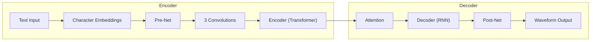
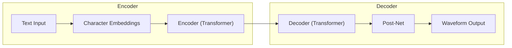

## 1. 背景介绍

### 1.1 语音合成技术的演进

语音合成技术，又称文语转换（Text-to-Speech，TTS），其目标是将文本信息转化为可听的声音。从早期的机械合成器到如今的深度学习模型，语音合成技术经历了漫长的发展历程。早期的语音合成系统主要基于规则和拼接技术，其合成语音质量较为生硬，缺乏自然度。随着深度学习技术的兴起，基于神经网络的语音合成系统逐渐成为主流，语音质量取得了显著提升。

### 1.2 Transformer的崛起

Transformer是一种基于自注意力机制的神经网络架构，最初应用于自然语言处理领域，并在机器翻译、文本摘要等任务中取得了突破性进展。Transformer的强大之处在于其能够捕捉长距离依赖关系，并具有高度并行化的特点。近年来，Transformer也被引入到语音合成领域，并展现出巨大的潜力。

### 1.3 Transformer在语音合成中的优势

相较于传统的循环神经网络（RNN）架构，Transformer在语音合成任务中具有以下优势：

* **并行化效率高:** Transformer的编码器和解码器均可并行计算，训练速度更快。
* **长距离依赖建模能力强:** Transformer的自注意力机制能够捕捉长距离的语音特征依赖关系，提升合成语音的自然度。
* **模型结构灵活:** Transformer的模块化设计使其易于扩展和定制，可以根据具体任务需求进行调整。


## 2. 核心概念与联系

### 2.1 Transformer架构

Transformer模型主要由编码器和解码器两部分组成。编码器负责将输入文本序列转化为高维特征表示，解码器则根据编码器输出的特征表示生成语音波形。

* **编码器:** 编码器由多个相同的层堆叠而成，每个层包含一个多头自注意力模块和一个前馈神经网络。自注意力机制允许模型关注输入序列中不同位置的信息，从而捕捉长距离依赖关系。
* **解码器:** 解码器也由多个相同的层堆叠而成，每个层除了包含编码器中的多头自注意力模块和前馈神经网络外，还包含一个编码器-解码器注意力模块。该模块允许解码器关注编码器输出的特征表示，从而生成与输入文本相对应的语音波形。

### 2.2 语音合成流程

基于Transformer的语音合成流程通常包括以下步骤：

1. **文本预处理:** 将输入文本进行分词、词性标注等预处理操作，以便于模型理解文本信息。
2. **编码:** 将预处理后的文本序列输入到Transformer编码器，获得高维特征表示。
3. **解码:** 将编码器输出的特征表示输入到Transformer解码器，生成语音波形。
4. **波形合成:** 将解码器生成的语音波形进行后处理，例如去噪、音调调整等，最终合成可听的声音。

### 2.3 关键技术

* **多头自注意力机制:** Transformer的核心机制，通过计算输入序列中不同位置之间的相似度，捕捉长距离依赖关系。
* **位置编码:** 由于Transformer不包含循环结构，需要引入位置编码来表示输入序列中每个元素的位置信息。
* **掩码机制:** 在解码过程中，使用掩码机制防止模型关注到未来时刻的信息，确保合成语音的因果关系。


## 3. 核心算法原理具体操作步骤

### 3.1 多头自注意力机制

多头自注意力机制是Transformer的核心模块，其作用是计算输入序列中不同位置之间的相似度，从而捕捉长距离依赖关系。具体操作步骤如下：

1. 将输入序列 $X = (x_1, x_2, ..., x_n)$ 映射到三个不同的向量空间，分别得到查询向量矩阵 $Q$、键向量矩阵 $K$ 和值向量矩阵 $V$。
2. 计算查询向量与键向量之间的点积，得到注意力分数矩阵 $S = QK^T$。
3. 对注意力分数矩阵进行缩放和归一化，得到注意力权重矩阵 $A = softmax(S / \sqrt{d_k})$，其中 $d_k$ 为键向量维度。
4. 将注意力权重矩阵与值向量矩阵相乘，得到输出向量矩阵 $O = AV$。

多头自注意力机制通过并行计算多个注意力头，并将各个头的输出拼接在一起，从而捕捉更丰富的特征表示。

### 3.2 位置编码

由于Transformer不包含循环结构，需要引入位置编码来表示输入序列中每个元素的位置信息。位置编码可以通过以下公式计算：

$$
PE_{(pos, 2i)} = sin(pos / 10000^{2i/d_{model}})
$$

$$
PE_{(pos, 2i+1)} = cos(pos / 10000^{2i/d_{model}})
$$

其中 $pos$ 表示元素在序列中的位置，$i$ 表示维度索引，$d_{model}$ 表示模型的隐藏层维度。

### 3.3 掩码机制

在解码过程中，使用掩码机制防止模型关注到未来时刻的信息，确保合成语音的因果关系。掩码机制可以通过将注意力分数矩阵中对应未来时刻的元素设置为负无穷来实现。

## 4. 数学模型和公式详细讲解举例说明

### 4.1 自注意力机制

自注意力机制的数学模型可以表示为：

$$
Attention(Q, K, V) = softmax(\frac{QK^T}{\sqrt{d_k}})V
$$

其中 $Q$、$K$ 和 $V$ 分别表示查询向量矩阵、键向量矩阵和值向量矩阵，$d_k$ 表示键向量维度。

**举例说明:**

假设输入序列为 "Hello world"，编码器将其转换为维度为 4 的特征向量序列：

```
[
  [0.1, 0.2, 0.3, 0.4],
  [0.5, 0.6, 0.7, 0.8],
  [0.9, 1.0, 1.1, 1.2],
  [1.3, 1.4, 1.5, 1.6]
]
```

假设查询向量矩阵 $Q$、键向量矩阵 $K$ 和值向量矩阵 $V$ 均为该特征向量序列，则注意力分数矩阵 $S$ 为：

```
[
  [1.0, 1.4, 1.8, 2.2],
  [1.4, 2.0, 2.6, 3.2],
  [1.8, 2.6, 3.4, 4.2],
  [2.2, 3.2, 4.2, 5.2]
]
```

对注意力分数矩阵进行缩放和归一化后，得到注意力权重矩阵 $A$：

```
[
  [0.11, 0.24, 0.39, 0.26],
  [0.10, 0.22, 0.37, 0.31],
  [0.09, 0.20, 0.35, 0.36],
  [0.08, 0.18, 0.33, 0.41]
]
```

将注意力权重矩阵与值向量矩阵相乘，得到输出向量矩阵 $O$：

```
[
  [0.84, 0.96, 1.08, 1.20],
  [0.98, 1.12, 1.26, 1.40],
  [1.12, 1.28, 1.44, 1.60],
  [1.26, 1.44, 1.62, 1.80]
]
```

### 4.2 位置编码

位置编码的数学模型如上文所述。

**举例说明:**

假设模型的隐藏层维度 $d_{model}$ 为 4，则第一个元素的位置编码为：

```
[
  sin(1 / 10000^(0/4)),
  cos(1 / 10000^(0/4)),
  sin(1 / 10000^(2/4)),
  cos(1 / 10000^(2/4))
]
```

第二个元素的位置编码为：

```
[
  sin(2 / 10000^(0/4)),
  cos(2 / 10000^(0/4)),
  sin(2 / 10000^(2/4)),
  cos(2 / 10000^(2/4))
]
```

以此类推。

## 5. 项目实践：代码实例和详细解释说明

### 5.1 Tacotron 2

Tacotron 2 是一种基于 Transformer 的语音合成模型，其架构如下图所示：



**代码实例:**

```python
import tensorflow as tf

# 定义 Tacotron 2 模型
class Tacotron2(tf.keras.Model):
    def __init__(self, ...):
        super(Tacotron2, self).__init__()
        # 定义编码器
        self.encoder = Encoder(...)
        # 定义解码器
        self.decoder = Decoder(...)
        # 定义后处理网络
        self.postnet = Postnet(...)

    def call(self, inputs):
        # 编码输入文本
        encoder_outputs = self.encoder(inputs)
        # 解码特征表示
        decoder_outputs = self.decoder(encoder_outputs)
        # 后处理语音波形
        waveform = self.postnet(decoder_outputs)
        return waveform
```

**详细解释说明:**

* `Encoder` 类定义了 Tacotron 2 的编码器，其包含字符嵌入层、预处理网络、卷积层和 Transformer 编码器。
* `Decoder` 类定义了 Tacotron 2 的解码器，其包含注意力机制、RNN 解码器和后处理网络。
* `Postnet` 类定义了 Tacotron 2 的后处理网络，其用于对解码器生成的语音波形进行精细调整。

### 5.2 Transformer-TTS

Transformer-TTS 是一种完全基于 Transformer 的语音合成模型，其架构如下图所示：



**代码实例:**

```python
import tensorflow as tf

# 定义 Transformer-TTS 模型
class TransformerTTS(tf.keras.Model):
    def __init__(self, ...):
        super(TransformerTTS, self).__init__()
        # 定义编码器
        self.encoder = Encoder(...)
        # 定义解码器
        self.decoder = Decoder(...)
        # 定义后处理网络
        self.postnet = Postnet(...)

    def call(self, inputs):
        # 编码输入文本
        encoder_outputs = self.encoder(inputs)
        # 解码特征表示
        decoder_outputs = self.decoder(encoder_outputs)
        # 后处理语音波形
        waveform = self.postnet(decoder_outputs)
        return waveform
```

**详细解释说明:**

* `Encoder` 类定义了 Transformer-TTS 的编码器，其包含字符嵌入层和 Transformer 编码器。
* `Decoder` 类定义了 Transformer-TTS 的解码器，其包含 Transformer 解码器和后处理网络。
* `Postnet` 类定义了 Transformer-TTS 的后处理网络，其用于对解码器生成的语音波形进行精细调整。

## 6. 实际应用场景

### 6.1 智能客服

Transformer 可以用于构建智能客服系统，为用户提供自然流畅的语音交互体验。

### 6.2 语音助手

Transformer 可以用于构建语音助手，例如 Siri、Alexa 等，提供语音搜索、控制智能家居等功能。

### 6.3 语音播报

Transformer 可以用于生成新闻播报、天气预报等语音内容，提升信息传播效率。

### 6.4 教育领域

Transformer 可以用于开发语音教材、语音评测系统等，辅助语言学习。

## 7. 工具和资源推荐

### 7.1 TensorFlowTTS

TensorFlowTTS 是一个基于 TensorFlow 的开源语音合成工具包，提供了多种 Transformer-based 语音合成模型的实现。

### 7.2 ESPnet

ESPnet 是一个基于 Kaldi 的开源语音识别和合成工具包，也提供了 Transformer-based 语音合成模型的实现。

### 7.3 MozillaTTS

MozillaTTS 是一个基于 PyTorch 的开源语音合成工具包，提供了多种 Transformer-based 语音合成模型的实现。

## 8. 总结：未来发展趋势与挑战

### 8.1 未来发展趋势

* **个性化语音合成:** 未来，语音合成技术将更加注重个性化，可以根据用户喜好生成不同音色、语调的语音。
* **多语言语音合成:** 随着全球化的发展，多语言语音合成技术将变得越来越重要。
* **情感语音合成:** 情感语音合成技术将赋予合成语音更加丰富的情感表达能力。

### 8.2 面临的挑战

* **数据需求:** Transformer-based 语音合成模型需要大量的训练数据，数据获取和标注成本较高。
* **模型复杂度:** Transformer-based 语音合成模型结构复杂，训练和推理成本较高。
* **语音质量:** 尽管 Transformer-based 语音合成模型的语音质量已经取得了很大进步，但仍有提升空间。


## 9. 附录：常见问题与解答

### 9.1 Transformer 相比于 RNN 的优势是什么？

* 并行化效率高
* 长距离依赖建模能力强
* 模型结构灵活

### 9.2 Transformer 在语音合成中如何处理位置信息？

通过引入位置编码来表示输入序列中每个元素的位置信息。

### 9.3 如何防止 Transformer 在解码过程中关注到未来时刻的信息？

使用掩码机制将注意力分数矩阵中对应未来时刻的元素设置为负无穷。