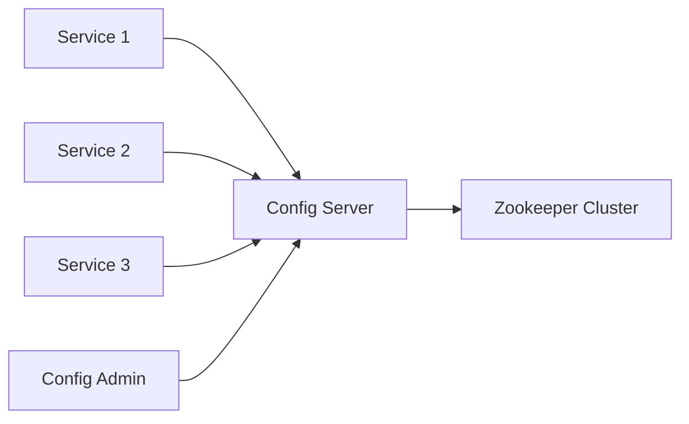

# Zookeeper在滴滴配置中心中的应用实践

作者：禅与计算机程序设计艺术

## 1. 背景介绍

### 1.1 分布式系统中的配置管理挑战

在现代分布式系统中,配置管理是一个关键而复杂的问题。随着系统规模的不断扩大,服务器数量的增加,如何高效、一致地管理所有服务的配置成为一大挑战。传统的配置管理方式,如本地配置文件,很难满足大规模分布式环境下的需求。

### 1.2 集中式配置管理的优势

集中式配置管理通过将配置信息统一存储和管理,为分布式系统提供了一种更高效、可靠的配置管理方案。它具有以下优势:

- 配置集中管理,避免了配置不一致问题
- 配置更新实时生效,无需重启服务
- 提供了配置的版本管理和回滚能力
- 方便进行配置的权限控制和审计

### 1.3 滴滴出行的配置管理需求

作为一家大型出行平台,滴滴内部有数千个服务,部署在成千上万的服务器上。配置管理一直是一个棘手的问题。滴滴需要一个高可用、高性能、易用的配置中心,来统一管理所有服务的配置。同时,配置变更要能够快速生效,对业务影响降到最低。

### 1.4 Zookeeper在配置管理中的应用

Zookeeper是一个开源的分布式协调服务,提供了配置管理、命名服务、分布式锁等多种功能。基于Zookeeper可以构建一个高可用的配置中心。本文将重点介绍滴滴基于Zookeeper实现的配置中心方案,以及在实践中的一些经验总结。

## 2. 核心概念与联系

### 2.1 Zookeeper核心概念

#### 2.1.1 数据模型

Zookeeper的数据模型是一个类似文件系统的树形结构。每个节点称为znode,可以存储数据。znode分为四种类型:

- 持久节点(PERSISTENT):除非主动删除,否则一直存在
- 持久顺序节点(PERSISTENT_SEQUENTIAL):节点名后自动追加一个单调递增的序号
- 临时节点(EPHEMERAL):客户端会话结束后自动删除
- 临时顺序节点(EPHEMERAL_SEQUENTIAL):结合临时节点和顺序节点特点

#### 2.1.2 会话

客户端与Zookeeper服务端之间维持的一个长连接称为会话(Session)。会话过期时间由客户端设置,Zookeeper通过心跳检测机制判断会话是否过期。

#### 2.1.3 Watcher

Watcher是Zookeeper提供的一种事件通知机制。客户端可以在指定节点上注册Watcher,当节点发生变化(如数据改变、节点删除)时,Zookeeper会异步通知客户端。

#### 2.1.4 ACL

Zookeeper提供了ACL(Access Control List)进行权限控制。ACL可以针对节点设置相应的读写等权限,保障数据安全。

### 2.2 Zookeeper在配置管理中的作用

Zookeeper天然适合作为配置管理的基础组件,主要有以下几个原因:

- 数据存储:Zookeeper提供了类似文件系统的树形结构,方便存储配置数据。
- 数据同步:Zookeeper集群中各节点数据强一致,保证了配置的一致性。
- 变更通知:利用Watcher机制可以实时通知配置变更。
- 高可用:Zookeeper是一个高可用的服务,满足配置中心的可用性需求。

## 3. 核心算法原理具体操作步骤

### 3.1 Zab协议

Zookeeper使用Zab(Zookeeper Atomic Broadcast)协议在集群各节点间同步数据,保证数据一致性。Zab协议主要分为两个阶段:

#### 3.1.1 消息广播

1. Leader接收到写请求,生成对应的事务Proposal
2. Leader将Proposal分发给所有Follower
3. Follower接收到Proposal,写入本地事务日志,并向Leader发送ACK
4. Leader收到过半数ACK后,向所有Follower发送COMMIT消息
5. Follower收到COMMIT消息,将事务应用到内存数据库中

#### 3.1.2 崩溃恢复

当Leader节点宕机,会触发崩溃恢复,选举出新的Leader:

1. Follower发现Leader已经宕机,进入Looking状态
2. 每个Server发出一个投票,投票信息包括SID(服务器ID)和ZXID(事务ID)
3. 接收到投票的Server根据一定规则更新自己的投票,并重新发出投票
4. 当有一台Server得到超过半数投票时,它将成为新的Leader
5. Leader等待Follower将日志同步完成,开始接收新的写请求

### 3.2 配置存储设计

#### 3.2.1 配置存储路径

配置存储在Zookeeper上的znodes节点,一般根据服务名、配置类型等进行目录划分,方便管理。如:

```
/config
  /service1
    /common
      /jdbc.properties
    /beta
      /jdbc.properties
  /service2
    /common
      /kafka.properties
```

#### 3.2.2 配置格式

配置数据一般采用properties、yaml、json等通用格式,便于程序读取解析。如:

```properties
jdbc.url=jdbc:mysql://localhost:3306/db
jdbc.username=root
jdbc.password=123456
```

### 3.3 配置更新与下发

#### 3.3.1 配置更新流程

1. 将新配置写入Zookeeper对应节点
2. 在配置节点上设置Watcher,监听数据变更事件
3. 服务监听到配置变更事件后,从Zookeeper读取最新配置
4. 服务重新加载配置,使变更生效

#### 3.3.2 配置下发性能优化

当服务数量较多时,大量服务同时从Zookeeper读取配置可能导致性能问题。可以采取以下优化措施:

1. 缓存配置:服务本地缓存配置,减少对Zookeeper的读请求
2. 分批下发:对于不那么紧急的配置变更,可以采用分批下发策略,避免流量高峰
3. 使用代理:引入代理组件(如ConfigServer)作为Zookeeper客户端,服务向代理请求配置

## 4. 数学模型和公式详细讲解举例说明

在Zookeeper的选举算法中,使用了Paxos算法的思想。Paxos是一种基于消息传递的一致性算法,用于在分布式系统中就某个值达成一致。

### 4.1 Paxos算法

Paxos算法中有三种角色:

- Proposer:提议发起者,提出提案
- Acceptor:提案决策者,参与投票
- Learner:不参与投票,从Acceptor学习最终结果

一个Paxos决议分为两个阶段:

#### 4.1.1 准备阶段(Prepare)

Proposer发起一个提案,格式为:
$$
[n:v]
$$
其中$n$为提案编号,$v$为提案值。

Proposer向多数Acceptor发送Prepare请求。Acceptor可以回复Promise或Reject:

- 如果$n>maxN$,则回复Promise,并更新$maxN=n$;否则回复Reject
- 如果Acceptor已经Accept过提案,则连同已Accept的提案一起回复

#### 4.1.2 接受阶段(Accept) 

如果Proposer收到多数Acceptor的Promise回复,则可以发起Accept请求:

- 如果收到过Acceptor回复的已Accept提案,则取其中编号最大的提案值作为$v$
- 否则,使用自己的提案值$v$

Proposer向多数Acceptor发送Accept请求。Acceptor根据情况回复Accepted或Reject:

- 如果$n\geq maxN$,则回复Accepted,并更新$maxN=n$;否则回复Reject

如果Proposer收到多数Acceptor的Accepted回复,则认为该提案被最终Accept。Learner从Acceptor学习被Accept的提案值。

### 4.2 Zookeeper选举算法

Zookeeper使用Fast Paxos算法,基于Paxos进行了改进,使得选举过程更高效。

在Zookeeper选举中:

- Proposer对应Follower
- Acceptor和Learner都对应所有Server

Follower发起选举时,提案格式为:
$$
[n:SID]
$$
其中$n$为ZXID(事务ID),$SID$为服务器ID。

Follower先给自己投票,然后将投票发送给其他Server。每个Server根据以下规则更新自己的投票:

1. 优先比较ZXID,ZXID大的胜出
2. 如果ZXID相同,则比较SID,SID大的胜出

Server不断重复这个过程,直到收到超过半数Server的相同投票,则该投票对应的Server成为Leader,选举结束。

## 5. 项目实践：代码实例和详细解释说明

下面通过一个简单的示例来演示如何使用Zookeeper进行配置管理。我们将使用Java语言和Curator框架。

### 5.1 添加依赖

首先在pom.xml中添加Curator依赖:

```xml
<dependency>
    <groupId>org.apache.curator</groupId>
    <artifactId>curator-recipes</artifactId>
    <version>4.2.0</version>
</dependency>
```

### 5.2 配置存储

我们将配置存储在Zookeeper的`/config/app`节点下,配置格式为properties:

```java
public class ConfigService {
    private CuratorFramework client;
    private final String CONFIG_NODE = "/config/app";

    public ConfigService(String connectString) {
        client = CuratorFrameworkFactory.newClient(connectString, new ExponentialBackoffRetry(1000, 3));
        client.start();
    }

    public void setConfig(String key, String value) throws Exception {
        String path = CONFIG_NODE + "/" + key;
        byte[] data = value.getBytes();
        if (client.checkExists().forPath(path) == null) {
            client.create().creatingParentsIfNeeded().forPath(path, data);
        } else {
            client.setData().forPath(path, data);
        }
    }

    public String getConfig(String key) throws Exception {
        String path = CONFIG_NODE + "/" + key;
        byte[] data = client.getData().forPath(path);
        return new String(data);
    }
}
```

### 5.3 配置更新

当配置发生变更时,我们希望能够实时通知到应用,这可以通过Watcher机制实现:

```java
public class ConfigWatcher implements CuratorWatcher {
    private ConfigService configService;

    public ConfigWatcher(ConfigService configService) {
        this.configService = configService;
    }

    public void process(WatchedEvent event) throws Exception {
        if (event.getType() == Watcher.Event.EventType.NodeDataChanged) {
            String key = event.getPath().replace(CONFIG_NODE + "/", "");
            String value = configService.getConfig(key);
            System.out.println("Config changed: " + key + "=" + value);
        }
    }
}
```

在主程序中,我们启动一个后台线程来监听配置变更事件:

```java
public static void main(String[] args) throws Exception {
    ConfigService configService = new ConfigService("localhost:2181");
    ConfigWatcher watcher = new ConfigWatcher(configService);

    // 监听配置变更
    ExecutorService executor = Executors.newFixedThreadPool(1);
    executor.submit(() -> {
        while (true) {
            configService.getClient().getData().usingWatcher(watcher).forPath(CONFIG_NODE);
            Thread.sleep(1000);
        }
    });

    // 初始化配置
    configService.setConfig("timeout", "1000");
    configService.setConfig("retries", "3");

    // 读取配置
    String timeout = configService.getConfig("timeout");
    String retries = configService.getConfig("retries");
    System.out.println("timeout=" + timeout + ", retries=" + retries);

    // 等待配置变更
    Thread.sleep(60000);
    executor.shutdownNow();
}
```

当我们在Zookeeper上修改配置时,ConfigWatcher将收到NodeDataChanged事件,输出配置变更信息。

## 6. 实际应用场景

### 6.1 滴滴配置中心架构

滴滴基于Zookeeper和Spring Cloud Config构建了自己的配置中心,架构如下:



- Config Server:作为配置中心的核心组件,对外提供配置的CRUD接口,对内监听Zookeeper配置变更事件
- Zookeeper Cluster:作为配置存储,保证配置的高可用和一致性
- Service:各个微服务,启动时从Config Server获取配置,并监听配置变更事件
- Config Admin:配置管理后台,用于配