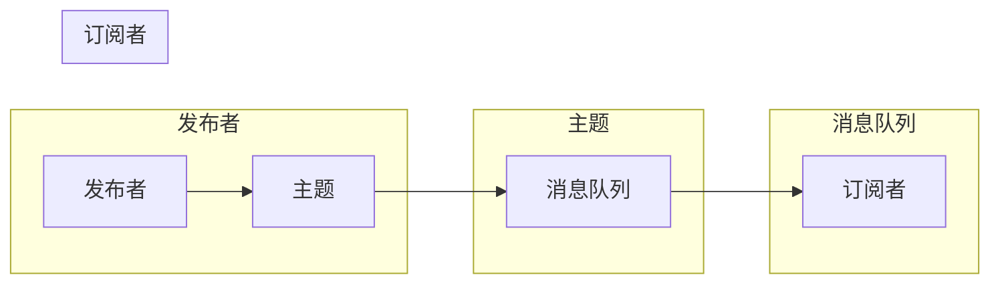

# 【AI大数据计算原理与代码实例讲解】发布订阅

作者：禅与计算机程序设计艺术

## 1. 背景介绍

### 1.1 大数据时代的消息传递需求
随着互联网和移动设备的普及，信息爆炸式增长，海量数据在各行各业涌现。如何高效、可靠地传递这些信息成为一个重要挑战。传统的点对点通信方式难以满足大规模、高并发、实时性等需求，消息队列应运而生，成为构建分布式系统的关键组件。

### 1.2 发布订阅模式的优势
发布订阅模式是一种消息传递模式，它将发送者（发布者）和接收者（订阅者）解耦，发布者无需知道订阅者的存在，订阅者也无需关心发布者的身份。这种模式具有以下优势：
- **松耦合：** 发布者和订阅者之间没有直接依赖关系，提高了系统的灵活性和可扩展性。
- **异步通信：** 发布者发送消息后无需等待订阅者接收，提高了系统效率。
- **可扩展性：** 可以轻松地添加或移除发布者和订阅者，适应不断变化的业务需求。

### 1.3 发布订阅模式的应用场景
发布订阅模式广泛应用于各种场景，例如：
- **实时数据分析：** 收集和分析传感器数据、社交媒体数据等。
- **消息推送：** 向用户推送通知、消息等。
- **事件驱动架构：** 构建基于事件触发的系统。
- **微服务架构：** 实现服务之间的异步通信。

## 2. 核心概念与联系

### 2.1 消息
消息是发布订阅模式中传递的信息单元，它可以是任何类型的数据，例如文本、数字、图片、视频等。

### 2.2 主题
主题是一个逻辑通道，用于区分不同类型的消息。发布者将消息发布到特定的主题，订阅者订阅感兴趣的主题以接收消息。

### 2.3 发布者
发布者是消息的发送者，它将消息发布到特定的主题。

### 2.4 订阅者
订阅者是消息的接收者，它订阅感兴趣的主题以接收消息。

### 2.5 消息队列
消息队列是一个存储消息的缓冲区，它负责接收来自发布者的消息，并将其转发给订阅者。

### 2.6 联系
发布者、主题、订阅者和消息队列之间的联系可以用下图表示：



## 3. 核心算法原理具体操作步骤

发布订阅模式的实现方式有很多种，其中一种常见的实现方式是使用消息队列。消息队列通常采用先进先出（FIFO）的原则，发布者将消息发送到队列的尾部，订阅者从队列的头部接收消息。

### 3.1 发布消息
发布者将消息发布到指定的主题，消息队列将消息存储在该主题对应的队列中。

### 3.2 订阅主题
订阅者订阅感兴趣的主题，消息队列将订阅者添加到该主题对应的订阅者列表中。

### 3.3 接收消息
当消息队列接收到新消息时，它会将消息转发给该主题的所有订阅者。

### 3.4 取消订阅
订阅者可以取消订阅不再感兴趣的主题，消息队列将订阅者从该主题对应的订阅者列表中移除。

## 4. 数学模型和公式详细讲解举例说明

发布订阅模式的数学模型可以用概率论来描述。假设有 $n$ 个发布者和 $m$ 个订阅者，每个发布者以概率 $p$ 发布消息，每个订阅者以概率 $q$ 订阅主题。

### 4.1 消息发布概率
每个发布者发布消息的概率为 $p$，因此所有发布者发布消息的概率为：

$$
P(发布消息) = 1 - (1-p)^n
$$

### 4.2 消息订阅概率
每个订阅者订阅主题的概率为 $q$，因此所有订阅者订阅主题的概率为：

$$
P(订阅主题) = 1 - (1-q)^m
$$

### 4.3 消息传递概率
消息传递成功的概率为发布消息的概率乘以订阅主题的概率：

$$
P(消息传递成功) = P(发布消息) * P(订阅主题)
$$

### 4.4 举例说明
假设有 10 个发布者和 100 个订阅者，每个发布者以 0.1 的概率发布消息，每个订阅者以 0.01 的概率订阅主题。

- 消息发布概率：
$$
P(发布消息) = 1 - (1-0.1)^{10} = 0.6513
$$

- 消息订阅概率：
$$
P(订阅主题) = 1 - (1-0.01)^{100} = 0.6340
$$

- 消息传递概率：
$$
P(消息传递成功) = 0.6513 * 0.6340 = 0.4130
$$

因此，在这种情况下，消息传递成功的概率约为 41.3%。

## 5. 项目实践：代码实例和详细解释说明

### 5.1 Python 代码实例
以下是一个使用 Python 实现发布订阅模式的简单示例：

```python
import threading
import time

class MessageQueue:
    def __init__(self):
        self.subscribers = {}
        self.lock = threading.Lock()

    def publish(self, topic, message):
        with self.lock:
            if topic in self.subscribers:
                for subscriber in self.subscribers[topic]:
                    subscriber(message)

    def subscribe(self, topic, callback):
        with self.lock:
            if topic not in self.subscribers:
                self.subscribers[topic] = []
            self.subscribers[topic].append(callback)

    def unsubscribe(self, topic, callback):
        with self.lock:
            if topic in self.subscribers:
                self.subscribers[topic].remove(callback)

def subscriber1(message):
    print(f"Subscriber 1 received message: {message}")

def subscriber2(message):
    print(f"Subscriber 2 received message: {message}")

if __name__ == "__main__":
    message_queue = MessageQueue()

    message_queue.subscribe("topic1", subscriber1)
    message_queue.subscribe("topic1", subscriber2)

    message_queue.publish("topic1", "Hello, world!")

    time.sleep(1)

    message_queue.unsubscribe("topic1", subscriber2)

    message_queue.publish("topic1", "Goodbye, world!")
```

### 5.2 代码解释说明
- `MessageQueue` 类表示消息队列，它包含以下方法：
    - `publish(topic, message)`：发布消息到指定主题。
    - `subscribe(topic, callback)`：订阅指定主题，并注册回调函数。
    - `unsubscribe(topic, callback)`：取消订阅指定主题。
- `subscriber1` 和 `subscriber2` 是两个订阅者回调函数，它们分别打印接收到的消息。
- 主程序首先创建一个 `MessageQueue` 对象，然后订阅 `topic1` 主题，并注册两个回调函数。
- 接着，发布两条消息到 `topic1` 主题。
- 最后，取消订阅 `subscriber2` 回调函数，并再次发布一条消息。

### 5.3 运行结果
运行该程序，输出结果如下：

```
Subscriber 1 received message: Hello, world!
Subscriber 2 received message: Hello, world!
Subscriber 1 received message: Goodbye, world!
```

## 6. 实际应用场景

### 6.1 实时数据分析

在实时数据分析领域，发布订阅模式可以用于收集和分析来自各种来源的数据，例如传感器、社交媒体、金融市场等。发布者可以将数据发布到特定的主题，订阅者可以订阅感兴趣的主题以接收数据并进行分析。

例如，一个物联网平台可以使用发布订阅模式来收集来自各种传感器的数据，并将数据实时传输给数据分析应用程序。

### 6.2 消息推送

在消息推送领域，发布订阅模式可以用于向用户推送通知、消息等。发布者可以将消息发布到特定的主题，订阅者可以订阅感兴趣的主题以接收消息。

例如，一个社交媒体应用程序可以使用发布订阅模式向用户推送新的好友请求、消息、评论等。

### 6.3 事件驱动架构

在事件驱动架构中，发布订阅模式可以用于构建基于事件触发的系统。发布者可以将事件发布到特定的主题，订阅者可以订阅感兴趣的主题以接收事件并执行相应的操作。

例如，一个电子商务网站可以使用发布订阅模式来处理订单事件。当用户下订单时，系统会发布一个订单创建事件，订阅者可以接收该事件并执行相应的操作，例如发送确认邮件、更新库存等。

## 7. 工具和资源推荐

### 7.1 消息队列工具
- **Kafka:** 一个高吞吐量、分布式、持久化的消息队列。
- **RabbitMQ:** 一个开源的、支持多种协议的消息队列。
- **ActiveMQ:** 一个成熟的、功能丰富的消息队列。
- **Redis:** 一个内存数据库，也支持发布订阅模式。

### 7.2 学习资源
- **Apache Kafka Documentation:** https://kafka.apache.org/documentation/
- **RabbitMQ Tutorials:** https://www.rabbitmq.com/getstarted.html
- **ActiveMQ Documentation:** https://activemq.apache.org/documentation.html
- **Redis Documentation:** https://redis.io/documentation

## 8. 总结：未来发展趋势与挑战

发布订阅模式是大数据时代构建分布式系统的关键组件之一。随着大数据、云计算、物联网等技术的不断发展，发布订阅模式将面临以下挑战：

### 8.1 海量数据处理
未来，数据量将持续增长，消息队列需要能够处理海量数据，并保持高吞吐量和低延迟。

### 8.2 实时性要求
许多应用场景对实时性要求很高，消息队列需要能够快速地传递消息，并保证消息的顺序。

### 8.3 安全性保障
消息队列需要提供可靠的安全机制，以保护数据的安全性和完整性。

### 8.4 未来发展趋势
为了应对这些挑战，消息队列技术将朝着以下方向发展：

- **云原生化:** 消息队列将更加紧密地集成到云平台中，提供更便捷的部署和管理方式。
- **高性能化:** 消息队列将采用更先进的技术，例如内存计算、硬件加速等，以提高性能和吞吐量。
- **智能化:** 消息队列将集成人工智能技术，例如机器学习、深度学习等，以实现更智能的消息路由、过滤、分析等功能。

## 9. 附录：常见问题与解答

### 9.1 什么是发布订阅模式？
发布订阅模式是一种消息传递模式，它将发送者（发布者）和接收者（订阅者）解耦，发布者无需知道订阅者的存在，订阅者也无需关心发布者的身份。

### 9.2 发布订阅模式有哪些优势？
发布订阅模式具有松耦合、异步通信、可扩展性等优势。

### 9.3 发布订阅模式有哪些应用场景？
发布订阅模式广泛应用于实时数据分析、消息推送、事件驱动架构、微服务架构等场景。

### 9.4 如何实现发布订阅模式？
发布订阅模式可以使用消息队列来实现。

### 9.5 消息队列有哪些常见工具？
常见的