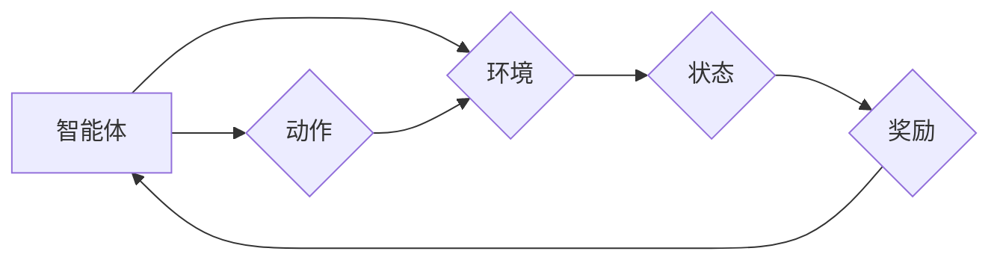
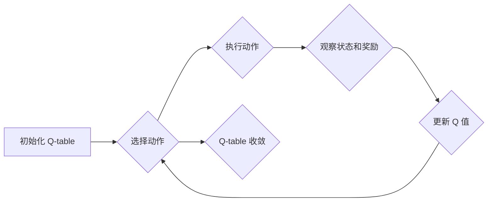

# 一切皆是映射：AI Q-learning在智能制造中的探索

作者：禅与计算机程序设计艺术

## 1. 背景介绍

### 1.1 智能制造的崛起与挑战

近年来，随着物联网、大数据、云计算等新一代信息技术的快速发展和深度融合，制造业正在经历一场前所未有的数字化转型。智能制造作为新一轮工业革命的核心，旨在通过应用人工智能、自动化技术、数字化技术等手段，实现生产过程的智能化、柔性化、高效化，从而提高产品质量、降低生产成本、缩短交付周期、增强企业竞争力。

然而，智能制造的实现并非易事。传统的制造系统往往依赖于人工经验和规则，难以适应复杂多变的生产环境。此外，制造数据的多样性、异构性和海量性也给数据分析和决策带来了巨大挑战。因此，如何利用人工智能技术赋能制造业，实现生产过程的智能化控制和优化，成为当前学术界和工业界共同关注的焦点。

### 1.2 强化学习：智能制造的利器

强化学习 (Reinforcement Learning, RL) 作为机器学习的一个重要分支，近年来在人工智能领域取得了突破性进展，并在游戏、机器人控制、自动驾驶等领域展现出巨大潜力。其核心思想是通过与环境的交互学习最优策略，以最大化累积奖励。与传统控制方法相比，强化学习具有以下优势：

* **无需预先建立精确的系统模型:** 强化学习通过与环境交互学习，无需预先建立精确的系统模型，更易于应用于复杂、动态的制造系统。
* **自适应性强:** 强化学习能够根据环境变化动态调整策略，具有良好的自适应性和鲁棒性。
* **可实现端到端优化:** 强化学习能够直接优化最终目标，无需人为设定中间目标或规则，更易于实现全局最优。

### 1.3 Q-learning：强化学习的经典算法

Q-learning 作为强化学习的一种经典算法，其核心思想是通过学习一个状态-动作值函数 (Q-function) 来评估在特定状态下采取特定动作的价值。Q-function 的值越高，表示在该状态下采取该动作获得的累积奖励越高，从而指导智能体选择最优动作。

## 2. 核心概念与联系

### 2.1 强化学习基本要素

强化学习的核心要素包括：

* **智能体 (Agent):**  与环境交互并执行动作的主体。
* **环境 (Environment):**  智能体所处的外部环境。
* **状态 (State):**  描述环境当前状况的信息。
* **动作 (Action):**  智能体可以采取的操作。
* **奖励 (Reward):**  环境对智能体动作的反馈，用于评估动作的优劣。

### 2.2 Q-learning 算法流程

Q-learning 算法的基本流程如下：

1. 初始化 Q-table，为所有状态-动作对赋予初始值。
2. 在每个时间步，根据当前状态 $s_t$ 选择动作 $a_t$。
3. 执行动作 $a_t$，并观察环境的下一个状态 $s_{t+1}$ 和奖励 $r_{t+1}$。
4. 更新 Q-table 中对应状态-动作对的 Q 值，更新公式为：
   $$Q(s_t, a_t) \leftarrow Q(s_t, a_t) + \alpha [r_{t+1} + \gamma \max_{a} Q(s_{t+1}, a) - Q(s_t, a_t)]$$
   其中，$\alpha$ 为学习率，$\gamma$ 为折扣因子，$\max_{a} Q(s_{t+1}, a)$ 表示在状态 $s_{t+1}$ 下所有动作的 Q 值的最大值。
5. 重复步骤 2-4，直到 Q-table 收敛。

### 2.3 Q-learning 与智能制造的联系

在智能制造中，Q-learning 可以应用于以下场景：

* **生产调度:**  将生产线上的机器、工序等视为状态，将加工时间、成本等视为奖励，利用 Q-learning 优化生产计划，提高生产效率。
* **质量控制:** 将产品质量指标视为状态，将检测结果、维修成本等视为奖励，利用 Q-learning 优化质量检测策略，提高产品合格率。
* **设备维护:** 将设备状态视为状态，将故障率、维修成本等视为奖励，利用 Q-learning 优化设备维护策略，提高设备可靠性。

## 3. 核心算法原理具体操作步骤

### 3.1 Q-table 的构建

Q-table 是 Q-learning 算法的核心数据结构，用于存储每个状态-动作对的 Q 值。Q-table 的行代表状态，列代表动作，每个单元格的值表示在该状态下采取该动作的预期累积奖励。

在实际应用中，Q-table 的构建需要考虑以下因素：

* **状态空间:**  状态空间的大小决定了 Q-table 的行数。状态空间越大，Q-table 的规模越大，训练时间越长。
* **动作空间:**  动作空间的大小决定了 Q-table 的列数。动作空间越大，Q-table 的规模越大，训练时间越长。
* **状态离散化:**  对于连续状态空间，需要进行离散化处理，将其转换为有限个离散状态。
* **动作离散化:**  对于连续动作空间，需要进行离散化处理，将其转换为有限个离散动作。

### 3.2 动作选择策略

在每个时间步，智能体需要根据当前状态选择动作。常用的动作选择策略包括：

* **ε-greedy 策略:**  以 ε 的概率随机选择动作，以 1-ε 的概率选择 Q 值最大的动作。
* **softmax 策略:**  根据 Q 值的 softmax 分布选择动作，Q 值越高的动作被选择的概率越高。

### 3.3 Q 值更新

Q 值更新是 Q-learning 算法的核心步骤，其目的是根据环境反馈的奖励信息更新 Q-table 中对应状态-动作对的 Q 值。Q 值更新公式如下：

$$Q(s_t, a_t) \leftarrow Q(s_t, a_t) + \alpha [r_{t+1} + \gamma \max_{a} Q(s_{t+1}, a) - Q(s_t, a_t)]$$

其中：

* $Q(s_t, a_t)$ 表示在状态 $s_t$ 下采取动作 $a_t$ 的当前 Q 值。
* $\alpha$ 为学习率，控制 Q 值更新的速度。
* $r_{t+1}$ 表示在状态 $s_t$ 下采取动作 $a_t$ 后获得的奖励。
* $\gamma$ 为折扣因子，控制未来奖励对当前 Q 值的影响。
* $\max_{a} Q(s_{t+1}, a)$ 表示在状态 $s_{t+1}$ 下所有动作的 Q 值的最大值。

### 3.4 算法终止条件

Q-learning 算法的终止条件可以根据具体应用场景进行设定，常用的终止条件包括：

* **达到最大迭代次数:**  设置最大迭代次数，当迭代次数达到最大值时终止算法。
* **Q-table 收敛:**  当 Q-table 的变化小于预设阈值时终止算法。

## 4. 数学模型和公式详细讲解举例说明

### 4.1 Bellman 方程

Q-learning 算法的理论基础是 Bellman 方程，其描述了状态-动作值函数 (Q-function) 满足的迭代关系。Bellman 方程如下：

$$Q(s, a) = \mathbb{E}[r + \gamma \max_{a'} Q(s', a') | s, a]$$

其中：

* $Q(s, a)$ 表示在状态 $s$ 下采取动作 $a$ 的预期累积奖励。
* $\mathbb{E}[\cdot]$ 表示期望值。
* $r$ 表示在状态 $s$ 下采取动作 $a$ 后获得的奖励。
* $\gamma$ 为折扣因子，控制未来奖励对当前 Q 值的影响。
* $s'$ 表示下一个状态。
* $a'$ 表示在下一个状态 $s'$ 下采取的动作。

### 4.2 Q-learning 更新公式推导

Q-learning 更新公式可以由 Bellman 方程推导得到。将 Bellman 方程中的期望值替换为样本平均值，得到：

$$Q(s, a) \approx r + \gamma \max_{a'} Q(s', a')$$

将上式变形，得到 Q-learning 更新公式：

$$Q(s, a) \leftarrow Q(s, a) + \alpha [r + \gamma \max_{a'} Q(s', a') - Q(s, a)]$$

### 4.3 举例说明

假设有一个简单的生产调度问题，生产线上有两台机器 A 和 B，需要加工三种产品 X、Y、Z。每种产品的加工时间和成本如下表所示：

| 产品 | 机器 A 加工时间 | 机器 B 加工时间 | 成本 |
|---|---|---|---|
| X | 1 | 2 | 10 |
| Y | 2 | 1 | 15 |
| Z | 3 | 3 | 20 |

目标是找到最优的生产计划，以最小化总成本。

我们可以将该问题建模为一个强化学习问题，其中：

* **状态:**  当前正在加工的产品。
* **动作:**  选择下一台加工的机器 (A 或 B)。
* **奖励:**  加工产品的负成本。

利用 Q-learning 算法可以找到最优的生产计划。

## 5. 项目实践：代码实例和详细解释说明

### 5.1 Python 代码实例

```python
import numpy as np

# 定义状态空间和动作空间
states = ['X', 'Y', 'Z']
actions = ['A', 'B']

# 初始化 Q-table
Q = np.zeros((len(states), len(actions)))

# 定义学习率、折扣因子和 ε-greedy 策略参数
alpha = 0.1
gamma = 0.9
epsilon = 0.1

# 定义奖励函数
def get_reward(state, action):
    if state == 'X':
        if action == 'A':
            return -10
        else:
            return -20
    elif state == 'Y':
        if action == 'A':
            return -15
        else:
            return -10
    else:
        return -20

# Q-learning 算法
for episode in range(1000):
    # 初始化状态
    state = np.random.choice(states)

    # 迭代直到终止状态
    while True:
        # ε-greedy 策略选择动作
        if np.random.uniform(0, 1) < epsilon:
            action = np.random.choice(actions)
        else:
            action = actions[np.argmax(Q[states.index(state), :])]

        # 执行动作并获得奖励
        reward = get_reward(state, action)

        # 更新 Q 值
        next_state = np.random.choice(states)
        Q[states.index(state), actions.index(action)] += alpha * (reward + gamma * np.max(Q[states.index(next_state), :]) - Q[states.index(state), actions.index(action)])

        # 更新状态
        state = next_state

# 打印 Q-table
print(Q)
```

### 5.2 代码解释

* `states` 和 `actions` 定义了状态空间和动作空间。
* `Q` 是 Q-table，初始值为 0。
* `alpha`、`gamma` 和 `epsilon` 定义了学习率、折扣因子和 ε-greedy 策略参数。
* `get_reward` 函数定义了奖励函数，根据状态和动作返回奖励值。
* `Q-learning 算法` 部分实现了 Q-learning 算法的迭代过程。
* `print(Q)` 打印最终的 Q-table。

## 6. 实际应用场景

### 6.1 智能排产

在智能制造中，Q-learning 可以用于优化生产计划，提高生产效率。例如，可以将生产线上的机器、工序等视为状态，将加工时间、成本等视为奖励，利用 Q-learning 算法学习最优的生产计划。

### 6.2 质量检测

Q-learning 可以用于优化质量检测策略，提高产品合格率。例如，可以将产品质量指标视为状态，将检测结果、维修成本等视为奖励，利用 Q-learning 算法学习最优的质量检测策略。

### 6.3 设备维护

Q-learning 可以用于优化设备维护策略，提高设备可靠性。例如，可以将设备状态视为状态，将故障率、维修成本等视为奖励，利用 Q-learning 算法学习最优的设备维护策略。

## 7. 工具和资源推荐

### 7.1 强化学习库

* **TensorFlow Agents:**  Google 开源的强化学习库，提供了丰富的算法实现和示例代码。
* **Stable Baselines3:**  基于 PyTorch 的强化学习库，提供了稳定的算法实现和易于使用的 API。
* **Ray RLlib:**  基于 Ray 的强化学习库，支持分布式训练和大规模应用。

### 7.2 学习资源

* **Reinforcement Learning: An Introduction by Richard S. Sutton and Andrew G. Barto:**  强化学习领域的经典教材，全面介绍了强化学习的理论和算法。
* **Deep Reinforcement Learning by Sergey Levine:**  深度强化学习领域的经典教材，介绍了深度强化学习的最新进展。
* **OpenAI Spinning Up:**  OpenAI 提供的强化学习教程，包含了丰富的学习资料和代码示例。

## 8. 总结：未来发展趋势与挑战

### 8.1 未来发展趋势

* **深度强化学习:**  将深度学习与强化学习相结合，可以处理更复杂的状态和动作空间，提高算法性能。
* **多智能体强化学习:**  研究多个智能体在共享环境中协同学习和决策的问题，可以应用于更复杂的制造场景。
* **迁移学习:**  将已学习的知识迁移到新的任务或环境中，可以提高算法的效率和泛化能力。

### 8.2 挑战

* **数据效率:**  强化学习算法通常需要大量的训练数据，如何提高数据效率是未来研究的重点。
* **泛化能力:**  强化学习算法的泛化能力有限，如何提高算法的泛化能力是未来研究的挑战。
* **安全性:**  强化学习算法的安全性问题需要得到重视，如何保证算法的安全性是未来研究的难点。

## 9. 附录：常见问题与解答

### 9.1 Q-learning 算法的收敛性如何保证？

Q-learning 算法的收敛性可以通过以下条件保证：

* 学习率 $\alpha$ 随着时间递减。
* 折扣因子 $\gamma$ 小于 1。
* 所有状态-动作对都被无限次访问。

### 9.2 Q-learning 算法的探索-利用困境如何解决？

Q-learning 算法的探索-利用困境可以通过以下策略解决：

* ε-greedy 策略：以 ε 的概率随机选择动作，以 1-ε 的概率选择 Q 值最大的动作。
* softmax 策略：根据 Q 值的 softmax 分布选择动作，Q 值越高的动作被选择的概率越高。

### 9.3 Q-learning 算法如何应用于连续状态和动作空间？

对于连续状态和动作空间，需要进行离散化处理，将其转换为有限个离散状态和动作。常用的离散化方法包括：

* 等间隔离散化
* 聚类离散化
* 基于模型的离散化


## 10.  Mermaid流程图



**图 1：强化学习基本要素流程图**



**图 2：Q-learning 算法流程图**
