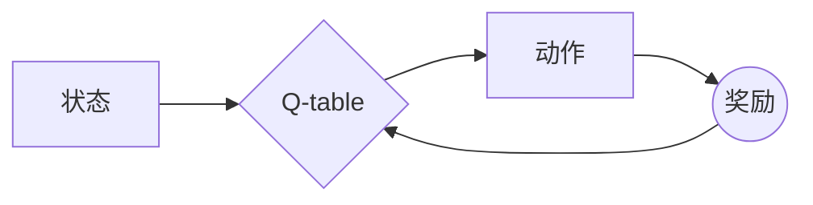

##  一切皆是映射：AI Q-learning核心算法解析

## 1. 背景介绍

### 1.1 强化学习：智能体与环境的交互

强化学习（Reinforcement Learning，RL）作为机器学习的一个重要分支，其核心在于智能体（Agent）通过与环境的交互学习最优策略。智能体在环境中执行动作，接收环境反馈的奖励或惩罚，并根据这些反馈调整自身的策略以最大化累积奖励。

### 1.2 Q-learning：基于价值的强化学习方法

Q-learning是一种基于价值的强化学习方法，它通过学习一个名为Q-table的表格来表示状态-动作对的价值。Q-table中的每个元素代表在特定状态下执行特定动作的预期累积奖励。智能体通过不断更新Q-table来学习最优策略，即在每个状态下选择能够获得最大预期累积奖励的动作。

### 1.3 一切皆是映射：Q-learning的本质

Q-learning的核心思想可以概括为“一切皆是映射”。它将状态-动作对映射到预期累积奖励，从而将复杂的决策问题转化为简单的查表问题。智能体只需根据当前状态和Q-table选择动作，无需进行复杂的推理或规划。

## 2. 核心概念与联系

### 2.1 状态（State）

状态是描述环境信息的集合，它可以是任何形式，例如游戏中的棋盘布局、机器人手臂的位置、股票市场的走势等等。状态的定义取决于具体的应用场景。

### 2.2 动作（Action）

动作是智能体可以执行的操作，例如在游戏中移动棋子、机器人手臂的旋转、股票的买入或卖出等等。动作的定义同样取决于具体的应用场景。

### 2.3 奖励（Reward）

奖励是环境对智能体执行动作的反馈，它可以是正数、负数或零。正奖励表示鼓励智能体执行该动作，负奖励表示惩罚智能体执行该动作。奖励的设置直接影响智能体的学习效果。

### 2.4 Q-table

Q-table是一个表格，用于存储状态-动作对的价值。每个元素Q(s, a)表示在状态s下执行动作a的预期累积奖励。

### 2.5 策略（Policy）

策略是指智能体在每个状态下选择动作的规则。Q-learning的目标是学习一个最优策略，即在每个状态下选择能够获得最大预期累积奖励的动作。

### 2.6 关系图



## 3. 核心算法原理具体操作步骤

### 3.1 初始化Q-table

首先，需要初始化Q-table。通常将Q-table的所有元素初始化为0或随机值。

### 3.2 选择动作

在每个时间步，智能体根据当前状态s和Q-table选择动作a。常用的动作选择策略有：

* 贪婪策略：选择Q-table中Q(s, a)最大的动作。
* ε-贪婪策略：以ε的概率随机选择一个动作，以1-ε的概率选择Q-table中Q(s, a)最大的动作。

### 3.3 执行动作

智能体执行选择的动作a，并观察环境的反馈，得到新的状态s'和奖励r。

### 3.4 更新Q-table

根据观察到的结果，更新Q-table中对应的元素Q(s, a)：

$$
Q(s, a) \leftarrow (1 - \alpha) * Q(s, a) + \alpha * (r + \gamma * \max_{a'} Q(s', a'))
$$

其中：

* α是学习率，控制新信息对Q-table的影响程度。
* γ是折扣因子，用于平衡当前奖励和未来奖励的重要性。

### 3.5 重复步骤2-4

重复步骤2-4，直到Q-table收敛，即不再发生 significant 的变化。

## 4. 数学模型和公式详细讲解举例说明

### 4.1 Q-learning更新公式

Q-learning更新公式的核心思想是基于贝尔曼方程：

$$
Q(s, a) = r + \gamma * \max_{a'} Q(s', a')
$$

该方程表明，在状态s下执行动作a的预期累积奖励等于当前奖励r加上折扣后的未来最大预期累积奖励。

Q-learning更新公式将贝尔曼方程转化为迭代更新的形式：

$$
Q(s, a) \leftarrow (1 - \alpha) * Q(s, a) + \alpha * (r + \gamma * \max_{a'} Q(s', a'))
$$

该公式将当前Q值与目标Q值进行加权平均，从而逐步逼近贝尔曼方程。

### 4.2 举例说明

假设有一个简单的迷宫游戏，智能体需要从起点走到终点。迷宫中有四个状态（A、B、C、D）和四个动作（上、下、左、右）。奖励设置如下：

* 走到终点获得奖励100。
* 撞到墙壁获得奖励-1。
* 其他情况获得奖励0。

初始Q-table所有元素均为0。假设智能体初始状态为A，选择动作“右”，移动到状态B，获得奖励0。根据Q-learning更新公式，更新Q(A, 右)：

$$
Q(A, 右) \leftarrow (1 - 0.1) * 0 + 0.1 * (0 + 0.9 * \max_{a'} Q(B, a'))
$$

由于Q(B, a')均为0，因此Q(A, 右)更新为0。

## 5. 项目实践：代码实例和详细解释说明

```python
import numpy as np

# 定义环境
class Maze:
    def __init__(self):
        self.states = ['A', 'B', 'C', 'D']
        self.actions = ['up', 'down', 'left', 'right']
        self.rewards = {
            ('A', 'right'): 0,
            ('B', 'down'): 100,
            ('B', 'up'): -1,
            ('B', 'left'): -1,
            ('B', 'right'): -1,
            ('C', 'left'): 0,
            ('C', 'right'): -1,
            ('D', 'up'): 0,
            ('D', 'down'): -1,
        }

    def get_reward(self, state, action):
        if (state, action) in self.rewards:
            return self.rewards[(state, action)]
        else:
            return 0

    def get_next_state(self, state, action):
        if state == 'A' and action == 'right':
            return 'B'
        elif state == 'B' and action == 'down':
            return 'D'
        elif state == 'C' and action == 'left':
            return 'B'
        else:
            return state

# 定义Q-learning算法
class QLearning:
    def __init__(self, env, alpha=0.1, gamma=0.9, epsilon=0.1):
        self.env = env
        self.alpha = alpha
        self.gamma = gamma
        self.epsilon = epsilon
        self.q_table = {}
        for s in env.states:
            for a in env.actions:
                self.q_table[(s, a)] = 0

    def choose_action(self, state):
        if np.random.uniform(0, 1) < self.epsilon:
            return np.random.choice(self.env.actions)
        else:
            q_values = [self.q_table[(state, a)] for a in self.env.actions]
            return self.env.actions[np.argmax(q_values)]

    def update_q_table(self, state, action, reward, next_state):
        q_values = [self.q_table[(next_state, a)] for a in self.env.actions]
        self.q_table[(state, action)] = (1 - self.alpha) * self.q_table[(state, action)] + self.alpha * (reward + self.gamma * np.max(q_values))

# 训练智能体
env = Maze()
agent = QLearning(env)

for episode in range(1000):
    state = 'A'
    while state != 'D':
        action = agent.choose_action(state)
        reward = env.get_reward(state, action)
        next_state = env.get_next_state(state, action)
        agent.update_q_table(state, action, reward, next_state)
        state = next_state

# 打印Q-table
print(agent.q_table)
```

### 5.1 代码解释

* 首先，定义了迷宫环境，包括状态、动作和奖励。
* 然后，定义了Q-learning算法，包括学习率、折扣因子、ε-贪婪策略参数和Q-table。
* 在训练过程中，智能体从起点开始，根据当前状态和Q-table选择动作，执行动作，获得奖励，并更新Q-table。
* 最后，打印训练好的Q-table。

### 5.2 结果分析

训练完成后，Q-table会存储每个状态-动作对的预期累积奖励。例如，Q(A, right)表示在状态A执行动作“右”的预期累积奖励。智能体可以根据Q-table选择最优动作，即在每个状态下选择能够获得最大预期累积奖励的动作。

## 6. 实际应用场景

### 6.1 游戏AI

Q-learning可以用于开发游戏AI，例如围棋、象棋、扑克等。

### 6.2 机器人控制

Q-learning可以用于控制机器人，例如机械臂、无人机等。

### 6.3 自动驾驶

Q-learning可以用于自动驾驶，例如路径规划、交通灯识别等。

### 6.4 金融交易

Q-learning可以用于金融交易，例如股票交易、期货交易等。

## 7. 工具和资源推荐

### 7.1 OpenAI Gym

OpenAI Gym是一个用于开发和比较强化学习算法的工具包，它提供了各种各样的环境，例如经典控制问题、游戏、机器人模拟器等。

### 7.2 TensorFlow

TensorFlow是一个开源的机器学习框架，它提供了丰富的工具和资源，可以用于实现Q-learning算法。

### 7.3 PyTorch

PyTorch是另一个开源的机器学习框架，它也提供了丰富的工具和资源，可以用于实现Q-learning算法。

## 8. 总结：未来发展趋势与挑战

### 8.1 深度强化学习

深度强化学习将深度学习与强化学习相结合，利用深度神经网络来逼近Q-table或策略函数，从而解决更复杂的问题。

### 8.2 多智能体强化学习

多智能体强化学习研究多个智能体在同一环境中相互作用的场景，例如多人游戏、机器人团队协作等。

### 8.3 迁移学习

迁移学习旨在将从一个任务中学到的知识迁移到另一个相关任务，从而提高学习效率。

## 9. 附录：常见问题与解答

### 9.1 Q-learning和SARSA的区别

Q-learning是一种off-policy算法，它学习最优策略，而SARSA是一种on-policy算法，它学习当前策略。

### 9.2 Q-learning的局限性

Q-learning适用于离散状态和动作空间，对于连续状态和动作空间，需要进行离散化或使用函数逼近。

### 9.3 如何提高Q-learning的性能

* 调整学习率和折扣因子。
* 使用ε-贪婪策略平衡探索和利用。
* 使用经验回放机制提高数据利用效率。
