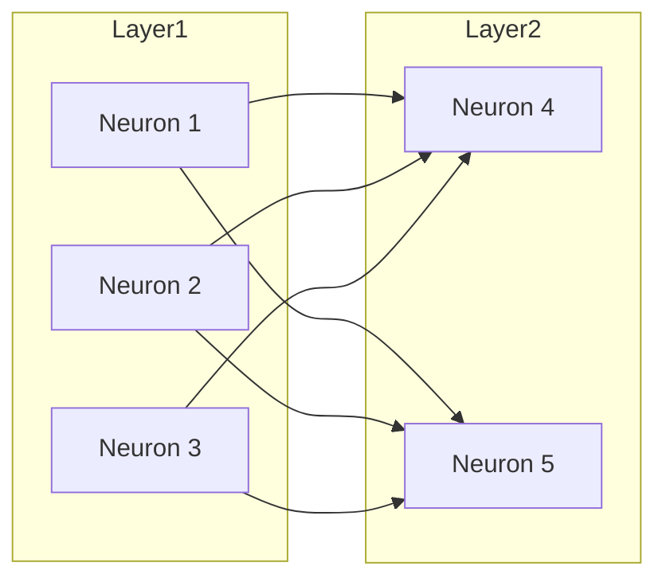

# 一切皆是映射：构建你自己的神经网络：入门指南

## 1.背景介绍

### 1.1 神经网络的兴起

神经网络近年来在人工智能领域获得了前所未有的关注和发展。它们被广泛应用于计算机视觉、自然语言处理、语音识别等各个领域,展现出了强大的能力。这种兴趣的浪潮源于深度学习技术的突破性进展,尤其是在训练深层神经网络方面。

### 1.2 神经网络的本质

但是,神经网络到底是什么呢?它们是如何工作的?虽然神经网络的数学原理和算法看起来复杂晦涩,但其核心思想却出奇的简单:一切都是映射(mapping)。

### 1.3 映射的力量

映射这个概念虽然简单,但却是理解神经网络的关键所在。它解释了为什么神经网络能够学习复杂的函数并对新的输入数据进行预测和推理。通过将输入数据映射到输出空间,神经网络可以捕捉输入和输出之间的潜在规律和模式。

## 2.核心概念与联系

### 2.1 神经元

神经网络的基本单元是神经元(neuron)。每个神经元接收一些输入值,对它们进行加权求和,然后通过一个非线性激活函数得到输出值。这个过程类似于一个简单的函数映射。

$$
y = f(\sum_{i=1}^{n}w_ix_i + b)
$$

其中$x_i$是输入值,$w_i$是对应的权重,b是偏置项,f是非线性激活函数。

### 2.2 层与连接

神经元被组织成层(layer),每一层的神经元输出将作为下一层的输入。层与层之间通过权重相连,这些权重决定了信号在网络中的流动方式。通过训练,网络可以学习到合适的权重值,从而实现所需的映射。



### 2.3 前馈与反向传播

在前馈(forward propagation)过程中,输入数据经过层层映射,最终到达输出层。而反向传播(backpropagation)则是通过比较输出与标准答案的差异,计算误差梯度,并沿着网络连接的反方向更新权重,使网络输出逐步逼近期望值。

### 2.4 深度学习

随着层数的增加,神经网络能够表示更加复杂的映射函数。这种深层次的结构赋予了神经网络强大的表达能力,可以从原始数据中自动提取出多层次的抽象特征,从而解决高维复杂的问题。

## 3.核心算法原理具体操作步骤  

### 3.1 前馈传播算法

前馈传播算法描述了在给定输入下,计算神经网络输出值的过程。对于每个神经元,它首先计算加权输入的总和,然后将其传递给激活函数以产生输出。该过程从输入层开始,一层一层向前传播,直到到达输出层。

1. 初始化网络权重(可使用小的随机值)
2. 对于每个输入样本:
    - 将输入样本馈送到输入层
    - 对于每个隐藏层:
        + 计算该层每个神经元的加权输入
        + 将加权输入传递给激活函数以获得神经元输出
        + 将该层的神经元输出作为下一层的输入
    - 计算输出层的输出值

该算法实现了从输入到输出的映射过程,但不能对网络进行训练以提高其性能。这需要使用反向传播算法。

### 3.2 反向传播算法

反向传播算法通过计算误差梯度来更新网络权重,使得网络输出逐步接近期望输出。该算法包含以下步骤:

1. 执行前馈传播以计算输出
2. 计算输出层的误差(实际输出与期望输出之差)
3. 反向传播误差:
    - 对于输出层:
        + 计算每个神经元的误差梯度
        + 使用梯度下降更新神经元权重和偏置
    - 对于每个隐藏层(从输出层向输入层的方向):
        + 计算该层每个神经元的误差梯度
        + 使用梯度下降更新神经元权重和偏置

4. 重复步骤1-3,直到网络收敛或达到最大迭代次数

该算法通过反向传播误差信号,并使用梯度下降法最小化损失函数,从而优化网络的权重和偏置参数。这实现了将输入映射到期望输出的过程。

## 4.数学模型和公式详细讲解举例说明

### 4.1 激活函数

激活函数引入了神经网络的非线性,使其能够拟合复杂的映射关系。常用的激活函数包括:

1. Sigmoid函数:
   $$\sigma(x) = \frac{1}{1+e^{-x}}$$

2. Tanh函数: 
   $$\tanh(x) = \frac{e^x - e^{-x}}{e^x + e^{-x}}$$

3. ReLU(整流线性单元):
   $$\text{ReLU}(x) = \max(0, x)$$

### 4.2 损失函数

损失函数用于衡量网络输出与期望输出之间的差异,是优化过程中需要最小化的目标函数。常用的损失函数包括:

1. 均方误差(MSE):
   $$E = \frac{1}{n}\sum_{i=1}^{n}(y_i - \hat{y_i})^2$$

2. 交叉熵损失:
   $$E = -\frac{1}{n}\sum_{i=1}^{n}[y_i\log(\hat{y_i}) + (1-y_i)\log(1-\hat{y_i})]$$

其中$y_i$是期望输出,$\hat{y_i}$是网络输出,n是样本数量。

### 4.3 权重更新

在反向传播过程中,使用梯度下降法更新网络权重,使损失函数最小化。对于每个权重$w_{ij}$,更新规则为:

$$w_{ij}^{(t+1)} = w_{ij}^{(t)} - \eta\frac{\partial E}{\partial w_{ij}}$$

其中$\eta$是学习率,控制更新的步长;$\frac{\partial E}{\partial w_{ij}}$是损失函数相对于权重$w_{ij}$的梯度,可以通过反向传播计算得到。

### 4.4 实例:二分类问题

考虑一个二分类问题,我们需要构建一个能够将输入$\mathbf{x} = (x_1, x_2)$正确分类为0或1的神经网络。

假设我们使用一个单层神经网络,包含两个输入神经元、一个隐藏层(具有3个神经元)和一个输出神经元。我们可以定义以下映射关系:

1. 隐藏层:
   $$
   \begin{aligned}
   h_1 &= \sigma(w_{11}x_1 + w_{12}x_2 + b_1)\\
   h_2 &= \sigma(w_{21}x_1 + w_{22}x_2 + b_2)\\
   h_3 &= \sigma(w_{31}x_1 + w_{32}x_2 + b_3)
   \end{aligned}
   $$

2. 输出层:
   $$\hat{y} = \sigma(w_4h_1 + w_5h_2 + w_6h_3 + b_4)$$

其中$\sigma$是sigmoid激活函数。通过训练,网络将学习合适的权重$w$和偏置$b$,使得输出$\hat{y}$尽可能接近期望输出$y$。

## 5.项目实践:代码实例和详细解释说明

为了加深对神经网络的理解,我们将使用Python和流行的机器学习库Keras构建一个简单的前馈神经网络,并在MNIST手写数字识别数据集上进行训练和测试。

### 5.1 导入所需库

```python
import numpy as np
from keras.models import Sequential
from keras.layers import Dense
from keras.optimizers import SGD
from keras.datasets import mnist
```

### 5.2 加载MNIST数据集

```python
# 加载MNIST数据集
(x_train, y_train), (x_test, y_test) = mnist.load_data()

# 将图像数据标准化到0-1范围
x_train = x_train.reshape(60000, 784).astype('float32') / 255
x_test = x_test.reshape(10000, 784).astype('float32') / 255

# 将标签进行一热编码
y_train = np.eye(10)[y_train]
y_test = np.eye(10)[y_test]
```

### 5.3 构建神经网络模型

```python
# 构建序贯模型
model = Sequential()

# 添加输入层和第一个隐藏层
model.add(Dense(64, input_dim=784, activation='relu'))

# 添加更多隐藏层
model.add(Dense(32, activation='relu'))

# 添加输出层
model.add(Dense(10, activation='softmax'))
```

在这个例子中,我们构建了一个包含两个隐藏层的前馈神经网络。第一个隐藏层有64个神经元,第二个隐藏层有32个神经元。输出层有10个神经元,对应10个数字类别。

### 5.4 编译模型

```python
# 编译模型
model.compile(optimizer=SGD(lr=0.01), loss='categorical_crossentropy', metrics=['accuracy'])
```

我们使用随机梯度下降作为优化器,学习率设置为0.01。损失函数选择类别交叉熵,评估指标为准确率。

### 5.5 训练模型

```python
# 训练模型
model.fit(x_train, y_train, epochs=10, batch_size=128, verbose=1, validation_data=(x_test, y_test))
```

我们在训练数据上训练模型10个epochs,每个batch包含128个样本。在每个epoch结束时,将在测试数据上评估模型的性能。

### 5.6 评估模型

```python
# 评估模型在测试集上的性能
scores = model.evaluate(x_test, y_test, verbose=0)
print('Test loss:', scores[0])
print('Test accuracy:', scores[1])
```

在训练结束后,我们可以在测试数据集上评估模型的损失和准确率,以了解其性能表现。

通过这个实例,我们实践了如何使用Python和Keras构建、训练和评估一个简单的神经网络模型。虽然这只是一个基本示例,但它展示了映射思想在实践中的应用,为构建更复杂的神经网络奠定了基础。

## 6.实际应用场景

神经网络在现实世界中有着广泛的应用,下面是一些典型的应用场景:

### 6.1 计算机视觉

- 图像分类: 将图像分类为不同的类别,如猫、狗、汽车等。
- 目标检测: 在图像或视频中定位和识别特定目标的位置。
- 语义分割: 将图像像素级别地分割为不同的语义类别。

### 6.2 自然语言处理

- 机器翻译: 将一种语言翻译成另一种语言。
- 情感分析: 分析文本的情感极性(正面或负面)。
- 文本生成: 根据给定的上下文生成连贯的文本。

### 6.3 语音识别

- 自动语音识别(ASR): 将语音转录为文本。
- 语音合成: 将文本转换为自然的语音输出。

### 6.4 推荐系统

- 个性化推荐: 根据用户的历史行为和偏好,推荐感兴趣的商品或内容。

### 6.5 医疗保健

- 医学影像分析: 从X射线、CT扫描或MRI图像中诊断疾病。
- 药物发现: 预测新分子的生物活性和毒性。

### 6.6 金融

- 股票预测: 预测股票价格的未来走势。
- 欺诈检测: 识别可疑的金融交易活动。

这只是神经网络应用的一小部分,随着技术的不断进步,它们正在不断扩展到更多的领域。

## 7.工具和资源推荐

### 7.1 机器学习框架

- TensorFlow: 由Google开发的开源机器学习框架,支持