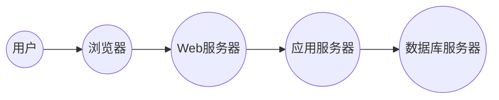

## 1. 背景介绍

### 1.1 中学图书馆现状及需求

随着信息技术的飞速发展，中学图书馆的功能早已不再局限于简单的图书借阅。现代中学图书馆需要满足师生多元化的学习和信息需求，例如：

* **丰富的馆藏资源:** 图书、期刊、电子资源、音视频资料等。
* **便捷的借阅服务:**  自助借还、预约借阅、馆际互借等。
* **高效的信息检索:**  精准搜索、个性化推荐、主题资源导航等。
* **多元化的学习空间:**  阅览室、自习室、多媒体教室、研讨室等。
* **智能化的管理系统:**  图书编目、流通管理、读者管理、统计分析等。

### 1.2 图书馆管理系统的重要性

图书馆管理系统是现代中学图书馆的“大脑”，它承担着整合、管理、利用图书馆各种资源的重要任务。一个高效的图书馆管理系统可以：

* **提高图书馆管理效率:**  自动化处理借阅、归还、预约等业务，减少人工操作，提高工作效率。
* **优化读者服务体验:**  提供便捷的自助服务，个性化的资源推荐，提升读者满意度。
* **促进资源的有效利用:**  提供精准的检索服务，主题资源导航，帮助读者快速找到所需信息。
* **支持图书馆决策:**  提供数据统计分析功能，帮助图书馆管理者了解读者需求，优化馆藏结构，制定发展规划。

## 2. 核心概念与联系

### 2.1 系统架构

中学图书馆系统通常采用B/S架构，即浏览器/服务器架构。用户通过浏览器访问系统，服务器负责处理业务逻辑和数据存储。

**系统架构图：**



### 2.2 核心模块

中学图书馆系统通常包括以下核心模块：

* **读者管理模块:**  负责读者信息管理、借阅权限设置、借阅记录查询等。
* **图书管理模块:**  负责图书编目、分类、检索、统计等。
* **流通管理模块:**  负责图书借阅、归还、预约、续借等业务处理。
* **系统管理模块:**  负责系统参数设置、用户权限管理、数据备份恢复等。

### 2.3 模块之间的联系

各模块之间相互协作，共同完成图书馆管理系统的各项功能。例如：

* 读者借阅图书时，流通管理模块需要调用读者管理模块验证读者身份和借阅权限。
* 图书编目时，图书管理模块需要调用系统管理模块获取分类体系和编目规则。
* 系统管理员可以通过系统管理模块监控各模块运行状态，进行数据备份和恢复。

## 3. 核心算法原理具体操作步骤

### 3.1 图书检索算法

图书馆系统需要提供高效的图书检索功能，常用的检索算法包括：

* **倒排索引:**  建立关键词与文档的映射关系，快速检索包含特定关键词的文档。
* **布尔检索:**  使用逻辑运算符（AND、OR、NOT）连接多个关键词，实现更精准的检索。
* **自然语言处理:**  分析用户输入的自然语言查询，提取关键词，进行语义匹配，提高检索精度。

**倒排索引算法操作步骤:**

1. 对所有图书建立索引，提取关键词，建立关键词与图书的映射关系。
2. 用户输入检索词时，系统根据倒排索引快速找到包含该关键词的图书。
3. 对检索结果进行排序，例如按相关度、出版年份、作者等排序。

### 3.2 图书推荐算法

为了提高读者借阅兴趣和效率，图书馆系统可以提供个性化的图书推荐服务。常用的推荐算法包括：

* **协同过滤:**  根据用户的历史借阅记录，找到与其兴趣相似的其他用户，推荐这些用户借阅过的图书。
* **基于内容的推荐:**  分析图书内容，提取关键词，根据用户的兴趣标签推荐与其兴趣相关的图书。
* **混合推荐:**  结合协同过滤和基于内容的推荐，提高推荐精度和个性化程度。

**协同过滤算法操作步骤:**

1. 收集用户的历史借阅数据，构建用户-图书评分矩阵。
2. 计算用户之间的相似度，例如皮尔逊相关系数、余弦相似度等。
3. 找到与目标用户兴趣相似的其他用户，推荐这些用户借阅过的图书。

## 4. 数学模型和公式详细讲解举例说明

### 4.1 图书流通率

图书流通率是指一定时期内图书借阅次数与馆藏图书总量的比率。它是衡量图书馆资源利用效率的重要指标。

**公式:**

$$
图书流通率 = \frac{图书借阅次数}{馆藏图书总量} \times 100\%
$$

**举例:**

某中学图书馆拥有图书10000册，一年内图书借阅次数为20000次，则该图书馆的图书流通率为：

$$
图书流通率 = \frac{20000}{10000} \times 100\% = 200\%
$$

### 4.2 读者平均借阅量

读者平均借阅量是指一定时期内读者人均借阅图书的数量。它是衡量读者阅读兴趣和图书馆服务水平的重要指标。

**公式:**

$$
读者平均借阅量 = \frac{图书借阅总量}{读者人数}
$$

**举例:**

某中学图书馆拥有读者1000人，一年内图书借阅总量为20000册，则该图书馆的读者平均借阅量为：

$$
读者平均借阅量 = \frac{20000}{1000} = 20册/人
$$

## 5. 项目实践：代码实例和详细解释说明

### 5.1 图书借阅功能实现

**代码示例 (Python):**

```python
def borrow_book(user_id, book_id):
    """
    图书借阅功能

    Args:
        user_id: 用户ID
        book_id: 图书ID

    Returns:
        借阅结果信息
    """
    # 验证用户身份和借阅权限
    user = get_user(user_id)
    if not user:
        return "用户不存在"
    if not user.can_borrow():
        return "用户借阅权限不足"

    # 检查图书库存
    book = get_book(book_id)
    if not book:
        return "图书不存在"
    if not book.is_available():
        return "图书已借出"

    # 更新图书状态
    book.borrow(user_id)

    # 记录借阅信息
    create_borrow_record(user_id, book_id)

    return "借阅成功"
```

**代码解释:**

* 函数`borrow_book`接收用户ID和图书ID作为参数，实现图书借阅功能。
* 首先，函数验证用户身份和借阅权限，确保用户存在且有借阅权限。
* 然后，函数检查图书库存，确保图书存在且可借阅。
* 如果验证通过，则更新图书状态为“已借出”，并记录借阅信息。
* 最后，函数返回借阅结果信息。

### 5.2 图书检索功能实现

**代码示例 (Python):**

```python
def search_books(query):
    """
    图书检索功能

    Args:
        query: 检索词

    Returns:
        检索结果列表
    """
    # 使用倒排索引检索包含检索词的图书
    results = search_index(query)

    # 对检索结果进行排序
    results.sort(key=lambda x: x.relevance, reverse=True)

    return results
```

**代码解释:**

* 函数`search_books`接收检索词作为参数，实现图书检索功能。
* 函数使用倒排索引检索包含检索词的图书，并对检索结果按相关度进行排序。
* 最后，函数返回检索结果列表。

## 6. 实际应用场景

### 6.1 学生自助借还

学生可以使用自助借还机进行图书借阅和归还，无需排队等待人工服务，提高借阅效率。

### 6.2 教师推荐书单

教师可以根据教学需要，创建推荐书单，方便学生查找相关学习资源。

### 6.3 图书馆数据分析

图书馆管理者可以利用系统提供的统计分析功能，了解读者借阅趋势、热门图书、馆藏利用率等信息，为图书馆决策提供数据支持。

## 7. 工具和资源推荐

### 7.1 开源图书馆管理系统

* **Koha:** 成熟的开源图书馆管理系统，功能强大，支持多种语言。
* **Evergreen:**  另一款流行的开源图书馆管理系统，界面友好，易于使用。

### 7.2 数据库管理系统

* **MySQL:**  流行的开源关系型数据库管理系统，性能稳定，易于维护。
* **PostgreSQL:**  功能强大的开源关系型数据库管理系统，支持更复杂的数据类型和查询。

### 7.3 开发工具

* **Python:**  流行的编程语言，语法简洁，易于学习，拥有丰富的第三方库。
* **Django:**  基于Python的Web框架，可以快速构建Web应用。

## 8. 总结：未来发展趋势与挑战

### 8.1 未来发展趋势

* **智能化:**  利用人工智能技术，实现图书推荐、读者画像、智能客服等功能，提升图书馆服务智能化水平。
* **数字化:**  推进图书数字化，提供更丰富的电子资源，满足读者多元化阅读需求。
* **个性化:**  提供个性化的阅读推荐、学习路径规划等服务，满足读者个性化学习需求。

### 8.2 面临的挑战

* **数据安全:**  保护读者隐私和图书版权，防止数据泄露和滥用。
* **技术更新:**  及时更新系统技术，适应新的技术发展趋势。
* **资金投入:**  需要持续的资金投入，保障系统维护和功能升级。

## 9. 附录：常见问题与解答

### 9.1 如何注册读者账号？

学生和教师可以通过学校官网或图书馆网站在线注册读者账号，填写个人信息并设置密码即可。

### 9.2 如何查询图书借阅记录？

读者可以登录图书馆系统，在“我的借阅”页面查看自己的借阅记录，包括借阅图书、借阅日期、应还日期等信息。

### 9.3 如何预约图书？

如果所需图书已被借出，读者可以登录图书馆系统，在图书详情页面点击“预约”按钮进行预约。当图书归还后，系统会自动通知读者前来借阅。
