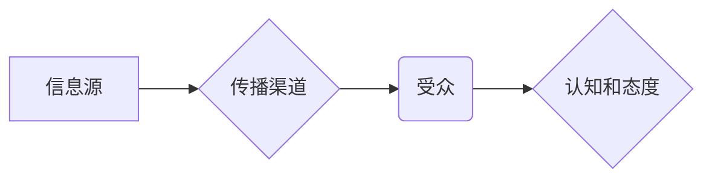

# 《从扩散模型Diffusion Model看网络信息传播》

作者：禅与计算机程序设计艺术

## 1. 背景介绍

### 1.1 信息传播的本质

在当今信息爆炸的时代，信息如同洪水般涌入我们的生活，而网络信息传播则扮演着至关重要的角色。理解信息传播的本质，对于我们把握信息时代脉搏、洞察社会发展趋势、制定有效的信息传播策略都具有重要意义。

信息传播的本质可以概括为信息的流动和扩散过程。信息源产生信息，通过各种渠道传递给受众，受众接收信息并进行解码和理解，最终形成对信息的认知和态度。在这个过程中，信息传播受到多种因素的影响，包括信息源的信誉度、传播渠道的效率、受众的信息需求和心理状态等等。

### 1.2 扩散模型的引入

为了更好地理解信息传播的规律，研究者们提出了各种模型和理论，其中扩散模型（Diffusion Model）是一种被广泛应用的模型。扩散模型最早起源于物理学领域，用于描述物质在介质中的扩散过程。后来，该模型被引入社会科学领域，用于研究信息、观念、行为等在社会网络中的传播规律。

扩散模型的核心思想是，信息在社会网络中的传播是一个渐进的过程，信息会像水滴滴入水中一样，逐渐向外扩散，最终影响到整个网络。在这个过程中，信息传播的速度、范围和影响力受到多种因素的影响，例如网络结构、个体特征、信息内容等等。

### 1.3 本文的意义

本文旨在探讨如何利用扩散模型来理解网络信息传播现象。我们将从以下几个方面展开讨论：

* 扩散模型的基本原理和核心概念
* 扩散模型在信息传播中的应用
* 基于扩散模型的信息传播策略
* 扩散模型的局限性和未来发展方向

通过对这些问题的探讨，我们可以更深入地理解信息传播的规律，并为信息传播实践提供理论指导。

## 2. 核心概念与联系

### 2.1 扩散模型的基本原理

扩散模型的基本原理是基于信息在社会网络中的传播是一个渐进的过程，信息会像水滴滴入水中一样，逐渐向外扩散，最终影响到整个网络。

在这个过程中，信息传播的速度、范围和影响力受到多种因素的影响，例如网络结构、个体特征、信息内容等等。

### 2.2 核心概念

* **创新者（Innovators）:** 最早接触并接受新信息的人，他们通常具有较高的社会地位、信息敏感度和冒险精神。
* **早期采用者（Early Adopters）:** 在创新者之后接受新信息的人，他们通常是意见领袖，对新事物持开放态度，并愿意尝试新事物。
* **早期大众（Early Majority）:** 在早期采用者之后接受新信息的人，他们通常是社会主流群体，对新事物持谨慎态度，需要观察一段时间才会接受。
* **晚期大众（Late Majority）:** 在早期大众之后接受新信息的人，他们通常是社会保守群体，对新事物持怀疑态度，只有在大多数人都接受之后才会接受。
* **落后者（Laggards）:** 最后接受新信息的人，他们通常是社会边缘群体，对新事物持排斥态度，很难接受新事物。

### 2.3 概念之间的联系

这些概念之间存在着密切的联系，它们共同构成了信息传播的扩散曲线。创新者是信息传播的起点，他们率先接受新信息，并将其传播给早期采用者。早期采用者是信息传播的关键环节，他们将信息传播给更广泛的群体，从而推动信息传播的加速发展。早期大众和晚期大众是信息传播的主体，他们决定了信息传播的最终范围和影响力。落后者是信息传播的尾声，他们代表着信息传播的最终完成。

## 3. 核心算法原理具体操作步骤

### 3.1 算法原理

扩散模型的算法原理可以概括为以下几个步骤：

1. **初始化:** 首先，我们需要初始化网络中的节点状态，例如将所有节点设置为未激活状态。
2. **选择种子节点:** 然后，我们需要选择一些种子节点，这些节点代表着信息的初始传播者，例如创新者。
3. **信息传播:** 接下来，信息会从种子节点开始，沿着网络中的连接关系向外扩散。
4. **节点激活:** 当一个节点接收到足够多的信息时，它就会被激活，并开始向其他节点传播信息。
5. **迭代传播:** 信息传播过程会不断迭代，直到网络中的所有节点都被激活，或者信息传播达到稳定状态。

### 3.2 具体操作步骤

下面以一个简单的例子来说明扩散模型的具体操作步骤：

假设我们有一个包含 5 个节点的网络，节点之间的连接关系如下所示：

```
graph LR
A --> B
A --> C
B --> D
C --> E
```

1. **初始化:** 将所有节点设置为未激活状态。
2. **选择种子节点:** 选择节点 A 作为种子节点。
3. **信息传播:** 节点 A 开始向节点 B 和 C 传播信息。
4. **节点激活:** 当节点 B 和 C 接收到来自节点 A 的信息时，它们就会被激活，并开始向节点 D 和 E 传播信息。
5. **迭代传播:** 信息传播过程会不断迭代，直到网络中的所有节点都被激活。

## 4. 数学模型和公式详细讲解举例说明

### 4.1 SIR 模型

SIR 模型是一种经典的扩散模型，它将人群分为三种状态：

* **易感者 (Susceptible):** 未感染病毒，但可能被感染的人。
* **感染者 (Infected):** 被病毒感染，并可以传播病毒的人。
* **康复者 (Recovered):** 已经从病毒感染中恢复，并对病毒免疫的人。

SIR 模型使用以下三个微分方程来描述三种状态的变化：

$$
\begin{aligned}
\frac{dS}{dt} &= -\beta SI \\
\frac{dI}{dt} &= \beta SI - \gamma I \\
\frac{dR}{dt} &= \gamma I
\end{aligned}
$$

其中：

* $S$ 表示易感者数量。
* $I$ 表示感染者数量。
* $R$ 表示康复者数量。
* $\beta$ 表示感染率，即每个感染者每天能够感染的易感者数量。
* $\gamma$ 表示康复率，即每个感染者每天康复的概率。

### 4.2 举例说明

假设一个城市有 10000 人，其中 100 人感染了病毒。感染率为 0.001，康复率为 0.1。

我们可以使用 SIR 模型来模拟病毒在城市中的传播过程：

```python
import numpy as np
from scipy.integrate import odeint

# 定义模型参数
beta = 0.001
gamma = 0.1

# 定义初始条件
S0 = 9900
I0 = 100
R0 = 0

# 定义时间跨度
t = np.linspace(0, 100, 1000)

# 定义 SIR 模型
def sir_model(y, t, beta, gamma):
    S, I, R = y
    dSdt = -beta * S * I
    dIdt = beta * S * I - gamma * I
    dRdt = gamma * I
    return [dSdt, dIdt, dRdt]

# 求解微分方程
solution = odeint(sir_model, [S0, I0, R0], t, args=(beta, gamma))

# 绘制结果
plt.plot(t, solution[:, 0], label='Susceptible')
plt.plot(t, solution[:, 1], label='Infected')
plt.plot(t, solution[:, 2], label='Recovered')
plt.xlabel('Time (days)')
plt.ylabel('Number of people')
plt.legend()
plt.show()
```

运行代码后，我们可以得到病毒在城市中传播的模拟结果。

## 5. 项目实践：代码实例和详细解释说明

### 5.1 Python 代码实例

```python
import networkx as nx
import matplotlib.pyplot as plt

# 创建一个随机网络
graph = nx.gnp_random_graph(100, 0.1)

# 选择种子节点
seed_nodes = [0, 10, 20]

# 定义扩散模型
def diffusion_model(graph, seed_nodes, threshold):
    """
    扩散模型

    参数:
    graph: 网络图
    seed_nodes: 种子节点列表
    threshold: 节点激活阈值

    返回值:
    activated_nodes: 激活节点列表
    """

    # 初始化节点状态
    node_states = {node: False for node in graph.nodes}

    # 激活种子节点
    for node in seed_nodes:
        node_states[node] = True

    # 迭代传播信息
    while True:
        new_activated_nodes = []
        for node in graph.nodes:
            if not node_states[node]:
                # 计算节点接收到的信息数量
                neighbor_count = sum([node_states[neighbor] for neighbor in graph.neighbors(node)])
                # 如果信息数量超过阈值，则激活节点
                if neighbor_count >= threshold:
                    node_states[node] = True
                    new_activated_nodes.append(node)
        # 如果没有新的节点被激活，则退出循环
        if len(new_activated_nodes) == 0:
            break

    # 返回激活节点列表
    activated_nodes = [node for node in graph.nodes if node_states[node]]
    return activated_nodes

# 运行扩散模型
activated_nodes = diffusion_model(graph, seed_nodes, 2)

# 绘制网络图和激活节点
nx.draw(graph, with_labels=True)
nx.draw_networkx_nodes(graph, pos=nx.spring_layout(graph), nodelist=activated_nodes, node_color='r')
plt.show()
```

### 5.2 代码解释

* 首先，我们使用 `networkx` 库创建了一个随机网络。
* 然后，我们选择了三个节点作为种子节点。
* 接着，我们定义了一个名为 `diffusion_model` 的函数，该函数实现了扩散模型的算法。
* 最后，我们运行扩散模型，并使用 `matplotlib` 库绘制了网络图和激活节点。

## 6. 实际应用场景

### 6.1 病毒营销

病毒营销是一种利用社交网络进行产品或服务推广的营销策略。其核心思想是，通过设计具有吸引力的内容，并鼓励用户分享，从而实现信息的快速传播。

扩散模型可以用于模拟病毒营销的效果，并帮助营销人员优化营销策略。例如，营销人员可以使用扩散模型来预测不同种子节点选择对信息传播范围的影响，从而选择最佳的种子节点。

### 6.2 谣言传播

谣言是一种未经证实的信息，它可以在社交网络中快速传播，并造成严重的社会影响。

扩散模型可以用于模拟谣言的传播过程，并帮助我们理解谣言传播的规律。例如，我们可以使用扩散模型来研究不同网络结构对谣言传播速度的影响，从而制定有效的谣言防控策略。

### 6.3 新技术推广

新技术推广是指将新技术引入市场的过程。新技术的推广需要克服用户对新技术的认知障碍和接受障碍，才能最终取得成功。

扩散模型可以用于模拟新技术推广的过程，并帮助我们理解新技术推广的规律。例如，我们可以使用扩散模型来研究不同用户群体对新技术的接受程度，从而制定有效的技术推广策略。

## 7. 工具和资源推荐

### 7.1 NetworkX

NetworkX 是一个用于创建、操作和研究复杂网络的 Python 包。它提供了丰富的功能，可以用于构建各种类型的网络，并进行网络分析和可视化。

### 7.2 Gephi

Gephi 是一款开源的网络分析和可视化软件。它提供了用户友好的界面，可以用于导入、分析和可视化各种类型的网络数据。

### 7.3 NetLogo

NetLogo 是一款用于模拟复杂系统的多代理建模环境。它提供了丰富的功能，可以用于构建各种类型的模型，包括扩散模型。

## 8. 总结：未来发展趋势与挑战

### 8.1 未来发展趋势

随着信息技术的快速发展，网络信息传播呈现出越来越复杂的趋势。为了更好地理解和应对这些趋势，扩散模型需要不断发展和完善。

未来扩散模型的发展趋势主要包括以下几个方面：

* **更精细的模型:** 传统的扩散模型通常假设所有节点都是同质的，而现实世界中的网络通常包含不同类型的节点，例如具有不同社会地位、信息需求和心理状态的个体。未来的扩散模型需要考虑节点的异质性，从而更准确地模拟信息传播过程。
* **更复杂的网络结构:** 传统的扩散模型通常假设网络结构是静态的，而现实世界中的网络结构是动态变化的，例如随着时间的推移，网络中的连接关系会发生变化。未来的扩散模型需要考虑网络结构的动态性，从而更准确地模拟信息传播过程。
* **更丰富的传播机制:** 传统的扩散模型通常假设信息传播是单向的，而现实世界中的信息传播通常是双向的，例如用户可以转发信息，也可以对信息进行评论和点赞。未来的扩散模型需要考虑更丰富的传播机制，从而更准确地模拟信息传播过程。

### 8.2 挑战

扩散模型在信息传播研究中面临着一些挑战，主要包括以下几个方面：

* **数据获取:** 扩散模型需要大量的网络数据来进行训练和验证，而现实世界中的网络数据通常难以获取，或者存在隐私问题。
* **模型解释:** 扩散模型通常是一个黑盒模型，其内部机制难以解释。这使得人们难以理解模型的预测结果，并难以根据模型的预测结果制定有效的策略。
* **模型泛化:** 扩散模型通常是在特定网络数据上进行训练的，其泛化能力有限。这意味着模型在应用于其他网络数据时，其预测精度可能会下降。

## 9. 附录：常见问题与解答

### 9.1 扩散模型和传染病模型有什么区别？

扩散模型和传染病模型都是用于描述信息或疾病在网络中传播的模型，但它们之间存在一些区别：

* **传播对象:** 扩散模型通常用于描述信息、观念、行为等在网络中的传播，而传染病模型通常用于描述疾病在人群中的传播。
* **节点状态:** 扩散模型通常将节点分为两种状态：激活状态和未激活状态，而传染病模型通常将节点分为三种状态：易感状态、感染状态和康复状态。
* **传播机制:** 扩散模型通常假设信息传播是单向的，而传染病模型通常假设疾病传播是双向的。

### 9.2 如何选择合适的扩散模型？

选择合适的扩散模型取决于具体的研究问题和数据特点。以下是一些选择扩散模型的建议：

* **网络结构:** 如果网络结构比较简单，例如规则网络或随机网络，则可以使用简单的扩散模型，例如 SIR 模型。如果网络结构比较复杂，例如社交网络，则需要使用更复杂的扩散模型，例如独立级联模型或线性阈值模型。
* **节点状态:** 如果节点状态比较简单，例如激活状态和未激活状态，则可以使用简单的扩散模型，例如 SIR 模型。如果节点状态比较复杂，例如具有不同社会地位、信息需求和心理状态的个体，则需要使用更复杂的扩散模型，例如异质性扩散模型。
* **传播机制:** 如果信息传播是单向的，则可以使用简单的扩散模型，例如 SIR 模型。如果信息传播是双向的，则需要使用更复杂的扩散模型，例如双向扩散模型。


## 10. Mermaid 流程图


