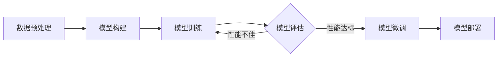

# 从零开始大模型开发与微调：基于深度学习的模型训练

作者：禅与计算机程序设计艺术

## 1. 背景介绍

### 1.1 大模型的兴起

近年来，随着深度学习技术的快速发展，以及计算能力的不断提升，大规模预训练语言模型（Large Language Model，LLM）逐渐成为人工智能领域的研究热点。这些模型通常包含数十亿甚至数千亿个参数，能够在海量文本数据上进行训练，从而获得强大的语言理解和生成能力。

### 1.2 大模型的优势

相比于传统的机器学习模型，大模型具有以下优势：

* **更强的泛化能力：** 由于在大规模数据集上进行了训练，大模型能够更好地泛化到未见过的样本上。
* **更高的准确率：** 大模型通常能够在各种自然语言处理任务上取得更高的准确率。
* **更丰富的表达能力：** 大模型能够学习到更复杂的语言模式，从而生成更自然、更流畅的文本。

### 1.3 大模型的应用

大模型在各个领域都有着广泛的应用，例如：

* **自然语言处理：** 文本生成、机器翻译、问答系统、情感分析等。
* **计算机视觉：** 图像分类、目标检测、图像描述生成等。
* **语音识别：** 语音转文本、语音合成等。

## 2. 核心概念与联系

### 2.1 深度学习

深度学习是一种机器学习方法，它利用多层神经网络来学习数据的表示。深度学习模型能够自动地从数据中提取特征，并进行复杂的非线性变换，从而获得强大的学习能力。

### 2.2 神经网络

神经网络是一种模拟人脑神经元结构的计算模型，它由多个神经元组成，每个神经元都与其他神经元相连接。神经元之间通过传递信号来进行信息处理。

### 2.3 语言模型

语言模型是一种统计模型，它用于预测一段文本序列中下一个词出现的概率。语言模型通常使用深度学习方法进行训练，例如循环神经网络（RNN）和 Transformer。

### 2.4 预训练

预训练是指在大规模数据集上训练模型，从而获得通用的语言表示。预训练模型可以作为其他任务的起点，例如文本分类、问答系统等。

### 2.5 微调

微调是指在预训练模型的基础上，针对特定任务进行进一步的训练。微调可以提高模型在特定任务上的性能。

## 3. 核心算法原理具体操作步骤

### 3.1 Transformer 架构

Transformer 是一种基于自注意力机制的神经网络架构，它在自然语言处理领域取得了巨大的成功。Transformer 模型的核心是自注意力层，它能够捕捉句子中不同词之间的关系。

#### 3.1.1 自注意力机制

自注意力机制是一种计算句子中每个词与其他词之间关系的方法。它通过计算每个词与其他词之间的相似度，来学习句子中不同词之间的依赖关系。

#### 3.1.2 多头注意力

多头注意力机制是指使用多个自注意力层，每个自注意力层都关注句子中不同的方面。多头注意力机制能够捕捉句子中更丰富的语义信息。

### 3.2 训练流程

大模型的训练通常包含以下步骤：

1. **数据预处理：** 对原始数据进行清洗、分词、编码等操作。
2. **模型构建：** 选择合适的深度学习模型，例如 Transformer。
3. **模型训练：** 使用大规模数据集对模型进行训练。
4. **模型评估：** 使用测试集评估模型的性能。
5. **模型微调：** 针对特定任务对模型进行微调。

## 4. 数学模型和公式详细讲解举例说明

### 4.1 自注意力机制

自注意力机制的计算公式如下：

$$
Attention(Q, K, V) = softmax(\frac{QK^T}{\sqrt{d_k}})V
$$

其中：

* $Q$ 是查询矩阵，表示当前词的表示。
* $K$ 是键矩阵，表示句子中所有词的表示。
* $V$ 是值矩阵，表示句子中所有词的语义信息。
* $d_k$ 是键矩阵的维度。
* $softmax$ 函数用于将注意力权重归一化。

### 4.2 损失函数

大模型的训练通常使用交叉熵损失函数，它用于衡量模型预测的概率分布与真实概率分布之间的差异。

$$
Loss = -\sum_{i=1}^{N}y_ilog(p_i)
$$

其中：

* $N$ 是样本数量。
* $y_i$ 是第 $i$ 个样本的真实标签。
* $p_i$ 是模型预测的第 $i$ 个样本属于真实标签的概率。

## 5. 项目实践：代码实例和详细解释说明

```python
import torch
import torch.nn as nn

class TransformerModel(nn.Module):
    def __init__(self, vocab_size, embedding_dim, d_model, nhead, num_layers):
        super(TransformerModel, self).__init__()
        self.encoder = nn.Embedding(vocab_size, embedding_dim)
        self.transformer = nn.Transformer(d_model, nhead, num_layers)
        self.decoder = nn.Linear(d_model, vocab_size)

    def forward(self, src, tgt):
        src = self.encoder(src)
        tgt = self.encoder(tgt)
        output = self.transformer(src, tgt)
        output = self.decoder(output)
        return output
```

**代码解释：**

* `TransformerModel` 类定义了一个 Transformer 模型。
* `__init__` 方法初始化模型的各个组件，包括词嵌入层、Transformer 层和线性解码层。
* `forward` 方法定义了模型的前向传播过程，它接受输入序列 `src` 和目标序列 `tgt`，并将它们分别编码为词向量。然后，将编码后的词向量输入到 Transformer 层进行处理，最后使用线性解码层将 Transformer 层的输出转换为词的概率分布。

## 6. 实际应用场景

### 6.1 文本生成

大模型可以用于生成各种类型的文本，例如：

* **新闻报道：** 生成新闻报道、体育赛事报道等。
* **小说创作：** 创作小说、剧本等。
* **诗歌生成：** 生成诗歌、歌词等。

### 6.2 机器翻译

大模型可以用于将一种语言的文本翻译成另一种语言的文本，例如：

* **英语翻译成中文：** 将英文文本翻译成中文文本。
* **中文翻译成英文：** 将中文文本翻译成英文文本。

### 6.3 问答系统

大模型可以用于构建问答系统，例如：

* **客服机器人：** 回答客户的常见问题。
* **智能助手：** 回答用户的问题，例如天气、航班信息等。

## 7. 工具和资源推荐

### 7.1 Hugging Face

Hugging Face 是一个开源的自然语言处理平台，它提供了大量的预训练模型和工具，方便用户进行大模型的开发和应用。

### 7.2 TensorFlow

TensorFlow 是 Google 开发的开源机器学习平台，它提供了丰富的深度学习工具和 API，支持大模型的训练和部署。

### 7.3 PyTorch

PyTorch 是 Facebook 开发的开源机器学习平台，它以其灵活性和易用性而闻名，支持大模型的训练和部署。

## 8. 总结：未来发展趋势与挑战

### 8.1 未来发展趋势

* **更大规模的模型：** 未来将会出现更大规模的预训练语言模型，例如包含数万亿个参数的模型。
* **更强的泛化能力：** 大模型的泛化能力将会进一步提升，能够更好地适应各种不同的任务和领域。
* **更广泛的应用：** 大模型将会应用于更多的领域，例如医疗、金融、教育等。

### 8.2 面临的挑战

* **计算资源：** 大模型的训练和部署需要大量的计算资源，这对于许多研究者和开发者来说是一个挑战。
* **数据质量：** 大模型的训练需要高质量的训练数据，而数据的获取和清洗是一个复杂的过程。
* **模型解释性：** 大模型的决策过程通常难以解释，这可能会限制其在某些领域的应用。

## 9. 附录：常见问题与解答

### 9.1 如何选择合适的预训练模型？

选择合适的预训练模型需要考虑以下因素：

* **任务类型：** 不同的预训练模型适用于不同的任务类型。
* **模型规模：** 更大的模型通常具有更好的性能，但需要更多的计算资源。
* **训练数据：** 预训练模型的训练数据应该与目标任务的数据集相似。

### 9.2 如何进行模型微调？

模型微调通常包含以下步骤：

1. **加载预训练模型：** 从 Hugging Face 等平台下载预训练模型。
2. **添加任务特定层：** 根据目标任务添加新的层，例如分类层。
3. **冻结部分参数：** 冻结预训练模型的部分参数，以防止过拟合。
4. **使用目标任务数据进行训练：** 使用目标任务的数据集对模型进行微调。

### 9.3 如何评估模型性能？

可以使用以下指标评估大模型的性能：

* **准确率：** 模型预测正确的样本比例。
* **召回率：** 模型正确预测的正样本比例。
* **F1 值：** 准确率和召回率的调和平均值。

## 10. Mermaid 流程图


